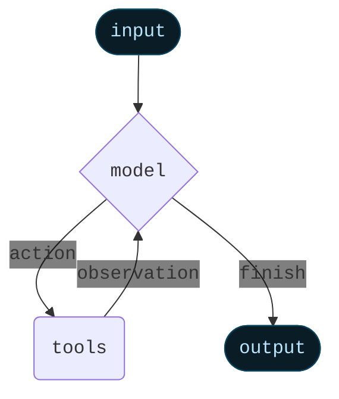

Read this like a build order, not a bedtime story. You are implementing a FastAPI backend that turns messy requirements into structured quotes, invoices, and project briefs. It must let the user choose an AI provider (OpenRouter, Groq, OpenAI), pick a model, and keep using that selection until changed. All outputs are strict JSON. No library pinning. Always check venv before installs or runs. The app must start with:

```
python -m uvicorn main:app --reload
```

Use structured logging and sane error envelopes. Write modular code, not a spaghetti festival.

# 0) Non-negotiables

* Before any `pip install` or run, verify venv is active. If not, activate:

  * Windows: `venv\Scripts\activate`
  * POSIX: `source venv/bin/activate`
* Do not install specific library versions. Install by name only.
* Start server with `python -m uvicorn main:app --reload` (add `main.py` at repo root that exposes `app`).
* All endpoints return JSON with a stable error envelope.
* Provider and model selection is user-controllable and persists per “workspace” while allowing per-request override.

# 1) Process overview

1. Client calls `/v1/providers` to discover providers/models.
2. Client selects provider+model via `/v1/providers/select` or passes them per request.
3. Client submits requirement to `/v1/draft` and gets a `DocumentBundle` (quotation by default; invoice/brief optional).
4. Client may validate with `/v1/validate` or repair with `/v1/repair`.
5. Client computes or refreshes totals via `/v1/compute/totals`.
6. Client builds UPI deep link or QR data via `/v1/upi/deeplink`.
7. Users can switch provider/model at any time; the new selection applies to subsequent calls unless per-request override is present.

# 2) Provider abstraction

Implement a provider interface:

* `generate(prompt: PromptPacket) -> LLMRawResponse`
* `capabilities() -> ProviderCapabilities` (supports json_schema | function_call | plain_json)
* `list_models() -> List[ModelDescriptor]`

Support three providers:

* OpenRouter (key: `OPENROUTER_API_KEY`)
* Groq (key: `GROQ_API_KEY`)
* OpenAI (key: `OPENAI_API_KEY`)

Selection precedence on each request:

1. Explicit request header/query/body override
2. Active workspace selection (in-memory cache; optional Redis)
3. Server default from env

# 3) Headers, auth, and logging

* Standard headers accepted:

  * `X-Provider: openrouter|groq|openai`
  * `X-Model: <model-name>`
  * `X-Request-Id: <uuid>` (server generates if missing)
  * `X-Workspace-Id: <id>` (optional; helps per-workspace persistence)
* Error envelope for all 4xx/5xx:

```json
{
  "error": {
    "code": "string",              // e.g., "VALIDATION_ERROR"
    "message": "human-readable",
    "request_id": "uuid",
    "details": {}
  }
}
```

* Structured logs: JSON lines, include `ts`, `level`, `request_id`, `route`, `provider`, `model`, `latency_ms`.

# 4) Runtime prompts to the LLM

Use a strict, schema-first approach. Choose best strategy per provider capability:

* Preferred: native JSON Schema response enforcement (e.g., OpenAI `response_format: {type: "json_schema"}`).
* Fallback: function/tool calling with structured parameters.
* Last resort: “Return only JSON matching this schema. No prose.”

## 4.1 System prompt (use verbatim)

```
You are an expert commercial documents drafter for India-focused SMEs. 
Output STRICT JSON matching the provided JSON Schema for DocumentBundle. 
Do not include markdown, comments, or extra keys. 
Prefer INR context, GST where applicable, 14–15 day validity for quotations, and 7-day due date for invoices unless user specifies otherwise.
Use conservative defaults when ambiguous.
```

## 4.2 User prompt template

```
Requirement:
{{free_text_requirement}}

Preferences:
- doc_types: {{list e.g., ["QUOTATION","PROJECT_BRIEF"]}}
- currency: {{currency or "INR"}}
- seller_defaults: {{JSON or null}}
- buyer_hint: {{text or null}}

Return: a single JSON object of type DocumentBundle.
Schema name: DocumentBundle
```

# 5) REST API surface

Design these endpoints. Implement with try/catch, validate inputs, and always return the envelopes below.

## 5.1 GET /v1/health

* Purpose: liveness.
* 200 Response:

```json
{ "ok": true, "version": "1.0.0" }
```

## 5.2 GET /v1/providers

* Purpose: enumerate providers and recommended models. Dynamic if keys present.
* 200 Response Schema:

```json
{
  "type": "object",
  "required": ["providers"],
  "properties": {
    "providers": {
      "type": "array",
      "items": {
        "type": "object",
        "required": ["name","enabled","models"],
        "properties": {
          "name": { "type": "string", "enum": ["openrouter","groq","openai"] },
          "enabled": { "type": "boolean" },
          "models": {
            "type": "array",
            "items": {
              "type": "object",
              "required": ["id","family","supports_json_schema"],
              "properties": {
                "id": { "type": "string" },
                "family": { "type": "string" }, 
                "context_window": { "type": "integer" },
                "supports_json_schema": { "type": "boolean" },
                "notes": { "type": "string" }
              }
            }
          }
        }
      }
    }
  }
}
```

* Populate with a short curated set per provider plus a `"custom"` option. Do not promise availability; this is advisory.

## 5.3 POST /v1/providers/select

* Purpose: set active provider/model for a workspace.
* Request Schema:

```json
{
  "type": "object",
  "required": ["provider","model"],
  "properties": {
    "provider": { "type": "string", "enum": ["openrouter","groq","openai"] },
    "model": { "type": "string" },
    "workspace_id": { "type": "string" }
  }
}
```

* 200 Response:

```json
{
  "ok": true,
  "active": { "provider": "openrouter", "model": "openrouter/auto", "workspace_id": "default" }
}
```

## 5.4 GET /v1/providers/active

* Purpose: read active provider/model for a workspace.
* Query: `workspace_id` optional.
* 200 Response:

```json
{ "provider": "openrouter", "model": "openrouter/auto", "workspace_id": "default" }
```

## 5.5 POST /v1/draft

* Purpose: convert requirement to structured docs using the active or overridden provider/model.
* Request Schema:

```json
{
  "type": "object",
  "required": ["prompt"],
  "properties": {
    "prompt": { "type": "string", "minLength": 5 },
    "prefer": {
      "type": "array",
      "items": { "type": "string", "enum": ["QUOTATION","TAX_INVOICE","PROJECT_BRIEF"] }
    },
    "currency": { "type": "string", "default": "INR" },
    "defaults": { "type": "object" },        // seller defaults override
    "provider": { "type": "string", "enum": ["openrouter","groq","openai"] },
    "model": { "type": "string" },
    "workspace_id": { "type": "string" }
  }
}
```

* 200 Response: `DocumentBundle` (see §7, referenced via `$ref`).
* 400 Response: error envelope.
* Notes: service must attempt native JSON schema enforcement; if unsupported, run plain JSON mode, then validate+repair.

## 5.6 POST /v1/validate

* Purpose: validate a candidate bundle against the schema.
* Request:

```json
{
  "type": "object",
  "required": ["bundle"],
  "properties": {
    "bundle": { "$ref": "document_bundle.schema.json#" }
  }
}
```

* 200 Response:

```json
{ "ok": true, "errors": [] }
```

* 422 Response (still 200 at transport level, but with errors array is fine if you prefer):

```json
{ "ok": false, "errors": [ { "path": "/drafts/0/items/0/unit_price", "message": "must be number" } ] }
```

## 5.7 POST /v1/repair

* Purpose: coerce partial/invalid payloads into schema-valid output, filling defaults and recomputing totals.
* Request:

```json
{
  "type": "object",
  "required": ["bundle"],
  "properties": {
    "bundle": { "type": "object" }   // any; you fix it
  }
}
```

* 200 Response: `DocumentBundle`.

## 5.8 POST /v1/compute/totals

* Purpose: recompute totals for a single draft after user edits.
* Request:

```json
{
  "type": "object",
  "required": ["draft"],
  "properties": {
    "draft": { "$ref": "document_bundle.schema.json#/$defs/DocDraft" }
  }
}
```

* 200 Response:

```json
{ "draft": { "$ref": "document_bundle.schema.json#/$defs/DocDraft" } }
```

## 5.9 POST /v1/upi/deeplink

* Purpose: build UPI deep link and QR payload.
* Request Schema:

```json
{
  "type": "object",
  "required": ["upi_id","payee_name"],
  "properties": {
    "upi_id": { "type": "string" },
    "payee_name": { "type": "string" },
    "amount": { "type": "number" },
    "currency": { "type": "string", "default": "INR" },
    "note": { "type": "string" },
    "txn_ref": { "type": "string" },
    "callback_url": { "type": "string" }
  }
}
```

* 200 Response:

```json
{
  "deeplink": "upi://pay?pa=acme@upi&pn=Acme%20Solutions&am=43660.00&cu=INR&tn=Advance%2050%25&tr=INV-2025-0041",
  "qr_payload": "upi://pay?pa=... identical ..."
}
```

## 5.10 GET /v1/version

* Purpose: export version and active defaults.
* 200 Response:

```json
{
  "name": "ai-draft-backend",
  "version": "1.0.0",
  "default_provider": "openrouter",
  "default_model": "openrouter/auto"
}
```

# 6) Document schema reference

Use the already defined `DocumentBundle` schema as the authoritative contract. Place it at:

```
app/schemas/document_bundle.schema.json
```

And reference it across endpoints using `$ref`. The schema must include `$defs` for:

* `DocDraft` (quotation/invoice), with Parties, Items, Totals, Terms, Payment
* `ProjectBrief` (objective, scope, milestones, billing_plan)
* `Dates`, `DocMeta`, etc.
  Strict numeric types for money; string ISO dates; enums for `doc_type`.

# 7) Provider wiring rules

## 7.1 OpenAI

* Base: `https://api.openai.com/v1/chat/completions`
* Auth: `Authorization: Bearer ${OPENAI_API_KEY}`
* Preferred: `response_format: { "type": "json_schema", "json_schema": { ...DocumentBundle... } }`
* Body shape:

```json
{
  "model": "<user-chosen>",
  "messages": [
    {"role":"system","content":"<§4.1>"},
    {"role":"user","content":"<§4.2>"}
  ],
  "temperature": 0.2
}
```

## 7.2 OpenRouter

* Base: `https://openrouter.ai/api/v1/chat/completions`
* Auth: `Authorization: Bearer ${OPENROUTER_API_KEY}`
* Body: similar to OpenAI chat; if schema enforcement unsupported, rely on strict system+user prompt and server-side validation/repair.
* Include `x-headers` like `HTTP-Referer` and `X-Title` if you want attribution, but keep them optional.

## 7.3 Groq

* Base: `https://api.groq.com/openai/v1/chat/completions`
* Auth: `Authorization: Bearer ${GROQ_API_KEY}`
* Body: OpenAI-compatible chat. No guaranteed schema enforcement; treat it like “plain JSON” mode, then validate/repair.

# 8) Validation and repair pipeline

* Step 1: Try to parse JSON; if failure, extract largest JSON block with a tolerant regex.
* Step 2: Validate against `document_bundle.schema.json` with `jsonschema`.
* Step 3: If invalid, run a deterministic repair:

  * Fill missing required keys with safe defaults.
  * Coerce numbers from strings.
  * If totals missing or wrong, recompute with server math.
  * If invoice doc and no due date, set `issue_date + 7`.
  * If quotation doc and no valid_till, set `issue_date + 15`.
* Step 4: Return a valid `DocumentBundle`. Never return nulls for required keys.

# 9) Totals computation rules

* `line_total = qty * unit_price - discount`
* `line_tax = line_total * tax_rate/100`
* `subtotal = Σ line_total`
* `discount_total = Σ item.discount`
* `tax_total = Σ line_tax`
* `grand_total = subtotal - discount_total + tax_total + shipping + round_off`
* `round_off = round(grand_total) - grand_total` (nearest rupee)
* Produce `amount_in_words` using Indian numbering (thousand, lakh, crore).

# 10) UPI deep link rules

* Template:
  `upi://pay?pa={VPA}&pn={Name}&am={Amount}&cu=INR&tn={Note}&tr={TxnRef}&url={CallbackURL}`
* URL-encode all values.
* `amount` optional for quotations, recommended for invoices/advance asks.

# 11) Environment, run, and scripts

* Guard script must fail fast if venv inactive before any install/run.
* Startup sequence for dev:

  1. Ensure venv active.
  2. Install required packages by name (no versions).
  3. `python -m uvicorn main:app --reload`
* Add a root `main.py` that exposes `app` by importing the factory from `app.main`:

```python
# main.py (thin shim)
from app.main import create_app
app = create_app()
```

* Logging: configure a JSON logger; include request IDs automatically; add exception handler that logs stack with `level=error` and returns the error envelope.

# 12) Example flows (concrete)

## 12.1 First-time user picks provider/model

1. `GET /v1/providers` → shows enabled providers and advisory models.
2. `POST /v1/providers/select` with:

```json
{ "provider":"groq", "model":"llama-3.1-70b", "workspace_id":"default" }
```

3. `POST /v1/draft` with:

```json
{
  "prompt": "Need a website redesign, 2-week timeline, include maintenance quote.",
  "prefer": ["QUOTATION","PROJECT_BRIEF"],
  "currency": "INR"
}
```

→ Returns `DocumentBundle` with a QUOTATION and PROJECT_BRIEF.

## 12.2 Override provider only for one request

`POST /v1/draft` body includes:

```json
{ "prompt":"...", "provider":"openai", "model":"gpt-4o-mini" }
```

Server uses this override without altering the active workspace selection.

## 12.3 Validate, repair, and totals

* `POST /v1/validate` with the bundle: returns `{ ok: false, errors: [...] }`.
* `POST /v1/repair`: returns fixed bundle.
* `POST /v1/compute/totals` on a single edited draft: returns recalculated draft.

## 12.4 Build UPI link

`POST /v1/upi/deeplink` with:

```json
{
  "upi_id": "acme@upi",
  "payee_name": "Acme Solutions",
  "amount": 43660,
  "note": "Advance 50%",
  "txn_ref": "INV-2025-0041"
}
```

→ Returns deep link and identical QR payload string.

# 13) Security and limits

* Optional API key auth via `x-api-key` header; configure on server.
* Rate limit `/v1/draft` by IP and workspace (e.g., 5/min and 200/day).
* Strip emails/phones from logs; never log raw prompts.

# 14) Quality gates

* Unit tests for totals, UPI, and validator/repair.
* E2E test that hits `/v1/draft` using a stub provider returning a canned JSON that intentionally omits fields; ensure repair + totals work.

# 15) Libraries to install (names only; no versions)

* `fastapi`, `uvicorn[standard]`, `pydantic`, `pydantic-settings`, `httpx`, `orjson`, `jsonschema`, `structlog`, `slowapi`, `redis`

You now have a complete, provider-agnostic spec with strict schemas, predictable endpoints, and a disciplined prompt strategy. Implement exactly this, and the rest of us won’t have to stage an intervention later.

___________________________________________________________________________________________________
here are more ifnormation about the specific libraris:
# LangChain overview

<Callout icon="bullhorn" color="#DFC5FE" iconType="regular">
  **LangChain v1.0 is now available!**

  For a complete list of changes and instructions on how to upgrade your code, see the [release notes](/oss/python/releases/langchain-v1) and [migration guide](/oss/python/migrate/langchain-v1).

  If you encounter any issues or have feedback, please [open an issue](https://github.com/langchain-ai/docs/issues/new?template=01-langchain.yml) so we can improve. To view v0.x documentation, [go to the archived content](https://github.com/langchain-ai/langchain/tree/v0.3/docs/docs).
</Callout>

LangChain is the easiest way to start building agents and applications powered by LLMs. With under 10 lines of code, you can connect to OpenAI, Anthropic, Google, and [more](/oss/python/integrations/providers/overview). LangChain provides a pre-built agent architecture and model integrations to help you get started quickly and seamlessly incorporate LLMs into your agents and applications.

We recommend you use LangChain if you want to quickly build agents and autonomous applications. Use [LangGraph](/oss/python/langgraph/overview), our low-level agent orchestration framework and runtime, when you have more advanced needs that require a combination of deterministic and agentic workflows, heavy customization, and carefully controlled latency.

LangChain [agents](/oss/python/langchain/agents) are built on top of LangGraph in order to provide durable execution, streaming, human-in-the-loop, persistence, and more. You do not need to know LangGraph for basic LangChain agent usage.

## <Icon icon="download" size={20} /> Install

<CodeGroup>
  ```bash pip theme={null}
  pip install -U langchain
  ```

  ```bash uv theme={null}
  uv add langchain
  ```
</CodeGroup>

## <Icon icon="wand-magic-sparkles" /> Create an agent

```python  theme={null}
# pip install -qU "langchain[anthropic]" to call the model

from langchain.agents import create_agent

def get_weather(city: str) -> str:
    """Get weather for a given city."""
    return f"It's always sunny in {city}!"

agent = create_agent(
    model="anthropic:claude-sonnet-4-5",
    tools=[get_weather],
    system_prompt="You are a helpful assistant",
)

# Run the agent
agent.invoke(
    {"messages": [{"role": "user", "content": "what is the weather in sf"}]}
)
```

## <Icon icon="star" size={20} /> Core benefits

<Columns cols={2}>
  <Card title="Standard model interface" icon="arrows-rotate" href="/oss/python/langchain/models" arrow cta="Learn more">
    Different providers have unique APIs for interacting with models, including the format of responses. LangChain standardizes how you interact with models so that you can seamlessly swap providers and avoid lock-in.
  </Card>

  <Card title="Easy to use, highly flexible agent" icon="wand-magic-sparkles" href="/oss/python/langchain/agents" arrow cta="Learn more">
    LangChain's agent abstraction is designed to be easy to get started with, letting you build a simple agent in under 10 lines of code. But it also provides enough flexibility to allow you to do all the context engineering your heart desires.
  </Card>

  <Card title="Built on top of LangGraph" icon="circle-nodes" href="/oss/python/langgraph/overview" arrow cta="Learn more">
    LangChain's agents are built on top of LangGraph. This allows us to take advantage of LangGraph's durable execution, human-in-the-loop support, persistence, and more.
  </Card>

  <Card title="Debug with LangSmith" icon="eye" href="/langsmith/home" arrow cta="Learn more">
    Gain deep visibility into complex agent behavior with visualization tools that trace execution paths, capture state transitions, and provide detailed runtime metrics.
  </Card>
</Columns>

***

<Callout icon="pen-to-square" iconType="regular">
  [Edit the source of this page on GitHub.](https://github.com/langchain-ai/docs/edit/main/src/oss/langchain/overview.mdx)
</Callout>

<Tip icon="terminal" iconType="regular">
  [Connect these docs programmatically](/use-these-docs) to Claude, VSCode, and more via MCP for    real-time answers.
</Tip>
# Agents

Agents combine language models with [tools](/oss/python/langchain/tools) to create systems that can reason about tasks, decide which tools to use, and iteratively work towards solutions.

[`create_agent`](https://reference.langchain.com/python/langchain/agents/#langchain.agents.create_agent) provides a production-ready agent implementation.

[An LLM Agent runs tools in a loop to achieve a goal](https://simonwillison.net/2025/Sep/18/agents/).
An agent runs until a stop condition is met - i.e., when the model emits a final output or an iteration limit is reached.


<Info>
  [`create_agent`](https://reference.langchain.com/python/langchain/agents/#langchain.agents.create_agent) builds a **graph**-based agent runtime using [LangGraph](/oss/python/langgraph/overview). A graph consists of nodes (steps) and edges (connections) that define how your agent processes information. The agent moves through this graph, executing nodes like the model node (which calls the model), the tools node (which executes tools), or middleware.

  Learn more about the [Graph API](/oss/python/langgraph/graph-api).
</Info>

## Core components

### Model

The [model](/oss/python/langchain/models) is the reasoning engine of your agent. It can be specified in multiple ways, supporting both static and dynamic model selection.

#### Static model

Static models are configured once when creating the agent and remain unchanged throughout execution. This is the most common and straightforward approach.

To initialize a static model from a <Tooltip tip="A string that follows the format `provider:model` (e.g. openai:gpt-5)" cta="See mappings" href="https://reference.langchain.com/python/langchain/models/#langchain.chat_models.init_chat_model(model_provider)">model identifier string</Tooltip>:

```python wrap theme={null}
from langchain.agents import create_agent

agent = create_agent(
    "openai:gpt-5",
    tools=tools
)
```

<Tip>
  Model identifier strings support automatic inference (e.g., `"gpt-5"` will be inferred as `"openai:gpt-5"`). Refer to the [reference](https://reference.langchain.com/python/langchain/models/#langchain.chat_models.init_chat_model\(model_provider\)) to see a full list of model identifier string mappings.
</Tip>

For more control over the model configuration, initialize a model instance directly using the provider package. In this example, we use [`ChatOpenAI`](https://reference.langchain.com/python/integrations/langchain_openai/ChatOpenAI/). See [Chat models](/oss/python/integrations/chat) for other available chat model classes.

```python wrap theme={null}
from langchain.agents import create_agent
from langchain_openai import ChatOpenAI

model = ChatOpenAI(
    model="gpt-5",
    temperature=0.1,
    max_tokens=1000,
    timeout=30
    # ... (other params)
)
agent = create_agent(model, tools=tools)
```

Model instances give you complete control over configuration. Use them when you need to set specific [parameters](/oss/python/langchain/models#parameters) like `temperature`, `max_tokens`, `timeouts`, `base_url`, and other provider-specific settings. Refer to the [reference](/oss/python/integrations/providers/all_providers) to see available params and methods on your model.

#### Dynamic model

Dynamic models are selected at <Tooltip tip="The execution environment of your agent, containing immutable configuration and contextual data that persists throughout the agent's execution (e.g., user IDs, session details, or application-specific configuration).">runtime</Tooltip> based on the current <Tooltip tip="The data that flows through your agent's execution, including messages, custom fields, and any information that needs to be tracked and potentially modified during processing (e.g., user preferences or tool usage stats).">state</Tooltip> and context. This enables sophisticated routing logic and cost optimization.

To use a dynamic model, create middleware using the [`@wrap_model_call`](https://reference.langchain.com/python/langchain/middleware/#langchain.agents.middleware.wrap_model_call) decorator that modifies the model in the request:

```python  theme={null}
from langchain_openai import ChatOpenAI
from langchain.agents import create_agent
from langchain.agents.middleware import wrap_model_call, ModelRequest, ModelResponse


basic_model = ChatOpenAI(model="gpt-4o-mini")
advanced_model = ChatOpenAI(model="gpt-4o")

@wrap_model_call
def dynamic_model_selection(request: ModelRequest, handler) -> ModelResponse:
    """Choose model based on conversation complexity."""
    message_count = len(request.state["messages"])

    if message_count > 10:
        # Use an advanced model for longer conversations
        model = advanced_model
    else:
        model = basic_model

    request.model = model
    return handler(request)

agent = create_agent(
    model=basic_model,  # Default model
    tools=tools,
    middleware=[dynamic_model_selection]
)
```

<Warning>
  Pre-bound models (models with [`bind_tools`](https://reference.langchain.com/python/langchain_core/language_models/#langchain_core.language_models.chat_models.BaseChatModel.bind_tools) already called) are not supported when using structured output. If you need dynamic model selection with structured output, ensure the models passed to the middleware are not pre-bound.
</Warning>

<Tip>
  For model configuration details, see [Models](/oss/python/langchain/models). For dynamic model selection patterns, see [Dynamic model in middleware](/oss/python/langchain/middleware#dynamic-model).
</Tip>

### Tools

Tools give agents the ability to take actions. Agents go beyond simple model-only tool binding by facilitating:

* Multiple tool calls in sequence (triggered by a single prompt)
* Parallel tool calls when appropriate
* Dynamic tool selection based on previous results
* Tool retry logic and error handling
* State persistence across tool calls

For more information, see [Tools](/oss/python/langchain/tools).

#### Defining tools

Pass a list of tools to the agent.

```python wrap theme={null}
from langchain.tools import tool
from langchain.agents import create_agent


@tool
def search(query: str) -> str:
    """Search for information."""
    return f"Results for: {query}"

@tool
def get_weather(location: str) -> str:
    """Get weather information for a location."""
    return f"Weather in {location}: Sunny, 72°F"

agent = create_agent(model, tools=[search, get_weather])
```

If an empty tool list is provided, the agent will consist of a single LLM node without tool-calling capabilities.

#### Tool error handling

To customize how tool errors are handled, use the [`@wrap_tool_call`](https://reference.langchain.com/python/langchain/middleware/#langchain.agents.middleware.wrap_tool_call) decorator to create middleware:

```python wrap theme={null}
from langchain.agents import create_agent
from langchain.agents.middleware import wrap_tool_call
from langchain_core.messages import ToolMessage


@wrap_tool_call
def handle_tool_errors(request, handler):
    """Handle tool execution errors with custom messages."""
    try:
        return handler(request)
    except Exception as e:
        # Return a custom error message to the model
        return ToolMessage(
            content=f"Tool error: Please check your input and try again. ({str(e)})",
            tool_call_id=request.tool_call["id"]
        )

agent = create_agent(
    model="openai:gpt-4o",
    tools=[search, get_weather],
    middleware=[handle_tool_errors]
)
```

The agent will return a [`ToolMessage`](https://reference.langchain.com/python/langchain/messages/#langchain.messages.ToolMessage) with the custom error message when a tool fails:

```python  theme={null}
[
    ...
    ToolMessage(
        content="Tool error: Please check your input and try again. (division by zero)",
        tool_call_id="..."
    ),
    ...
]
```

#### Tool use in the ReAct loop

Agents follow the ReAct ("Reasoning + Acting") pattern, alternating between brief reasoning steps with targeted tool calls and feeding the resulting observations into subsequent decisions until they can deliver a final answer.

<Accordion title="Example of ReAct loop">
  Prompt: Identify the current most popular wireless headphones and verify availability.

  ```
  ================================ Human Message =================================

  Find the most popular wireless headphones right now and check if they're in stock
  ```

  * **Reasoning**: "Popularity is time-sensitive, I need to use the provided search tool."
  * **Acting**: Call `search_products("wireless headphones")`

  ```
  ================================== Ai Message ==================================
  Tool Calls:
    search_products (call_abc123)
   Call ID: call_abc123
    Args:
      query: wireless headphones
  ```

  ```
  ================================= Tool Message =================================

  Found 5 products matching "wireless headphones". Top 5 results: WH-1000XM5, ...
  ```

  * **Reasoning**: "I need to confirm availability for the top-ranked item before answering."
  * **Acting**: Call `check_inventory("WH-1000XM5")`

  ```
  ================================== Ai Message ==================================
  Tool Calls:
    check_inventory (call_def456)
   Call ID: call_def456
    Args:
      product_id: WH-1000XM5
  ```

  ```
  ================================= Tool Message =================================

  Product WH-1000XM5: 10 units in stock
  ```

  * **Reasoning**: "I have the most popular model and its stock status. I can now answer the user's question."
  * **Acting**: Produce final answer

  ```
  ================================== Ai Message ==================================

  I found wireless headphones (model WH-1000XM5) with 10 units in stock...
  ```
</Accordion>

<Tip>
  To learn more about tools, see [Tools](/oss/python/langchain/tools).
</Tip>

### System prompt

You can shape how your agent approaches tasks by providing a prompt. The [`system_prompt`](https://reference.langchain.com/python/langchain/agents/#langchain.agents.create_agent\(system_prompt\)) parameter can be provided as a string:

```python wrap theme={null}
agent = create_agent(
    model,
    tools,
    system_prompt="You are a helpful assistant. Be concise and accurate."
)
```

When no [`system_prompt`](https://reference.langchain.com/python/langchain/agents/#langchain.agents.create_agent\(system_prompt\)) is provided, the agent will infer its task from the messages directly.

#### Dynamic system prompt

For more advanced use cases where you need to modify the system prompt based on runtime context or agent state, you can use [middleware](/oss/python/langchain/middleware).

The [`@dynamic_prompt`](https://reference.langchain.com/python/langchain/middleware/#langchain.agents.middleware.dynamic_prompt) decorator creates middleware that generates system prompts dynamically based on the model request:

```python wrap theme={null}
from typing import TypedDict

from langchain.agents import create_agent
from langchain.agents.middleware import dynamic_prompt, ModelRequest


class Context(TypedDict):
    user_role: str

@dynamic_prompt
def user_role_prompt(request: ModelRequest) -> str:
    """Generate system prompt based on user role."""
    user_role = request.runtime.context.get("user_role", "user")
    base_prompt = "You are a helpful assistant."

    if user_role == "expert":
        return f"{base_prompt} Provide detailed technical responses."
    elif user_role == "beginner":
        return f"{base_prompt} Explain concepts simply and avoid jargon."

    return base_prompt

agent = create_agent(
    model="openai:gpt-4o",
    tools=[web_search],
    middleware=[user_role_prompt],
    context_schema=Context
)

# The system prompt will be set dynamically based on context
result = agent.invoke(
    {"messages": [{"role": "user", "content": "Explain machine learning"}]},
    context={"user_role": "expert"}
)
```

<Tip>
  For more details on message types and formatting, see [Messages](/oss/python/langchain/messages). For comprehensive middleware documentation, see [Middleware](/oss/python/langchain/middleware).
</Tip>

## Invocation

You can invoke an agent by passing an update to its [`State`](/oss/python/langgraph/graph-api#state). All agents include a [sequence of messages](/oss/python/langgraph/use-graph-api#messagesstate) in their state; to invoke the agent, pass a new message:

```python  theme={null}
result = agent.invoke(
    {"messages": [{"role": "user", "content": "What's the weather in San Francisco?"}]}
)
```

For streaming steps and / or tokens from the agent, refer to the [streaming](/oss/python/langchain/streaming) guide.

Otherwise, the agent follows the LangGraph [Graph API](/oss/python/langgraph/use-graph-api) and supports all associated methods.

## Advanced concepts

### Structured output

In some situations, you may want the agent to return an output in a specific format. LangChain provides strategies for structured output via the [`response_format`](https://reference.langchain.com/python/langchain/middleware/#langchain.agents.middleware.ModelRequest\(response_format\)) parameter.

#### ToolStrategy

`ToolStrategy` uses artificial tool calling to generate structured output. This works with any model that supports tool calling:

```python wrap theme={null}
from pydantic import BaseModel
from langchain.agents import create_agent
from langchain.agents.structured_output import ToolStrategy


class ContactInfo(BaseModel):
    name: str
    email: str
    phone: str

agent = create_agent(
    model="openai:gpt-4o-mini",
    tools=[search_tool],
    response_format=ToolStrategy(ContactInfo)
)

result = agent.invoke({
    "messages": [{"role": "user", "content": "Extract contact info from: John Doe, john@example.com, (555) 123-4567"}]
})

result["structured_response"]
# ContactInfo(name='John Doe', email='john@example.com', phone='(555) 123-4567')
```

#### ProviderStrategy

`ProviderStrategy` uses the model provider's native structured output generation. This is more reliable but only works with providers that support native structured output (e.g., OpenAI):

```python wrap theme={null}
from langchain.agents.structured_output import ProviderStrategy

agent = create_agent(
    model="openai:gpt-4o",
    response_format=ProviderStrategy(ContactInfo)
)
```

<Note>
  As of `langchain 1.0`, simply passing a schema (e.g., `response_format=ContactInfo`) is no longer supported. You must explicitly use `ToolStrategy` or `ProviderStrategy`.
</Note>

<Tip>
  To learn about structured output, see [Structured output](/oss/python/langchain/structured-output).
</Tip>

### Memory

Agents maintain conversation history automatically through the message state. You can also configure the agent to use a custom state schema to remember additional information during the conversation.

Information stored in the state can be thought of as the [short-term memory](/oss/python/langchain/short-term-memory) of the agent:

Custom state schemas must extend [`AgentState`](https://reference.langchain.com/python/langchain/agents/#langchain.agents.AgentState) as a `TypedDict`.

There are two ways to define custom state:

1. Via [middleware](/oss/python/langchain/middleware) (preferred)
2. Via [`state_schema`](https://reference.langchain.com/python/langchain/middleware/#langchain.agents.middleware.AgentMiddleware.state_schema) on [`create_agent`](https://reference.langchain.com/python/langchain/agents/#langchain.agents.create_agent)

<Note>
  Defining custom state via middleware is preferred over defining it via [`state_schema`](https://reference.langchain.com/python/langchain/middleware/#langchain.agents.middleware.AgentMiddleware.state_schema) on [`create_agent`](https://reference.langchain.com/python/langchain/agents/#langchain.agents.create_agent) because it allows you to keep state extensions conceptually scoped to the relevant middleware and tools.

  [`state_schema`](https://reference.langchain.com/python/langchain/middleware/#langchain.agents.middleware.AgentMiddleware.state_schema) is still supported for backwards compatibility on [`create_agent`](https://reference.langchain.com/python/langchain/agents/#langchain.agents.create_agent).
</Note>

#### Defining state via middleware

Use middleware to define custom state when your custom state needs to be accessed by specific middleware hooks and tools attached to said middleware.

```python  theme={null}
from langchain.agents import AgentState
from langchain.agents.middleware import AgentMiddleware


class CustomState(AgentState):
    user_preferences: dict

class CustomMiddleware(AgentMiddleware):
    state_schema = CustomState
    tools = [tool1, tool2]

    def before_model(self, state: CustomState, runtime) -> dict[str, Any] | None:
        ...

agent = create_agent(
    model,
    tools=tools,
    middleware=[CustomMiddleware()]
)

# The agent can now track additional state beyond messages
result = agent.invoke({
    "messages": [{"role": "user", "content": "I prefer technical explanations"}],
    "user_preferences": {"style": "technical", "verbosity": "detailed"},
})
```

#### Defining state via `state_schema`

Use the [`state_schema`](https://reference.langchain.com/python/langchain/middleware/#langchain.agents.middleware.AgentMiddleware.state_schema) parameter as a shortcut to define custom state that is only used in tools.

```python  theme={null}
from langchain.agents import AgentState


class CustomState(AgentState):
    user_preferences: dict

agent = create_agent(
    model,
    tools=[tool1, tool2],
    state_schema=CustomState
)
# The agent can now track additional state beyond messages
result = agent.invoke({
    "messages": [{"role": "user", "content": "I prefer technical explanations"}],
    "user_preferences": {"style": "technical", "verbosity": "detailed"},
})
```

<Note>
  As of `langchain 1.0`, custom state schemas **must** be `TypedDict` types. Pydantic models and dataclasses are no longer supported. See the [v1 migration guide](/oss/python/migrate/langchain-v1#state-type-restrictions) for more details.
</Note>

<Tip>
  To learn more about memory, see [Memory](/oss/python/concepts/memory). For information on implementing long-term memory that persists across sessions, see [Long-term memory](/oss/python/langchain/long-term-memory).
</Tip>

### Streaming

We've seen how the agent can be called with `invoke` to get a final response. If the agent executes multiple steps, this may take a while. To show intermediate progress, we can stream back messages as they occur.

```python  theme={null}
for chunk in agent.stream({
    "messages": [{"role": "user", "content": "Search for AI news and summarize the findings"}]
}, stream_mode="values"):
    # Each chunk contains the full state at that point
    latest_message = chunk["messages"][-1]
    if latest_message.content:
        print(f"Agent: {latest_message.content}")
    elif latest_message.tool_calls:
        print(f"Calling tools: {[tc['name'] for tc in latest_message.tool_calls]}")
```

<Tip>
  For more details on streaming, see [Streaming](/oss/python/langchain/streaming).
</Tip>

### Middleware

[Middleware](/oss/python/langchain/middleware) provides powerful extensibility for customizing agent behavior at different stages of execution. You can use middleware to:

* Process state before the model is called (e.g., message trimming, context injection)
* Modify or validate the model's response (e.g., guardrails, content filtering)
* Handle tool execution errors with custom logic
* Implement dynamic model selection based on state or context
* Add custom logging, monitoring, or analytics

Middleware integrates seamlessly into the agent's execution graph, allowing you to intercept and modify data flow at key points without changing the core agent logic.

<Tip>
  For comprehensive middleware documentation including decorators like [`@before_model`](https://reference.langchain.com/python/langchain/middleware/#langchain.agents.middleware.before_model), [`@after_model`](https://reference.langchain.com/python/langchain/middleware/#langchain.agents.middleware.after_model), and [`@wrap_tool_call`](https://reference.langchain.com/python/langchain/middleware/#langchain.agents.middleware.wrap_tool_call), see [Middleware](/oss/python/langchain/middleware).
</Tip>

***

<Callout icon="pen-to-square" iconType="regular">
  [Edit the source of this page on GitHub.](https://github.com/langchain-ai/docs/edit/main/src/oss/langchain/agents.mdx)
</Callout>

<Tip icon="terminal" iconType="regular">
  [Connect these docs programmatically](/use-these-docs) to Claude, VSCode, and more via MCP for    real-time answers.
</Tip>
# Models

[LLMs](https://en.wikipedia.org/wiki/Large_language_model) are powerful AI tools that can interpret and generate text like humans. They're versatile enough to write content, translate languages, summarize, and answer questions without needing specialized training for each task.

In addition to text generation, many models support:

* <Icon icon="hammer" size={16} /> [Tool calling](#tool-calling) - calling external tools (like databases queries or API calls) and use results in their responses.
* <Icon icon="shapes" size={16} /> [Structured output](#structured-outputs) - where the model's response is constrained to follow a defined format.
* <Icon icon="image" size={16} /> [Multimodality](#multimodal) - process and return data other than text, such as images, audio, and video.
* <Icon icon="brain" size={16} /> [Reasoning](#reasoning) - models perform multi-step reasoning to arrive at a conclusion.

Models are the reasoning engine of [agents](/oss/python/langchain/agents). They drive the agent's decision-making process, determining which tools to call, how to interpret results, and when to provide a final answer.

The quality and capabilities of the model you choose directly impact your agent's reliability and performance. Different models excel at different tasks - some are better at following complex instructions, others at structured reasoning, and some support larger context windows for handling more information.

LangChain's standard model interfaces give you access to many different provider integrations, which makes it easy to experiment with and switch between models to find the best fit for your case.

<Info>
  For provider-specific integration information and capabilities, see the provider's [chat model page](/oss/python/integrations/chat).
</Info>

## Basic usage

Models can be utilized in two ways:

1. **With agents** - Models can be dynamically specified when creating an [agent](/oss/python/langchain/agents#model).
2. **Standalone** - Models can be called directly (outside of the agent loop) for tasks like text generation, classification, or extraction without the need for an agent framework.

The same model interface works in both contexts, which gives you the flexibility to start simple and scale up to more complex agent-based workflows as needed.

### Initialize a model

The easiest way to get started with a standalone model in LangChain is to use [`init_chat_model`](https://reference.langchain.com/python/langchain/models/#langchain.chat_models.init_chat_model) to initialize one from a [chat model provider](/oss/python/integrations/chat) of your choice (examples below):

<Tabs>
  <Tab title="OpenAI">
    👉 Read the [OpenAI chat model integration docs](/oss/python/integrations/chat/openai/)

    ```shell  theme={null}
    pip install -U "langchain[openai]"
    ```

    <CodeGroup>
      ```python init_chat_model theme={null}
      import os
      from langchain.chat_models import init_chat_model

      os.environ["OPENAI_API_KEY"] = "sk-..."

      model = init_chat_model("openai:gpt-4.1")
      ```

      ```python Model Class theme={null}
      import os
      from langchain_openai import ChatOpenAI

      os.environ["OPENAI_API_KEY"] = "sk-..."

      model = ChatOpenAI(model="gpt-4.1")
      ```
    </CodeGroup>
  </Tab>

  <Tab title="Anthropic">
    👉 Read the [Anthropic chat model integration docs](/oss/python/integrations/chat/anthropic/)

    ```shell  theme={null}
    pip install -U "langchain[anthropic]"
    ```

    <CodeGroup>
      ```python init_chat_model theme={null}
      import os
      from langchain.chat_models import init_chat_model

      os.environ["ANTHROPIC_API_KEY"] = "sk-..."

      model = init_chat_model("anthropic:claude-sonnet-4-5")
      ```

      ```python Model Class theme={null}
      import os
      from langchain_anthropic import ChatAnthropic

      os.environ["ANTHROPIC_API_KEY"] = "sk-..."

      model = ChatAnthropic(model="claude-sonnet-4-5")
      ```
    </CodeGroup>
  </Tab>

  <Tab title="Azure">
    👉 Read the [Azure chat model integration docs](/oss/python/integrations/chat/azure_chat_openai/)

    ```shell  theme={null}
    pip install -U "langchain[openai]"
    ```

    <CodeGroup>
      ```python init_chat_model theme={null}
      import os
      from langchain.chat_models import init_chat_model

      os.environ["AZURE_OPENAI_API_KEY"] = "..."
      os.environ["AZURE_OPENAI_ENDPOINT"] = "..."
      os.environ["OPENAI_API_VERSION"] = "2025-03-01-preview"

      model = init_chat_model(
          "azure_openai:gpt-4.1",
          azure_deployment=os.environ["AZURE_OPENAI_DEPLOYMENT_NAME"],
      )
      ```

      ```python Model Class theme={null}
      import os
      from langchain_openai import AzureChatOpenAI

      os.environ["AZURE_OPENAI_API_KEY"] = "..."
      os.environ["AZURE_OPENAI_ENDPOINT"] = "..."
      os.environ["OPENAI_API_VERSION"] = "2025-03-01-preview"

      model = AzureChatOpenAI(
          model="gpt-4.1",
          azure_deployment=os.environ["AZURE_OPENAI_DEPLOYMENT_NAME"]
      )
      ```
    </CodeGroup>
  </Tab>

  <Tab title="Google Gemini">
    👉 Read the [Google GenAI chat model integration docs](/oss/python/integrations/chat/google_generative_ai/)

    ```shell  theme={null}
    pip install -U "langchain[google-genai]"
    ```

    <CodeGroup>
      ```python init_chat_model theme={null}
      import os
      from langchain.chat_models import init_chat_model

      os.environ["GOOGLE_API_KEY"] = "..."

      model = init_chat_model("google_genai:gemini-2.5-flash-lite")
      ```

      ```python Model Class theme={null}
      import os
      from langchain_google_genai import ChatGoogleGenerativeAI

      os.environ["GOOGLE_API_KEY"] = "..."

      model = ChatGoogleGenerativeAI(model="gemini-2.5-flash-lite")
      ```
    </CodeGroup>
  </Tab>

  <Tab title="AWS Bedrock">
    👉 Read the [AWS Bedrock chat model integration docs](/oss/python/integrations/chat/bedrock/)

    ```shell  theme={null}
    pip install -U "langchain[aws]"
    ```

    <CodeGroup>
      ```python init_chat_model theme={null}
      from langchain.chat_models import init_chat_model

      # Follow the steps here to configure your credentials:
      # https://docs.aws.amazon.com/bedrock/latest/userguide/getting-started.html

      model = init_chat_model(
          "anthropic.claude-3-5-sonnet-20240620-v1:0",
          model_provider="bedrock_converse",
      )
      ```

      ```python Model Class theme={null}
      from langchain_aws import ChatBedrock

      model = ChatBedrock(model="anthropic.claude-3-5-sonnet-20240620-v1:0")
      ```
    </CodeGroup>
  </Tab>
</Tabs>

```python  theme={null}
response = model.invoke("Why do parrots talk?")
```

See [`init_chat_model`](https://reference.langchain.com/python/langchain/models/#langchain.chat_models.init_chat_model) for more detail, including information on how to pass model [parameters](#parameters).

### Key methods

<Card title="Invoke" href="#invoke" icon="paper-plane" arrow="true" horizontal>
  The model takes messages as input and outputs messages after generating a complete response.
</Card>

<Card title="Stream" href="#stream" icon="tower-broadcast" arrow="true" horizontal>
  Invoke the model, but stream the output as it is generated in real-time.
</Card>

<Card title="Batch" href="#batch" icon="grip" arrow="true" horizontal>
  Send multiple requests to a model in a batch for more efficient processing.
</Card>

<Info>
  In addition to chat models, LangChain provides support for other adjacent technologies, such as embedding models and vector stores. See the [integrations page](/oss/python/integrations/providers/overview) for details.
</Info>

## Parameters

A chat model takes parameters that can be used to configure its behavior. The full set of supported parameters varies by model and provider, but standard ones include:

<ParamField body="model" type="string" required>
  The name or identifier of the specific model you want to use with a provider.
</ParamField>

<ParamField body="api_key" type="string">
  The key required for authenticating with the model's provider. This is usually issued when you sign up for access to the model. Often accessed by setting an <Tooltip tip="A variable whose value is set outside the program, typically through functionality built into the operating system or microservice.">environment variable</Tooltip>.
</ParamField>

<ParamField body="temperature" type="number">
  Controls the randomness of the model's output. A higher number makes responses more creative; lower ones make them more deterministic.
</ParamField>

<ParamField body="timeout" type="number">
  The maximum time (in seconds) to wait for a response from the model before canceling the request.
</ParamField>

<ParamField body="max_tokens" type="number">
  Limits the total number of <Tooltip tip="The basic unit that a model reads and generates. Providers may define them differently, but in general, they can represent a whole or part of word.">tokens</Tooltip> in the response, effectively controlling how long the output can be.
</ParamField>

<ParamField body="max_retries" type="number">
  The maximum number of attempts the system will make to resend a request if it fails due to issues like network timeouts or rate limits.
</ParamField>

Using [`init_chat_model`](https://reference.langchain.com/python/langchain/models/#langchain.chat_models.init_chat_model), pass these parameters as inline <Tooltip tip="Arbitrary keyword arguments" cta="Learn more" href="https://www.w3schools.com/python/python_args_kwargs.asp">`**kwargs`</Tooltip>:

```python Initialize using model parameters theme={null}
model = init_chat_model(
    "anthropic:claude-sonnet-4-5",
    # Kwargs passed to the model:
    temperature=0.7,
    timeout=30,
    max_tokens=1000,
)
```

<Info>
  Each chat model integration may have additional params used to control provider-specific functionality. For example, [`ChatOpenAI`](https://reference.langchain.com/python/integrations/langchain_openai/ChatOpenAI/) has `use_responses_api` to dictate whether to use the OpenAI Responses or Completions API.

  To find all the parameters supported by a given chat model, head to the [chat model integrations](/oss/python/integrations/chat) page.
</Info>

***

## Invocation

A chat model must be invoked to generate an output. There are three primary invocation methods, each suited to different use cases.

### Invoke

The most straightforward way to call a model is to use [`invoke()`](https://reference.langchain.com/python/langchain_core/language_models/#langchain_core.language_models.chat_models.BaseChatModel.invoke) with a single message or a list of messages.

```python Single message theme={null}
response = model.invoke("Why do parrots have colorful feathers?")
print(response)
```

A list of messages can be provided to a model to represent conversation history. Each message has a role that models use to indicate who sent the message in the conversation. See the [messages](/oss/python/langchain/messages) guide for more detail on roles, types, and content.

```python Dictionary format theme={null}
from langchain.messages import HumanMessage, AIMessage, SystemMessage

conversation = [
    {"role": "system", "content": "You are a helpful assistant that translates English to French."},
    {"role": "user", "content": "Translate: I love programming."},
    {"role": "assistant", "content": "J'adore la programmation."},
    {"role": "user", "content": "Translate: I love building applications."}
]

response = model.invoke(conversation)
print(response)  # AIMessage("J'adore créer des applications.")
```

```python Message objects theme={null}
from langchain_core.messages import HumanMessage, AIMessage, SystemMessage

conversation = [
    SystemMessage("You are a helpful assistant that translates English to French."),
    HumanMessage("Translate: I love programming."),
    AIMessage("J'adore la programmation."),
    HumanMessage("Translate: I love building applications.")
]

response = model.invoke(conversation)
print(response)  # AIMessage("J'adore créer des applications.")
```

### Stream

Most models can stream their output content while it is being generated. By displaying output progressively, streaming significantly improves user experience, particularly for longer responses.

Calling [`stream()`](https://reference.langchain.com/python/langchain_core/language_models/#langchain_core.language_models.chat_models.BaseChatModel.stream) returns an <Tooltip tip="An object that progressively provides access to each item of a collection, in order.">iterator</Tooltip> that yields output chunks as they are produced. You can use a loop to process each chunk in real-time:

<CodeGroup>
  ```python Basic text streaming theme={null}
  for chunk in model.stream("Why do parrots have colorful feathers?"):
      print(chunk.text, end="|", flush=True)
  ```

  ```python Stream tool calls, reasoning, and other content theme={null}
  for chunk in model.stream("What color is the sky?"):
      for block in chunk.content_blocks:
          if block["type"] == "reasoning" and (reasoning := block.get("reasoning")):
              print(f"Reasoning: {reasoning}")
          elif block["type"] == "tool_call_chunk":
              print(f"Tool call chunk: {block}")
          elif block["type"] == "text":
              print(block["text"])
          else:
              ...
  ```
</CodeGroup>

As opposed to [`invoke()`](#invoke), which returns a single [`AIMessage`](https://reference.langchain.com/python/langchain/messages/#langchain.messages.AIMessage) after the model has finished generating its full response, `stream()` returns multiple [`AIMessageChunk`](https://reference.langchain.com/python/langchain/messages/#langchain.messages.AIMessageChunk) objects, each containing a portion of the output text. Importantly, each chunk in a stream is designed to be gathered into a full message via summation:

```python Construct an AIMessage theme={null}
full = None  # None | AIMessageChunk
for chunk in model.stream("What color is the sky?"):
    full = chunk if full is None else full + chunk
    print(full.text)

# The
# The sky
# The sky is
# The sky is typically
# The sky is typically blue
# ...

print(full.content_blocks)
# [{"type": "text", "text": "The sky is typically blue..."}]
```

The resulting message can be treated the same as a message that was generated with [`invoke()`](#invoke) - for example, it can be aggregated into a message history and passed back to the model as conversational context.

<Warning>
  Streaming only works if all steps in the program know how to process a stream of chunks. For instance, an application that isn't streaming-capable would be one that needs to store the entire output in memory before it can be processed.
</Warning>

<Accordion title="Advanced streaming topics">
  <Accordion title="&#x22;Auto-streaming&#x22; chat models">
    LangChain simplifies streaming from chat models by automatically enabling streaming mode in certain cases, even when you're not explicitly calling the streaming methods. This is particularly useful when you use the non-streaming invoke method but still want to stream the entire application, including intermediate results from the chat model.

    In [LangGraph agents](/oss/python/langchain/agents), for example, you can call `model.invoke()` within nodes, but LangChain will automatically delegate to streaming if running in a streaming mode.

    #### How it works

    When you `invoke()` a chat model, LangChain will automatically switch to an internal streaming mode if it detects that you are trying to stream the overall application. The result of the invocation will be the same as far as the code that was using invoke is concerned; however, while the chat model is being streamed, LangChain will take care of invoking [`on_llm_new_token`](https://reference.langchain.com/python/langchain_core/callbacks/#langchain_core.callbacks.base.AsyncCallbackHandler.on_llm_new_token) events in LangChain's callback system.

    Callback events allow LangGraph `stream()` and [`astream_events()`](https://reference.langchain.com/python/langchain_core/language_models/#langchain_core.language_models.chat_models.BaseChatModel.astream_events) to surface the chat model's output in real-time.
  </Accordion>

  <Accordion title="Streaming events">
    LangChain chat models can also stream semantic events using [`astream_events()`](https://reference.langchain.com/python/langchain_core/language_models/#langchain_core.language_models.chat_models.BaseChatModel.astream_events).

    This simplifies filtering based on event types and other metadata, and will aggregate the full message in the background. See below for an example.

    ```python  theme={null}
    async for event in model.astream_events("Hello"):

        if event["event"] == "on_chat_model_start":
            print(f"Input: {event['data']['input']}")

        elif event["event"] == "on_chat_model_stream":
            print(f"Token: {event['data']['chunk'].text}")

        elif event["event"] == "on_chat_model_end":
            print(f"Full message: {event['data']['output'].text}")

        else:
            pass
    ```

    ```txt  theme={null}
    Input: Hello
    Token: Hi
    Token:  there
    Token: !
    Token:  How
    Token:  can
    Token:  I
    ...
    Full message: Hi there! How can I help today?
    ```

    <Tip>
      See the [`astream_events()`](https://reference.langchain.com/python/langchain_core/language_models/#langchain_core.language_models.chat_models.BaseChatModel.astream_events) reference for event types and other details.
    </Tip>
  </Accordion>
</Accordion>

### Batch

Batching a collection of independent requests to a model can significantly improve performance and reduce costs, as the processing can be done in parallel:

```python Batch theme={null}
responses = model.batch([
    "Why do parrots have colorful feathers?",
    "How do airplanes fly?",
    "What is quantum computing?"
])
for response in responses:
    print(response)
```

<Note>
  This section describes a chat model method [`batch()`](https://reference.langchain.com/python/langchain_core/language_models/#langchain_core.language_models.chat_models.BaseChatModel.batch), which parallelizes model calls client-side.

  It is **distinct** from batch APIs supported by inference providers, such as [OpenAI](https://platform.openai.com/docs/guides/batch) or [Anthropic](https://docs.claude.com/en/docs/build-with-claude/batch-processing#message-batches-api).
</Note>

By default, [`batch()`](https://reference.langchain.com/python/langchain_core/language_models/#langchain_core.language_models.chat_models.BaseChatModel.batch) will only return the final output for the entire batch. If you want to receive the output for each individual input as it finishes generating, you can stream results with [`batch_as_completed()`](https://reference.langchain.com/python/langchain_core/language_models/#langchain_core.language_models.chat_models.BaseChatModel.batch_as_completed):

```python Yield batch responses upon completion theme={null}
for response in model.batch_as_completed([
    "Why do parrots have colorful feathers?",
    "How do airplanes fly?",
    "What is quantum computing?"
]):
    print(response)
```

<Note>
  When using [`batch_as_completed()`](https://reference.langchain.com/python/langchain_core/language_models/#langchain_core.language_models.chat_models.BaseChatModel.batch_as_completed), results may arrive out of order. Each includes the input index for matching to reconstruct the original order as needed.
</Note>

<Tip>
  When processing a large number of inputs using [`batch()`](https://reference.langchain.com/python/langchain_core/language_models/#langchain_core.language_models.chat_models.BaseChatModel.batch) or [`batch_as_completed()`](https://reference.langchain.com/python/langchain_core/language_models/#langchain_core.language_models.chat_models.BaseChatModel.batch_as_completed), you may want to control the maximum number of parallel calls. This can be done by setting the [`max_concurrency`](https://reference.langchain.com/python/langchain_core/runnables/#langchain_core.runnables.RunnableConfig.max_concurrency) attribute in the [`RunnableConfig`](https://reference.langchain.com/python/langchain_core/runnables/#langchain_core.runnables.RunnableConfig) dictionary.

  ```python Batch with max concurrency theme={null}
  model.batch(
      list_of_inputs,
      config={
          'max_concurrency': 5,  # Limit to 5 parallel calls
      }
  )
  ```

  See the [`RunnableConfig`](https://reference.langchain.com/python/langchain_core/runnables/#langchain_core.runnables.RunnableConfig) reference for a full list of supported attributes.
</Tip>

For more details on batching, see the [reference](https://reference.langchain.com/python/langchain_core/language_models/#langchain_core.language_models.chat_models.BaseChatModel.batch).

***

## Tool calling

Models can request to call tools that perform tasks such as fetching data from a database, searching the web, or running code. Tools are pairings of:

1. A schema, including the name of the tool, a description, and/or argument definitions (often a JSON schema)
2. A function or <Tooltip tip="A method that can suspend execution and resume at a later time">coroutine</Tooltip> to execute.

<Note>
  You may hear the term "function calling". We use this interchangeably with "tool calling".
</Note>

To make tools that you have defined available for use by a model, you must bind them using [`bind_tools()`](https://reference.langchain.com/python/langchain_core/language_models/#langchain_core.language_models.chat_models.BaseChatModel.bind_tools). In subsequent invocations, the model can choose to call any of the bound tools as needed.

Some model providers offer built-in tools that can be enabled via model or invocation parameters (e.g. [`ChatOpenAI`](/oss/python/integrations/chat/openai), [`ChatAnthropic`](/oss/python/integrations/chat/anthropic)). Check the respective [provider reference](/oss/python/integrations/providers/overview) for details.

<Tip>
  See the [tools guide](/oss/python/langchain/tools) for details and other options for creating tools.
</Tip>

```python Binding user tools theme={null}
from langchain.tools import tool

@tool
def get_weather(location: str) -> str:
    """Get the weather at a location."""
    return f"It's sunny in {location}."


model_with_tools = model.bind_tools([get_weather])  # [!code highlight]

response = model_with_tools.invoke("What's the weather like in Boston?")
for tool_call in response.tool_calls:
    # View tool calls made by the model
    print(f"Tool: {tool_call['name']}")
    print(f"Args: {tool_call['args']}")
```

When binding user-defined tools, the model's response includes a **request** to execute a tool. When using a model separately from an [agent](/oss/python/langchain/agents), it is up to you to perform the requested action and return the result back to the model for use in subsequent reasoning. Note that when using an [agent](/oss/python/langchain/agents), the agent loop will handle the tool execution loop for you.

Below, we show some common ways you can use tool calling.

<AccordionGroup>
  <Accordion title="Tool execution loop" icon="arrow-rotate-right">
    When a model returns tool calls, you need to execute the tools and pass the results back to the model. This creates a conversation loop where the model can use tool results to generate its final response. LangChain includes [agent](/oss/python/langchain/agents) abstractions that handle this orchestration for you.

    Here's a simple example of how to do this:

    ```python Tool execution loop theme={null}
    # Bind (potentially multiple) tools to the model
    model_with_tools = model.bind_tools([get_weather])

    # Step 1: Model generates tool calls
    messages = [{"role": "user", "content": "What's the weather in Boston?"}]
    ai_msg = model_with_tools.invoke(messages)
    messages.append(ai_msg)

    # Step 2: Execute tools and collect results
    for tool_call in ai_msg.tool_calls:
        # Execute the tool with the generated arguments
        tool_result = get_weather.invoke(tool_call)
        messages.append(tool_result)

    # Step 3: Pass results back to model for final response
    final_response = model_with_tools.invoke(messages)
    print(final_response.text)
    # "The current weather in Boston is 72°F and sunny."
    ```

    Each [`ToolMessage`](https://reference.langchain.com/python/langchain/messages/#langchain.messages.ToolMessage) returned by the tool includes a `tool_call_id` that matches the original tool call, helping the model correlate results with requests.
  </Accordion>

  <Accordion title="Forcing tool calls" icon="asterisk">
    By default, the model has the freedom to choose which bound tool to use based on the user's input. However, you might want to force choosing a tool, ensuring the model uses either a particular tool or **any** tool from a given list:

    <CodeGroup>
      ```python Force use of any tool theme={null}
      model_with_tools = model.bind_tools([tool_1], tool_choice="any")
      ```

      ```python Force use of specific tools theme={null}
      model_with_tools = model.bind_tools([tool_1], tool_choice="tool_1")
      ```
    </CodeGroup>
  </Accordion>

  <Accordion title="Parallel tool calls" icon="layer-group">
    Many models support calling multiple tools in parallel when appropriate. This allows the model to gather information from different sources simultaneously.

    ```python Parallel tool calls theme={null}
    model_with_tools = model.bind_tools([get_weather])

    response = model_with_tools.invoke(
        "What's the weather in Boston and Tokyo?"
    )


    # The model may generate multiple tool calls
    print(response.tool_calls)
    # [
    #   {'name': 'get_weather', 'args': {'location': 'Boston'}, 'id': 'call_1'},
    #   {'name': 'get_weather', 'args': {'location': 'Tokyo'}, 'id': 'call_2'},
    # ]


    # Execute all tools (can be done in parallel with async)
    results = []
    for tool_call in response.tool_calls:
        if tool_call['name'] == 'get_weather':
            result = get_weather.invoke(tool_call)
        ...
        results.append(result)
    ```

    The model intelligently determines when parallel execution is appropriate based on the independence of the requested operations.

    <Tip>
      Most models supporting tool calling enable parallel tool calls by default. Some (including [OpenAI](/oss/python/integrations/chat/openai) and [Anthropic](/oss/python/integrations/chat/anthropic)) allow you to disable this feature. To do this, set `parallel_tool_calls=False`:

      ```python  theme={null}
      model.bind_tools([get_weather], parallel_tool_calls=False)
      ```
    </Tip>
  </Accordion>

  <Accordion title="Streaming tool calls" icon="rss">
    When streaming responses, tool calls are progressively built through [`ToolCallChunk`](https://reference.langchain.com/python/langchain/messages/#langchain.messages.ToolCallChunk). This allows you to see tool calls as they're being generated rather than waiting for the complete response.

    ```python Streaming tool calls theme={null}
    for chunk in model_with_tools.stream(
        "What's the weather in Boston and Tokyo?"
    ):
        # Tool call chunks arrive progressively
        for tool_chunk in chunk.tool_call_chunks:
            if name := tool_chunk.get("name"):
                print(f"Tool: {name}")
            if id_ := tool_chunk.get("id"):
                print(f"ID: {id_}")
            if args := tool_chunk.get("args"):
                print(f"Args: {args}")

    # Output:
    # Tool: get_weather
    # ID: call_SvMlU1TVIZugrFLckFE2ceRE
    # Args: {"lo
    # Args: catio
    # Args: n": "B
    # Args: osto
    # Args: n"}
    # Tool: get_weather
    # ID: call_QMZdy6qInx13oWKE7KhuhOLR
    # Args: {"lo
    # Args: catio
    # Args: n": "T
    # Args: okyo
    # Args: "}
    ```

    You can accumulate chunks to build complete tool calls:

    ```python Accumulate tool calls theme={null}
    gathered = None
    for chunk in model_with_tools.stream("What's the weather in Boston?"):
        gathered = chunk if gathered is None else gathered + chunk
        print(gathered.tool_calls)
    ```
  </Accordion>
</AccordionGroup>

***

## Structured outputs

Models can be requested to provide their response in a format matching a given schema. This is useful for ensuring the output can be easily parsed and used in subsequent processing. LangChain supports multiple schema types and methods for enforcing structured outputs.

<Tabs>
  <Tab title="Pydantic">
    [Pydantic models](https://docs.pydantic.dev/latest/concepts/models/#basic-model-usage) provide the richest feature set with field validation, descriptions, and nested structures.

    ```python  theme={null}
    from pydantic import BaseModel, Field

    class Movie(BaseModel):
        """A movie with details."""
        title: str = Field(..., description="The title of the movie")
        year: int = Field(..., description="The year the movie was released")
        director: str = Field(..., description="The director of the movie")
        rating: float = Field(..., description="The movie's rating out of 10")

    model_with_structure = model.with_structured_output(Movie)
    response = model_with_structure.invoke("Provide details about the movie Inception")
    print(response)  # Movie(title="Inception", year=2010, director="Christopher Nolan", rating=8.8)
    ```
  </Tab>

  <Tab title="TypedDict">
    `TypedDict` provides a simpler alternative using Python's built-in typing, ideal when you don't need runtime validation.

    ```python  theme={null}
    from typing_extensions import TypedDict, Annotated

    class MovieDict(TypedDict):
        """A movie with details."""
        title: Annotated[str, ..., "The title of the movie"]
        year: Annotated[int, ..., "The year the movie was released"]
        director: Annotated[str, ..., "The director of the movie"]
        rating: Annotated[float, ..., "The movie's rating out of 10"]

    model_with_structure = model.with_structured_output(MovieDict)
    response = model_with_structure.invoke("Provide details about the movie Inception")
    print(response)  # {'title': 'Inception', 'year': 2010, 'director': 'Christopher Nolan', 'rating': 8.8}
    ```
  </Tab>

  <Tab title="JSON Schema">
    For maximum control or interoperability, you can provide a raw JSON Schema.

    ```python  theme={null}
    import json

    json_schema = {
        "title": "Movie",
        "description": "A movie with details",
        "type": "object",
        "properties": {
            "title": {
                "type": "string",
                "description": "The title of the movie"
            },
            "year": {
                "type": "integer",
                "description": "The year the movie was released"
            },
            "director": {
                "type": "string",
                "description": "The director of the movie"
            },
            "rating": {
                "type": "number",
                "description": "The movie's rating out of 10"
            }
        },
        "required": ["title", "year", "director", "rating"]
    }

    model_with_structure = model.with_structured_output(
        json_schema,
        method="json_schema",
    )
    response = model_with_structure.invoke("Provide details about the movie Inception")
    print(response)  # {'title': 'Inception', 'year': 2010, ...}
    ```
  </Tab>
</Tabs>

<Note>
  **Key considerations for structured outputs:**

  * **Method parameter**: Some providers support different methods (`'json_schema'`, `'function_calling'`, `'json_mode'`)
    * `'json_schema'` typically refers to dedicated structured output features offered by a provider
    * `'function_calling'` derives structured output by forcing a [tool call](#tool-calling) following the given schema
    * `'json_mode'` is a precursor to `'json_schema'` offered by some providers- it generates valid json, but the schema must be described in the prompt
  * **Include raw**: Use `include_raw=True` to get both the parsed output and the raw AI message
  * **Validation**: Pydantic models provide automatic validation, while `TypedDict` and JSON Schema require manual validation
</Note>

<Accordion title="Example: Message output alongside parsed structure">
  It can be useful to return the raw [`AIMessage`](https://reference.langchain.com/python/langchain/messages/#langchain.messages.AIMessage) object alongside the parsed representation to access response metadata such as [token counts](#token-usage). To do this, set [`include_raw=True`](https://reference.langchain.com/python/langchain_core/language_models/#langchain_core.language_models.chat_models.BaseChatModel.with_structured_output\(include_raw\)) when calling [`with_structured_output`](https://reference.langchain.com/python/langchain_core/language_models/#langchain_core.language_models.chat_models.BaseChatModel.with_structured_output):

  ```python  theme={null}
  from pydantic import BaseModel, Field

  class Movie(BaseModel):
      """A movie with details."""
      title: str = Field(..., description="The title of the movie")
      year: int = Field(..., description="The year the movie was released")
      director: str = Field(..., description="The director of the movie")
      rating: float = Field(..., description="The movie's rating out of 10")

  model_with_structure = model.with_structured_output(Movie, include_raw=True)  # [!code highlight]
  response = model_with_structure.invoke("Provide details about the movie Inception")
  response
  # {
  #     "raw": AIMessage(...),
  #     "parsed": Movie(title=..., year=..., ...),
  #     "parsing_error": None,
  # }
  ```
</Accordion>

<Accordion title="Example: Nested structures">
  Schemas can be nested:

  <CodeGroup>
    ```python Pydantic BaseModel theme={null}
    from pydantic import BaseModel, Field

    class Actor(BaseModel):
        name: str
        role: str

    class MovieDetails(BaseModel):
        title: str
        year: int
        cast: list[Actor]
        genres: list[str]
        budget: float | None = Field(None, description="Budget in millions USD")

    model_with_structure = model.with_structured_output(MovieDetails)
    ```

    ```python TypedDict theme={null}
    from typing_extensions import Annotated, TypedDict

    class Actor(TypedDict):
        name: str
        role: str

    class MovieDetails(TypedDict):
        title: str
        year: int
        cast: list[Actor]
        genres: list[str]
        budget: Annotated[float | None, ..., "Budget in millions USD"]

    model_with_structure = model.with_structured_output(MovieDetails)
    ```
  </CodeGroup>
</Accordion>

***

## Supported models

LangChain supports all major model providers, including OpenAI, Anthropic, Google, Azure, AWS Bedrock, and more. Each provider offers a variety of models with different capabilities. For a full list of supported models in LangChain, see the [integrations page](/oss/python/integrations/providers/overview).

***

## Advanced topics

### Multimodal

Certain models can process and return non-textual data such as images, audio, and video. You can pass non-textual data to a model by providing [content blocks](/oss/python/langchain/messages#message-content).

<Tip>
  All LangChain chat models with underlying multimodal capabilities support:

  1. Data in the cross-provider standard format (see [our messages guide](/oss/python/langchain/messages))
  2. OpenAI [chat completions](https://platform.openai.com/docs/api-reference/chat) format
  3. Any format that is native to that specific provider (e.g., Anthropic models accept Anthropic native format)
</Tip>

See the [multimodal section](/oss/python/langchain/messages#multimodal) of the messages guide for details.

<Tooltip tip="Not all LLMs are made equally!" cta="See reference" href="https://models.dev/">Some models</Tooltip> can return multimodal data as part of their response. If invoked to do so, the resulting [`AIMessage`](https://reference.langchain.com/python/langchain/messages/#langchain.messages.AIMessage) will have content blocks with multimodal types.

```python Multimodal output theme={null}
response = model.invoke("Create a picture of a cat")
print(response.content_blocks)
# [
#     {"type": "text", "text": "Here's a picture of a cat"},
#     {"type": "image", "base64": "...", "mime_type": "image/jpeg"},
# ]
```

See the [integrations page](/oss/python/integrations/providers/overview) for details on specific providers.

### Reasoning

Newer models are capable of performing multi-step reasoning to arrive at a conclusion. This involves breaking down complex problems into smaller, more manageable steps.

**If supported by the underlying model,** you can surface this reasoning process to better understand how the model arrived at its final answer.

<CodeGroup>
  ```python Stream reasoning output theme={null}
  for chunk in model.stream("Why do parrots have colorful feathers?"):
      reasoning_steps = [r for r in chunk.content_blocks if r["type"] == "reasoning"]
      print(reasoning_steps if reasoning_steps else chunk.text)
  ```

  ```python Complete reasoning output theme={null}
  response = model.invoke("Why do parrots have colorful feathers?")
  reasoning_steps = [b for b in response.content_blocks if b["type"] == "reasoning"]
  print(" ".join(step["reasoning"] for step in reasoning_steps))
  ```
</CodeGroup>

Depending on the model, you can sometimes specify the level of effort it should put into reasoning. Similarly, you can request that the model turn off reasoning entirely. This may take the form of categorical "tiers" of reasoning (e.g., `'low'` or `'high'`) or integer token budgets.

For details, see the [integrations page](/oss/python/integrations/providers/overview) or [reference](https://reference.langchain.com/python/integrations/) for your respective chat model.

### Local models

LangChain supports running models locally on your own hardware. This is useful for scenarios where either data privacy is critical, you want to invoke a custom model, or when you want to avoid the costs incurred when using a cloud-based model.

[Ollama](/oss/python/integrations/chat/ollama) is one of the easiest ways to run models locally. See the full list of local integrations on the [integrations page](/oss/python/integrations/providers/overview).

### Prompt caching

Many providers offer prompt caching features to reduce latency and cost on repeat processing of the same tokens. These features can be **implicit** or **explicit**:

* **Implicit prompt caching:** providers will automatically pass on cost savings if a request hits a cache. Examples: [OpenAI](/oss/python/integrations/chat/openai) and [Gemini](/oss/python/integrations/chat/google_generative_ai) (Gemini 2.5 and above).
* **Explicit caching:** providers allow you to manually indicate cache points for greater control or to guarantee cost savings. Examples: [`ChatOpenAI`](https://reference.langchain.com/python/integrations/langchain_openai/ChatOpenAI/) (via `prompt_cache_key`), Anthropic's [`AnthropicPromptCachingMiddleware`](/oss/python/integrations/chat/anthropic#prompt-caching) and [`cache_control`](https://docs.langchain.com/oss/python/integrations/chat/anthropic#prompt-caching) options, [AWS Bedrock](/oss/python/integrations/chat/bedrock#prompt-caching), [Gemini](https://python.langchain.com/api_reference/google_genai/chat_models/langchain_google_genai.chat_models.ChatGoogleGenerativeAI.html).

<Warning>
  Prompt caching is often only engaged above a minimum input token threshold. See [provider pages](/oss/python/integrations/chat) for details.
</Warning>

Cache usage will be reflected in the [usage metadata](/oss/python/langchain/messages#token-usage) of the model response.

### Server-side tool use

Some providers support server-side [tool-calling](#tool-calling) loops: models can interact with web search, code interpreters, and other tools and analyze the results in a single conversational turn.

If a model invokes a tool server-side, the content of the response message will include content representing the invocation and result of the tool. Accessing the [content blocks](/oss/python/langchain/messages#standard-content-blocks) of the response will return the server-side tool calls and results in a provider-agnostic format:

```python Invoke with server-side tool use theme={null}
from langchain.chat_models import init_chat_model

model = init_chat_model("openai:gpt-4.1-mini")

tool = {"type": "web_search"}
model_with_tools = model.bind_tools([tool])

response = model_with_tools.invoke("What was a positive news story from today?")
response.content_blocks
```

```python Result expandable theme={null}
[
    {
        "type": "server_tool_call",
        "name": "web_search",
        "args": {
            "query": "positive news stories today",
            "type": "search"
        },
        "id": "ws_abc123"
    },
    {
        "type": "server_tool_result",
        "tool_call_id": "ws_abc123",
        "status": "success"
    },
    {
        "type": "text",
        "text": "Here are some positive news stories from today...",
        "annotations": [
            {
                "end_index": 410,
                "start_index": 337,
                "title": "article title",
                "type": "citation",
                "url": "..."
            }
        ]
    }
]
```

This represents a single conversational turn; there are no associated [ToolMessage](/oss/python/langchain/messages#tool-message) objects that need to be passed in as in client-side [tool-calling](#tool-calling).

See the [integration page](/oss/python/integrations/chat) for your given provider for available tools and usage details.

### Rate limiting

Many chat model providers impose a limit on the number of invocations that can be made in a given time period. If you hit a rate limit, you will typically receive a rate limit error response from the provider, and will need to wait before making more requests.

To help manage rate limits, chat model integrations accept a `rate_limiter` parameter that can be provided during initialization to control the rate at which requests are made.

<Accordion title="Initialize and use a rate limiter" icon="gauge-high">
  LangChain in comes with (an optional) built-in [`InMemoryRateLimiter`](https://reference.langchain.com/python/langchain_core/rate_limiters/#langchain_core.rate_limiters.InMemoryRateLimiter). This limiter is thread safe and can be shared by multiple threads in the same process.

  ```python Define a rate limiter theme={null}
  from langchain_core.rate_limiters import InMemoryRateLimiter

  rate_limiter = InMemoryRateLimiter(
      requests_per_second=0.1,  # 1 request every 10s
      check_every_n_seconds=0.1,  # Check every 100ms whether allowed to make a request
      max_bucket_size=10,  # Controls the maximum burst size.
  )

  model = init_chat_model(
      model="gpt-5",
      model_provider="openai",
      rate_limiter=rate_limiter  # [!code highlight]
  )
  ```

  <Warning>
    The provided rate limiter can only limit the number of requests per unit time. It will not help if you need to also limit based on the size of the requests.
  </Warning>
</Accordion>

### Base URL or proxy

For many chat model integrations, you can configure the base URL for API requests, which allows you to use model providers that have OpenAI-compatible APIs or to use a proxy server.

<Accordion title="Base URL" icon="link">
  Many model providers offer OpenAI-compatible APIs (e.g., [Together AI](https://www.together.ai/), [vLLM](https://github.com/vllm-project/vllm)). You can use [`init_chat_model`](https://reference.langchain.com/python/langchain/models/#langchain.chat_models.init_chat_model) with these providers by specifying the appropriate `base_url` parameter:

  ```python  theme={null}
  model = init_chat_model(
      model="MODEL_NAME",
      model_provider="openai",
      base_url="BASE_URL",
      api_key="YOUR_API_KEY",
  )
  ```

  <Note>
    When using direct chat model class instantiation, the parameter name may vary by provider. Check the respective [reference](/oss/python/integrations/providers/overview) for details.
  </Note>
</Accordion>

<Accordion title="Proxy configuration" icon="shield">
  For deployments requiring HTTP proxies, some model integrations support proxy configuration:

  ```python  theme={null}
  from langchain_openai import ChatOpenAI

  model = ChatOpenAI(
      model="gpt-4o",
      openai_proxy="http://proxy.example.com:8080"
  )
  ```

  <Note>
    Proxy support varies by integration. Check the specific model provider's [reference](/oss/python/integrations/providers/overview) for proxy configuration options.
  </Note>
</Accordion>

### Log probabilities

Certain models can be configured to return token-level log probabilities representing the likelihood of a given token by setting the `logprobs` parameter when initializing the model:

```python  theme={null}
model = init_chat_model(
    model="gpt-4o",
    model_provider="openai"
).bind(logprobs=True)

response = model.invoke("Why do parrots talk?")
print(response.response_metadata["logprobs"])
```

### Token usage

A number of model providers return token usage information as part of the invocation response. When available, this information will be included on the [`AIMessage`](https://reference.langchain.com/python/langchain/messages/#langchain.messages.AIMessage) objects produced by the corresponding model. For more details, see the [messages](/oss/python/langchain/messages) guide.

<Note>
  Some provider APIs, notably OpenAI and Azure OpenAI chat completions, require users opt-in to receiving token usage data in streaming contexts. See the [streaming usage metadata](/oss/python/integrations/chat/openai#streaming-usage-metadata) section of the integration guide for details.
</Note>

You can track aggregate token counts across models in an application using either a callback or context manager, as shown below:

<Tabs>
  <Tab title="Callback handler">
    ```python  theme={null}
    from langchain.chat_models import init_chat_model
    from langchain_core.callbacks import UsageMetadataCallbackHandler

    model_1 = init_chat_model(model="openai:gpt-4o-mini")
    model_2 = init_chat_model(model="anthropic:claude-3-5-haiku-latest")

    callback = UsageMetadataCallbackHandler()
    result_1 = model_1.invoke("Hello", config={"callbacks": [callback]})
    result_2 = model_2.invoke("Hello", config={"callbacks": [callback]})
    callback.usage_metadata
    ```

    ```python  theme={null}
    {
        'gpt-4o-mini-2024-07-18': {
            'input_tokens': 8,
            'output_tokens': 10,
            'total_tokens': 18,
            'input_token_details': {'audio': 0, 'cache_read': 0},
            'output_token_details': {'audio': 0, 'reasoning': 0}
        },
        'claude-3-5-haiku-20241022': {
            'input_tokens': 8,
            'output_tokens': 21,
            'total_tokens': 29,
            'input_token_details': {'cache_read': 0, 'cache_creation': 0}
        }
    }
    ```
  </Tab>

  <Tab title="Context manager">
    ```python  theme={null}
    from langchain.chat_models import init_chat_model
    from langchain_core.callbacks import get_usage_metadata_callback

    model_1 = init_chat_model(model="openai:gpt-4o-mini")
    model_2 = init_chat_model(model="anthropic:claude-3-5-haiku-latest")

    with get_usage_metadata_callback() as cb:
        model_1.invoke("Hello")
        model_2.invoke("Hello")
        print(cb.usage_metadata)
    ```

    ```python  theme={null}
    {
        'gpt-4o-mini-2024-07-18': {
            'input_tokens': 8,
            'output_tokens': 10,
            'total_tokens': 18,
            'input_token_details': {'audio': 0, 'cache_read': 0},
            'output_token_details': {'audio': 0, 'reasoning': 0}
        },
        'claude-3-5-haiku-20241022': {
            'input_tokens': 8,
            'output_tokens': 21,
            'total_tokens': 29,
            'input_token_details': {'cache_read': 0, 'cache_creation': 0}
        }
    }
    ```
  </Tab>
</Tabs>

### Invocation config

When invoking a model, you can pass additional configuration through the `config` parameter using a [`RunnableConfig`](https://reference.langchain.com/python/langchain_core/runnables/#langchain_core.runnables.RunnableConfig) dictionary. This provides run-time control over execution behavior, callbacks, and metadata tracking.

Common configuration options include:

```python Invocation with config theme={null}
response = model.invoke(
    "Tell me a joke",
    config={
        "run_name": "joke_generation",      # Custom name for this run
        "tags": ["humor", "demo"],          # Tags for categorization
        "metadata": {"user_id": "123"},     # Custom metadata
        "callbacks": [my_callback_handler], # Callback handlers
    }
)
```

These configuration values are particularly useful when:

* Debugging with [LangSmith](https://docs.smith.langchain.com/) tracing
* Implementing custom logging or monitoring
* Controlling resource usage in production
* Tracking invocations across complex pipelines

<Accordion title="Key configuration attributes">
  <ParamField body="run_name" type="string">
    Identifies this specific invocation in logs and traces. Not inherited by sub-calls.
  </ParamField>

  <ParamField body="tags" type="string[]">
    Labels inherited by all sub-calls for filtering and organization in debugging tools.
  </ParamField>

  <ParamField body="metadata" type="object">
    Custom key-value pairs for tracking additional context, inherited by all sub-calls.
  </ParamField>

  <ParamField body="max_concurrency" type="number">
    Controls the maximum number of parallel calls when using [`batch()`](https://reference.langchain.com/python/langchain_core/language_models/#langchain_core.language_models.chat_models.BaseChatModel.batch) or [`batch_as_completed()`](https://reference.langchain.com/python/langchain_core/language_models/#langchain_core.language_models.chat_models.BaseChatModel.batch_as_completed).
  </ParamField>

  <ParamField body="callbacks" type="array">
    Handlers for monitoring and responding to events during execution.
  </ParamField>

  <ParamField body="recursion_limit" type="number">
    Maximum recursion depth for chains to prevent infinite loops in complex pipelines.
  </ParamField>
</Accordion>

<Tip>
  See full [`RunnableConfig`](https://reference.langchain.com/python/langchain_core/runnables/#langchain_core.runnables.RunnableConfig) reference for all supported attributes.
</Tip>

### Configurable models

You can also create a runtime-configurable model by specifying [`configurable_fields`](https://reference.langchain.com/python/langchain_core/language_models/#langchain_core.language_models.chat_models.BaseChatModel.configurable_fields). If you don't specify a model value, then `'model'` and `'model_provider'` will be configurable by default.

```python  theme={null}
from langchain.chat_models import init_chat_model

configurable_model = init_chat_model(temperature=0)

configurable_model.invoke(
    "what's your name",
    config={"configurable": {"model": "gpt-5-nano"}},  # Run with GPT-5-Nano
)
configurable_model.invoke(
    "what's your name",
    config={"configurable": {"model": "claude-sonnet-4-5"}},  # Run with Claude
)
```

<Accordion title="Configurable model with default values">
  We can create a configurable model with default model values, specify which parameters are configurable, and add prefixes to configurable params:

  ```python  theme={null}
  first_model = init_chat_model(
          model="gpt-4.1-mini",
          temperature=0,
          configurable_fields=("model", "model_provider", "temperature", "max_tokens"),
          config_prefix="first",  # Useful when you have a chain with multiple models
  )

  first_model.invoke("what's your name")
  ```

  ```python  theme={null}
  first_model.invoke(
      "what's your name",
      config={
          "configurable": {
              "first_model": "claude-sonnet-4-5",
              "first_temperature": 0.5,
              "first_max_tokens": 100,
          }
      },
  )
  ```
</Accordion>

<Accordion title="Using a configurable model declaratively">
  We can call declarative operations like `bind_tools`, `with_structured_output`, `with_configurable`, etc. on a configurable model and chain a configurable model in the same way that we would a regularly instantiated chat model object.

  ```python  theme={null}
  from pydantic import BaseModel, Field


  class GetWeather(BaseModel):
      """Get the current weather in a given location"""

          location: str = Field(..., description="The city and state, e.g. San Francisco, CA")


  class GetPopulation(BaseModel):
      """Get the current population in a given location"""

          location: str = Field(..., description="The city and state, e.g. San Francisco, CA")


  model = init_chat_model(temperature=0)
  model_with_tools = model.bind_tools([GetWeather, GetPopulation])

  model_with_tools.invoke(
      "what's bigger in 2024 LA or NYC", config={"configurable": {"model": "gpt-4.1-mini"}}
  ).tool_calls
  ```

  ```
  [
      {
          'name': 'GetPopulation',
          'args': {'location': 'Los Angeles, CA'},
          'id': 'call_Ga9m8FAArIyEjItHmztPYA22',
          'type': 'tool_call'
      },
      {
          'name': 'GetPopulation',
          'args': {'location': 'New York, NY'},
          'id': 'call_jh2dEvBaAHRaw5JUDthOs7rt',
          'type': 'tool_call'
      }
  ]
  ```

  ```python  theme={null}
  model_with_tools.invoke(
      "what's bigger in 2024 LA or NYC",
          config={"configurable": {"model": "claude-sonnet-4-5"}},
  ).tool_calls
  ```

  ```
  [
      {
          'name': 'GetPopulation',
          'args': {'location': 'Los Angeles, CA'},
          'id': 'toolu_01JMufPf4F4t2zLj7miFeqXp',
          'type': 'tool_call'
      },
      {
          'name': 'GetPopulation',
          'args': {'location': 'New York City, NY'},
          'id': 'toolu_01RQBHcE8kEEbYTuuS8WqY1u',
          'type': 'tool_call'
      }
  ]
  ```
</Accordion>

***

<Callout icon="pen-to-square" iconType="regular">
  [Edit the source of this page on GitHub.](https://github.com/langchain-ai/docs/edit/main/src/oss/langchain/models.mdx)
</Callout>

<Tip icon="terminal" iconType="regular">
  [Connect these docs programmatically](/use-these-docs) to Claude, VSCode, and more via MCP for    real-time answers.
</Tip>
here are more ifnormation about the specific libraris:
# LangChain overview

<Callout icon="bullhorn" color="#DFC5FE" iconType="regular">
  **LangChain v1.0 is now available!**

  For a complete list of changes and instructions on how to upgrade your code, see the [release notes](/oss/python/releases/langchain-v1) and [migration guide](/oss/python/migrate/langchain-v1).

  If you encounter any issues or have feedback, please [open an issue](https://github.com/langchain-ai/docs/issues/new?template=01-langchain.yml) so we can improve. To view v0.x documentation, [go to the archived content](https://github.com/langchain-ai/langchain/tree/v0.3/docs/docs).
</Callout>

LangChain is the easiest way to start building agents and applications powered by LLMs. With under 10 lines of code, you can connect to OpenAI, Anthropic, Google, and [more](/oss/python/integrations/providers/overview). LangChain provides a pre-built agent architecture and model integrations to help you get started quickly and seamlessly incorporate LLMs into your agents and applications.

We recommend you use LangChain if you want to quickly build agents and autonomous applications. Use [LangGraph](/oss/python/langgraph/overview), our low-level agent orchestration framework and runtime, when you have more advanced needs that require a combination of deterministic and agentic workflows, heavy customization, and carefully controlled latency.

LangChain [agents](/oss/python/langchain/agents) are built on top of LangGraph in order to provide durable execution, streaming, human-in-the-loop, persistence, and more. You do not need to know LangGraph for basic LangChain agent usage.

## <Icon icon="download" size={20} /> Install

<CodeGroup>
  ```bash pip theme={null}
  pip install -U langchain
  ```

  ```bash uv theme={null}
  uv add langchain
  ```
</CodeGroup>

## <Icon icon="wand-magic-sparkles" /> Create an agent

```python  theme={null}
# pip install -qU "langchain[anthropic]" to call the model

from langchain.agents import create_agent

def get_weather(city: str) -> str:
    """Get weather for a given city."""
    return f"It's always sunny in {city}!"

agent = create_agent(
    model="anthropic:claude-sonnet-4-5",
    tools=[get_weather],
    system_prompt="You are a helpful assistant",
)

# Run the agent
agent.invoke(
    {"messages": [{"role": "user", "content": "what is the weather in sf"}]}
)
```

## <Icon icon="star" size={20} /> Core benefits

<Columns cols={2}>
  <Card title="Standard model interface" icon="arrows-rotate" href="/oss/python/langchain/models" arrow cta="Learn more">
    Different providers have unique APIs for interacting with models, including the format of responses. LangChain standardizes how you interact with models so that you can seamlessly swap providers and avoid lock-in.
  </Card>

  <Card title="Easy to use, highly flexible agent" icon="wand-magic-sparkles" href="/oss/python/langchain/agents" arrow cta="Learn more">
    LangChain's agent abstraction is designed to be easy to get started with, letting you build a simple agent in under 10 lines of code. But it also provides enough flexibility to allow you to do all the context engineering your heart desires.
  </Card>

  <Card title="Built on top of LangGraph" icon="circle-nodes" href="/oss/python/langgraph/overview" arrow cta="Learn more">
    LangChain's agents are built on top of LangGraph. This allows us to take advantage of LangGraph's durable execution, human-in-the-loop support, persistence, and more.
  </Card>

  <Card title="Debug with LangSmith" icon="eye" href="/langsmith/home" arrow cta="Learn more">
    Gain deep visibility into complex agent behavior with visualization tools that trace execution paths, capture state transitions, and provide detailed runtime metrics.
  </Card>
</Columns>

***

<Callout icon="pen-to-square" iconType="regular">
  [Edit the source of this page on GitHub.](https://github.com/langchain-ai/docs/edit/main/src/oss/langchain/overview.mdx)
</Callout>

<Tip icon="terminal" iconType="regular">
  [Connect these docs programmatically](/use-these-docs) to Claude, VSCode, and more via MCP for    real-time answers.
</Tip>
# Agents

Agents combine language models with [tools](/oss/python/langchain/tools) to create systems that can reason about tasks, decide which tools to use, and iteratively work towards solutions.

[`create_agent`](https://reference.langchain.com/python/langchain/agents/#langchain.agents.create_agent) provides a production-ready agent implementation.

[An LLM Agent runs tools in a loop to achieve a goal](https://simonwillison.net/2025/Sep/18/agents/).
An agent runs until a stop condition is met - i.e., when the model emits a final output or an iteration limit is reached.


<Info>
  [`create_agent`](https://reference.langchain.com/python/langchain/agents/#langchain.agents.create_agent) builds a **graph**-based agent runtime using [LangGraph](/oss/python/langgraph/overview). A graph consists of nodes (steps) and edges (connections) that define how your agent processes information. The agent moves through this graph, executing nodes like the model node (which calls the model), the tools node (which executes tools), or middleware.

  Learn more about the [Graph API](/oss/python/langgraph/graph-api).
</Info>

## Core components

### Model

The [model](/oss/python/langchain/models) is the reasoning engine of your agent. It can be specified in multiple ways, supporting both static and dynamic model selection.

#### Static model

Static models are configured once when creating the agent and remain unchanged throughout execution. This is the most common and straightforward approach.

To initialize a static model from a <Tooltip tip="A string that follows the format `provider:model` (e.g. openai:gpt-5)" cta="See mappings" href="https://reference.langchain.com/python/langchain/models/#langchain.chat_models.init_chat_model(model_provider)">model identifier string</Tooltip>:

```python wrap theme={null}
from langchain.agents import create_agent

agent = create_agent(
    "openai:gpt-5",
    tools=tools
)
```

<Tip>
  Model identifier strings support automatic inference (e.g., `"gpt-5"` will be inferred as `"openai:gpt-5"`). Refer to the [reference](https://reference.langchain.com/python/langchain/models/#langchain.chat_models.init_chat_model\(model_provider\)) to see a full list of model identifier string mappings.
</Tip>

For more control over the model configuration, initialize a model instance directly using the provider package. In this example, we use [`ChatOpenAI`](https://reference.langchain.com/python/integrations/langchain_openai/ChatOpenAI/). See [Chat models](/oss/python/integrations/chat) for other available chat model classes.

```python wrap theme={null}
from langchain.agents import create_agent
from langchain_openai import ChatOpenAI

model = ChatOpenAI(
    model="gpt-5",
    temperature=0.1,
    max_tokens=1000,
    timeout=30
    # ... (other params)
)
agent = create_agent(model, tools=tools)
```

Model instances give you complete control over configuration. Use them when you need to set specific [parameters](/oss/python/langchain/models#parameters) like `temperature`, `max_tokens`, `timeouts`, `base_url`, and other provider-specific settings. Refer to the [reference](/oss/python/integrations/providers/all_providers) to see available params and methods on your model.

#### Dynamic model

Dynamic models are selected at <Tooltip tip="The execution environment of your agent, containing immutable configuration and contextual data that persists throughout the agent's execution (e.g., user IDs, session details, or application-specific configuration).">runtime</Tooltip> based on the current <Tooltip tip="The data that flows through your agent's execution, including messages, custom fields, and any information that needs to be tracked and potentially modified during processing (e.g., user preferences or tool usage stats).">state</Tooltip> and context. This enables sophisticated routing logic and cost optimization.

To use a dynamic model, create middleware using the [`@wrap_model_call`](https://reference.langchain.com/python/langchain/middleware/#langchain.agents.middleware.wrap_model_call) decorator that modifies the model in the request:

```python  theme={null}
from langchain_openai import ChatOpenAI
from langchain.agents import create_agent
from langchain.agents.middleware import wrap_model_call, ModelRequest, ModelResponse


basic_model = ChatOpenAI(model="gpt-4o-mini")
advanced_model = ChatOpenAI(model="gpt-4o")

@wrap_model_call
def dynamic_model_selection(request: ModelRequest, handler) -> ModelResponse:
    """Choose model based on conversation complexity."""
    message_count = len(request.state["messages"])

    if message_count > 10:
        # Use an advanced model for longer conversations
        model = advanced_model
    else:
        model = basic_model

    request.model = model
    return handler(request)

agent = create_agent(
    model=basic_model,  # Default model
    tools=tools,
    middleware=[dynamic_model_selection]
)
```

<Warning>
  Pre-bound models (models with [`bind_tools`](https://reference.langchain.com/python/langchain_core/language_models/#langchain_core.language_models.chat_models.BaseChatModel.bind_tools) already called) are not supported when using structured output. If you need dynamic model selection with structured output, ensure the models passed to the middleware are not pre-bound.
</Warning>

<Tip>
  For model configuration details, see [Models](/oss/python/langchain/models). For dynamic model selection patterns, see [Dynamic model in middleware](/oss/python/langchain/middleware#dynamic-model).
</Tip>

### Tools

Tools give agents the ability to take actions. Agents go beyond simple model-only tool binding by facilitating:

* Multiple tool calls in sequence (triggered by a single prompt)
* Parallel tool calls when appropriate
* Dynamic tool selection based on previous results
* Tool retry logic and error handling
* State persistence across tool calls

For more information, see [Tools](/oss/python/langchain/tools).

#### Defining tools

Pass a list of tools to the agent.

```python wrap theme={null}
from langchain.tools import tool
from langchain.agents import create_agent


@tool
def search(query: str) -> str:
    """Search for information."""
    return f"Results for: {query}"

@tool
def get_weather(location: str) -> str:
    """Get weather information for a location."""
    return f"Weather in {location}: Sunny, 72°F"

agent = create_agent(model, tools=[search, get_weather])
```

If an empty tool list is provided, the agent will consist of a single LLM node without tool-calling capabilities.

#### Tool error handling

To customize how tool errors are handled, use the [`@wrap_tool_call`](https://reference.langchain.com/python/langchain/middleware/#langchain.agents.middleware.wrap_tool_call) decorator to create middleware:

```python wrap theme={null}
from langchain.agents import create_agent
from langchain.agents.middleware import wrap_tool_call
from langchain_core.messages import ToolMessage


@wrap_tool_call
def handle_tool_errors(request, handler):
    """Handle tool execution errors with custom messages."""
    try:
        return handler(request)
    except Exception as e:
        # Return a custom error message to the model
        return ToolMessage(
            content=f"Tool error: Please check your input and try again. ({str(e)})",
            tool_call_id=request.tool_call["id"]
        )

agent = create_agent(
    model="openai:gpt-4o",
    tools=[search, get_weather],
    middleware=[handle_tool_errors]
)
```

The agent will return a [`ToolMessage`](https://reference.langchain.com/python/langchain/messages/#langchain.messages.ToolMessage) with the custom error message when a tool fails:

```python  theme={null}
[
    ...
    ToolMessage(
        content="Tool error: Please check your input and try again. (division by zero)",
        tool_call_id="..."
    ),
    ...
]
```

#### Tool use in the ReAct loop

Agents follow the ReAct ("Reasoning + Acting") pattern, alternating between brief reasoning steps with targeted tool calls and feeding the resulting observations into subsequent decisions until they can deliver a final answer.

<Accordion title="Example of ReAct loop">
  Prompt: Identify the current most popular wireless headphones and verify availability.

  ```
  ================================ Human Message =================================

  Find the most popular wireless headphones right now and check if they're in stock
  ```

  * **Reasoning**: "Popularity is time-sensitive, I need to use the provided search tool."
  * **Acting**: Call `search_products("wireless headphones")`

  ```
  ================================== Ai Message ==================================
  Tool Calls:
    search_products (call_abc123)
   Call ID: call_abc123
    Args:
      query: wireless headphones
  ```

  ```
  ================================= Tool Message =================================

  Found 5 products matching "wireless headphones". Top 5 results: WH-1000XM5, ...
  ```

  * **Reasoning**: "I need to confirm availability for the top-ranked item before answering."
  * **Acting**: Call `check_inventory("WH-1000XM5")`

  ```
  ================================== Ai Message ==================================
  Tool Calls:
    check_inventory (call_def456)
   Call ID: call_def456
    Args:
      product_id: WH-1000XM5
  ```

  ```
  ================================= Tool Message =================================

  Product WH-1000XM5: 10 units in stock
  ```

  * **Reasoning**: "I have the most popular model and its stock status. I can now answer the user's question."
  * **Acting**: Produce final answer

  ```
  ================================== Ai Message ==================================

  I found wireless headphones (model WH-1000XM5) with 10 units in stock...
  ```
</Accordion>

<Tip>
  To learn more about tools, see [Tools](/oss/python/langchain/tools).
</Tip>

### System prompt

You can shape how your agent approaches tasks by providing a prompt. The [`system_prompt`](https://reference.langchain.com/python/langchain/agents/#langchain.agents.create_agent\(system_prompt\)) parameter can be provided as a string:

```python wrap theme={null}
agent = create_agent(
    model,
    tools,
    system_prompt="You are a helpful assistant. Be concise and accurate."
)
```

When no [`system_prompt`](https://reference.langchain.com/python/langchain/agents/#langchain.agents.create_agent\(system_prompt\)) is provided, the agent will infer its task from the messages directly.

#### Dynamic system prompt

For more advanced use cases where you need to modify the system prompt based on runtime context or agent state, you can use [middleware](/oss/python/langchain/middleware).

The [`@dynamic_prompt`](https://reference.langchain.com/python/langchain/middleware/#langchain.agents.middleware.dynamic_prompt) decorator creates middleware that generates system prompts dynamically based on the model request:

```python wrap theme={null}
from typing import TypedDict

from langchain.agents import create_agent
from langchain.agents.middleware import dynamic_prompt, ModelRequest


class Context(TypedDict):
    user_role: str

@dynamic_prompt
def user_role_prompt(request: ModelRequest) -> str:
    """Generate system prompt based on user role."""
    user_role = request.runtime.context.get("user_role", "user")
    base_prompt = "You are a helpful assistant."

    if user_role == "expert":
        return f"{base_prompt} Provide detailed technical responses."
    elif user_role == "beginner":
        return f"{base_prompt} Explain concepts simply and avoid jargon."

    return base_prompt

agent = create_agent(
    model="openai:gpt-4o",
    tools=[web_search],
    middleware=[user_role_prompt],
    context_schema=Context
)

# The system prompt will be set dynamically based on context
result = agent.invoke(
    {"messages": [{"role": "user", "content": "Explain machine learning"}]},
    context={"user_role": "expert"}
)
```

<Tip>
  For more details on message types and formatting, see [Messages](/oss/python/langchain/messages). For comprehensive middleware documentation, see [Middleware](/oss/python/langchain/middleware).
</Tip>

## Invocation

You can invoke an agent by passing an update to its [`State`](/oss/python/langgraph/graph-api#state). All agents include a [sequence of messages](/oss/python/langgraph/use-graph-api#messagesstate) in their state; to invoke the agent, pass a new message:

```python  theme={null}
result = agent.invoke(
    {"messages": [{"role": "user", "content": "What's the weather in San Francisco?"}]}
)
```

For streaming steps and / or tokens from the agent, refer to the [streaming](/oss/python/langchain/streaming) guide.

Otherwise, the agent follows the LangGraph [Graph API](/oss/python/langgraph/use-graph-api) and supports all associated methods.

## Advanced concepts

### Structured output

In some situations, you may want the agent to return an output in a specific format. LangChain provides strategies for structured output via the [`response_format`](https://reference.langchain.com/python/langchain/middleware/#langchain.agents.middleware.ModelRequest\(response_format\)) parameter.

#### ToolStrategy

`ToolStrategy` uses artificial tool calling to generate structured output. This works with any model that supports tool calling:

```python wrap theme={null}
from pydantic import BaseModel
from langchain.agents import create_agent
from langchain.agents.structured_output import ToolStrategy


class ContactInfo(BaseModel):
    name: str
    email: str
    phone: str

agent = create_agent(
    model="openai:gpt-4o-mini",
    tools=[search_tool],
    response_format=ToolStrategy(ContactInfo)
)

result = agent.invoke({
    "messages": [{"role": "user", "content": "Extract contact info from: John Doe, john@example.com, (555) 123-4567"}]
})

result["structured_response"]
# ContactInfo(name='John Doe', email='john@example.com', phone='(555) 123-4567')
```

#### ProviderStrategy

`ProviderStrategy` uses the model provider's native structured output generation. This is more reliable but only works with providers that support native structured output (e.g., OpenAI):

```python wrap theme={null}
from langchain.agents.structured_output import ProviderStrategy

agent = create_agent(
    model="openai:gpt-4o",
    response_format=ProviderStrategy(ContactInfo)
)
```

<Note>
  As of `langchain 1.0`, simply passing a schema (e.g., `response_format=ContactInfo`) is no longer supported. You must explicitly use `ToolStrategy` or `ProviderStrategy`.
</Note>

<Tip>
  To learn about structured output, see [Structured output](/oss/python/langchain/structured-output).
</Tip>

### Memory

Agents maintain conversation history automatically through the message state. You can also configure the agent to use a custom state schema to remember additional information during the conversation.

Information stored in the state can be thought of as the [short-term memory](/oss/python/langchain/short-term-memory) of the agent:

Custom state schemas must extend [`AgentState`](https://reference.langchain.com/python/langchain/agents/#langchain.agents.AgentState) as a `TypedDict`.

There are two ways to define custom state:

1. Via [middleware](/oss/python/langchain/middleware) (preferred)
2. Via [`state_schema`](https://reference.langchain.com/python/langchain/middleware/#langchain.agents.middleware.AgentMiddleware.state_schema) on [`create_agent`](https://reference.langchain.com/python/langchain/agents/#langchain.agents.create_agent)

<Note>
  Defining custom state via middleware is preferred over defining it via [`state_schema`](https://reference.langchain.com/python/langchain/middleware/#langchain.agents.middleware.AgentMiddleware.state_schema) on [`create_agent`](https://reference.langchain.com/python/langchain/agents/#langchain.agents.create_agent) because it allows you to keep state extensions conceptually scoped to the relevant middleware and tools.

  [`state_schema`](https://reference.langchain.com/python/langchain/middleware/#langchain.agents.middleware.AgentMiddleware.state_schema) is still supported for backwards compatibility on [`create_agent`](https://reference.langchain.com/python/langchain/agents/#langchain.agents.create_agent).
</Note>

#### Defining state via middleware

Use middleware to define custom state when your custom state needs to be accessed by specific middleware hooks and tools attached to said middleware.

```python  theme={null}
from langchain.agents import AgentState
from langchain.agents.middleware import AgentMiddleware


class CustomState(AgentState):
    user_preferences: dict

class CustomMiddleware(AgentMiddleware):
    state_schema = CustomState
    tools = [tool1, tool2]

    def before_model(self, state: CustomState, runtime) -> dict[str, Any] | None:
        ...

agent = create_agent(
    model,
    tools=tools,
    middleware=[CustomMiddleware()]
)

# The agent can now track additional state beyond messages
result = agent.invoke({
    "messages": [{"role": "user", "content": "I prefer technical explanations"}],
    "user_preferences": {"style": "technical", "verbosity": "detailed"},
})
```

#### Defining state via `state_schema`

Use the [`state_schema`](https://reference.langchain.com/python/langchain/middleware/#langchain.agents.middleware.AgentMiddleware.state_schema) parameter as a shortcut to define custom state that is only used in tools.

```python  theme={null}
from langchain.agents import AgentState


class CustomState(AgentState):
    user_preferences: dict

agent = create_agent(
    model,
    tools=[tool1, tool2],
    state_schema=CustomState
)
# The agent can now track additional state beyond messages
result = agent.invoke({
    "messages": [{"role": "user", "content": "I prefer technical explanations"}],
    "user_preferences": {"style": "technical", "verbosity": "detailed"},
})
```

<Note>
  As of `langchain 1.0`, custom state schemas **must** be `TypedDict` types. Pydantic models and dataclasses are no longer supported. See the [v1 migration guide](/oss/python/migrate/langchain-v1#state-type-restrictions) for more details.
</Note>

<Tip>
  To learn more about memory, see [Memory](/oss/python/concepts/memory). For information on implementing long-term memory that persists across sessions, see [Long-term memory](/oss/python/langchain/long-term-memory).
</Tip>

### Streaming

We've seen how the agent can be called with `invoke` to get a final response. If the agent executes multiple steps, this may take a while. To show intermediate progress, we can stream back messages as they occur.

```python  theme={null}
for chunk in agent.stream({
    "messages": [{"role": "user", "content": "Search for AI news and summarize the findings"}]
}, stream_mode="values"):
    # Each chunk contains the full state at that point
    latest_message = chunk["messages"][-1]
    if latest_message.content:
        print(f"Agent: {latest_message.content}")
    elif latest_message.tool_calls:
        print(f"Calling tools: {[tc['name'] for tc in latest_message.tool_calls]}")
```

<Tip>
  For more details on streaming, see [Streaming](/oss/python/langchain/streaming).
</Tip>

### Middleware

[Middleware](/oss/python/langchain/middleware) provides powerful extensibility for customizing agent behavior at different stages of execution. You can use middleware to:

* Process state before the model is called (e.g., message trimming, context injection)
* Modify or validate the model's response (e.g., guardrails, content filtering)
* Handle tool execution errors with custom logic
* Implement dynamic model selection based on state or context
* Add custom logging, monitoring, or analytics

Middleware integrates seamlessly into the agent's execution graph, allowing you to intercept and modify data flow at key points without changing the core agent logic.

<Tip>
  For comprehensive middleware documentation including decorators like [`@before_model`](https://reference.langchain.com/python/langchain/middleware/#langchain.agents.middleware.before_model), [`@after_model`](https://reference.langchain.com/python/langchain/middleware/#langchain.agents.middleware.after_model), and [`@wrap_tool_call`](https://reference.langchain.com/python/langchain/middleware/#langchain.agents.middleware.wrap_tool_call), see [Middleware](/oss/python/langchain/middleware).
</Tip>

***

<Callout icon="pen-to-square" iconType="regular">
  [Edit the source of this page on GitHub.](https://github.com/langchain-ai/docs/edit/main/src/oss/langchain/agents.mdx)
</Callout>

<Tip icon="terminal" iconType="regular">
  [Connect these docs programmatically](/use-these-docs) to Claude, VSCode, and more via MCP for    real-time answers.
</Tip>
# Models

[LLMs](https://en.wikipedia.org/wiki/Large_language_model) are powerful AI tools that can interpret and generate text like humans. They're versatile enough to write content, translate languages, summarize, and answer questions without needing specialized training for each task.

In addition to text generation, many models support:

* <Icon icon="hammer" size={16} /> [Tool calling](#tool-calling) - calling external tools (like databases queries or API calls) and use results in their responses.
* <Icon icon="shapes" size={16} /> [Structured output](#structured-outputs) - where the model's response is constrained to follow a defined format.
* <Icon icon="image" size={16} /> [Multimodality](#multimodal) - process and return data other than text, such as images, audio, and video.
* <Icon icon="brain" size={16} /> [Reasoning](#reasoning) - models perform multi-step reasoning to arrive at a conclusion.

Models are the reasoning engine of [agents](/oss/python/langchain/agents). They drive the agent's decision-making process, determining which tools to call, how to interpret results, and when to provide a final answer.

The quality and capabilities of the model you choose directly impact your agent's reliability and performance. Different models excel at different tasks - some are better at following complex instructions, others at structured reasoning, and some support larger context windows for handling more information.

LangChain's standard model interfaces give you access to many different provider integrations, which makes it easy to experiment with and switch between models to find the best fit for your case.

<Info>
  For provider-specific integration information and capabilities, see the provider's [chat model page](/oss/python/integrations/chat).
</Info>

## Basic usage

Models can be utilized in two ways:

1. **With agents** - Models can be dynamically specified when creating an [agent](/oss/python/langchain/agents#model).
2. **Standalone** - Models can be called directly (outside of the agent loop) for tasks like text generation, classification, or extraction without the need for an agent framework.

The same model interface works in both contexts, which gives you the flexibility to start simple and scale up to more complex agent-based workflows as needed.

### Initialize a model

The easiest way to get started with a standalone model in LangChain is to use [`init_chat_model`](https://reference.langchain.com/python/langchain/models/#langchain.chat_models.init_chat_model) to initialize one from a [chat model provider](/oss/python/integrations/chat) of your choice (examples below):

<Tabs>
  <Tab title="OpenAI">
    👉 Read the [OpenAI chat model integration docs](/oss/python/integrations/chat/openai/)

    ```shell  theme={null}
    pip install -U "langchain[openai]"
    ```

    <CodeGroup>
      ```python init_chat_model theme={null}
      import os
      from langchain.chat_models import init_chat_model

      os.environ["OPENAI_API_KEY"] = "sk-..."

      model = init_chat_model("openai:gpt-4.1")
      ```

      ```python Model Class theme={null}
      import os
      from langchain_openai import ChatOpenAI

      os.environ["OPENAI_API_KEY"] = "sk-..."

      model = ChatOpenAI(model="gpt-4.1")
      ```
    </CodeGroup>
  </Tab>

  <Tab title="Anthropic">
    👉 Read the [Anthropic chat model integration docs](/oss/python/integrations/chat/anthropic/)

    ```shell  theme={null}
    pip install -U "langchain[anthropic]"
    ```

    <CodeGroup>
      ```python init_chat_model theme={null}
      import os
      from langchain.chat_models import init_chat_model

      os.environ["ANTHROPIC_API_KEY"] = "sk-..."

      model = init_chat_model("anthropic:claude-sonnet-4-5")
      ```

      ```python Model Class theme={null}
      import os
      from langchain_anthropic import ChatAnthropic

      os.environ["ANTHROPIC_API_KEY"] = "sk-..."

      model = ChatAnthropic(model="claude-sonnet-4-5")
      ```
    </CodeGroup>
  </Tab>

  <Tab title="Azure">
    👉 Read the [Azure chat model integration docs](/oss/python/integrations/chat/azure_chat_openai/)

    ```shell  theme={null}
    pip install -U "langchain[openai]"
    ```

    <CodeGroup>
      ```python init_chat_model theme={null}
      import os
      from langchain.chat_models import init_chat_model

      os.environ["AZURE_OPENAI_API_KEY"] = "..."
      os.environ["AZURE_OPENAI_ENDPOINT"] = "..."
      os.environ["OPENAI_API_VERSION"] = "2025-03-01-preview"

      model = init_chat_model(
          "azure_openai:gpt-4.1",
          azure_deployment=os.environ["AZURE_OPENAI_DEPLOYMENT_NAME"],
      )
      ```

      ```python Model Class theme={null}
      import os
      from langchain_openai import AzureChatOpenAI

      os.environ["AZURE_OPENAI_API_KEY"] = "..."
      os.environ["AZURE_OPENAI_ENDPOINT"] = "..."
      os.environ["OPENAI_API_VERSION"] = "2025-03-01-preview"

      model = AzureChatOpenAI(
          model="gpt-4.1",
          azure_deployment=os.environ["AZURE_OPENAI_DEPLOYMENT_NAME"]
      )
      ```
    </CodeGroup>
  </Tab>

  <Tab title="Google Gemini">
    👉 Read the [Google GenAI chat model integration docs](/oss/python/integrations/chat/google_generative_ai/)

    ```shell  theme={null}
    pip install -U "langchain[google-genai]"
    ```

    <CodeGroup>
      ```python init_chat_model theme={null}
      import os
      from langchain.chat_models import init_chat_model

      os.environ["GOOGLE_API_KEY"] = "..."

      model = init_chat_model("google_genai:gemini-2.5-flash-lite")
      ```

      ```python Model Class theme={null}
      import os
      from langchain_google_genai import ChatGoogleGenerativeAI

      os.environ["GOOGLE_API_KEY"] = "..."

      model = ChatGoogleGenerativeAI(model="gemini-2.5-flash-lite")
      ```
    </CodeGroup>
  </Tab>

  <Tab title="AWS Bedrock">
    👉 Read the [AWS Bedrock chat model integration docs](/oss/python/integrations/chat/bedrock/)

    ```shell  theme={null}
    pip install -U "langchain[aws]"
    ```

    <CodeGroup>
      ```python init_chat_model theme={null}
      from langchain.chat_models import init_chat_model

      # Follow the steps here to configure your credentials:
      # https://docs.aws.amazon.com/bedrock/latest/userguide/getting-started.html

      model = init_chat_model(
          "anthropic.claude-3-5-sonnet-20240620-v1:0",
          model_provider="bedrock_converse",
      )
      ```

      ```python Model Class theme={null}
      from langchain_aws import ChatBedrock

      model = ChatBedrock(model="anthropic.claude-3-5-sonnet-20240620-v1:0")
      ```
    </CodeGroup>
  </Tab>
</Tabs>

```python  theme={null}
response = model.invoke("Why do parrots talk?")
```

See [`init_chat_model`](https://reference.langchain.com/python/langchain/models/#langchain.chat_models.init_chat_model) for more detail, including information on how to pass model [parameters](#parameters).

### Key methods

<Card title="Invoke" href="#invoke" icon="paper-plane" arrow="true" horizontal>
  The model takes messages as input and outputs messages after generating a complete response.
</Card>

<Card title="Stream" href="#stream" icon="tower-broadcast" arrow="true" horizontal>
  Invoke the model, but stream the output as it is generated in real-time.
</Card>

<Card title="Batch" href="#batch" icon="grip" arrow="true" horizontal>
  Send multiple requests to a model in a batch for more efficient processing.
</Card>

<Info>
  In addition to chat models, LangChain provides support for other adjacent technologies, such as embedding models and vector stores. See the [integrations page](/oss/python/integrations/providers/overview) for details.
</Info>

## Parameters

A chat model takes parameters that can be used to configure its behavior. The full set of supported parameters varies by model and provider, but standard ones include:

<ParamField body="model" type="string" required>
  The name or identifier of the specific model you want to use with a provider.
</ParamField>

<ParamField body="api_key" type="string">
  The key required for authenticating with the model's provider. This is usually issued when you sign up for access to the model. Often accessed by setting an <Tooltip tip="A variable whose value is set outside the program, typically through functionality built into the operating system or microservice.">environment variable</Tooltip>.
</ParamField>

<ParamField body="temperature" type="number">
  Controls the randomness of the model's output. A higher number makes responses more creative; lower ones make them more deterministic.
</ParamField>

<ParamField body="timeout" type="number">
  The maximum time (in seconds) to wait for a response from the model before canceling the request.
</ParamField>

<ParamField body="max_tokens" type="number">
  Limits the total number of <Tooltip tip="The basic unit that a model reads and generates. Providers may define them differently, but in general, they can represent a whole or part of word.">tokens</Tooltip> in the response, effectively controlling how long the output can be.
</ParamField>

<ParamField body="max_retries" type="number">
  The maximum number of attempts the system will make to resend a request if it fails due to issues like network timeouts or rate limits.
</ParamField>

Using [`init_chat_model`](https://reference.langchain.com/python/langchain/models/#langchain.chat_models.init_chat_model), pass these parameters as inline <Tooltip tip="Arbitrary keyword arguments" cta="Learn more" href="https://www.w3schools.com/python/python_args_kwargs.asp">`**kwargs`</Tooltip>:

```python Initialize using model parameters theme={null}
model = init_chat_model(
    "anthropic:claude-sonnet-4-5",
    # Kwargs passed to the model:
    temperature=0.7,
    timeout=30,
    max_tokens=1000,
)
```

<Info>
  Each chat model integration may have additional params used to control provider-specific functionality. For example, [`ChatOpenAI`](https://reference.langchain.com/python/integrations/langchain_openai/ChatOpenAI/) has `use_responses_api` to dictate whether to use the OpenAI Responses or Completions API.

  To find all the parameters supported by a given chat model, head to the [chat model integrations](/oss/python/integrations/chat) page.
</Info>

***

## Invocation

A chat model must be invoked to generate an output. There are three primary invocation methods, each suited to different use cases.

### Invoke

The most straightforward way to call a model is to use [`invoke()`](https://reference.langchain.com/python/langchain_core/language_models/#langchain_core.language_models.chat_models.BaseChatModel.invoke) with a single message or a list of messages.

```python Single message theme={null}
response = model.invoke("Why do parrots have colorful feathers?")
print(response)
```

A list of messages can be provided to a model to represent conversation history. Each message has a role that models use to indicate who sent the message in the conversation. See the [messages](/oss/python/langchain/messages) guide for more detail on roles, types, and content.

```python Dictionary format theme={null}
from langchain.messages import HumanMessage, AIMessage, SystemMessage

conversation = [
    {"role": "system", "content": "You are a helpful assistant that translates English to French."},
    {"role": "user", "content": "Translate: I love programming."},
    {"role": "assistant", "content": "J'adore la programmation."},
    {"role": "user", "content": "Translate: I love building applications."}
]

response = model.invoke(conversation)
print(response)  # AIMessage("J'adore créer des applications.")
```

```python Message objects theme={null}
from langchain_core.messages import HumanMessage, AIMessage, SystemMessage

conversation = [
    SystemMessage("You are a helpful assistant that translates English to French."),
    HumanMessage("Translate: I love programming."),
    AIMessage("J'adore la programmation."),
    HumanMessage("Translate: I love building applications.")
]

response = model.invoke(conversation)
print(response)  # AIMessage("J'adore créer des applications.")
```

### Stream

Most models can stream their output content while it is being generated. By displaying output progressively, streaming significantly improves user experience, particularly for longer responses.

Calling [`stream()`](https://reference.langchain.com/python/langchain_core/language_models/#langchain_core.language_models.chat_models.BaseChatModel.stream) returns an <Tooltip tip="An object that progressively provides access to each item of a collection, in order.">iterator</Tooltip> that yields output chunks as they are produced. You can use a loop to process each chunk in real-time:

<CodeGroup>
  ```python Basic text streaming theme={null}
  for chunk in model.stream("Why do parrots have colorful feathers?"):
      print(chunk.text, end="|", flush=True)
  ```

  ```python Stream tool calls, reasoning, and other content theme={null}
  for chunk in model.stream("What color is the sky?"):
      for block in chunk.content_blocks:
          if block["type"] == "reasoning" and (reasoning := block.get("reasoning")):
              print(f"Reasoning: {reasoning}")
          elif block["type"] == "tool_call_chunk":
              print(f"Tool call chunk: {block}")
          elif block["type"] == "text":
              print(block["text"])
          else:
              ...
  ```
</CodeGroup>

As opposed to [`invoke()`](#invoke), which returns a single [`AIMessage`](https://reference.langchain.com/python/langchain/messages/#langchain.messages.AIMessage) after the model has finished generating its full response, `stream()` returns multiple [`AIMessageChunk`](https://reference.langchain.com/python/langchain/messages/#langchain.messages.AIMessageChunk) objects, each containing a portion of the output text. Importantly, each chunk in a stream is designed to be gathered into a full message via summation:

```python Construct an AIMessage theme={null}
full = None  # None | AIMessageChunk
for chunk in model.stream("What color is the sky?"):
    full = chunk if full is None else full + chunk
    print(full.text)

# The
# The sky
# The sky is
# The sky is typically
# The sky is typically blue
# ...

print(full.content_blocks)
# [{"type": "text", "text": "The sky is typically blue..."}]
```

The resulting message can be treated the same as a message that was generated with [`invoke()`](#invoke) - for example, it can be aggregated into a message history and passed back to the model as conversational context.

<Warning>
  Streaming only works if all steps in the program know how to process a stream of chunks. For instance, an application that isn't streaming-capable would be one that needs to store the entire output in memory before it can be processed.
</Warning>

<Accordion title="Advanced streaming topics">
  <Accordion title="&#x22;Auto-streaming&#x22; chat models">
    LangChain simplifies streaming from chat models by automatically enabling streaming mode in certain cases, even when you're not explicitly calling the streaming methods. This is particularly useful when you use the non-streaming invoke method but still want to stream the entire application, including intermediate results from the chat model.

    In [LangGraph agents](/oss/python/langchain/agents), for example, you can call `model.invoke()` within nodes, but LangChain will automatically delegate to streaming if running in a streaming mode.

    #### How it works

    When you `invoke()` a chat model, LangChain will automatically switch to an internal streaming mode if it detects that you are trying to stream the overall application. The result of the invocation will be the same as far as the code that was using invoke is concerned; however, while the chat model is being streamed, LangChain will take care of invoking [`on_llm_new_token`](https://reference.langchain.com/python/langchain_core/callbacks/#langchain_core.callbacks.base.AsyncCallbackHandler.on_llm_new_token) events in LangChain's callback system.

    Callback events allow LangGraph `stream()` and [`astream_events()`](https://reference.langchain.com/python/langchain_core/language_models/#langchain_core.language_models.chat_models.BaseChatModel.astream_events) to surface the chat model's output in real-time.
  </Accordion>

  <Accordion title="Streaming events">
    LangChain chat models can also stream semantic events using [`astream_events()`](https://reference.langchain.com/python/langchain_core/language_models/#langchain_core.language_models.chat_models.BaseChatModel.astream_events).

    This simplifies filtering based on event types and other metadata, and will aggregate the full message in the background. See below for an example.

    ```python  theme={null}
    async for event in model.astream_events("Hello"):

        if event["event"] == "on_chat_model_start":
            print(f"Input: {event['data']['input']}")

        elif event["event"] == "on_chat_model_stream":
            print(f"Token: {event['data']['chunk'].text}")

        elif event["event"] == "on_chat_model_end":
            print(f"Full message: {event['data']['output'].text}")

        else:
            pass
    ```

    ```txt  theme={null}
    Input: Hello
    Token: Hi
    Token:  there
    Token: !
    Token:  How
    Token:  can
    Token:  I
    ...
    Full message: Hi there! How can I help today?
    ```

    <Tip>
      See the [`astream_events()`](https://reference.langchain.com/python/langchain_core/language_models/#langchain_core.language_models.chat_models.BaseChatModel.astream_events) reference for event types and other details.
    </Tip>
  </Accordion>
</Accordion>

### Batch

Batching a collection of independent requests to a model can significantly improve performance and reduce costs, as the processing can be done in parallel:

```python Batch theme={null}
responses = model.batch([
    "Why do parrots have colorful feathers?",
    "How do airplanes fly?",
    "What is quantum computing?"
])
for response in responses:
    print(response)
```

<Note>
  This section describes a chat model method [`batch()`](https://reference.langchain.com/python/langchain_core/language_models/#langchain_core.language_models.chat_models.BaseChatModel.batch), which parallelizes model calls client-side.

  It is **distinct** from batch APIs supported by inference providers, such as [OpenAI](https://platform.openai.com/docs/guides/batch) or [Anthropic](https://docs.claude.com/en/docs/build-with-claude/batch-processing#message-batches-api).
</Note>

By default, [`batch()`](https://reference.langchain.com/python/langchain_core/language_models/#langchain_core.language_models.chat_models.BaseChatModel.batch) will only return the final output for the entire batch. If you want to receive the output for each individual input as it finishes generating, you can stream results with [`batch_as_completed()`](https://reference.langchain.com/python/langchain_core/language_models/#langchain_core.language_models.chat_models.BaseChatModel.batch_as_completed):

```python Yield batch responses upon completion theme={null}
for response in model.batch_as_completed([
    "Why do parrots have colorful feathers?",
    "How do airplanes fly?",
    "What is quantum computing?"
]):
    print(response)
```

<Note>
  When using [`batch_as_completed()`](https://reference.langchain.com/python/langchain_core/language_models/#langchain_core.language_models.chat_models.BaseChatModel.batch_as_completed), results may arrive out of order. Each includes the input index for matching to reconstruct the original order as needed.
</Note>

<Tip>
  When processing a large number of inputs using [`batch()`](https://reference.langchain.com/python/langchain_core/language_models/#langchain_core.language_models.chat_models.BaseChatModel.batch) or [`batch_as_completed()`](https://reference.langchain.com/python/langchain_core/language_models/#langchain_core.language_models.chat_models.BaseChatModel.batch_as_completed), you may want to control the maximum number of parallel calls. This can be done by setting the [`max_concurrency`](https://reference.langchain.com/python/langchain_core/runnables/#langchain_core.runnables.RunnableConfig.max_concurrency) attribute in the [`RunnableConfig`](https://reference.langchain.com/python/langchain_core/runnables/#langchain_core.runnables.RunnableConfig) dictionary.

  ```python Batch with max concurrency theme={null}
  model.batch(
      list_of_inputs,
      config={
          'max_concurrency': 5,  # Limit to 5 parallel calls
      }
  )
  ```

  See the [`RunnableConfig`](https://reference.langchain.com/python/langchain_core/runnables/#langchain_core.runnables.RunnableConfig) reference for a full list of supported attributes.
</Tip>

For more details on batching, see the [reference](https://reference.langchain.com/python/langchain_core/language_models/#langchain_core.language_models.chat_models.BaseChatModel.batch).

***

## Tool calling

Models can request to call tools that perform tasks such as fetching data from a database, searching the web, or running code. Tools are pairings of:

1. A schema, including the name of the tool, a description, and/or argument definitions (often a JSON schema)
2. A function or <Tooltip tip="A method that can suspend execution and resume at a later time">coroutine</Tooltip> to execute.

<Note>
  You may hear the term "function calling". We use this interchangeably with "tool calling".
</Note>

To make tools that you have defined available for use by a model, you must bind them using [`bind_tools()`](https://reference.langchain.com/python/langchain_core/language_models/#langchain_core.language_models.chat_models.BaseChatModel.bind_tools). In subsequent invocations, the model can choose to call any of the bound tools as needed.

Some model providers offer built-in tools that can be enabled via model or invocation parameters (e.g. [`ChatOpenAI`](/oss/python/integrations/chat/openai), [`ChatAnthropic`](/oss/python/integrations/chat/anthropic)). Check the respective [provider reference](/oss/python/integrations/providers/overview) for details.

<Tip>
  See the [tools guide](/oss/python/langchain/tools) for details and other options for creating tools.
</Tip>

```python Binding user tools theme={null}
from langchain.tools import tool

@tool
def get_weather(location: str) -> str:
    """Get the weather at a location."""
    return f"It's sunny in {location}."


model_with_tools = model.bind_tools([get_weather])  # [!code highlight]

response = model_with_tools.invoke("What's the weather like in Boston?")
for tool_call in response.tool_calls:
    # View tool calls made by the model
    print(f"Tool: {tool_call['name']}")
    print(f"Args: {tool_call['args']}")
```

When binding user-defined tools, the model's response includes a **request** to execute a tool. When using a model separately from an [agent](/oss/python/langchain/agents), it is up to you to perform the requested action and return the result back to the model for use in subsequent reasoning. Note that when using an [agent](/oss/python/langchain/agents), the agent loop will handle the tool execution loop for you.

Below, we show some common ways you can use tool calling.

<AccordionGroup>
  <Accordion title="Tool execution loop" icon="arrow-rotate-right">
    When a model returns tool calls, you need to execute the tools and pass the results back to the model. This creates a conversation loop where the model can use tool results to generate its final response. LangChain includes [agent](/oss/python/langchain/agents) abstractions that handle this orchestration for you.

    Here's a simple example of how to do this:

    ```python Tool execution loop theme={null}
    # Bind (potentially multiple) tools to the model
    model_with_tools = model.bind_tools([get_weather])

    # Step 1: Model generates tool calls
    messages = [{"role": "user", "content": "What's the weather in Boston?"}]
    ai_msg = model_with_tools.invoke(messages)
    messages.append(ai_msg)

    # Step 2: Execute tools and collect results
    for tool_call in ai_msg.tool_calls:
        # Execute the tool with the generated arguments
        tool_result = get_weather.invoke(tool_call)
        messages.append(tool_result)

    # Step 3: Pass results back to model for final response
    final_response = model_with_tools.invoke(messages)
    print(final_response.text)
    # "The current weather in Boston is 72°F and sunny."
    ```

    Each [`ToolMessage`](https://reference.langchain.com/python/langchain/messages/#langchain.messages.ToolMessage) returned by the tool includes a `tool_call_id` that matches the original tool call, helping the model correlate results with requests.
  </Accordion>

  <Accordion title="Forcing tool calls" icon="asterisk">
    By default, the model has the freedom to choose which bound tool to use based on the user's input. However, you might want to force choosing a tool, ensuring the model uses either a particular tool or **any** tool from a given list:

    <CodeGroup>
      ```python Force use of any tool theme={null}
      model_with_tools = model.bind_tools([tool_1], tool_choice="any")
      ```

      ```python Force use of specific tools theme={null}
      model_with_tools = model.bind_tools([tool_1], tool_choice="tool_1")
      ```
    </CodeGroup>
  </Accordion>

  <Accordion title="Parallel tool calls" icon="layer-group">
    Many models support calling multiple tools in parallel when appropriate. This allows the model to gather information from different sources simultaneously.

    ```python Parallel tool calls theme={null}
    model_with_tools = model.bind_tools([get_weather])

    response = model_with_tools.invoke(
        "What's the weather in Boston and Tokyo?"
    )


    # The model may generate multiple tool calls
    print(response.tool_calls)
    # [
    #   {'name': 'get_weather', 'args': {'location': 'Boston'}, 'id': 'call_1'},
    #   {'name': 'get_weather', 'args': {'location': 'Tokyo'}, 'id': 'call_2'},
    # ]


    # Execute all tools (can be done in parallel with async)
    results = []
    for tool_call in response.tool_calls:
        if tool_call['name'] == 'get_weather':
            result = get_weather.invoke(tool_call)
        ...
        results.append(result)
    ```

    The model intelligently determines when parallel execution is appropriate based on the independence of the requested operations.

    <Tip>
      Most models supporting tool calling enable parallel tool calls by default. Some (including [OpenAI](/oss/python/integrations/chat/openai) and [Anthropic](/oss/python/integrations/chat/anthropic)) allow you to disable this feature. To do this, set `parallel_tool_calls=False`:

      ```python  theme={null}
      model.bind_tools([get_weather], parallel_tool_calls=False)
      ```
    </Tip>
  </Accordion>

  <Accordion title="Streaming tool calls" icon="rss">
    When streaming responses, tool calls are progressively built through [`ToolCallChunk`](https://reference.langchain.com/python/langchain/messages/#langchain.messages.ToolCallChunk). This allows you to see tool calls as they're being generated rather than waiting for the complete response.

    ```python Streaming tool calls theme={null}
    for chunk in model_with_tools.stream(
        "What's the weather in Boston and Tokyo?"
    ):
        # Tool call chunks arrive progressively
        for tool_chunk in chunk.tool_call_chunks:
            if name := tool_chunk.get("name"):
                print(f"Tool: {name}")
            if id_ := tool_chunk.get("id"):
                print(f"ID: {id_}")
            if args := tool_chunk.get("args"):
                print(f"Args: {args}")

    # Output:
    # Tool: get_weather
    # ID: call_SvMlU1TVIZugrFLckFE2ceRE
    # Args: {"lo
    # Args: catio
    # Args: n": "B
    # Args: osto
    # Args: n"}
    # Tool: get_weather
    # ID: call_QMZdy6qInx13oWKE7KhuhOLR
    # Args: {"lo
    # Args: catio
    # Args: n": "T
    # Args: okyo
    # Args: "}
    ```

    You can accumulate chunks to build complete tool calls:

    ```python Accumulate tool calls theme={null}
    gathered = None
    for chunk in model_with_tools.stream("What's the weather in Boston?"):
        gathered = chunk if gathered is None else gathered + chunk
        print(gathered.tool_calls)
    ```
  </Accordion>
</AccordionGroup>

***

## Structured outputs

Models can be requested to provide their response in a format matching a given schema. This is useful for ensuring the output can be easily parsed and used in subsequent processing. LangChain supports multiple schema types and methods for enforcing structured outputs.

<Tabs>
  <Tab title="Pydantic">
    [Pydantic models](https://docs.pydantic.dev/latest/concepts/models/#basic-model-usage) provide the richest feature set with field validation, descriptions, and nested structures.

    ```python  theme={null}
    from pydantic import BaseModel, Field

    class Movie(BaseModel):
        """A movie with details."""
        title: str = Field(..., description="The title of the movie")
        year: int = Field(..., description="The year the movie was released")
        director: str = Field(..., description="The director of the movie")
        rating: float = Field(..., description="The movie's rating out of 10")

    model_with_structure = model.with_structured_output(Movie)
    response = model_with_structure.invoke("Provide details about the movie Inception")
    print(response)  # Movie(title="Inception", year=2010, director="Christopher Nolan", rating=8.8)
    ```
  </Tab>

  <Tab title="TypedDict">
    `TypedDict` provides a simpler alternative using Python's built-in typing, ideal when you don't need runtime validation.

    ```python  theme={null}
    from typing_extensions import TypedDict, Annotated

    class MovieDict(TypedDict):
        """A movie with details."""
        title: Annotated[str, ..., "The title of the movie"]
        year: Annotated[int, ..., "The year the movie was released"]
        director: Annotated[str, ..., "The director of the movie"]
        rating: Annotated[float, ..., "The movie's rating out of 10"]

    model_with_structure = model.with_structured_output(MovieDict)
    response = model_with_structure.invoke("Provide details about the movie Inception")
    print(response)  # {'title': 'Inception', 'year': 2010, 'director': 'Christopher Nolan', 'rating': 8.8}
    ```
  </Tab>

  <Tab title="JSON Schema">
    For maximum control or interoperability, you can provide a raw JSON Schema.

    ```python  theme={null}
    import json

    json_schema = {
        "title": "Movie",
        "description": "A movie with details",
        "type": "object",
        "properties": {
            "title": {
                "type": "string",
                "description": "The title of the movie"
            },
            "year": {
                "type": "integer",
                "description": "The year the movie was released"
            },
            "director": {
                "type": "string",
                "description": "The director of the movie"
            },
            "rating": {
                "type": "number",
                "description": "The movie's rating out of 10"
            }
        },
        "required": ["title", "year", "director", "rating"]
    }

    model_with_structure = model.with_structured_output(
        json_schema,
        method="json_schema",
    )
    response = model_with_structure.invoke("Provide details about the movie Inception")
    print(response)  # {'title': 'Inception', 'year': 2010, ...}
    ```
  </Tab>
</Tabs>

<Note>
  **Key considerations for structured outputs:**

  * **Method parameter**: Some providers support different methods (`'json_schema'`, `'function_calling'`, `'json_mode'`)
    * `'json_schema'` typically refers to dedicated structured output features offered by a provider
    * `'function_calling'` derives structured output by forcing a [tool call](#tool-calling) following the given schema
    * `'json_mode'` is a precursor to `'json_schema'` offered by some providers- it generates valid json, but the schema must be described in the prompt
  * **Include raw**: Use `include_raw=True` to get both the parsed output and the raw AI message
  * **Validation**: Pydantic models provide automatic validation, while `TypedDict` and JSON Schema require manual validation
</Note>

<Accordion title="Example: Message output alongside parsed structure">
  It can be useful to return the raw [`AIMessage`](https://reference.langchain.com/python/langchain/messages/#langchain.messages.AIMessage) object alongside the parsed representation to access response metadata such as [token counts](#token-usage). To do this, set [`include_raw=True`](https://reference.langchain.com/python/langchain_core/language_models/#langchain_core.language_models.chat_models.BaseChatModel.with_structured_output\(include_raw\)) when calling [`with_structured_output`](https://reference.langchain.com/python/langchain_core/language_models/#langchain_core.language_models.chat_models.BaseChatModel.with_structured_output):

  ```python  theme={null}
  from pydantic import BaseModel, Field

  class Movie(BaseModel):
      """A movie with details."""
      title: str = Field(..., description="The title of the movie")
      year: int = Field(..., description="The year the movie was released")
      director: str = Field(..., description="The director of the movie")
      rating: float = Field(..., description="The movie's rating out of 10")

  model_with_structure = model.with_structured_output(Movie, include_raw=True)  # [!code highlight]
  response = model_with_structure.invoke("Provide details about the movie Inception")
  response
  # {
  #     "raw": AIMessage(...),
  #     "parsed": Movie(title=..., year=..., ...),
  #     "parsing_error": None,
  # }
  ```
</Accordion>

<Accordion title="Example: Nested structures">
  Schemas can be nested:

  <CodeGroup>
    ```python Pydantic BaseModel theme={null}
    from pydantic import BaseModel, Field

    class Actor(BaseModel):
        name: str
        role: str

    class MovieDetails(BaseModel):
        title: str
        year: int
        cast: list[Actor]
        genres: list[str]
        budget: float | None = Field(None, description="Budget in millions USD")

    model_with_structure = model.with_structured_output(MovieDetails)
    ```

    ```python TypedDict theme={null}
    from typing_extensions import Annotated, TypedDict

    class Actor(TypedDict):
        name: str
        role: str

    class MovieDetails(TypedDict):
        title: str
        year: int
        cast: list[Actor]
        genres: list[str]
        budget: Annotated[float | None, ..., "Budget in millions USD"]

    model_with_structure = model.with_structured_output(MovieDetails)
    ```
  </CodeGroup>
</Accordion>

***

## Supported models

LangChain supports all major model providers, including OpenAI, Anthropic, Google, Azure, AWS Bedrock, and more. Each provider offers a variety of models with different capabilities. For a full list of supported models in LangChain, see the [integrations page](/oss/python/integrations/providers/overview).

***

## Advanced topics

### Multimodal

Certain models can process and return non-textual data such as images, audio, and video. You can pass non-textual data to a model by providing [content blocks](/oss/python/langchain/messages#message-content).

<Tip>
  All LangChain chat models with underlying multimodal capabilities support:

  1. Data in the cross-provider standard format (see [our messages guide](/oss/python/langchain/messages))
  2. OpenAI [chat completions](https://platform.openai.com/docs/api-reference/chat) format
  3. Any format that is native to that specific provider (e.g., Anthropic models accept Anthropic native format)
</Tip>

See the [multimodal section](/oss/python/langchain/messages#multimodal) of the messages guide for details.

<Tooltip tip="Not all LLMs are made equally!" cta="See reference" href="https://models.dev/">Some models</Tooltip> can return multimodal data as part of their response. If invoked to do so, the resulting [`AIMessage`](https://reference.langchain.com/python/langchain/messages/#langchain.messages.AIMessage) will have content blocks with multimodal types.

```python Multimodal output theme={null}
response = model.invoke("Create a picture of a cat")
print(response.content_blocks)
# [
#     {"type": "text", "text": "Here's a picture of a cat"},
#     {"type": "image", "base64": "...", "mime_type": "image/jpeg"},
# ]
```

See the [integrations page](/oss/python/integrations/providers/overview) for details on specific providers.

### Reasoning

Newer models are capable of performing multi-step reasoning to arrive at a conclusion. This involves breaking down complex problems into smaller, more manageable steps.

**If supported by the underlying model,** you can surface this reasoning process to better understand how the model arrived at its final answer.

<CodeGroup>
  ```python Stream reasoning output theme={null}
  for chunk in model.stream("Why do parrots have colorful feathers?"):
      reasoning_steps = [r for r in chunk.content_blocks if r["type"] == "reasoning"]
      print(reasoning_steps if reasoning_steps else chunk.text)
  ```

  ```python Complete reasoning output theme={null}
  response = model.invoke("Why do parrots have colorful feathers?")
  reasoning_steps = [b for b in response.content_blocks if b["type"] == "reasoning"]
  print(" ".join(step["reasoning"] for step in reasoning_steps))
  ```
</CodeGroup>

Depending on the model, you can sometimes specify the level of effort it should put into reasoning. Similarly, you can request that the model turn off reasoning entirely. This may take the form of categorical "tiers" of reasoning (e.g., `'low'` or `'high'`) or integer token budgets.

For details, see the [integrations page](/oss/python/integrations/providers/overview) or [reference](https://reference.langchain.com/python/integrations/) for your respective chat model.

### Local models

LangChain supports running models locally on your own hardware. This is useful for scenarios where either data privacy is critical, you want to invoke a custom model, or when you want to avoid the costs incurred when using a cloud-based model.

[Ollama](/oss/python/integrations/chat/ollama) is one of the easiest ways to run models locally. See the full list of local integrations on the [integrations page](/oss/python/integrations/providers/overview).

### Prompt caching

Many providers offer prompt caching features to reduce latency and cost on repeat processing of the same tokens. These features can be **implicit** or **explicit**:

* **Implicit prompt caching:** providers will automatically pass on cost savings if a request hits a cache. Examples: [OpenAI](/oss/python/integrations/chat/openai) and [Gemini](/oss/python/integrations/chat/google_generative_ai) (Gemini 2.5 and above).
* **Explicit caching:** providers allow you to manually indicate cache points for greater control or to guarantee cost savings. Examples: [`ChatOpenAI`](https://reference.langchain.com/python/integrations/langchain_openai/ChatOpenAI/) (via `prompt_cache_key`), Anthropic's [`AnthropicPromptCachingMiddleware`](/oss/python/integrations/chat/anthropic#prompt-caching) and [`cache_control`](https://docs.langchain.com/oss/python/integrations/chat/anthropic#prompt-caching) options, [AWS Bedrock](/oss/python/integrations/chat/bedrock#prompt-caching), [Gemini](https://python.langchain.com/api_reference/google_genai/chat_models/langchain_google_genai.chat_models.ChatGoogleGenerativeAI.html).

<Warning>
  Prompt caching is often only engaged above a minimum input token threshold. See [provider pages](/oss/python/integrations/chat) for details.
</Warning>

Cache usage will be reflected in the [usage metadata](/oss/python/langchain/messages#token-usage) of the model response.

### Server-side tool use

Some providers support server-side [tool-calling](#tool-calling) loops: models can interact with web search, code interpreters, and other tools and analyze the results in a single conversational turn.

If a model invokes a tool server-side, the content of the response message will include content representing the invocation and result of the tool. Accessing the [content blocks](/oss/python/langchain/messages#standard-content-blocks) of the response will return the server-side tool calls and results in a provider-agnostic format:

```python Invoke with server-side tool use theme={null}
from langchain.chat_models import init_chat_model

model = init_chat_model("openai:gpt-4.1-mini")

tool = {"type": "web_search"}
model_with_tools = model.bind_tools([tool])

response = model_with_tools.invoke("What was a positive news story from today?")
response.content_blocks
```

```python Result expandable theme={null}
[
    {
        "type": "server_tool_call",
        "name": "web_search",
        "args": {
            "query": "positive news stories today",
            "type": "search"
        },
        "id": "ws_abc123"
    },
    {
        "type": "server_tool_result",
        "tool_call_id": "ws_abc123",
        "status": "success"
    },
    {
        "type": "text",
        "text": "Here are some positive news stories from today...",
        "annotations": [
            {
                "end_index": 410,
                "start_index": 337,
                "title": "article title",
                "type": "citation",
                "url": "..."
            }
        ]
    }
]
```

This represents a single conversational turn; there are no associated [ToolMessage](/oss/python/langchain/messages#tool-message) objects that need to be passed in as in client-side [tool-calling](#tool-calling).

See the [integration page](/oss/python/integrations/chat) for your given provider for available tools and usage details.

### Rate limiting

Many chat model providers impose a limit on the number of invocations that can be made in a given time period. If you hit a rate limit, you will typically receive a rate limit error response from the provider, and will need to wait before making more requests.

To help manage rate limits, chat model integrations accept a `rate_limiter` parameter that can be provided during initialization to control the rate at which requests are made.

<Accordion title="Initialize and use a rate limiter" icon="gauge-high">
  LangChain in comes with (an optional) built-in [`InMemoryRateLimiter`](https://reference.langchain.com/python/langchain_core/rate_limiters/#langchain_core.rate_limiters.InMemoryRateLimiter). This limiter is thread safe and can be shared by multiple threads in the same process.

  ```python Define a rate limiter theme={null}
  from langchain_core.rate_limiters import InMemoryRateLimiter

  rate_limiter = InMemoryRateLimiter(
      requests_per_second=0.1,  # 1 request every 10s
      check_every_n_seconds=0.1,  # Check every 100ms whether allowed to make a request
      max_bucket_size=10,  # Controls the maximum burst size.
  )

  model = init_chat_model(
      model="gpt-5",
      model_provider="openai",
      rate_limiter=rate_limiter  # [!code highlight]
  )
  ```

  <Warning>
    The provided rate limiter can only limit the number of requests per unit time. It will not help if you need to also limit based on the size of the requests.
  </Warning>
</Accordion>

### Base URL or proxy

For many chat model integrations, you can configure the base URL for API requests, which allows you to use model providers that have OpenAI-compatible APIs or to use a proxy server.

<Accordion title="Base URL" icon="link">
  Many model providers offer OpenAI-compatible APIs (e.g., [Together AI](https://www.together.ai/), [vLLM](https://github.com/vllm-project/vllm)). You can use [`init_chat_model`](https://reference.langchain.com/python/langchain/models/#langchain.chat_models.init_chat_model) with these providers by specifying the appropriate `base_url` parameter:

  ```python  theme={null}
  model = init_chat_model(
      model="MODEL_NAME",
      model_provider="openai",
      base_url="BASE_URL",
      api_key="YOUR_API_KEY",
  )
  ```

  <Note>
    When using direct chat model class instantiation, the parameter name may vary by provider. Check the respective [reference](/oss/python/integrations/providers/overview) for details.
  </Note>
</Accordion>

<Accordion title="Proxy configuration" icon="shield">
  For deployments requiring HTTP proxies, some model integrations support proxy configuration:

  ```python  theme={null}
  from langchain_openai import ChatOpenAI

  model = ChatOpenAI(
      model="gpt-4o",
      openai_proxy="http://proxy.example.com:8080"
  )
  ```

  <Note>
    Proxy support varies by integration. Check the specific model provider's [reference](/oss/python/integrations/providers/overview) for proxy configuration options.
  </Note>
</Accordion>

### Log probabilities

Certain models can be configured to return token-level log probabilities representing the likelihood of a given token by setting the `logprobs` parameter when initializing the model:

```python  theme={null}
model = init_chat_model(
    model="gpt-4o",
    model_provider="openai"
).bind(logprobs=True)

response = model.invoke("Why do parrots talk?")
print(response.response_metadata["logprobs"])
```

### Token usage

A number of model providers return token usage information as part of the invocation response. When available, this information will be included on the [`AIMessage`](https://reference.langchain.com/python/langchain/messages/#langchain.messages.AIMessage) objects produced by the corresponding model. For more details, see the [messages](/oss/python/langchain/messages) guide.

<Note>
  Some provider APIs, notably OpenAI and Azure OpenAI chat completions, require users opt-in to receiving token usage data in streaming contexts. See the [streaming usage metadata](/oss/python/integrations/chat/openai#streaming-usage-metadata) section of the integration guide for details.
</Note>

You can track aggregate token counts across models in an application using either a callback or context manager, as shown below:

<Tabs>
  <Tab title="Callback handler">
    ```python  theme={null}
    from langchain.chat_models import init_chat_model
    from langchain_core.callbacks import UsageMetadataCallbackHandler

    model_1 = init_chat_model(model="openai:gpt-4o-mini")
    model_2 = init_chat_model(model="anthropic:claude-3-5-haiku-latest")

    callback = UsageMetadataCallbackHandler()
    result_1 = model_1.invoke("Hello", config={"callbacks": [callback]})
    result_2 = model_2.invoke("Hello", config={"callbacks": [callback]})
    callback.usage_metadata
    ```

    ```python  theme={null}
    {
        'gpt-4o-mini-2024-07-18': {
            'input_tokens': 8,
            'output_tokens': 10,
            'total_tokens': 18,
            'input_token_details': {'audio': 0, 'cache_read': 0},
            'output_token_details': {'audio': 0, 'reasoning': 0}
        },
        'claude-3-5-haiku-20241022': {
            'input_tokens': 8,
            'output_tokens': 21,
            'total_tokens': 29,
            'input_token_details': {'cache_read': 0, 'cache_creation': 0}
        }
    }
    ```
  </Tab>

  <Tab title="Context manager">
    ```python  theme={null}
    from langchain.chat_models import init_chat_model
    from langchain_core.callbacks import get_usage_metadata_callback

    model_1 = init_chat_model(model="openai:gpt-4o-mini")
    model_2 = init_chat_model(model="anthropic:claude-3-5-haiku-latest")

    with get_usage_metadata_callback() as cb:
        model_1.invoke("Hello")
        model_2.invoke("Hello")
        print(cb.usage_metadata)
    ```

    ```python  theme={null}
    {
        'gpt-4o-mini-2024-07-18': {
            'input_tokens': 8,
            'output_tokens': 10,
            'total_tokens': 18,
            'input_token_details': {'audio': 0, 'cache_read': 0},
            'output_token_details': {'audio': 0, 'reasoning': 0}
        },
        'claude-3-5-haiku-20241022': {
            'input_tokens': 8,
            'output_tokens': 21,
            'total_tokens': 29,
            'input_token_details': {'cache_read': 0, 'cache_creation': 0}
        }
    }
    ```
  </Tab>
</Tabs>

### Invocation config

When invoking a model, you can pass additional configuration through the `config` parameter using a [`RunnableConfig`](https://reference.langchain.com/python/langchain_core/runnables/#langchain_core.runnables.RunnableConfig) dictionary. This provides run-time control over execution behavior, callbacks, and metadata tracking.

Common configuration options include:

```python Invocation with config theme={null}
response = model.invoke(
    "Tell me a joke",
    config={
        "run_name": "joke_generation",      # Custom name for this run
        "tags": ["humor", "demo"],          # Tags for categorization
        "metadata": {"user_id": "123"},     # Custom metadata
        "callbacks": [my_callback_handler], # Callback handlers
    }
)
```

These configuration values are particularly useful when:

* Debugging with [LangSmith](https://docs.smith.langchain.com/) tracing
* Implementing custom logging or monitoring
* Controlling resource usage in production
* Tracking invocations across complex pipelines

<Accordion title="Key configuration attributes">
  <ParamField body="run_name" type="string">
    Identifies this specific invocation in logs and traces. Not inherited by sub-calls.
  </ParamField>

  <ParamField body="tags" type="string[]">
    Labels inherited by all sub-calls for filtering and organization in debugging tools.
  </ParamField>

  <ParamField body="metadata" type="object">
    Custom key-value pairs for tracking additional context, inherited by all sub-calls.
  </ParamField>

  <ParamField body="max_concurrency" type="number">
    Controls the maximum number of parallel calls when using [`batch()`](https://reference.langchain.com/python/langchain_core/language_models/#langchain_core.language_models.chat_models.BaseChatModel.batch) or [`batch_as_completed()`](https://reference.langchain.com/python/langchain_core/language_models/#langchain_core.language_models.chat_models.BaseChatModel.batch_as_completed).
  </ParamField>

  <ParamField body="callbacks" type="array">
    Handlers for monitoring and responding to events during execution.
  </ParamField>

  <ParamField body="recursion_limit" type="number">
    Maximum recursion depth for chains to prevent infinite loops in complex pipelines.
  </ParamField>
</Accordion>

<Tip>
  See full [`RunnableConfig`](https://reference.langchain.com/python/langchain_core/runnables/#langchain_core.runnables.RunnableConfig) reference for all supported attributes.
</Tip>

### Configurable models

You can also create a runtime-configurable model by specifying [`configurable_fields`](https://reference.langchain.com/python/langchain_core/language_models/#langchain_core.language_models.chat_models.BaseChatModel.configurable_fields). If you don't specify a model value, then `'model'` and `'model_provider'` will be configurable by default.

```python  theme={null}
from langchain.chat_models import init_chat_model

configurable_model = init_chat_model(temperature=0)

configurable_model.invoke(
    "what's your name",
    config={"configurable": {"model": "gpt-5-nano"}},  # Run with GPT-5-Nano
)
configurable_model.invoke(
    "what's your name",
    config={"configurable": {"model": "claude-sonnet-4-5"}},  # Run with Claude
)
```

<Accordion title="Configurable model with default values">
  We can create a configurable model with default model values, specify which parameters are configurable, and add prefixes to configurable params:

  ```python  theme={null}
  first_model = init_chat_model(
          model="gpt-4.1-mini",
          temperature=0,
          configurable_fields=("model", "model_provider", "temperature", "max_tokens"),
          config_prefix="first",  # Useful when you have a chain with multiple models
  )

  first_model.invoke("what's your name")
  ```

  ```python  theme={null}
  first_model.invoke(
      "what's your name",
      config={
          "configurable": {
              "first_model": "claude-sonnet-4-5",
              "first_temperature": 0.5,
              "first_max_tokens": 100,
          }
      },
  )
  ```
</Accordion>

<Accordion title="Using a configurable model declaratively">
  We can call declarative operations like `bind_tools`, `with_structured_output`, `with_configurable`, etc. on a configurable model and chain a configurable model in the same way that we would a regularly instantiated chat model object.

  ```python  theme={null}
  from pydantic import BaseModel, Field


  class GetWeather(BaseModel):
      """Get the current weather in a given location"""

          location: str = Field(..., description="The city and state, e.g. San Francisco, CA")


  class GetPopulation(BaseModel):
      """Get the current population in a given location"""

          location: str = Field(..., description="The city and state, e.g. San Francisco, CA")


  model = init_chat_model(temperature=0)
  model_with_tools = model.bind_tools([GetWeather, GetPopulation])

  model_with_tools.invoke(
      "what's bigger in 2024 LA or NYC", config={"configurable": {"model": "gpt-4.1-mini"}}
  ).tool_calls
  ```

  ```
  [
      {
          'name': 'GetPopulation',
          'args': {'location': 'Los Angeles, CA'},
          'id': 'call_Ga9m8FAArIyEjItHmztPYA22',
          'type': 'tool_call'
      },
      {
          'name': 'GetPopulation',
          'args': {'location': 'New York, NY'},
          'id': 'call_jh2dEvBaAHRaw5JUDthOs7rt',
          'type': 'tool_call'
      }
  ]
  ```

  ```python  theme={null}
  model_with_tools.invoke(
      "what's bigger in 2024 LA or NYC",
          config={"configurable": {"model": "claude-sonnet-4-5"}},
  ).tool_calls
  ```

  ```
  [
      {
          'name': 'GetPopulation',
          'args': {'location': 'Los Angeles, CA'},
          'id': 'toolu_01JMufPf4F4t2zLj7miFeqXp',
          'type': 'tool_call'
      },
      {
          'name': 'GetPopulation',
          'args': {'location': 'New York City, NY'},
          'id': 'toolu_01RQBHcE8kEEbYTuuS8WqY1u',
          'type': 'tool_call'
      }
  ]
  ```
</Accordion>

***

<Callout icon="pen-to-square" iconType="regular">
  [Edit the source of this page on GitHub.](https://github.com/langchain-ai/docs/edit/main/src/oss/langchain/models.mdx)
</Callout>

<Tip icon="terminal" iconType="regular">
  [Connect these docs programmatically](/use-these-docs) to Claude, VSCode, and more via MCP for    real-time answers.
</Tip>
 here are more ifnormation about the specific libraris:
# LangChain overview

<Callout icon="bullhorn" color="#DFC5FE" iconType="regular">
  **LangChain v1.0 is now available!**

  For a complete list of changes and instructions on how to upgrade your code, see the [release notes](/oss/python/releases/langchain-v1) and [migration guide](/oss/python/migrate/langchain-v1).

  If you encounter any issues or have feedback, please [open an issue](https://github.com/langchain-ai/docs/issues/new?template=01-langchain.yml) so we can improve. To view v0.x documentation, [go to the archived content](https://github.com/langchain-ai/langchain/tree/v0.3/docs/docs).
</Callout>

LangChain is the easiest way to start building agents and applications powered by LLMs. With under 10 lines of code, you can connect to OpenAI, Anthropic, Google, and [more](/oss/python/integrations/providers/overview). LangChain provides a pre-built agent architecture and model integrations to help you get started quickly and seamlessly incorporate LLMs into your agents and applications.

We recommend you use LangChain if you want to quickly build agents and autonomous applications. Use [LangGraph](/oss/python/langgraph/overview), our low-level agent orchestration framework and runtime, when you have more advanced needs that require a combination of deterministic and agentic workflows, heavy customization, and carefully controlled latency.

LangChain [agents](/oss/python/langchain/agents) are built on top of LangGraph in order to provide durable execution, streaming, human-in-the-loop, persistence, and more. You do not need to know LangGraph for basic LangChain agent usage.

## <Icon icon="download" size={20} /> Install

<CodeGroup>
  ```bash pip theme={null}
  pip install -U langchain
  ```

  ```bash uv theme={null}
  uv add langchain
  ```
</CodeGroup>

## <Icon icon="wand-magic-sparkles" /> Create an agent

```python  theme={null}
# pip install -qU "langchain[anthropic]" to call the model

from langchain.agents import create_agent

def get_weather(city: str) -> str:
    """Get weather for a given city."""
    return f"It's always sunny in {city}!"

agent = create_agent(
    model="anthropic:claude-sonnet-4-5",
    tools=[get_weather],
    system_prompt="You are a helpful assistant",
)

# Run the agent
agent.invoke(
    {"messages": [{"role": "user", "content": "what is the weather in sf"}]}
)
```

## <Icon icon="star" size={20} /> Core benefits

<Columns cols={2}>
  <Card title="Standard model interface" icon="arrows-rotate" href="/oss/python/langchain/models" arrow cta="Learn more">
    Different providers have unique APIs for interacting with models, including the format of responses. LangChain standardizes how you interact with models so that you can seamlessly swap providers and avoid lock-in.
  </Card>

  <Card title="Easy to use, highly flexible agent" icon="wand-magic-sparkles" href="/oss/python/langchain/agents" arrow cta="Learn more">
    LangChain's agent abstraction is designed to be easy to get started with, letting you build a simple agent in under 10 lines of code. But it also provides enough flexibility to allow you to do all the context engineering your heart desires.
  </Card>

  <Card title="Built on top of LangGraph" icon="circle-nodes" href="/oss/python/langgraph/overview" arrow cta="Learn more">
    LangChain's agents are built on top of LangGraph. This allows us to take advantage of LangGraph's durable execution, human-in-the-loop support, persistence, and more.
  </Card>

  <Card title="Debug with LangSmith" icon="eye" href="/langsmith/home" arrow cta="Learn more">
    Gain deep visibility into complex agent behavior with visualization tools that trace execution paths, capture state transitions, and provide detailed runtime metrics.
  </Card>
</Columns>

***

<Callout icon="pen-to-square" iconType="regular">
  [Edit the source of this page on GitHub.](https://github.com/langchain-ai/docs/edit/main/src/oss/langchain/overview.mdx)
</Callout>

<Tip icon="terminal" iconType="regular">
  [Connect these docs programmatically](/use-these-docs) to Claude, VSCode, and more via MCP for    real-time answers.
</Tip>
# Agents

Agents combine language models with [tools](/oss/python/langchain/tools) to create systems that can reason about tasks, decide which tools to use, and iteratively work towards solutions.

[`create_agent`](https://reference.langchain.com/python/langchain/agents/#langchain.agents.create_agent) provides a production-ready agent implementation.

[An LLM Agent runs tools in a loop to achieve a goal](https://simonwillison.net/2025/Sep/18/agents/).
An agent runs until a stop condition is met - i.e., when the model emits a final output or an iteration limit is reached.



<Info>
  [`create_agent`](https://reference.langchain.com/python/langchain/agents/#langchain.agents.create_agent) builds a **graph**-based agent runtime using [LangGraph](/oss/python/langgraph/overview). A graph consists of nodes (steps) and edges (connections) that define how your agent processes information. The agent moves through this graph, executing nodes like the model node (which calls the model), the tools node (which executes tools), or middleware.

  Learn more about the [Graph API](/oss/python/langgraph/graph-api).
</Info>

## Core components

### Model

The [model](/oss/python/langchain/models) is the reasoning engine of your agent. It can be specified in multiple ways, supporting both static and dynamic model selection.

#### Static model

Static models are configured once when creating the agent and remain unchanged throughout execution. This is the most common and straightforward approach.

To initialize a static model from a <Tooltip tip="A string that follows the format `provider:model` (e.g. openai:gpt-5)" cta="See mappings" href="https://reference.langchain.com/python/langchain/models/#langchain.chat_models.init_chat_model(model_provider)">model identifier string</Tooltip>:

```python wrap theme={null}
from langchain.agents import create_agent

agent = create_agent(
    "openai:gpt-5",
    tools=tools
)
```

<Tip>
  Model identifier strings support automatic inference (e.g., `"gpt-5"` will be inferred as `"openai:gpt-5"`). Refer to the [reference](https://reference.langchain.com/python/langchain/models/#langchain.chat_models.init_chat_model\(model_provider\)) to see a full list of model identifier string mappings.
</Tip>

For more control over the model configuration, initialize a model instance directly using the provider package. In this example, we use [`ChatOpenAI`](https://reference.langchain.com/python/integrations/langchain_openai/ChatOpenAI/). See [Chat models](/oss/python/integrations/chat) for other available chat model classes.

```python wrap theme={null}
from langchain.agents import create_agent
from langchain_openai import ChatOpenAI

model = ChatOpenAI(
    model="gpt-5",
    temperature=0.1,
    max_tokens=1000,
    timeout=30
    # ... (other params)
)
agent = create_agent(model, tools=tools)
```

Model instances give you complete control over configuration. Use them when you need to set specific [parameters](/oss/python/langchain/models#parameters) like `temperature`, `max_tokens`, `timeouts`, `base_url`, and other provider-specific settings. Refer to the [reference](/oss/python/integrations/providers/all_providers) to see available params and methods on your model.

#### Dynamic model

Dynamic models are selected at <Tooltip tip="The execution environment of your agent, containing immutable configuration and contextual data that persists throughout the agent's execution (e.g., user IDs, session details, or application-specific configuration).">runtime</Tooltip> based on the current <Tooltip tip="The data that flows through your agent's execution, including messages, custom fields, and any information that needs to be tracked and potentially modified during processing (e.g., user preferences or tool usage stats).">state</Tooltip> and context. This enables sophisticated routing logic and cost optimization.

To use a dynamic model, create middleware using the [`@wrap_model_call`](https://reference.langchain.com/python/langchain/middleware/#langchain.agents.middleware.wrap_model_call) decorator that modifies the model in the request:

```python  theme={null}
from langchain_openai import ChatOpenAI
from langchain.agents import create_agent
from langchain.agents.middleware import wrap_model_call, ModelRequest, ModelResponse


basic_model = ChatOpenAI(model="gpt-4o-mini")
advanced_model = ChatOpenAI(model="gpt-4o")

@wrap_model_call
def dynamic_model_selection(request: ModelRequest, handler) -> ModelResponse:
    """Choose model based on conversation complexity."""
    message_count = len(request.state["messages"])

    if message_count > 10:
        # Use an advanced model for longer conversations
        model = advanced_model
    else:
        model = basic_model

    request.model = model
    return handler(request)

agent = create_agent(
    model=basic_model,  # Default model
    tools=tools,
    middleware=[dynamic_model_selection]
)
```

<Warning>
  Pre-bound models (models with [`bind_tools`](https://reference.langchain.com/python/langchain_core/language_models/#langchain_core.language_models.chat_models.BaseChatModel.bind_tools) already called) are not supported when using structured output. If you need dynamic model selection with structured output, ensure the models passed to the middleware are not pre-bound.
</Warning>

<Tip>
  For model configuration details, see [Models](/oss/python/langchain/models). For dynamic model selection patterns, see [Dynamic model in middleware](/oss/python/langchain/middleware#dynamic-model).
</Tip>

### Tools

Tools give agents the ability to take actions. Agents go beyond simple model-only tool binding by facilitating:

* Multiple tool calls in sequence (triggered by a single prompt)
* Parallel tool calls when appropriate
* Dynamic tool selection based on previous results
* Tool retry logic and error handling
* State persistence across tool calls

For more information, see [Tools](/oss/python/langchain/tools).

#### Defining tools

Pass a list of tools to the agent.

```python wrap theme={null}
from langchain.tools import tool
from langchain.agents import create_agent


@tool
def search(query: str) -> str:
    """Search for information."""
    return f"Results for: {query}"

@tool
def get_weather(location: str) -> str:
    """Get weather information for a location."""
    return f"Weather in {location}: Sunny, 72°F"

agent = create_agent(model, tools=[search, get_weather])
```

If an empty tool list is provided, the agent will consist of a single LLM node without tool-calling capabilities.

#### Tool error handling

To customize how tool errors are handled, use the [`@wrap_tool_call`](https://reference.langchain.com/python/langchain/middleware/#langchain.agents.middleware.wrap_tool_call) decorator to create middleware:

```python wrap theme={null}
from langchain.agents import create_agent
from langchain.agents.middleware import wrap_tool_call
from langchain_core.messages import ToolMessage


@wrap_tool_call
def handle_tool_errors(request, handler):
    """Handle tool execution errors with custom messages."""
    try:
        return handler(request)
    except Exception as e:
        # Return a custom error message to the model
        return ToolMessage(
            content=f"Tool error: Please check your input and try again. ({str(e)})",
            tool_call_id=request.tool_call["id"]
        )

agent = create_agent(
    model="openai:gpt-4o",
    tools=[search, get_weather],
    middleware=[handle_tool_errors]
)
```

The agent will return a [`ToolMessage`](https://reference.langchain.com/python/langchain/messages/#langchain.messages.ToolMessage) with the custom error message when a tool fails:

```python  theme={null}
[
    ...
    ToolMessage(
        content="Tool error: Please check your input and try again. (division by zero)",
        tool_call_id="..."
    ),
    ...
]
```

#### Tool use in the ReAct loop

Agents follow the ReAct ("Reasoning + Acting") pattern, alternating between brief reasoning steps with targeted tool calls and feeding the resulting observations into subsequent decisions until they can deliver a final answer.

<Accordion title="Example of ReAct loop">
  Prompt: Identify the current most popular wireless headphones and verify availability.

  ```
  ================================ Human Message =================================

  Find the most popular wireless headphones right now and check if they're in stock
  ```

  * **Reasoning**: "Popularity is time-sensitive, I need to use the provided search tool."
  * **Acting**: Call `search_products("wireless headphones")`

  ```
  ================================== Ai Message ==================================
  Tool Calls:
    search_products (call_abc123)
   Call ID: call_abc123
    Args:
      query: wireless headphones
  ```

  ```
  ================================= Tool Message =================================

  Found 5 products matching "wireless headphones". Top 5 results: WH-1000XM5, ...
  ```

  * **Reasoning**: "I need to confirm availability for the top-ranked item before answering."
  * **Acting**: Call `check_inventory("WH-1000XM5")`

  ```
  ================================== Ai Message ==================================
  Tool Calls:
    check_inventory (call_def456)
   Call ID: call_def456
    Args:
      product_id: WH-1000XM5
  ```

  ```
  ================================= Tool Message =================================

  Product WH-1000XM5: 10 units in stock
  ```

  * **Reasoning**: "I have the most popular model and its stock status. I can now answer the user's question."
  * **Acting**: Produce final answer

  ```
  ================================== Ai Message ==================================

  I found wireless headphones (model WH-1000XM5) with 10 units in stock...
  ```
</Accordion>

<Tip>
  To learn more about tools, see [Tools](/oss/python/langchain/tools).
</Tip>

### System prompt

You can shape how your agent approaches tasks by providing a prompt. The [`system_prompt`](https://reference.langchain.com/python/langchain/agents/#langchain.agents.create_agent\(system_prompt\)) parameter can be provided as a string:

```python wrap theme={null}
agent = create_agent(
    model,
    tools,
    system_prompt="You are a helpful assistant. Be concise and accurate."
)
```

When no [`system_prompt`](https://reference.langchain.com/python/langchain/agents/#langchain.agents.create_agent\(system_prompt\)) is provided, the agent will infer its task from the messages directly.

#### Dynamic system prompt

For more advanced use cases where you need to modify the system prompt based on runtime context or agent state, you can use [middleware](/oss/python/langchain/middleware).

The [`@dynamic_prompt`](https://reference.langchain.com/python/langchain/middleware/#langchain.agents.middleware.dynamic_prompt) decorator creates middleware that generates system prompts dynamically based on the model request:

```python wrap theme={null}
from typing import TypedDict

from langchain.agents import create_agent
from langchain.agents.middleware import dynamic_prompt, ModelRequest


class Context(TypedDict):
    user_role: str

@dynamic_prompt
def user_role_prompt(request: ModelRequest) -> str:
    """Generate system prompt based on user role."""
    user_role = request.runtime.context.get("user_role", "user")
    base_prompt = "You are a helpful assistant."

    if user_role == "expert":
        return f"{base_prompt} Provide detailed technical responses."
    elif user_role == "beginner":
        return f"{base_prompt} Explain concepts simply and avoid jargon."

    return base_prompt

agent = create_agent(
    model="openai:gpt-4o",
    tools=[web_search],
    middleware=[user_role_prompt],
    context_schema=Context
)

# The system prompt will be set dynamically based on context
result = agent.invoke(
    {"messages": [{"role": "user", "content": "Explain machine learning"}]},
    context={"user_role": "expert"}
)
```

<Tip>
  For more details on message types and formatting, see [Messages](/oss/python/langchain/messages). For comprehensive middleware documentation, see [Middleware](/oss/python/langchain/middleware).
</Tip>

## Invocation

You can invoke an agent by passing an update to its [`State`](/oss/python/langgraph/graph-api#state). All agents include a [sequence of messages](/oss/python/langgraph/use-graph-api#messagesstate) in their state; to invoke the agent, pass a new message:

```python  theme={null}
result = agent.invoke(
    {"messages": [{"role": "user", "content": "What's the weather in San Francisco?"}]}
)
```

For streaming steps and / or tokens from the agent, refer to the [streaming](/oss/python/langchain/streaming) guide.

Otherwise, the agent follows the LangGraph [Graph API](/oss/python/langgraph/use-graph-api) and supports all associated methods.

## Advanced concepts

### Structured output

In some situations, you may want the agent to return an output in a specific format. LangChain provides strategies for structured output via the [`response_format`](https://reference.langchain.com/python/langchain/middleware/#langchain.agents.middleware.ModelRequest\(response_format\)) parameter.

#### ToolStrategy

`ToolStrategy` uses artificial tool calling to generate structured output. This works with any model that supports tool calling:

```python wrap theme={null}
from pydantic import BaseModel
from langchain.agents import create_agent
from langchain.agents.structured_output import ToolStrategy


class ContactInfo(BaseModel):
    name: str
    email: str
    phone: str

agent = create_agent(
    model="openai:gpt-4o-mini",
    tools=[search_tool],
    response_format=ToolStrategy(ContactInfo)
)

result = agent.invoke({
    "messages": [{"role": "user", "content": "Extract contact info from: John Doe, john@example.com, (555) 123-4567"}]
})

result["structured_response"]
# ContactInfo(name='John Doe', email='john@example.com', phone='(555) 123-4567')
```

#### ProviderStrategy

`ProviderStrategy` uses the model provider's native structured output generation. This is more reliable but only works with providers that support native structured output (e.g., OpenAI):

```python wrap theme={null}
from langchain.agents.structured_output import ProviderStrategy

agent = create_agent(
    model="openai:gpt-4o",
    response_format=ProviderStrategy(ContactInfo)
)
```

<Note>
  As of `langchain 1.0`, simply passing a schema (e.g., `response_format=ContactInfo`) is no longer supported. You must explicitly use `ToolStrategy` or `ProviderStrategy`.
</Note>

<Tip>
  To learn about structured output, see [Structured output](/oss/python/langchain/structured-output).
</Tip>

### Memory

Agents maintain conversation history automatically through the message state. You can also configure the agent to use a custom state schema to remember additional information during the conversation.

Information stored in the state can be thought of as the [short-term memory](/oss/python/langchain/short-term-memory) of the agent:

Custom state schemas must extend [`AgentState`](https://reference.langchain.com/python/langchain/agents/#langchain.agents.AgentState) as a `TypedDict`.

There are two ways to define custom state:

1. Via [middleware](/oss/python/langchain/middleware) (preferred)
2. Via [`state_schema`](https://reference.langchain.com/python/langchain/middleware/#langchain.agents.middleware.AgentMiddleware.state_schema) on [`create_agent`](https://reference.langchain.com/python/langchain/agents/#langchain.agents.create_agent)

<Note>
  Defining custom state via middleware is preferred over defining it via [`state_schema`](https://reference.langchain.com/python/langchain/middleware/#langchain.agents.middleware.AgentMiddleware.state_schema) on [`create_agent`](https://reference.langchain.com/python/langchain/agents/#langchain.agents.create_agent) because it allows you to keep state extensions conceptually scoped to the relevant middleware and tools.

  [`state_schema`](https://reference.langchain.com/python/langchain/middleware/#langchain.agents.middleware.AgentMiddleware.state_schema) is still supported for backwards compatibility on [`create_agent`](https://reference.langchain.com/python/langchain/agents/#langchain.agents.create_agent).
</Note>

#### Defining state via middleware

Use middleware to define custom state when your custom state needs to be accessed by specific middleware hooks and tools attached to said middleware.

```python  theme={null}
from langchain.agents import AgentState
from langchain.agents.middleware import AgentMiddleware


class CustomState(AgentState):
    user_preferences: dict

class CustomMiddleware(AgentMiddleware):
    state_schema = CustomState
    tools = [tool1, tool2]

    def before_model(self, state: CustomState, runtime) -> dict[str, Any] | None:
        ...

agent = create_agent(
    model,
    tools=tools,
    middleware=[CustomMiddleware()]
)

# The agent can now track additional state beyond messages
result = agent.invoke({
    "messages": [{"role": "user", "content": "I prefer technical explanations"}],
    "user_preferences": {"style": "technical", "verbosity": "detailed"},
})
```

#### Defining state via `state_schema`

Use the [`state_schema`](https://reference.langchain.com/python/langchain/middleware/#langchain.agents.middleware.AgentMiddleware.state_schema) parameter as a shortcut to define custom state that is only used in tools.

```python  theme={null}
from langchain.agents import AgentState


class CustomState(AgentState):
    user_preferences: dict

agent = create_agent(
    model,
    tools=[tool1, tool2],
    state_schema=CustomState
)
# The agent can now track additional state beyond messages
result = agent.invoke({
    "messages": [{"role": "user", "content": "I prefer technical explanations"}],
    "user_preferences": {"style": "technical", "verbosity": "detailed"},
})
```

<Note>
  As of `langchain 1.0`, custom state schemas **must** be `TypedDict` types. Pydantic models and dataclasses are no longer supported. See the [v1 migration guide](/oss/python/migrate/langchain-v1#state-type-restrictions) for more details.
</Note>

<Tip>
  To learn more about memory, see [Memory](/oss/python/concepts/memory). For information on implementing long-term memory that persists across sessions, see [Long-term memory](/oss/python/langchain/long-term-memory).
</Tip>

### Streaming

We've seen how the agent can be called with `invoke` to get a final response. If the agent executes multiple steps, this may take a while. To show intermediate progress, we can stream back messages as they occur.

```python  theme={null}
for chunk in agent.stream({
    "messages": [{"role": "user", "content": "Search for AI news and summarize the findings"}]
}, stream_mode="values"):
    # Each chunk contains the full state at that point
    latest_message = chunk["messages"][-1]
    if latest_message.content:
        print(f"Agent: {latest_message.content}")
    elif latest_message.tool_calls:
        print(f"Calling tools: {[tc['name'] for tc in latest_message.tool_calls]}")
```

<Tip>
  For more details on streaming, see [Streaming](/oss/python/langchain/streaming).
</Tip>

### Middleware

[Middleware](/oss/python/langchain/middleware) provides powerful extensibility for customizing agent behavior at different stages of execution. You can use middleware to:

* Process state before the model is called (e.g., message trimming, context injection)
* Modify or validate the model's response (e.g., guardrails, content filtering)
* Handle tool execution errors with custom logic
* Implement dynamic model selection based on state or context
* Add custom logging, monitoring, or analytics

Middleware integrates seamlessly into the agent's execution graph, allowing you to intercept and modify data flow at key points without changing the core agent logic.

<Tip>
  For comprehensive middleware documentation including decorators like [`@before_model`](https://reference.langchain.com/python/langchain/middleware/#langchain.agents.middleware.before_model), [`@after_model`](https://reference.langchain.com/python/langchain/middleware/#langchain.agents.middleware.after_model), and [`@wrap_tool_call`](https://reference.langchain.com/python/langchain/middleware/#langchain.agents.middleware.wrap_tool_call), see [Middleware](/oss/python/langchain/middleware).
</Tip>

***

<Callout icon="pen-to-square" iconType="regular">
  [Edit the source of this page on GitHub.](https://github.com/langchain-ai/docs/edit/main/src/oss/langchain/agents.mdx)
</Callout>

<Tip icon="terminal" iconType="regular">
  [Connect these docs programmatically](/use-these-docs) to Claude, VSCode, and more via MCP for    real-time answers.
</Tip>
# Models

[LLMs](https://en.wikipedia.org/wiki/Large_language_model) are powerful AI tools that can interpret and generate text like humans. They're versatile enough to write content, translate languages, summarize, and answer questions without needing specialized training for each task.

In addition to text generation, many models support:

* <Icon icon="hammer" size={16} /> [Tool calling](#tool-calling) - calling external tools (like databases queries or API calls) and use results in their responses.
* <Icon icon="shapes" size={16} /> [Structured output](#structured-outputs) - where the model's response is constrained to follow a defined format.
* <Icon icon="image" size={16} /> [Multimodality](#multimodal) - process and return data other than text, such as images, audio, and video.
* <Icon icon="brain" size={16} /> [Reasoning](#reasoning) - models perform multi-step reasoning to arrive at a conclusion.

Models are the reasoning engine of [agents](/oss/python/langchain/agents). They drive the agent's decision-making process, determining which tools to call, how to interpret results, and when to provide a final answer.

The quality and capabilities of the model you choose directly impact your agent's reliability and performance. Different models excel at different tasks - some are better at following complex instructions, others at structured reasoning, and some support larger context windows for handling more information.

LangChain's standard model interfaces give you access to many different provider integrations, which makes it easy to experiment with and switch between models to find the best fit for your case.

<Info>
  For provider-specific integration information and capabilities, see the provider's [chat model page](/oss/python/integrations/chat).
</Info>

## Basic usage

Models can be utilized in two ways:

1. **With agents** - Models can be dynamically specified when creating an [agent](/oss/python/langchain/agents#model).
2. **Standalone** - Models can be called directly (outside of the agent loop) for tasks like text generation, classification, or extraction without the need for an agent framework.

The same model interface works in both contexts, which gives you the flexibility to start simple and scale up to more complex agent-based workflows as needed.

### Initialize a model

The easiest way to get started with a standalone model in LangChain is to use [`init_chat_model`](https://reference.langchain.com/python/langchain/models/#langchain.chat_models.init_chat_model) to initialize one from a [chat model provider](/oss/python/integrations/chat) of your choice (examples below):

<Tabs>
  <Tab title="OpenAI">
    👉 Read the [OpenAI chat model integration docs](/oss/python/integrations/chat/openai/)

    ```shell  theme={null}
    pip install -U "langchain[openai]"
    ```

    <CodeGroup>
      ```python init_chat_model theme={null}
      import os
      from langchain.chat_models import init_chat_model

      os.environ["OPENAI_API_KEY"] = "sk-..."

      model = init_chat_model("openai:gpt-4.1")
      ```

      ```python Model Class theme={null}
      import os
      from langchain_openai import ChatOpenAI

      os.environ["OPENAI_API_KEY"] = "sk-..."

      model = ChatOpenAI(model="gpt-4.1")
      ```
    </CodeGroup>
  </Tab>

  <Tab title="Anthropic">
    👉 Read the [Anthropic chat model integration docs](/oss/python/integrations/chat/anthropic/)

    ```shell  theme={null}
    pip install -U "langchain[anthropic]"
    ```

    <CodeGroup>
      ```python init_chat_model theme={null}
      import os
      from langchain.chat_models import init_chat_model

      os.environ["ANTHROPIC_API_KEY"] = "sk-..."

      model = init_chat_model("anthropic:claude-sonnet-4-5")
      ```

      ```python Model Class theme={null}
      import os
      from langchain_anthropic import ChatAnthropic

      os.environ["ANTHROPIC_API_KEY"] = "sk-..."

      model = ChatAnthropic(model="claude-sonnet-4-5")
      ```
    </CodeGroup>
  </Tab>

  <Tab title="Azure">
    👉 Read the [Azure chat model integration docs](/oss/python/integrations/chat/azure_chat_openai/)

    ```shell  theme={null}
    pip install -U "langchain[openai]"
    ```

    <CodeGroup>
      ```python init_chat_model theme={null}
      import os
      from langchain.chat_models import init_chat_model

      os.environ["AZURE_OPENAI_API_KEY"] = "..."
      os.environ["AZURE_OPENAI_ENDPOINT"] = "..."
      os.environ["OPENAI_API_VERSION"] = "2025-03-01-preview"

      model = init_chat_model(
          "azure_openai:gpt-4.1",
          azure_deployment=os.environ["AZURE_OPENAI_DEPLOYMENT_NAME"],
      )
      ```

      ```python Model Class theme={null}
      import os
      from langchain_openai import AzureChatOpenAI

      os.environ["AZURE_OPENAI_API_KEY"] = "..."
      os.environ["AZURE_OPENAI_ENDPOINT"] = "..."
      os.environ["OPENAI_API_VERSION"] = "2025-03-01-preview"

      model = AzureChatOpenAI(
          model="gpt-4.1",
          azure_deployment=os.environ["AZURE_OPENAI_DEPLOYMENT_NAME"]
      )
      ```
    </CodeGroup>
  </Tab>

  <Tab title="Google Gemini">
    👉 Read the [Google GenAI chat model integration docs](/oss/python/integrations/chat/google_generative_ai/)

    ```shell  theme={null}
    pip install -U "langchain[google-genai]"
    ```

    <CodeGroup>
      ```python init_chat_model theme={null}
      import os
      from langchain.chat_models import init_chat_model

      os.environ["GOOGLE_API_KEY"] = "..."

      model = init_chat_model("google_genai:gemini-2.5-flash-lite")
      ```

      ```python Model Class theme={null}
      import os
      from langchain_google_genai import ChatGoogleGenerativeAI

      os.environ["GOOGLE_API_KEY"] = "..."

      model = ChatGoogleGenerativeAI(model="gemini-2.5-flash-lite")
      ```
    </CodeGroup>
  </Tab>

  <Tab title="AWS Bedrock">
    👉 Read the [AWS Bedrock chat model integration docs](/oss/python/integrations/chat/bedrock/)

    ```shell  theme={null}
    pip install -U "langchain[aws]"
    ```

    <CodeGroup>
      ```python init_chat_model theme={null}
      from langchain.chat_models import init_chat_model

      # Follow the steps here to configure your credentials:
      # https://docs.aws.amazon.com/bedrock/latest/userguide/getting-started.html

      model = init_chat_model(
          "anthropic.claude-3-5-sonnet-20240620-v1:0",
          model_provider="bedrock_converse",
      )
      ```

      ```python Model Class theme={null}
      from langchain_aws import ChatBedrock

      model = ChatBedrock(model="anthropic.claude-3-5-sonnet-20240620-v1:0")
      ```
    </CodeGroup>
  </Tab>
</Tabs>

```python  theme={null}
response = model.invoke("Why do parrots talk?")
```

See [`init_chat_model`](https://reference.langchain.com/python/langchain/models/#langchain.chat_models.init_chat_model) for more detail, including information on how to pass model [parameters](#parameters).

### Key methods

<Card title="Invoke" href="#invoke" icon="paper-plane" arrow="true" horizontal>
  The model takes messages as input and outputs messages after generating a complete response.
</Card>

<Card title="Stream" href="#stream" icon="tower-broadcast" arrow="true" horizontal>
  Invoke the model, but stream the output as it is generated in real-time.
</Card>

<Card title="Batch" href="#batch" icon="grip" arrow="true" horizontal>
  Send multiple requests to a model in a batch for more efficient processing.
</Card>

<Info>
  In addition to chat models, LangChain provides support for other adjacent technologies, such as embedding models and vector stores. See the [integrations page](/oss/python/integrations/providers/overview) for details.
</Info>

## Parameters

A chat model takes parameters that can be used to configure its behavior. The full set of supported parameters varies by model and provider, but standard ones include:

<ParamField body="model" type="string" required>
  The name or identifier of the specific model you want to use with a provider.
</ParamField>

<ParamField body="api_key" type="string">
  The key required for authenticating with the model's provider. This is usually issued when you sign up for access to the model. Often accessed by setting an <Tooltip tip="A variable whose value is set outside the program, typically through functionality built into the operating system or microservice.">environment variable</Tooltip>.
</ParamField>

<ParamField body="temperature" type="number">
  Controls the randomness of the model's output. A higher number makes responses more creative; lower ones make them more deterministic.
</ParamField>

<ParamField body="timeout" type="number">
  The maximum time (in seconds) to wait for a response from the model before canceling the request.
</ParamField>

<ParamField body="max_tokens" type="number">
  Limits the total number of <Tooltip tip="The basic unit that a model reads and generates. Providers may define them differently, but in general, they can represent a whole or part of word.">tokens</Tooltip> in the response, effectively controlling how long the output can be.
</ParamField>

<ParamField body="max_retries" type="number">
  The maximum number of attempts the system will make to resend a request if it fails due to issues like network timeouts or rate limits.
</ParamField>

Using [`init_chat_model`](https://reference.langchain.com/python/langchain/models/#langchain.chat_models.init_chat_model), pass these parameters as inline <Tooltip tip="Arbitrary keyword arguments" cta="Learn more" href="https://www.w3schools.com/python/python_args_kwargs.asp">`**kwargs`</Tooltip>:

```python Initialize using model parameters theme={null}
model = init_chat_model(
    "anthropic:claude-sonnet-4-5",
    # Kwargs passed to the model:
    temperature=0.7,
    timeout=30,
    max_tokens=1000,
)
```

<Info>
  Each chat model integration may have additional params used to control provider-specific functionality. For example, [`ChatOpenAI`](https://reference.langchain.com/python/integrations/langchain_openai/ChatOpenAI/) has `use_responses_api` to dictate whether to use the OpenAI Responses or Completions API.

  To find all the parameters supported by a given chat model, head to the [chat model integrations](/oss/python/integrations/chat) page.
</Info>

***

## Invocation

A chat model must be invoked to generate an output. There are three primary invocation methods, each suited to different use cases.

### Invoke

The most straightforward way to call a model is to use [`invoke()`](https://reference.langchain.com/python/langchain_core/language_models/#langchain_core.language_models.chat_models.BaseChatModel.invoke) with a single message or a list of messages.

```python Single message theme={null}
response = model.invoke("Why do parrots have colorful feathers?")
print(response)
```

A list of messages can be provided to a model to represent conversation history. Each message has a role that models use to indicate who sent the message in the conversation. See the [messages](/oss/python/langchain/messages) guide for more detail on roles, types, and content.

```python Dictionary format theme={null}
from langchain.messages import HumanMessage, AIMessage, SystemMessage

conversation = [
    {"role": "system", "content": "You are a helpful assistant that translates English to French."},
    {"role": "user", "content": "Translate: I love programming."},
    {"role": "assistant", "content": "J'adore la programmation."},
    {"role": "user", "content": "Translate: I love building applications."}
]

response = model.invoke(conversation)
print(response)  # AIMessage("J'adore créer des applications.")
```

```python Message objects theme={null}
from langchain_core.messages import HumanMessage, AIMessage, SystemMessage

conversation = [
    SystemMessage("You are a helpful assistant that translates English to French."),
    HumanMessage("Translate: I love programming."),
    AIMessage("J'adore la programmation."),
    HumanMessage("Translate: I love building applications.")
]

response = model.invoke(conversation)
print(response)  # AIMessage("J'adore créer des applications.")
```

### Stream

Most models can stream their output content while it is being generated. By displaying output progressively, streaming significantly improves user experience, particularly for longer responses.

Calling [`stream()`](https://reference.langchain.com/python/langchain_core/language_models/#langchain_core.language_models.chat_models.BaseChatModel.stream) returns an <Tooltip tip="An object that progressively provides access to each item of a collection, in order.">iterator</Tooltip> that yields output chunks as they are produced. You can use a loop to process each chunk in real-time:

<CodeGroup>
  ```python Basic text streaming theme={null}
  for chunk in model.stream("Why do parrots have colorful feathers?"):
      print(chunk.text, end="|", flush=True)
  ```

  ```python Stream tool calls, reasoning, and other content theme={null}
  for chunk in model.stream("What color is the sky?"):
      for block in chunk.content_blocks:
          if block["type"] == "reasoning" and (reasoning := block.get("reasoning")):
              print(f"Reasoning: {reasoning}")
          elif block["type"] == "tool_call_chunk":
              print(f"Tool call chunk: {block}")
          elif block["type"] == "text":
              print(block["text"])
          else:
              ...
  ```
</CodeGroup>

As opposed to [`invoke()`](#invoke), which returns a single [`AIMessage`](https://reference.langchain.com/python/langchain/messages/#langchain.messages.AIMessage) after the model has finished generating its full response, `stream()` returns multiple [`AIMessageChunk`](https://reference.langchain.com/python/langchain/messages/#langchain.messages.AIMessageChunk) objects, each containing a portion of the output text. Importantly, each chunk in a stream is designed to be gathered into a full message via summation:

```python Construct an AIMessage theme={null}
full = None  # None | AIMessageChunk
for chunk in model.stream("What color is the sky?"):
    full = chunk if full is None else full + chunk
    print(full.text)

# The
# The sky
# The sky is
# The sky is typically
# The sky is typically blue
# ...

print(full.content_blocks)
# [{"type": "text", "text": "The sky is typically blue..."}]
```

The resulting message can be treated the same as a message that was generated with [`invoke()`](#invoke) - for example, it can be aggregated into a message history and passed back to the model as conversational context.

<Warning>
  Streaming only works if all steps in the program know how to process a stream of chunks. For instance, an application that isn't streaming-capable would be one that needs to store the entire output in memory before it can be processed.
</Warning>

<Accordion title="Advanced streaming topics">
  <Accordion title="&#x22;Auto-streaming&#x22; chat models">
    LangChain simplifies streaming from chat models by automatically enabling streaming mode in certain cases, even when you're not explicitly calling the streaming methods. This is particularly useful when you use the non-streaming invoke method but still want to stream the entire application, including intermediate results from the chat model.

    In [LangGraph agents](/oss/python/langchain/agents), for example, you can call `model.invoke()` within nodes, but LangChain will automatically delegate to streaming if running in a streaming mode.

    #### How it works

    When you `invoke()` a chat model, LangChain will automatically switch to an internal streaming mode if it detects that you are trying to stream the overall application. The result of the invocation will be the same as far as the code that was using invoke is concerned; however, while the chat model is being streamed, LangChain will take care of invoking [`on_llm_new_token`](https://reference.langchain.com/python/langchain_core/callbacks/#langchain_core.callbacks.base.AsyncCallbackHandler.on_llm_new_token) events in LangChain's callback system.

    Callback events allow LangGraph `stream()` and [`astream_events()`](https://reference.langchain.com/python/langchain_core/language_models/#langchain_core.language_models.chat_models.BaseChatModel.astream_events) to surface the chat model's output in real-time.
  </Accordion>

  <Accordion title="Streaming events">
    LangChain chat models can also stream semantic events using [`astream_events()`](https://reference.langchain.com/python/langchain_core/language_models/#langchain_core.language_models.chat_models.BaseChatModel.astream_events).

    This simplifies filtering based on event types and other metadata, and will aggregate the full message in the background. See below for an example.

    ```python  theme={null}
    async for event in model.astream_events("Hello"):

        if event["event"] == "on_chat_model_start":
            print(f"Input: {event['data']['input']}")

        elif event["event"] == "on_chat_model_stream":
            print(f"Token: {event['data']['chunk'].text}")

        elif event["event"] == "on_chat_model_end":
            print(f"Full message: {event['data']['output'].text}")

        else:
            pass
    ```

    ```txt  theme={null}
    Input: Hello
    Token: Hi
    Token:  there
    Token: !
    Token:  How
    Token:  can
    Token:  I
    ...
    Full message: Hi there! How can I help today?
    ```

    <Tip>
      See the [`astream_events()`](https://reference.langchain.com/python/langchain_core/language_models/#langchain_core.language_models.chat_models.BaseChatModel.astream_events) reference for event types and other details.
    </Tip>
  </Accordion>
</Accordion>

### Batch

Batching a collection of independent requests to a model can significantly improve performance and reduce costs, as the processing can be done in parallel:

```python Batch theme={null}
responses = model.batch([
    "Why do parrots have colorful feathers?",
    "How do airplanes fly?",
    "What is quantum computing?"
])
for response in responses:
    print(response)
```

<Note>
  This section describes a chat model method [`batch()`](https://reference.langchain.com/python/langchain_core/language_models/#langchain_core.language_models.chat_models.BaseChatModel.batch), which parallelizes model calls client-side.

  It is **distinct** from batch APIs supported by inference providers, such as [OpenAI](https://platform.openai.com/docs/guides/batch) or [Anthropic](https://docs.claude.com/en/docs/build-with-claude/batch-processing#message-batches-api).
</Note>

By default, [`batch()`](https://reference.langchain.com/python/langchain_core/language_models/#langchain_core.language_models.chat_models.BaseChatModel.batch) will only return the final output for the entire batch. If you want to receive the output for each individual input as it finishes generating, you can stream results with [`batch_as_completed()`](https://reference.langchain.com/python/langchain_core/language_models/#langchain_core.language_models.chat_models.BaseChatModel.batch_as_completed):

```python Yield batch responses upon completion theme={null}
for response in model.batch_as_completed([
    "Why do parrots have colorful feathers?",
    "How do airplanes fly?",
    "What is quantum computing?"
]):
    print(response)
```

<Note>
  When using [`batch_as_completed()`](https://reference.langchain.com/python/langchain_core/language_models/#langchain_core.language_models.chat_models.BaseChatModel.batch_as_completed), results may arrive out of order. Each includes the input index for matching to reconstruct the original order as needed.
</Note>

<Tip>
  When processing a large number of inputs using [`batch()`](https://reference.langchain.com/python/langchain_core/language_models/#langchain_core.language_models.chat_models.BaseChatModel.batch) or [`batch_as_completed()`](https://reference.langchain.com/python/langchain_core/language_models/#langchain_core.language_models.chat_models.BaseChatModel.batch_as_completed), you may want to control the maximum number of parallel calls. This can be done by setting the [`max_concurrency`](https://reference.langchain.com/python/langchain_core/runnables/#langchain_core.runnables.RunnableConfig.max_concurrency) attribute in the [`RunnableConfig`](https://reference.langchain.com/python/langchain_core/runnables/#langchain_core.runnables.RunnableConfig) dictionary.

  ```python Batch with max concurrency theme={null}
  model.batch(
      list_of_inputs,
      config={
          'max_concurrency': 5,  # Limit to 5 parallel calls
      }
  )
  ```

  See the [`RunnableConfig`](https://reference.langchain.com/python/langchain_core/runnables/#langchain_core.runnables.RunnableConfig) reference for a full list of supported attributes.
</Tip>

For more details on batching, see the [reference](https://reference.langchain.com/python/langchain_core/language_models/#langchain_core.language_models.chat_models.BaseChatModel.batch).

***

## Tool calling

Models can request to call tools that perform tasks such as fetching data from a database, searching the web, or running code. Tools are pairings of:

1. A schema, including the name of the tool, a description, and/or argument definitions (often a JSON schema)
2. A function or <Tooltip tip="A method that can suspend execution and resume at a later time">coroutine</Tooltip> to execute.

<Note>
  You may hear the term "function calling". We use this interchangeably with "tool calling".
</Note>

To make tools that you have defined available for use by a model, you must bind them using [`bind_tools()`](https://reference.langchain.com/python/langchain_core/language_models/#langchain_core.language_models.chat_models.BaseChatModel.bind_tools). In subsequent invocations, the model can choose to call any of the bound tools as needed.

Some model providers offer built-in tools that can be enabled via model or invocation parameters (e.g. [`ChatOpenAI`](/oss/python/integrations/chat/openai), [`ChatAnthropic`](/oss/python/integrations/chat/anthropic)). Check the respective [provider reference](/oss/python/integrations/providers/overview) for details.

<Tip>
  See the [tools guide](/oss/python/langchain/tools) for details and other options for creating tools.
</Tip>

```python Binding user tools theme={null}
from langchain.tools import tool

@tool
def get_weather(location: str) -> str:
    """Get the weather at a location."""
    return f"It's sunny in {location}."


model_with_tools = model.bind_tools([get_weather])  # [!code highlight]

response = model_with_tools.invoke("What's the weather like in Boston?")
for tool_call in response.tool_calls:
    # View tool calls made by the model
    print(f"Tool: {tool_call['name']}")
    print(f"Args: {tool_call['args']}")
```

When binding user-defined tools, the model's response includes a **request** to execute a tool. When using a model separately from an [agent](/oss/python/langchain/agents), it is up to you to perform the requested action and return the result back to the model for use in subsequent reasoning. Note that when using an [agent](/oss/python/langchain/agents), the agent loop will handle the tool execution loop for you.

Below, we show some common ways you can use tool calling.

<AccordionGroup>
  <Accordion title="Tool execution loop" icon="arrow-rotate-right">
    When a model returns tool calls, you need to execute the tools and pass the results back to the model. This creates a conversation loop where the model can use tool results to generate its final response. LangChain includes [agent](/oss/python/langchain/agents) abstractions that handle this orchestration for you.

    Here's a simple example of how to do this:

    ```python Tool execution loop theme={null}
    # Bind (potentially multiple) tools to the model
    model_with_tools = model.bind_tools([get_weather])

    # Step 1: Model generates tool calls
    messages = [{"role": "user", "content": "What's the weather in Boston?"}]
    ai_msg = model_with_tools.invoke(messages)
    messages.append(ai_msg)

    # Step 2: Execute tools and collect results
    for tool_call in ai_msg.tool_calls:
        # Execute the tool with the generated arguments
        tool_result = get_weather.invoke(tool_call)
        messages.append(tool_result)

    # Step 3: Pass results back to model for final response
    final_response = model_with_tools.invoke(messages)
    print(final_response.text)
    # "The current weather in Boston is 72°F and sunny."
    ```

    Each [`ToolMessage`](https://reference.langchain.com/python/langchain/messages/#langchain.messages.ToolMessage) returned by the tool includes a `tool_call_id` that matches the original tool call, helping the model correlate results with requests.
  </Accordion>

  <Accordion title="Forcing tool calls" icon="asterisk">
    By default, the model has the freedom to choose which bound tool to use based on the user's input. However, you might want to force choosing a tool, ensuring the model uses either a particular tool or **any** tool from a given list:

    <CodeGroup>
      ```python Force use of any tool theme={null}
      model_with_tools = model.bind_tools([tool_1], tool_choice="any")
      ```

      ```python Force use of specific tools theme={null}
      model_with_tools = model.bind_tools([tool_1], tool_choice="tool_1")
      ```
    </CodeGroup>
  </Accordion>

  <Accordion title="Parallel tool calls" icon="layer-group">
    Many models support calling multiple tools in parallel when appropriate. This allows the model to gather information from different sources simultaneously.

    ```python Parallel tool calls theme={null}
    model_with_tools = model.bind_tools([get_weather])

    response = model_with_tools.invoke(
        "What's the weather in Boston and Tokyo?"
    )


    # The model may generate multiple tool calls
    print(response.tool_calls)
    # [
    #   {'name': 'get_weather', 'args': {'location': 'Boston'}, 'id': 'call_1'},
    #   {'name': 'get_weather', 'args': {'location': 'Tokyo'}, 'id': 'call_2'},
    # ]


    # Execute all tools (can be done in parallel with async)
    results = []
    for tool_call in response.tool_calls:
        if tool_call['name'] == 'get_weather':
            result = get_weather.invoke(tool_call)
        ...
        results.append(result)
    ```

    The model intelligently determines when parallel execution is appropriate based on the independence of the requested operations.

    <Tip>
      Most models supporting tool calling enable parallel tool calls by default. Some (including [OpenAI](/oss/python/integrations/chat/openai) and [Anthropic](/oss/python/integrations/chat/anthropic)) allow you to disable this feature. To do this, set `parallel_tool_calls=False`:

      ```python  theme={null}
      model.bind_tools([get_weather], parallel_tool_calls=False)
      ```
    </Tip>
  </Accordion>

  <Accordion title="Streaming tool calls" icon="rss">
    When streaming responses, tool calls are progressively built through [`ToolCallChunk`](https://reference.langchain.com/python/langchain/messages/#langchain.messages.ToolCallChunk). This allows you to see tool calls as they're being generated rather than waiting for the complete response.

    ```python Streaming tool calls theme={null}
    for chunk in model_with_tools.stream(
        "What's the weather in Boston and Tokyo?"
    ):
        # Tool call chunks arrive progressively
        for tool_chunk in chunk.tool_call_chunks:
            if name := tool_chunk.get("name"):
                print(f"Tool: {name}")
            if id_ := tool_chunk.get("id"):
                print(f"ID: {id_}")
            if args := tool_chunk.get("args"):
                print(f"Args: {args}")

    # Output:
    # Tool: get_weather
    # ID: call_SvMlU1TVIZugrFLckFE2ceRE
    # Args: {"lo
    # Args: catio
    # Args: n": "B
    # Args: osto
    # Args: n"}
    # Tool: get_weather
    # ID: call_QMZdy6qInx13oWKE7KhuhOLR
    # Args: {"lo
    # Args: catio
    # Args: n": "T
    # Args: okyo
    # Args: "}
    ```

    You can accumulate chunks to build complete tool calls:

    ```python Accumulate tool calls theme={null}
    gathered = None
    for chunk in model_with_tools.stream("What's the weather in Boston?"):
        gathered = chunk if gathered is None else gathered + chunk
        print(gathered.tool_calls)
    ```
  </Accordion>
</AccordionGroup>

***

## Structured outputs

Models can be requested to provide their response in a format matching a given schema. This is useful for ensuring the output can be easily parsed and used in subsequent processing. LangChain supports multiple schema types and methods for enforcing structured outputs.

<Tabs>
  <Tab title="Pydantic">
    [Pydantic models](https://docs.pydantic.dev/latest/concepts/models/#basic-model-usage) provide the richest feature set with field validation, descriptions, and nested structures.

    ```python  theme={null}
    from pydantic import BaseModel, Field

    class Movie(BaseModel):
        """A movie with details."""
        title: str = Field(..., description="The title of the movie")
        year: int = Field(..., description="The year the movie was released")
        director: str = Field(..., description="The director of the movie")
        rating: float = Field(..., description="The movie's rating out of 10")

    model_with_structure = model.with_structured_output(Movie)
    response = model_with_structure.invoke("Provide details about the movie Inception")
    print(response)  # Movie(title="Inception", year=2010, director="Christopher Nolan", rating=8.8)
    ```
  </Tab>

  <Tab title="TypedDict">
    `TypedDict` provides a simpler alternative using Python's built-in typing, ideal when you don't need runtime validation.

    ```python  theme={null}
    from typing_extensions import TypedDict, Annotated

    class MovieDict(TypedDict):
        """A movie with details."""
        title: Annotated[str, ..., "The title of the movie"]
        year: Annotated[int, ..., "The year the movie was released"]
        director: Annotated[str, ..., "The director of the movie"]
        rating: Annotated[float, ..., "The movie's rating out of 10"]

    model_with_structure = model.with_structured_output(MovieDict)
    response = model_with_structure.invoke("Provide details about the movie Inception")
    print(response)  # {'title': 'Inception', 'year': 2010, 'director': 'Christopher Nolan', 'rating': 8.8}
    ```
  </Tab>

  <Tab title="JSON Schema">
    For maximum control or interoperability, you can provide a raw JSON Schema.

    ```python  theme={null}
    import json

    json_schema = {
        "title": "Movie",
        "description": "A movie with details",
        "type": "object",
        "properties": {
            "title": {
                "type": "string",
                "description": "The title of the movie"
            },
            "year": {
                "type": "integer",
                "description": "The year the movie was released"
            },
            "director": {
                "type": "string",
                "description": "The director of the movie"
            },
            "rating": {
                "type": "number",
                "description": "The movie's rating out of 10"
            }
        },
        "required": ["title", "year", "director", "rating"]
    }

    model_with_structure = model.with_structured_output(
        json_schema,
        method="json_schema",
    )
    response = model_with_structure.invoke("Provide details about the movie Inception")
    print(response)  # {'title': 'Inception', 'year': 2010, ...}
    ```
  </Tab>
</Tabs>

<Note>
  **Key considerations for structured outputs:**

  * **Method parameter**: Some providers support different methods (`'json_schema'`, `'function_calling'`, `'json_mode'`)
    * `'json_schema'` typically refers to dedicated structured output features offered by a provider
    * `'function_calling'` derives structured output by forcing a [tool call](#tool-calling) following the given schema
    * `'json_mode'` is a precursor to `'json_schema'` offered by some providers- it generates valid json, but the schema must be described in the prompt
  * **Include raw**: Use `include_raw=True` to get both the parsed output and the raw AI message
  * **Validation**: Pydantic models provide automatic validation, while `TypedDict` and JSON Schema require manual validation
</Note>

<Accordion title="Example: Message output alongside parsed structure">
  It can be useful to return the raw [`AIMessage`](https://reference.langchain.com/python/langchain/messages/#langchain.messages.AIMessage) object alongside the parsed representation to access response metadata such as [token counts](#token-usage). To do this, set [`include_raw=True`](https://reference.langchain.com/python/langchain_core/language_models/#langchain_core.language_models.chat_models.BaseChatModel.with_structured_output\(include_raw\)) when calling [`with_structured_output`](https://reference.langchain.com/python/langchain_core/language_models/#langchain_core.language_models.chat_models.BaseChatModel.with_structured_output):

  ```python  theme={null}
  from pydantic import BaseModel, Field

  class Movie(BaseModel):
      """A movie with details."""
      title: str = Field(..., description="The title of the movie")
      year: int = Field(..., description="The year the movie was released")
      director: str = Field(..., description="The director of the movie")
      rating: float = Field(..., description="The movie's rating out of 10")

  model_with_structure = model.with_structured_output(Movie, include_raw=True)  # [!code highlight]
  response = model_with_structure.invoke("Provide details about the movie Inception")
  response
  # {
  #     "raw": AIMessage(...),
  #     "parsed": Movie(title=..., year=..., ...),
  #     "parsing_error": None,
  # }
  ```
</Accordion>

<Accordion title="Example: Nested structures">
  Schemas can be nested:

  <CodeGroup>
    ```python Pydantic BaseModel theme={null}
    from pydantic import BaseModel, Field

    class Actor(BaseModel):
        name: str
        role: str

    class MovieDetails(BaseModel):
        title: str
        year: int
        cast: list[Actor]
        genres: list[str]
        budget: float | None = Field(None, description="Budget in millions USD")

    model_with_structure = model.with_structured_output(MovieDetails)
    ```

    ```python TypedDict theme={null}
    from typing_extensions import Annotated, TypedDict

    class Actor(TypedDict):
        name: str
        role: str

    class MovieDetails(TypedDict):
        title: str
        year: int
        cast: list[Actor]
        genres: list[str]
        budget: Annotated[float | None, ..., "Budget in millions USD"]

    model_with_structure = model.with_structured_output(MovieDetails)
    ```
  </CodeGroup>
</Accordion>

***

## Supported models

LangChain supports all major model providers, including OpenAI, Anthropic, Google, Azure, AWS Bedrock, and more. Each provider offers a variety of models with different capabilities. For a full list of supported models in LangChain, see the [integrations page](/oss/python/integrations/providers/overview).

***

## Advanced topics

### Multimodal

Certain models can process and return non-textual data such as images, audio, and video. You can pass non-textual data to a model by providing [content blocks](/oss/python/langchain/messages#message-content).

<Tip>
  All LangChain chat models with underlying multimodal capabilities support:

  1. Data in the cross-provider standard format (see [our messages guide](/oss/python/langchain/messages))
  2. OpenAI [chat completions](https://platform.openai.com/docs/api-reference/chat) format
  3. Any format that is native to that specific provider (e.g., Anthropic models accept Anthropic native format)
</Tip>

See the [multimodal section](/oss/python/langchain/messages#multimodal) of the messages guide for details.

<Tooltip tip="Not all LLMs are made equally!" cta="See reference" href="https://models.dev/">Some models</Tooltip> can return multimodal data as part of their response. If invoked to do so, the resulting [`AIMessage`](https://reference.langchain.com/python/langchain/messages/#langchain.messages.AIMessage) will have content blocks with multimodal types.

```python Multimodal output theme={null}
response = model.invoke("Create a picture of a cat")
print(response.content_blocks)
# [
#     {"type": "text", "text": "Here's a picture of a cat"},
#     {"type": "image", "base64": "...", "mime_type": "image/jpeg"},
# ]
```

See the [integrations page](/oss/python/integrations/providers/overview) for details on specific providers.

### Reasoning

Newer models are capable of performing multi-step reasoning to arrive at a conclusion. This involves breaking down complex problems into smaller, more manageable steps.

**If supported by the underlying model,** you can surface this reasoning process to better understand how the model arrived at its final answer.

<CodeGroup>
  ```python Stream reasoning output theme={null}
  for chunk in model.stream("Why do parrots have colorful feathers?"):
      reasoning_steps = [r for r in chunk.content_blocks if r["type"] == "reasoning"]
      print(reasoning_steps if reasoning_steps else chunk.text)
  ```

  ```python Complete reasoning output theme={null}
  response = model.invoke("Why do parrots have colorful feathers?")
  reasoning_steps = [b for b in response.content_blocks if b["type"] == "reasoning"]
  print(" ".join(step["reasoning"] for step in reasoning_steps))
  ```
</CodeGroup>

Depending on the model, you can sometimes specify the level of effort it should put into reasoning. Similarly, you can request that the model turn off reasoning entirely. This may take the form of categorical "tiers" of reasoning (e.g., `'low'` or `'high'`) or integer token budgets.

For details, see the [integrations page](/oss/python/integrations/providers/overview) or [reference](https://reference.langchain.com/python/integrations/) for your respective chat model.

### Local models

LangChain supports running models locally on your own hardware. This is useful for scenarios where either data privacy is critical, you want to invoke a custom model, or when you want to avoid the costs incurred when using a cloud-based model.

[Ollama](/oss/python/integrations/chat/ollama) is one of the easiest ways to run models locally. See the full list of local integrations on the [integrations page](/oss/python/integrations/providers/overview).

### Prompt caching

Many providers offer prompt caching features to reduce latency and cost on repeat processing of the same tokens. These features can be **implicit** or **explicit**:

* **Implicit prompt caching:** providers will automatically pass on cost savings if a request hits a cache. Examples: [OpenAI](/oss/python/integrations/chat/openai) and [Gemini](/oss/python/integrations/chat/google_generative_ai) (Gemini 2.5 and above).
* **Explicit caching:** providers allow you to manually indicate cache points for greater control or to guarantee cost savings. Examples: [`ChatOpenAI`](https://reference.langchain.com/python/integrations/langchain_openai/ChatOpenAI/) (via `prompt_cache_key`), Anthropic's [`AnthropicPromptCachingMiddleware`](/oss/python/integrations/chat/anthropic#prompt-caching) and [`cache_control`](https://docs.langchain.com/oss/python/integrations/chat/anthropic#prompt-caching) options, [AWS Bedrock](/oss/python/integrations/chat/bedrock#prompt-caching), [Gemini](https://python.langchain.com/api_reference/google_genai/chat_models/langchain_google_genai.chat_models.ChatGoogleGenerativeAI.html).

<Warning>
  Prompt caching is often only engaged above a minimum input token threshold. See [provider pages](/oss/python/integrations/chat) for details.
</Warning>

Cache usage will be reflected in the [usage metadata](/oss/python/langchain/messages#token-usage) of the model response.

### Server-side tool use

Some providers support server-side [tool-calling](#tool-calling) loops: models can interact with web search, code interpreters, and other tools and analyze the results in a single conversational turn.

If a model invokes a tool server-side, the content of the response message will include content representing the invocation and result of the tool. Accessing the [content blocks](/oss/python/langchain/messages#standard-content-blocks) of the response will return the server-side tool calls and results in a provider-agnostic format:

```python Invoke with server-side tool use theme={null}
from langchain.chat_models import init_chat_model

model = init_chat_model("openai:gpt-4.1-mini")

tool = {"type": "web_search"}
model_with_tools = model.bind_tools([tool])

response = model_with_tools.invoke("What was a positive news story from today?")
response.content_blocks
```

```python Result expandable theme={null}
[
    {
        "type": "server_tool_call",
        "name": "web_search",
        "args": {
            "query": "positive news stories today",
            "type": "search"
        },
        "id": "ws_abc123"
    },
    {
        "type": "server_tool_result",
        "tool_call_id": "ws_abc123",
        "status": "success"
    },
    {
        "type": "text",
        "text": "Here are some positive news stories from today...",
        "annotations": [
            {
                "end_index": 410,
                "start_index": 337,
                "title": "article title",
                "type": "citation",
                "url": "..."
            }
        ]
    }
]
```

This represents a single conversational turn; there are no associated [ToolMessage](/oss/python/langchain/messages#tool-message) objects that need to be passed in as in client-side [tool-calling](#tool-calling).

See the [integration page](/oss/python/integrations/chat) for your given provider for available tools and usage details.

### Rate limiting

Many chat model providers impose a limit on the number of invocations that can be made in a given time period. If you hit a rate limit, you will typically receive a rate limit error response from the provider, and will need to wait before making more requests.

To help manage rate limits, chat model integrations accept a `rate_limiter` parameter that can be provided during initialization to control the rate at which requests are made.

<Accordion title="Initialize and use a rate limiter" icon="gauge-high">
  LangChain in comes with (an optional) built-in [`InMemoryRateLimiter`](https://reference.langchain.com/python/langchain_core/rate_limiters/#langchain_core.rate_limiters.InMemoryRateLimiter). This limiter is thread safe and can be shared by multiple threads in the same process.

  ```python Define a rate limiter theme={null}
  from langchain_core.rate_limiters import InMemoryRateLimiter

  rate_limiter = InMemoryRateLimiter(
      requests_per_second=0.1,  # 1 request every 10s
      check_every_n_seconds=0.1,  # Check every 100ms whether allowed to make a request
      max_bucket_size=10,  # Controls the maximum burst size.
  )

  model = init_chat_model(
      model="gpt-5",
      model_provider="openai",
      rate_limiter=rate_limiter  # [!code highlight]
  )
  ```

  <Warning>
    The provided rate limiter can only limit the number of requests per unit time. It will not help if you need to also limit based on the size of the requests.
  </Warning>
</Accordion>

### Base URL or proxy

For many chat model integrations, you can configure the base URL for API requests, which allows you to use model providers that have OpenAI-compatible APIs or to use a proxy server.

<Accordion title="Base URL" icon="link">
  Many model providers offer OpenAI-compatible APIs (e.g., [Together AI](https://www.together.ai/), [vLLM](https://github.com/vllm-project/vllm)). You can use [`init_chat_model`](https://reference.langchain.com/python/langchain/models/#langchain.chat_models.init_chat_model) with these providers by specifying the appropriate `base_url` parameter:

  ```python  theme={null}
  model = init_chat_model(
      model="MODEL_NAME",
      model_provider="openai",
      base_url="BASE_URL",
      api_key="YOUR_API_KEY",
  )
  ```

  <Note>
    When using direct chat model class instantiation, the parameter name may vary by provider. Check the respective [reference](/oss/python/integrations/providers/overview) for details.
  </Note>
</Accordion>

<Accordion title="Proxy configuration" icon="shield">
  For deployments requiring HTTP proxies, some model integrations support proxy configuration:

  ```python  theme={null}
  from langchain_openai import ChatOpenAI

  model = ChatOpenAI(
      model="gpt-4o",
      openai_proxy="http://proxy.example.com:8080"
  )
  ```

  <Note>
    Proxy support varies by integration. Check the specific model provider's [reference](/oss/python/integrations/providers/overview) for proxy configuration options.
  </Note>
</Accordion>

### Log probabilities

Certain models can be configured to return token-level log probabilities representing the likelihood of a given token by setting the `logprobs` parameter when initializing the model:

```python  theme={null}
model = init_chat_model(
    model="gpt-4o",
    model_provider="openai"
).bind(logprobs=True)

response = model.invoke("Why do parrots talk?")
print(response.response_metadata["logprobs"])
```

### Token usage

A number of model providers return token usage information as part of the invocation response. When available, this information will be included on the [`AIMessage`](https://reference.langchain.com/python/langchain/messages/#langchain.messages.AIMessage) objects produced by the corresponding model. For more details, see the [messages](/oss/python/langchain/messages) guide.

<Note>
  Some provider APIs, notably OpenAI and Azure OpenAI chat completions, require users opt-in to receiving token usage data in streaming contexts. See the [streaming usage metadata](/oss/python/integrations/chat/openai#streaming-usage-metadata) section of the integration guide for details.
</Note>

You can track aggregate token counts across models in an application using either a callback or context manager, as shown below:

<Tabs>
  <Tab title="Callback handler">
    ```python  theme={null}
    from langchain.chat_models import init_chat_model
    from langchain_core.callbacks import UsageMetadataCallbackHandler

    model_1 = init_chat_model(model="openai:gpt-4o-mini")
    model_2 = init_chat_model(model="anthropic:claude-3-5-haiku-latest")

    callback = UsageMetadataCallbackHandler()
    result_1 = model_1.invoke("Hello", config={"callbacks": [callback]})
    result_2 = model_2.invoke("Hello", config={"callbacks": [callback]})
    callback.usage_metadata
    ```

    ```python  theme={null}
    {
        'gpt-4o-mini-2024-07-18': {
            'input_tokens': 8,
            'output_tokens': 10,
            'total_tokens': 18,
            'input_token_details': {'audio': 0, 'cache_read': 0},
            'output_token_details': {'audio': 0, 'reasoning': 0}
        },
        'claude-3-5-haiku-20241022': {
            'input_tokens': 8,
            'output_tokens': 21,
            'total_tokens': 29,
            'input_token_details': {'cache_read': 0, 'cache_creation': 0}
        }
    }
    ```
  </Tab>

  <Tab title="Context manager">
    ```python  theme={null}
    from langchain.chat_models import init_chat_model
    from langchain_core.callbacks import get_usage_metadata_callback

    model_1 = init_chat_model(model="openai:gpt-4o-mini")
    model_2 = init_chat_model(model="anthropic:claude-3-5-haiku-latest")

    with get_usage_metadata_callback() as cb:
        model_1.invoke("Hello")
        model_2.invoke("Hello")
        print(cb.usage_metadata)
    ```

    ```python  theme={null}
    {
        'gpt-4o-mini-2024-07-18': {
            'input_tokens': 8,
            'output_tokens': 10,
            'total_tokens': 18,
            'input_token_details': {'audio': 0, 'cache_read': 0},
            'output_token_details': {'audio': 0, 'reasoning': 0}
        },
        'claude-3-5-haiku-20241022': {
            'input_tokens': 8,
            'output_tokens': 21,
            'total_tokens': 29,
            'input_token_details': {'cache_read': 0, 'cache_creation': 0}
        }
    }
    ```
  </Tab>
</Tabs>

### Invocation config

When invoking a model, you can pass additional configuration through the `config` parameter using a [`RunnableConfig`](https://reference.langchain.com/python/langchain_core/runnables/#langchain_core.runnables.RunnableConfig) dictionary. This provides run-time control over execution behavior, callbacks, and metadata tracking.

Common configuration options include:

```python Invocation with config theme={null}
response = model.invoke(
    "Tell me a joke",
    config={
        "run_name": "joke_generation",      # Custom name for this run
        "tags": ["humor", "demo"],          # Tags for categorization
        "metadata": {"user_id": "123"},     # Custom metadata
        "callbacks": [my_callback_handler], # Callback handlers
    }
)
```

These configuration values are particularly useful when:

* Debugging with [LangSmith](https://docs.smith.langchain.com/) tracing
* Implementing custom logging or monitoring
* Controlling resource usage in production
* Tracking invocations across complex pipelines

<Accordion title="Key configuration attributes">
  <ParamField body="run_name" type="string">
    Identifies this specific invocation in logs and traces. Not inherited by sub-calls.
  </ParamField>

  <ParamField body="tags" type="string[]">
    Labels inherited by all sub-calls for filtering and organization in debugging tools.
  </ParamField>

  <ParamField body="metadata" type="object">
    Custom key-value pairs for tracking additional context, inherited by all sub-calls.
  </ParamField>

  <ParamField body="max_concurrency" type="number">
    Controls the maximum number of parallel calls when using [`batch()`](https://reference.langchain.com/python/langchain_core/language_models/#langchain_core.language_models.chat_models.BaseChatModel.batch) or [`batch_as_completed()`](https://reference.langchain.com/python/langchain_core/language_models/#langchain_core.language_models.chat_models.BaseChatModel.batch_as_completed).
  </ParamField>

  <ParamField body="callbacks" type="array">
    Handlers for monitoring and responding to events during execution.
  </ParamField>

  <ParamField body="recursion_limit" type="number">
    Maximum recursion depth for chains to prevent infinite loops in complex pipelines.
  </ParamField>
</Accordion>

<Tip>
  See full [`RunnableConfig`](https://reference.langchain.com/python/langchain_core/runnables/#langchain_core.runnables.RunnableConfig) reference for all supported attributes.
</Tip>

### Configurable models

You can also create a runtime-configurable model by specifying [`configurable_fields`](https://reference.langchain.com/python/langchain_core/language_models/#langchain_core.language_models.chat_models.BaseChatModel.configurable_fields). If you don't specify a model value, then `'model'` and `'model_provider'` will be configurable by default.

```python  theme={null}
from langchain.chat_models import init_chat_model

configurable_model = init_chat_model(temperature=0)

configurable_model.invoke(
    "what's your name",
    config={"configurable": {"model": "gpt-5-nano"}},  # Run with GPT-5-Nano
)
configurable_model.invoke(
    "what's your name",
    config={"configurable": {"model": "claude-sonnet-4-5"}},  # Run with Claude
)
```

<Accordion title="Configurable model with default values">
  We can create a configurable model with default model values, specify which parameters are configurable, and add prefixes to configurable params:

  ```python  theme={null}
  first_model = init_chat_model(
          model="gpt-4.1-mini",
          temperature=0,
          configurable_fields=("model", "model_provider", "temperature", "max_tokens"),
          config_prefix="first",  # Useful when you have a chain with multiple models
  )

  first_model.invoke("what's your name")
  ```

  ```python  theme={null}
  first_model.invoke(
      "what's your name",
      config={
          "configurable": {
              "first_model": "claude-sonnet-4-5",
              "first_temperature": 0.5,
              "first_max_tokens": 100,
          }
      },
  )
  ```
</Accordion>

<Accordion title="Using a configurable model declaratively">
  We can call declarative operations like `bind_tools`, `with_structured_output`, `with_configurable`, etc. on a configurable model and chain a configurable model in the same way that we would a regularly instantiated chat model object.

  ```python  theme={null}
  from pydantic import BaseModel, Field


  class GetWeather(BaseModel):
      """Get the current weather in a given location"""

          location: str = Field(..., description="The city and state, e.g. San Francisco, CA")


  class GetPopulation(BaseModel):
      """Get the current population in a given location"""

          location: str = Field(..., description="The city and state, e.g. San Francisco, CA")


  model = init_chat_model(temperature=0)
  model_with_tools = model.bind_tools([GetWeather, GetPopulation])

  model_with_tools.invoke(
      "what's bigger in 2024 LA or NYC", config={"configurable": {"model": "gpt-4.1-mini"}}
  ).tool_calls
  ```

  ```
  [
      {
          'name': 'GetPopulation',
          'args': {'location': 'Los Angeles, CA'},
          'id': 'call_Ga9m8FAArIyEjItHmztPYA22',
          'type': 'tool_call'
      },
      {
          'name': 'GetPopulation',
          'args': {'location': 'New York, NY'},
          'id': 'call_jh2dEvBaAHRaw5JUDthOs7rt',
          'type': 'tool_call'
      }
  ]
  ```

  ```python  theme={null}
  model_with_tools.invoke(
      "what's bigger in 2024 LA or NYC",
          config={"configurable": {"model": "claude-sonnet-4-5"}},
  ).tool_calls
  ```

  ```
  [
      {
          'name': 'GetPopulation',
          'args': {'location': 'Los Angeles, CA'},
          'id': 'toolu_01JMufPf4F4t2zLj7miFeqXp',
          'type': 'tool_call'
      },
      {
          'name': 'GetPopulation',
          'args': {'location': 'New York City, NY'},
          'id': 'toolu_01RQBHcE8kEEbYTuuS8WqY1u',
          'type': 'tool_call'
      }
  ]
  ```
</Accordion>

***

<Callout icon="pen-to-square" iconType="regular">
  [Edit the source of this page on GitHub.](https://github.com/langchain-ai/docs/edit/main/src/oss/langchain/models.mdx)
</Callout>

<Tip icon="terminal" iconType="regular">
  [Connect these docs programmatically](/use-these-docs) to Claude, VSCode, and more via MCP for    real-time answers.
</Tip># Tools

Many AI applications interact with users via natural language. However, some use cases require models to interface directly with external systems—such as APIs, databases, or file systems—using structured input.

Tools are components that [agents](/oss/python/langchain/agents) call to perform actions. They extend model capabilities by letting them interact with the world through well-defined inputs and outputs. Tools encapsulate a callable function and its input schema. These can be passed to compatible [chat models](/oss/python/langchain/models), allowing the model to decide whether to invoke a tool and with what arguments. In these scenarios, tool calling enables models to generate requests that conform to a specified input schema.

<Note>
  **Server-side tool use**

  Some chat models (e.g., [OpenAI](/oss/python/integrations/chat/openai), [Anthropic](/oss/python/integrations/chat/anthropic), and [Gemini](/oss/python/integrations/chat/google_generative_ai)) feature [built-in tools](/oss/python/langchain/models#server-side-tool-use) that are executed server-side, such as web search and code interpreters. Refer to the [provider overview](/oss/python/integrations/providers/overview) to learn how to access these tools with your specific chat model.
</Note>

## Create tools

### Basic tool definition

The simplest way to create a tool is with the [`@tool`](https://reference.langchain.com/python/langchain/tools/#langchain.tools.tool) decorator. By default, the function's docstring becomes the tool's description that helps the model understand when to use it:

```python wrap theme={null}
from langchain.tools import tool

@tool
def search_database(query: str, limit: int = 10) -> str:
    """Search the customer database for records matching the query.

    Args:
        query: Search terms to look for
        limit: Maximum number of results to return
    """
    return f"Found {limit} results for '{query}'"
```

Type hints are **required** as they define the tool's input schema. The docstring should be informative and concise to help the model understand the tool's purpose.

### Customize tool properties

#### Custom tool name

By default, the tool name comes from the function name. Override it when you need something more descriptive:

```python wrap theme={null}
@tool("web_search")  # Custom name
def search(query: str) -> str:
    """Search the web for information."""
    return f"Results for: {query}"

print(search.name)  # web_search
```

#### Custom tool description

Override the auto-generated tool description for clearer model guidance:

```python wrap theme={null}
@tool("calculator", description="Performs arithmetic calculations. Use this for any math problems.")
def calc(expression: str) -> str:
    """Evaluate mathematical expressions."""
    return str(eval(expression))
```

### Advanced schema definition

Define complex inputs with Pydantic models or JSON schemas:

<CodeGroup>
  ```python wrap Pydantic model theme={null}
  from pydantic import BaseModel, Field
  from typing import Literal

  class WeatherInput(BaseModel):
      """Input for weather queries."""
      location: str = Field(description="City name or coordinates")
      units: Literal["celsius", "fahrenheit"] = Field(
          default="celsius",
          description="Temperature unit preference"
      )
      include_forecast: bool = Field(
          default=False,
          description="Include 5-day forecast"
      )

  @tool(args_schema=WeatherInput)
  def get_weather(location: str, units: str = "celsius", include_forecast: bool = False) -> str:
      """Get current weather and optional forecast."""
      temp = 22 if units == "celsius" else 72
      result = f"Current weather in {location}: {temp} degrees {units[0].upper()}"
      if include_forecast:
          result += "\nNext 5 days: Sunny"
      return result
  ```

  ```python wrap JSON Schema theme={null}
  weather_schema = {
      "type": "object",
      "properties": {
          "location": {"type": "string"},
          "units": {"type": "string"},
          "include_forecast": {"type": "boolean"}
      },
      "required": ["location", "units", "include_forecast"]
  }

  @tool(args_schema=weather_schema)
  def get_weather(location: str, units: str = "celsius", include_forecast: bool = False) -> str:
      """Get current weather and optional forecast."""
      temp = 22 if units == "celsius" else 72
      result = f"Current weather in {location}: {temp} degrees {units[0].upper()}"
      if include_forecast:
          result += "\nNext 5 days: Sunny"
      return result
  ```
</CodeGroup>

## Accessing Context

<Info>
  **Why this matters:** Tools are most powerful when they can access agent state, runtime context, and long-term memory. This enables tools to make context-aware decisions, personalize responses, and maintain information across conversations.
</Info>

Tools can access runtime information through the `ToolRuntime` parameter, which provides:

* **State** - Mutable data that flows through execution (messages, counters, custom fields)
* **Context** - Immutable configuration like user IDs, session details, or application-specific configuration
* **Store** - Persistent long-term memory across conversations
* **Stream Writer** - Stream custom updates as tools execute
* **Config** - RunnableConfig for the execution
* **Tool Call ID** - ID of the current tool call

### ToolRuntime

Use `ToolRuntime` to access all runtime information in a single parameter. Simply add `runtime: ToolRuntime` to your tool signature, and it will be automatically injected without being exposed to the LLM.

<Info>
  **`ToolRuntime`**: A unified parameter that provides tools access to state, context, store, streaming, config, and tool call ID. This replaces the older pattern of using separate [`InjectedState`](https://reference.langchain.com/python/langgraph/agents/#langgraph.prebuilt.tool_node.InjectedState), [`InjectedStore`](https://reference.langchain.com/python/langgraph/agents/#langgraph.prebuilt.tool_node.InjectedStore), [`get_runtime`](https://reference.langchain.com/python/langgraph/runtime/#langgraph.runtime.get_runtime), and [`InjectedToolCallId`](https://reference.langchain.com/python/langchain/tools/#langchain.tools.InjectedToolCallId) annotations.
</Info>

**Accessing state:**

Tools can access the current graph state using `ToolRuntime`:

```python wrap theme={null}
from langchain.tools import tool, ToolRuntime

# Access the current conversation state
@tool
def summarize_conversation(
    runtime: ToolRuntime
) -> str:
    """Summarize the conversation so far."""
    messages = runtime.state["messages"]

    human_msgs = sum(1 for m in messages if m.__class__.__name__ == "HumanMessage")
    ai_msgs = sum(1 for m in messages if m.__class__.__name__ == "AIMessage")
    tool_msgs = sum(1 for m in messages if m.__class__.__name__ == "ToolMessage")

    return f"Conversation has {human_msgs} user messages, {ai_msgs} AI responses, and {tool_msgs} tool results"

# Access custom state fields
@tool
def get_user_preference(
    pref_name: str,
    runtime: ToolRuntime  # ToolRuntime parameter is not visible to the model
) -> str:
    """Get a user preference value."""
    preferences = runtime.state.get("user_preferences", {})
    return preferences.get(pref_name, "Not set")
```

<Warning>
  The `tool_runtime` parameter is hidden from the model. For the example above, the model only sees `pref_name` in the tool schema - `tool_runtime` is *not* included in the request.
</Warning>

**Updating state:**

Use [`Command`](https://reference.langchain.com/python/langgraph/types/#langgraph.types.Command) to update the agent's state or control the graph's execution flow:

```python wrap theme={null}
from langgraph.types import Command
from langchain.messages import RemoveMessage
from langgraph.graph.message import REMOVE_ALL_MESSAGES
from langchain.tools import tool, ToolRuntime

# Update the conversation history by removing all messages
@tool
def clear_conversation() -> Command:
    """Clear the conversation history."""

    return Command(
        update={
            "messages": [RemoveMessage(id=REMOVE_ALL_MESSAGES)],
        }
    )

# Update the user_name in the agent state
@tool
def update_user_name(
    new_name: str,
    runtime: ToolRuntime
) -> Command:
    """Update the user's name."""
    return Command(update={"user_name": new_name})
```

#### Context

Access immutable configuration and contextual data like user IDs, session details, or application-specific configuration through `runtime.context`.

Tools can access runtime context through `ToolRuntime`:

```python wrap theme={null}
from dataclasses import dataclass
from langchain_openai import ChatOpenAI
from langchain.agents import create_agent
from langchain.tools import tool, ToolRuntime


USER_DATABASE = {
    "user123": {
        "name": "Alice Johnson",
        "account_type": "Premium",
        "balance": 5000,
        "email": "alice@example.com"
    },
    "user456": {
        "name": "Bob Smith",
        "account_type": "Standard",
        "balance": 1200,
        "email": "bob@example.com"
    }
}

@dataclass
class UserContext:
    user_id: str

@tool
def get_account_info(runtime: ToolRuntime[UserContext]) -> str:
    """Get the current user's account information."""
    user_id = runtime.context.user_id

    if user_id in USER_DATABASE:
        user = USER_DATABASE[user_id]
        return f"Account holder: {user['name']}\nType: {user['account_type']}\nBalance: ${user['balance']}"
    return "User not found"

model = ChatOpenAI(model="gpt-4o")
agent = create_agent(
    model,
    tools=[get_account_info],
    context_schema=UserContext,
    system_prompt="You are a financial assistant."
)

result = agent.invoke(
    {"messages": [{"role": "user", "content": "What's my current balance?"}]},
    context=UserContext(user_id="user123")
)
```

#### Memory (Store)

Access persistent data across conversations using the store. The store is accessed via `runtime.store` and allows you to save and retrieve user-specific or application-specific data.

Tools can access and update the store through `ToolRuntime`:

```python wrap expandable theme={null}
from typing import Any
from langgraph.store.memory import InMemoryStore
from langchain.agents import create_agent
from langchain.tools import tool, ToolRuntime


# Access memory
@tool
def get_user_info(user_id: str, runtime: ToolRuntime) -> str:
    """Look up user info."""
    store = runtime.store
    user_info = store.get(("users",), user_id)
    return str(user_info.value) if user_info else "Unknown user"

# Update memory
@tool
def save_user_info(user_id: str, user_info: dict[str, Any], runtime: ToolRuntime) -> str:
    """Save user info."""
    store = runtime.store
    store.put(("users",), user_id, user_info)
    return "Successfully saved user info."

store = InMemoryStore()
agent = create_agent(
    model,
    tools=[get_user_info, save_user_info],
    store=store
)

# First session: save user info
agent.invoke({
    "messages": [{"role": "user", "content": "Save the following user: userid: abc123, name: Foo, age: 25, email: foo@langchain.dev"}]
})

# Second session: get user info
agent.invoke({
    "messages": [{"role": "user", "content": "Get user info for user with id 'abc123'"}]
})
# Here is the user info for user with ID "abc123":
# - Name: Foo
# - Age: 25
# - Email: foo@langchain.dev
```

#### Stream Writer

Stream custom updates from tools as they execute using `runtime.stream_writer`. This is useful for providing real-time feedback to users about what a tool is doing.

```python wrap theme={null}
from langchain.tools import tool, ToolRuntime

@tool
def get_weather(city: str, runtime: ToolRuntime) -> str:
    """Get weather for a given city."""
    writer = runtime.stream_writer

    # Stream custom updates as the tool executes
    writer(f"Looking up data for city: {city}")
    writer(f"Acquired data for city: {city}")

    return f"It's always sunny in {city}!"
```

<Note>
  If you use `runtime.stream_writer` inside your tool, the tool must be invoked within a LangGraph execution context. See [Streaming](/oss/python/langchain/streaming) for more details.
</Note>

***

<Callout icon="pen-to-square" iconType="regular">
  [Edit the source of this page on GitHub.](https://github.com/langchain-ai/docs/edit/main/src/oss/langchain/tools.mdx)
</Callout>

<Tip icon="terminal" iconType="regular">
  [Connect these docs programmatically](/use-these-docs) to Claude, VSCode, and more via MCP for    real-time answers.
</Tip>
# Tools

Many AI applications interact with users via natural language. However, some use cases require models to interface directly with external systems—such as APIs, databases, or file systems—using structured input.

Tools are components that [agents](/oss/python/langchain/agents) call to perform actions. They extend model capabilities by letting them interact with the world through well-defined inputs and outputs. Tools encapsulate a callable function and its input schema. These can be passed to compatible [chat models](/oss/python/langchain/models), allowing the model to decide whether to invoke a tool and with what arguments. In these scenarios, tool calling enables models to generate requests that conform to a specified input schema.

<Note>
  **Server-side tool use**

  Some chat models (e.g., [OpenAI](/oss/python/integrations/chat/openai), [Anthropic](/oss/python/integrations/chat/anthropic), and [Gemini](/oss/python/integrations/chat/google_generative_ai)) feature [built-in tools](/oss/python/langchain/models#server-side-tool-use) that are executed server-side, such as web search and code interpreters. Refer to the [provider overview](/oss/python/integrations/providers/overview) to learn how to access these tools with your specific chat model.
</Note>

## Create tools

### Basic tool definition

The simplest way to create a tool is with the [`@tool`](https://reference.langchain.com/python/langchain/tools/#langchain.tools.tool) decorator. By default, the function's docstring becomes the tool's description that helps the model understand when to use it:

```python wrap theme={null}
from langchain.tools import tool

@tool
def search_database(query: str, limit: int = 10) -> str:
    """Search the customer database for records matching the query.

    Args:
        query: Search terms to look for
        limit: Maximum number of results to return
    """
    return f"Found {limit} results for '{query}'"
```

Type hints are **required** as they define the tool's input schema. The docstring should be informative and concise to help the model understand the tool's purpose.

### Customize tool properties

#### Custom tool name

By default, the tool name comes from the function name. Override it when you need something more descriptive:

```python wrap theme={null}
@tool("web_search")  # Custom name
def search(query: str) -> str:
    """Search the web for information."""
    return f"Results for: {query}"

print(search.name)  # web_search
```

#### Custom tool description

Override the auto-generated tool description for clearer model guidance:

```python wrap theme={null}
@tool("calculator", description="Performs arithmetic calculations. Use this for any math problems.")
def calc(expression: str) -> str:
    """Evaluate mathematical expressions."""
    return str(eval(expression))
```

### Advanced schema definition

Define complex inputs with Pydantic models or JSON schemas:

<CodeGroup>
  ```python wrap Pydantic model theme={null}
  from pydantic import BaseModel, Field
  from typing import Literal

  class WeatherInput(BaseModel):
      """Input for weather queries."""
      location: str = Field(description="City name or coordinates")
      units: Literal["celsius", "fahrenheit"] = Field(
          default="celsius",
          description="Temperature unit preference"
      )
      include_forecast: bool = Field(
          default=False,
          description="Include 5-day forecast"
      )

  @tool(args_schema=WeatherInput)
  def get_weather(location: str, units: str = "celsius", include_forecast: bool = False) -> str:
      """Get current weather and optional forecast."""
      temp = 22 if units == "celsius" else 72
      result = f"Current weather in {location}: {temp} degrees {units[0].upper()}"
      if include_forecast:
          result += "\nNext 5 days: Sunny"
      return result
  ```

  ```python wrap JSON Schema theme={null}
  weather_schema = {
      "type": "object",
      "properties": {
          "location": {"type": "string"},
          "units": {"type": "string"},
          "include_forecast": {"type": "boolean"}
      },
      "required": ["location", "units", "include_forecast"]
  }

  @tool(args_schema=weather_schema)
  def get_weather(location: str, units: str = "celsius", include_forecast: bool = False) -> str:
      """Get current weather and optional forecast."""
      temp = 22 if units == "celsius" else 72
      result = f"Current weather in {location}: {temp} degrees {units[0].upper()}"
      if include_forecast:
          result += "\nNext 5 days: Sunny"
      return result
  ```
</CodeGroup>

## Accessing Context

<Info>
  **Why this matters:** Tools are most powerful when they can access agent state, runtime context, and long-term memory. This enables tools to make context-aware decisions, personalize responses, and maintain information across conversations.
</Info>

Tools can access runtime information through the `ToolRuntime` parameter, which provides:

* **State** - Mutable data that flows through execution (messages, counters, custom fields)
* **Context** - Immutable configuration like user IDs, session details, or application-specific configuration
* **Store** - Persistent long-term memory across conversations
* **Stream Writer** - Stream custom updates as tools execute
* **Config** - RunnableConfig for the execution
* **Tool Call ID** - ID of the current tool call

### ToolRuntime

Use `ToolRuntime` to access all runtime information in a single parameter. Simply add `runtime: ToolRuntime` to your tool signature, and it will be automatically injected without being exposed to the LLM.

<Info>
  **`ToolRuntime`**: A unified parameter that provides tools access to state, context, store, streaming, config, and tool call ID. This replaces the older pattern of using separate [`InjectedState`](https://reference.langchain.com/python/langgraph/agents/#langgraph.prebuilt.tool_node.InjectedState), [`InjectedStore`](https://reference.langchain.com/python/langgraph/agents/#langgraph.prebuilt.tool_node.InjectedStore), [`get_runtime`](https://reference.langchain.com/python/langgraph/runtime/#langgraph.runtime.get_runtime), and [`InjectedToolCallId`](https://reference.langchain.com/python/langchain/tools/#langchain.tools.InjectedToolCallId) annotations.
</Info>

**Accessing state:**

Tools can access the current graph state using `ToolRuntime`:

```python wrap theme={null}
from langchain.tools import tool, ToolRuntime

# Access the current conversation state
@tool
def summarize_conversation(
    runtime: ToolRuntime
) -> str:
    """Summarize the conversation so far."""
    messages = runtime.state["messages"]

    human_msgs = sum(1 for m in messages if m.__class__.__name__ == "HumanMessage")
    ai_msgs = sum(1 for m in messages if m.__class__.__name__ == "AIMessage")
    tool_msgs = sum(1 for m in messages if m.__class__.__name__ == "ToolMessage")

    return f"Conversation has {human_msgs} user messages, {ai_msgs} AI responses, and {tool_msgs} tool results"

# Access custom state fields
@tool
def get_user_preference(
    pref_name: str,
    runtime: ToolRuntime  # ToolRuntime parameter is not visible to the model
) -> str:
    """Get a user preference value."""
    preferences = runtime.state.get("user_preferences", {})
    return preferences.get(pref_name, "Not set")
```

<Warning>
  The `tool_runtime` parameter is hidden from the model. For the example above, the model only sees `pref_name` in the tool schema - `tool_runtime` is *not* included in the request.
</Warning>

**Updating state:**

Use [`Command`](https://reference.langchain.com/python/langgraph/types/#langgraph.types.Command) to update the agent's state or control the graph's execution flow:

```python wrap theme={null}
from langgraph.types import Command
from langchain.messages import RemoveMessage
from langgraph.graph.message import REMOVE_ALL_MESSAGES
from langchain.tools import tool, ToolRuntime

# Update the conversation history by removing all messages
@tool
def clear_conversation() -> Command:
    """Clear the conversation history."""

    return Command(
        update={
            "messages": [RemoveMessage(id=REMOVE_ALL_MESSAGES)],
        }
    )

# Update the user_name in the agent state
@tool
def update_user_name(
    new_name: str,
    runtime: ToolRuntime
) -> Command:
    """Update the user's name."""
    return Command(update={"user_name": new_name})
```

#### Context

Access immutable configuration and contextual data like user IDs, session details, or application-specific configuration through `runtime.context`.

Tools can access runtime context through `ToolRuntime`:

```python wrap theme={null}
from dataclasses import dataclass
from langchain_openai import ChatOpenAI
from langchain.agents import create_agent
from langchain.tools import tool, ToolRuntime


USER_DATABASE = {
    "user123": {
        "name": "Alice Johnson",
        "account_type": "Premium",
        "balance": 5000,
        "email": "alice@example.com"
    },
    "user456": {
        "name": "Bob Smith",
        "account_type": "Standard",
        "balance": 1200,
        "email": "bob@example.com"
    }
}

@dataclass
class UserContext:
    user_id: str

@tool
def get_account_info(runtime: ToolRuntime[UserContext]) -> str:
    """Get the current user's account information."""
    user_id = runtime.context.user_id

    if user_id in USER_DATABASE:
        user = USER_DATABASE[user_id]
        return f"Account holder: {user['name']}\nType: {user['account_type']}\nBalance: ${user['balance']}"
    return "User not found"

model = ChatOpenAI(model="gpt-4o")
agent = create_agent(
    model,
    tools=[get_account_info],
    context_schema=UserContext,
    system_prompt="You are a financial assistant."
)

result = agent.invoke(
    {"messages": [{"role": "user", "content": "What's my current balance?"}]},
    context=UserContext(user_id="user123")
)
```

#### Memory (Store)

Access persistent data across conversations using the store. The store is accessed via `runtime.store` and allows you to save and retrieve user-specific or application-specific data.

Tools can access and update the store through `ToolRuntime`:

```python wrap expandable theme={null}
from typing import Any
from langgraph.store.memory import InMemoryStore
from langchain.agents import create_agent
from langchain.tools import tool, ToolRuntime


# Access memory
@tool
def get_user_info(user_id: str, runtime: ToolRuntime) -> str:
    """Look up user info."""
    store = runtime.store
    user_info = store.get(("users",), user_id)
    return str(user_info.value) if user_info else "Unknown user"

# Update memory
@tool
def save_user_info(user_id: str, user_info: dict[str, Any], runtime: ToolRuntime) -> str:
    """Save user info."""
    store = runtime.store
    store.put(("users",), user_id, user_info)
    return "Successfully saved user info."

store = InMemoryStore()
agent = create_agent(
    model,
    tools=[get_user_info, save_user_info],
    store=store
)

# First session: save user info
agent.invoke({
    "messages": [{"role": "user", "content": "Save the following user: userid: abc123, name: Foo, age: 25, email: foo@langchain.dev"}]
})

# Second session: get user info
agent.invoke({
    "messages": [{"role": "user", "content": "Get user info for user with id 'abc123'"}]
})
# Here is the user info for user with ID "abc123":
# - Name: Foo
# - Age: 25
# - Email: foo@langchain.dev
```

#### Stream Writer

Stream custom updates from tools as they execute using `runtime.stream_writer`. This is useful for providing real-time feedback to users about what a tool is doing.

```python wrap theme={null}
from langchain.tools import tool, ToolRuntime

@tool
def get_weather(city: str, runtime: ToolRuntime) -> str:
    """Get weather for a given city."""
    writer = runtime.stream_writer

    # Stream custom updates as the tool executes
    writer(f"Looking up data for city: {city}")
    writer(f"Acquired data for city: {city}")

    return f"It's always sunny in {city}!"
```

<Note>
  If you use `runtime.stream_writer` inside your tool, the tool must be invoked within a LangGraph execution context. See [Streaming](/oss/python/langchain/streaming) for more details.
</Note>

***

<Callout icon="pen-to-square" iconType="regular">
  [Edit the source of this page on GitHub.](https://github.com/langchain-ai/docs/edit/main/src/oss/langchain/tools.mdx)
</Callout>

<Tip icon="terminal" iconType="regular">
  [Connect these docs programmatically](/use-these-docs) to Claude, VSCode, and more via MCP for    real-time answers.
</Tip>
# Tools

Many AI applications interact with users via natural language. However, some use cases require models to interface directly with external systems—such as APIs, databases, or file systems—using structured input.

Tools are components that [agents](/oss/python/langchain/agents) call to perform actions. They extend model capabilities by letting them interact with the world through well-defined inputs and outputs. Tools encapsulate a callable function and its input schema. These can be passed to compatible [chat models](/oss/python/langchain/models), allowing the model to decide whether to invoke a tool and with what arguments. In these scenarios, tool calling enables models to generate requests that conform to a specified input schema.

<Note>
  **Server-side tool use**

  Some chat models (e.g., [OpenAI](/oss/python/integrations/chat/openai), [Anthropic](/oss/python/integrations/chat/anthropic), and [Gemini](/oss/python/integrations/chat/google_generative_ai)) feature [built-in tools](/oss/python/langchain/models#server-side-tool-use) that are executed server-side, such as web search and code interpreters. Refer to the [provider overview](/oss/python/integrations/providers/overview) to learn how to access these tools with your specific chat model.
</Note>

## Create tools

### Basic tool definition

The simplest way to create a tool is with the [`@tool`](https://reference.langchain.com/python/langchain/tools/#langchain.tools.tool) decorator. By default, the function's docstring becomes the tool's description that helps the model understand when to use it:

```python wrap theme={null}
from langchain.tools import tool

@tool
def search_database(query: str, limit: int = 10) -> str:
    """Search the customer database for records matching the query.

    Args:
        query: Search terms to look for
        limit: Maximum number of results to return
    """
    return f"Found {limit} results for '{query}'"
```

Type hints are **required** as they define the tool's input schema. The docstring should be informative and concise to help the model understand the tool's purpose.

### Customize tool properties

#### Custom tool name

By default, the tool name comes from the function name. Override it when you need something more descriptive:

```python wrap theme={null}
@tool("web_search")  # Custom name
def search(query: str) -> str:
    """Search the web for information."""
    return f"Results for: {query}"

print(search.name)  # web_search
```

#### Custom tool description

Override the auto-generated tool description for clearer model guidance:

```python wrap theme={null}
@tool("calculator", description="Performs arithmetic calculations. Use this for any math problems.")
def calc(expression: str) -> str:
    """Evaluate mathematical expressions."""
    return str(eval(expression))
```

### Advanced schema definition

Define complex inputs with Pydantic models or JSON schemas:

<CodeGroup>
  ```python wrap Pydantic model theme={null}
  from pydantic import BaseModel, Field
  from typing import Literal

  class WeatherInput(BaseModel):
      """Input for weather queries."""
      location: str = Field(description="City name or coordinates")
      units: Literal["celsius", "fahrenheit"] = Field(
          default="celsius",
          description="Temperature unit preference"
      )
      include_forecast: bool = Field(
          default=False,
          description="Include 5-day forecast"
      )

  @tool(args_schema=WeatherInput)
  def get_weather(location: str, units: str = "celsius", include_forecast: bool = False) -> str:
      """Get current weather and optional forecast."""
      temp = 22 if units == "celsius" else 72
      result = f"Current weather in {location}: {temp} degrees {units[0].upper()}"
      if include_forecast:
          result += "\nNext 5 days: Sunny"
      return result
  ```

  ```python wrap JSON Schema theme={null}
  weather_schema = {
      "type": "object",
      "properties": {
          "location": {"type": "string"},
          "units": {"type": "string"},
          "include_forecast": {"type": "boolean"}
      },
      "required": ["location", "units", "include_forecast"]
  }

  @tool(args_schema=weather_schema)
  def get_weather(location: str, units: str = "celsius", include_forecast: bool = False) -> str:
      """Get current weather and optional forecast."""
      temp = 22 if units == "celsius" else 72
      result = f"Current weather in {location}: {temp} degrees {units[0].upper()}"
      if include_forecast:
          result += "\nNext 5 days: Sunny"
      return result
  ```
</CodeGroup>

## Accessing Context

<Info>
  **Why this matters:** Tools are most powerful when they can access agent state, runtime context, and long-term memory. This enables tools to make context-aware decisions, personalize responses, and maintain information across conversations.
</Info>

Tools can access runtime information through the `ToolRuntime` parameter, which provides:

* **State** - Mutable data that flows through execution (messages, counters, custom fields)
* **Context** - Immutable configuration like user IDs, session details, or application-specific configuration
* **Store** - Persistent long-term memory across conversations
* **Stream Writer** - Stream custom updates as tools execute
* **Config** - RunnableConfig for the execution
* **Tool Call ID** - ID of the current tool call

### ToolRuntime

Use `ToolRuntime` to access all runtime information in a single parameter. Simply add `runtime: ToolRuntime` to your tool signature, and it will be automatically injected without being exposed to the LLM.

<Info>
  **`ToolRuntime`**: A unified parameter that provides tools access to state, context, store, streaming, config, and tool call ID. This replaces the older pattern of using separate [`InjectedState`](https://reference.langchain.com/python/langgraph/agents/#langgraph.prebuilt.tool_node.InjectedState), [`InjectedStore`](https://reference.langchain.com/python/langgraph/agents/#langgraph.prebuilt.tool_node.InjectedStore), [`get_runtime`](https://reference.langchain.com/python/langgraph/runtime/#langgraph.runtime.get_runtime), and [`InjectedToolCallId`](https://reference.langchain.com/python/langchain/tools/#langchain.tools.InjectedToolCallId) annotations.
</Info>

**Accessing state:**

Tools can access the current graph state using `ToolRuntime`:

```python wrap theme={null}
from langchain.tools import tool, ToolRuntime

# Access the current conversation state
@tool
def summarize_conversation(
    runtime: ToolRuntime
) -> str:
    """Summarize the conversation so far."""
    messages = runtime.state["messages"]

    human_msgs = sum(1 for m in messages if m.__class__.__name__ == "HumanMessage")
    ai_msgs = sum(1 for m in messages if m.__class__.__name__ == "AIMessage")
    tool_msgs = sum(1 for m in messages if m.__class__.__name__ == "ToolMessage")

    return f"Conversation has {human_msgs} user messages, {ai_msgs} AI responses, and {tool_msgs} tool results"

# Access custom state fields
@tool
def get_user_preference(
    pref_name: str,
    runtime: ToolRuntime  # ToolRuntime parameter is not visible to the model
) -> str:
    """Get a user preference value."""
    preferences = runtime.state.get("user_preferences", {})
    return preferences.get(pref_name, "Not set")
```

<Warning>
  The `tool_runtime` parameter is hidden from the model. For the example above, the model only sees `pref_name` in the tool schema - `tool_runtime` is *not* included in the request.
</Warning>

**Updating state:**

Use [`Command`](https://reference.langchain.com/python/langgraph/types/#langgraph.types.Command) to update the agent's state or control the graph's execution flow:

```python wrap theme={null}
from langgraph.types import Command
from langchain.messages import RemoveMessage
from langgraph.graph.message import REMOVE_ALL_MESSAGES
from langchain.tools import tool, ToolRuntime

# Update the conversation history by removing all messages
@tool
def clear_conversation() -> Command:
    """Clear the conversation history."""

    return Command(
        update={
            "messages": [RemoveMessage(id=REMOVE_ALL_MESSAGES)],
        }
    )

# Update the user_name in the agent state
@tool
def update_user_name(
    new_name: str,
    runtime: ToolRuntime
) -> Command:
    """Update the user's name."""
    return Command(update={"user_name": new_name})
```

#### Context

Access immutable configuration and contextual data like user IDs, session details, or application-specific configuration through `runtime.context`.

Tools can access runtime context through `ToolRuntime`:

```python wrap theme={null}
from dataclasses import dataclass
from langchain_openai import ChatOpenAI
from langchain.agents import create_agent
from langchain.tools import tool, ToolRuntime


USER_DATABASE = {
    "user123": {
        "name": "Alice Johnson",
        "account_type": "Premium",
        "balance": 5000,
        "email": "alice@example.com"
    },
    "user456": {
        "name": "Bob Smith",
        "account_type": "Standard",
        "balance": 1200,
        "email": "bob@example.com"
    }
}

@dataclass
class UserContext:
    user_id: str

@tool
def get_account_info(runtime: ToolRuntime[UserContext]) -> str:
    """Get the current user's account information."""
    user_id = runtime.context.user_id

    if user_id in USER_DATABASE:
        user = USER_DATABASE[user_id]
        return f"Account holder: {user['name']}\nType: {user['account_type']}\nBalance: ${user['balance']}"
    return "User not found"

model = ChatOpenAI(model="gpt-4o")
agent = create_agent(
    model,
    tools=[get_account_info],
    context_schema=UserContext,
    system_prompt="You are a financial assistant."
)

result = agent.invoke(
    {"messages": [{"role": "user", "content": "What's my current balance?"}]},
    context=UserContext(user_id="user123")
)
```

#### Memory (Store)

Access persistent data across conversations using the store. The store is accessed via `runtime.store` and allows you to save and retrieve user-specific or application-specific data.

Tools can access and update the store through `ToolRuntime`:

```python wrap expandable theme={null}
from typing import Any
from langgraph.store.memory import InMemoryStore
from langchain.agents import create_agent
from langchain.tools import tool, ToolRuntime


# Access memory
@tool
def get_user_info(user_id: str, runtime: ToolRuntime) -> str:
    """Look up user info."""
    store = runtime.store
    user_info = store.get(("users",), user_id)
    return str(user_info.value) if user_info else "Unknown user"

# Update memory
@tool
def save_user_info(user_id: str, user_info: dict[str, Any], runtime: ToolRuntime) -> str:
    """Save user info."""
    store = runtime.store
    store.put(("users",), user_id, user_info)
    return "Successfully saved user info."

store = InMemoryStore()
agent = create_agent(
    model,
    tools=[get_user_info, save_user_info],
    store=store
)

# First session: save user info
agent.invoke({
    "messages": [{"role": "user", "content": "Save the following user: userid: abc123, name: Foo, age: 25, email: foo@langchain.dev"}]
})

# Second session: get user info
agent.invoke({
    "messages": [{"role": "user", "content": "Get user info for user with id 'abc123'"}]
})
# Here is the user info for user with ID "abc123":
# - Name: Foo
# - Age: 25
# - Email: foo@langchain.dev
```

#### Stream Writer

Stream custom updates from tools as they execute using `runtime.stream_writer`. This is useful for providing real-time feedback to users about what a tool is doing.

```python wrap theme={null}
from langchain.tools import tool, ToolRuntime

@tool
def get_weather(city: str, runtime: ToolRuntime) -> str:
    """Get weather for a given city."""
    writer = runtime.stream_writer

    # Stream custom updates as the tool executes
    writer(f"Looking up data for city: {city}")
    writer(f"Acquired data for city: {city}")

    return f"It's always sunny in {city}!"
```

<Note>
  If you use `runtime.stream_writer` inside your tool, the tool must be invoked within a LangGraph execution context. See [Streaming](/oss/python/langchain/streaming) for more details.
</Note>

***

<Callout icon="pen-to-square" iconType="regular">
  [Edit the source of this page on GitHub.](https://github.com/langchain-ai/docs/edit/main/src/oss/langchain/tools.mdx)
</Callout>

<Tip icon="terminal" iconType="regular">
  [Connect these docs programmatically](/use-these-docs) to Claude, VSCode, and more via MCP for    real-time answers.
</Tip>
# Tools

Many AI applications interact with users via natural language. However, some use cases require models to interface directly with external systems—such as APIs, databases, or file systems—using structured input.

Tools are components that [agents](/oss/python/langchain/agents) call to perform actions. They extend model capabilities by letting them interact with the world through well-defined inputs and outputs. Tools encapsulate a callable function and its input schema. These can be passed to compatible [chat models](/oss/python/langchain/models), allowing the model to decide whether to invoke a tool and with what arguments. In these scenarios, tool calling enables models to generate requests that conform to a specified input schema.

<Note>
  **Server-side tool use**

  Some chat models (e.g., [OpenAI](/oss/python/integrations/chat/openai), [Anthropic](/oss/python/integrations/chat/anthropic), and [Gemini](/oss/python/integrations/chat/google_generative_ai)) feature [built-in tools](/oss/python/langchain/models#server-side-tool-use) that are executed server-side, such as web search and code interpreters. Refer to the [provider overview](/oss/python/integrations/providers/overview) to learn how to access these tools with your specific chat model.
</Note>

## Create tools

### Basic tool definition

The simplest way to create a tool is with the [`@tool`](https://reference.langchain.com/python/langchain/tools/#langchain.tools.tool) decorator. By default, the function's docstring becomes the tool's description that helps the model understand when to use it:

```python wrap theme={null}
from langchain.tools import tool

@tool
def search_database(query: str, limit: int = 10) -> str:
    """Search the customer database for records matching the query.

    Args:
        query: Search terms to look for
        limit: Maximum number of results to return
    """
    return f"Found {limit} results for '{query}'"
```

Type hints are **required** as they define the tool's input schema. The docstring should be informative and concise to help the model understand the tool's purpose.

### Customize tool properties

#### Custom tool name

By default, the tool name comes from the function name. Override it when you need something more descriptive:

```python wrap theme={null}
@tool("web_search")  # Custom name
def search(query: str) -> str:
    """Search the web for information."""
    return f"Results for: {query}"

print(search.name)  # web_search
```

#### Custom tool description

Override the auto-generated tool description for clearer model guidance:

```python wrap theme={null}
@tool("calculator", description="Performs arithmetic calculations. Use this for any math problems.")
def calc(expression: str) -> str:
    """Evaluate mathematical expressions."""
    return str(eval(expression))
```

### Advanced schema definition

Define complex inputs with Pydantic models or JSON schemas:

<CodeGroup>
  ```python wrap Pydantic model theme={null}
  from pydantic import BaseModel, Field
  from typing import Literal

  class WeatherInput(BaseModel):
      """Input for weather queries."""
      location: str = Field(description="City name or coordinates")
      units: Literal["celsius", "fahrenheit"] = Field(
          default="celsius",
          description="Temperature unit preference"
      )
      include_forecast: bool = Field(
          default=False,
          description="Include 5-day forecast"
      )

  @tool(args_schema=WeatherInput)
  def get_weather(location: str, units: str = "celsius", include_forecast: bool = False) -> str:
      """Get current weather and optional forecast."""
      temp = 22 if units == "celsius" else 72
      result = f"Current weather in {location}: {temp} degrees {units[0].upper()}"
      if include_forecast:
          result += "\nNext 5 days: Sunny"
      return result
  ```

  ```python wrap JSON Schema theme={null}
  weather_schema = {
      "type": "object",
      "properties": {
          "location": {"type": "string"},
          "units": {"type": "string"},
          "include_forecast": {"type": "boolean"}
      },
      "required": ["location", "units", "include_forecast"]
  }

  @tool(args_schema=weather_schema)
  def get_weather(location: str, units: str = "celsius", include_forecast: bool = False) -> str:
      """Get current weather and optional forecast."""
      temp = 22 if units == "celsius" else 72
      result = f"Current weather in {location}: {temp} degrees {units[0].upper()}"
      if include_forecast:
          result += "\nNext 5 days: Sunny"
      return result
  ```
</CodeGroup>

## Accessing Context

<Info>
  **Why this matters:** Tools are most powerful when they can access agent state, runtime context, and long-term memory. This enables tools to make context-aware decisions, personalize responses, and maintain information across conversations.
</Info>

Tools can access runtime information through the `ToolRuntime` parameter, which provides:

* **State** - Mutable data that flows through execution (messages, counters, custom fields)
* **Context** - Immutable configuration like user IDs, session details, or application-specific configuration
* **Store** - Persistent long-term memory across conversations
* **Stream Writer** - Stream custom updates as tools execute
* **Config** - RunnableConfig for the execution
* **Tool Call ID** - ID of the current tool call

### ToolRuntime

Use `ToolRuntime` to access all runtime information in a single parameter. Simply add `runtime: ToolRuntime` to your tool signature, and it will be automatically injected without being exposed to the LLM.

<Info>
  **`ToolRuntime`**: A unified parameter that provides tools access to state, context, store, streaming, config, and tool call ID. This replaces the older pattern of using separate [`InjectedState`](https://reference.langchain.com/python/langgraph/agents/#langgraph.prebuilt.tool_node.InjectedState), [`InjectedStore`](https://reference.langchain.com/python/langgraph/agents/#langgraph.prebuilt.tool_node.InjectedStore), [`get_runtime`](https://reference.langchain.com/python/langgraph/runtime/#langgraph.runtime.get_runtime), and [`InjectedToolCallId`](https://reference.langchain.com/python/langchain/tools/#langchain.tools.InjectedToolCallId) annotations.
</Info>

**Accessing state:**

Tools can access the current graph state using `ToolRuntime`:

```python wrap theme={null}
from langchain.tools import tool, ToolRuntime

# Access the current conversation state
@tool
def summarize_conversation(
    runtime: ToolRuntime
) -> str:
    """Summarize the conversation so far."""
    messages = runtime.state["messages"]

    human_msgs = sum(1 for m in messages if m.__class__.__name__ == "HumanMessage")
    ai_msgs = sum(1 for m in messages if m.__class__.__name__ == "AIMessage")
    tool_msgs = sum(1 for m in messages if m.__class__.__name__ == "ToolMessage")

    return f"Conversation has {human_msgs} user messages, {ai_msgs} AI responses, and {tool_msgs} tool results"

# Access custom state fields
@tool
def get_user_preference(
    pref_name: str,
    runtime: ToolRuntime  # ToolRuntime parameter is not visible to the model
) -> str:
    """Get a user preference value."""
    preferences = runtime.state.get("user_preferences", {})
    return preferences.get(pref_name, "Not set")
```

<Warning>
  The `tool_runtime` parameter is hidden from the model. For the example above, the model only sees `pref_name` in the tool schema - `tool_runtime` is *not* included in the request.
</Warning>

**Updating state:**

Use [`Command`](https://reference.langchain.com/python/langgraph/types/#langgraph.types.Command) to update the agent's state or control the graph's execution flow:

```python wrap theme={null}
from langgraph.types import Command
from langchain.messages import RemoveMessage
from langgraph.graph.message import REMOVE_ALL_MESSAGES
from langchain.tools import tool, ToolRuntime

# Update the conversation history by removing all messages
@tool
def clear_conversation() -> Command:
    """Clear the conversation history."""

    return Command(
        update={
            "messages": [RemoveMessage(id=REMOVE_ALL_MESSAGES)],
        }
    )

# Update the user_name in the agent state
@tool
def update_user_name(
    new_name: str,
    runtime: ToolRuntime
) -> Command:
    """Update the user's name."""
    return Command(update={"user_name": new_name})
```

#### Context

Access immutable configuration and contextual data like user IDs, session details, or application-specific configuration through `runtime.context`.

Tools can access runtime context through `ToolRuntime`:

```python wrap theme={null}
from dataclasses import dataclass
from langchain_openai import ChatOpenAI
from langchain.agents import create_agent
from langchain.tools import tool, ToolRuntime


USER_DATABASE = {
    "user123": {
        "name": "Alice Johnson",
        "account_type": "Premium",
        "balance": 5000,
        "email": "alice@example.com"
    },
    "user456": {
        "name": "Bob Smith",
        "account_type": "Standard",
        "balance": 1200,
        "email": "bob@example.com"
    }
}

@dataclass
class UserContext:
    user_id: str

@tool
def get_account_info(runtime: ToolRuntime[UserContext]) -> str:
    """Get the current user's account information."""
    user_id = runtime.context.user_id

    if user_id in USER_DATABASE:
        user = USER_DATABASE[user_id]
        return f"Account holder: {user['name']}\nType: {user['account_type']}\nBalance: ${user['balance']}"
    return "User not found"

model = ChatOpenAI(model="gpt-4o")
agent = create_agent(
    model,
    tools=[get_account_info],
    context_schema=UserContext,
    system_prompt="You are a financial assistant."
)

result = agent.invoke(
    {"messages": [{"role": "user", "content": "What's my current balance?"}]},
    context=UserContext(user_id="user123")
)
```

#### Memory (Store)

Access persistent data across conversations using the store. The store is accessed via `runtime.store` and allows you to save and retrieve user-specific or application-specific data.

Tools can access and update the store through `ToolRuntime`:

```python wrap expandable theme={null}
from typing import Any
from langgraph.store.memory import InMemoryStore
from langchain.agents import create_agent
from langchain.tools import tool, ToolRuntime


# Access memory
@tool
def get_user_info(user_id: str, runtime: ToolRuntime) -> str:
    """Look up user info."""
    store = runtime.store
    user_info = store.get(("users",), user_id)
    return str(user_info.value) if user_info else "Unknown user"

# Update memory
@tool
def save_user_info(user_id: str, user_info: dict[str, Any], runtime: ToolRuntime) -> str:
    """Save user info."""
    store = runtime.store
    store.put(("users",), user_id, user_info)
    return "Successfully saved user info."

store = InMemoryStore()
agent = create_agent(
    model,
    tools=[get_user_info, save_user_info],
    store=store
)

# First session: save user info
agent.invoke({
    "messages": [{"role": "user", "content": "Save the following user: userid: abc123, name: Foo, age: 25, email: foo@langchain.dev"}]
})

# Second session: get user info
agent.invoke({
    "messages": [{"role": "user", "content": "Get user info for user with id 'abc123'"}]
})
# Here is the user info for user with ID "abc123":
# - Name: Foo
# - Age: 25
# - Email: foo@langchain.dev
```

#### Stream Writer

Stream custom updates from tools as they execute using `runtime.stream_writer`. This is useful for providing real-time feedback to users about what a tool is doing.

```python wrap theme={null}
from langchain.tools import tool, ToolRuntime

@tool
def get_weather(city: str, runtime: ToolRuntime) -> str:
    """Get weather for a given city."""
    writer = runtime.stream_writer

    # Stream custom updates as the tool executes
    writer(f"Looking up data for city: {city}")
    writer(f"Acquired data for city: {city}")

    return f"It's always sunny in {city}!"
```

<Note>
  If you use `runtime.stream_writer` inside your tool, the tool must be invoked within a LangGraph execution context. See [Streaming](/oss/python/langchain/streaming) for more details.
</Note>

***

<Callout icon="pen-to-square" iconType="regular">
  [Edit the source of this page on GitHub.](https://github.com/langchain-ai/docs/edit/main/src/oss/langchain/tools.mdx)
</Callout>

<Tip icon="terminal" iconType="regular">
  [Connect these docs programmatically](/use-these-docs) to Claude, VSCode, and more via MCP for    real-time answers.
</Tip>
# Guardrails

> Implement safety checks and content filtering for your agents

Guardrails help you build safe, compliant AI applications by validating and filtering content at key points in your agent's execution. They can detect sensitive information, enforce content policies, validate outputs, and prevent unsafe behaviors before they cause problems.

Common use cases include:

* Preventing PII leakage
* Detecting and blocking prompt injection attacks
* Blocking inappropriate or harmful content
* Enforcing business rules and compliance requirements
* Validating output quality and accuracy

You can implement guardrails using [middleware](/oss/python/langchain/middleware) to intercept execution at strategic points - before the agent starts, after it completes, or around model and tool calls.

<div style={{ display: "flex", justifyContent: "center" }}>
  
</div>

Guardrails can be implemented using two complementary approaches:

<CardGroup cols={2}>
  <Card title="Deterministic guardrails" icon="list-check">
    Use rule-based logic like regex patterns, keyword matching, or explicit checks. Fast, predictable, and cost-effective, but may miss nuanced violations.
  </Card>

  <Card title="Model-based guardrails" icon="brain">
    Use LLMs or classifiers to evaluate content with semantic understanding. Catch subtle issues that rules miss, but are slower and more expensive.
  </Card>
</CardGroup>

LangChain provides both built-in guardrails (e.g., [PII detection](#pii-detection), [human-in-the-loop](#human-in-the-loop)) and a flexible middleware system for building custom guardrails using either approach.

## Built-in guardrails

### PII detection

LangChain provides built-in middleware for detecting and handling Personally Identifiable Information (PII) in conversations. This middleware can detect common PII types like emails, credit cards, IP addresses, and more.

PII detection middleware is helpful for cases such as health care and financial applications with compliance requirements, customer service agents that need to sanitize logs, and generally any application handling sensitive user data.

The PII middleware supports multiple strategies for handling detected PII:

| Strategy | Description                             | Example               |
| -------- | --------------------------------------- | --------------------- |
| `redact` | Replace with `[REDACTED_TYPE]`          | `[REDACTED_EMAIL]`    |
| `mask`   | Partially obscure (e.g., last 4 digits) | `****-****-****-1234` |
| `hash`   | Replace with deterministic hash         | `a8f5f167...`         |
| `block`  | Raise exception when detected           | Error thrown          |

```python  theme={null}
from langchain.agents import create_agent
from langchain.agents.middleware import PIIMiddleware


agent = create_agent(
    model="openai:gpt-4o",
    tools=[customer_service_tool, email_tool],
    middleware=[
        # Redact emails in user input before sending to model
        PIIMiddleware(
            "email",
            strategy="redact",
            apply_to_input=True,
        ),
        # Mask credit cards in user input
        PIIMiddleware(
            "credit_card",
            strategy="mask",
            apply_to_input=True,
        ),
        # Block API keys - raise error if detected
        PIIMiddleware(
            "api_key",
            detector=r"sk-[a-zA-Z0-9]{32}",
            strategy="block",
            apply_to_input=True,
        ),
    ],
)

# When user provides PII, it will be handled according to the strategy
result = agent.invoke({
    "messages": [{"role": "user", "content": "My email is john.doe@example.com and card is 4532-1234-5678-9010"}]
})
```

<Accordion title="Built-in PII types and configuration">
  **Built-in PII types:**

  * `email` - Email addresses
  * `credit_card` - Credit card numbers (Luhn validated)
  * `ip` - IP addresses
  * `mac_address` - MAC addresses
  * `url` - URLs

  **Configuration options:**

  | Parameter               | Description                                                            | Default                |
  | ----------------------- | ---------------------------------------------------------------------- | ---------------------- |
  | `pii_type`              | Type of PII to detect (built-in or custom)                             | Required               |
  | `strategy`              | How to handle detected PII (`"block"`, `"redact"`, `"mask"`, `"hash"`) | `"redact"`             |
  | `detector`              | Custom detector function or regex pattern                              | `None` (uses built-in) |
  | `apply_to_input`        | Check user messages before model call                                  | `True`                 |
  | `apply_to_output`       | Check AI messages after model call                                     | `False`                |
  | `apply_to_tool_results` | Check tool result messages after execution                             | `False`                |
</Accordion>

See the [middleware documentation](/oss/python/langchain/middleware#pii-detection) for complete details on PII detection capabilities.

### Human-in-the-loop

LangChain provides built-in middleware for requiring human approval before executing sensitive operations. This is one of the most effective guardrails for high-stakes decisions.

Human-in-the-loop middleware is helpful for cases such as financial transactions and transfers, deleting or modifying production data, sending communications to external parties, and any operation with significant business impact.

```python  theme={null}
from langchain.agents import create_agent
from langchain.agents.middleware import HumanInTheLoopMiddleware
from langgraph.checkpoint.memory import InMemorySaver
from langgraph.types import Command


agent = create_agent(
    model="openai:gpt-4o",
    tools=[search_tool, send_email_tool, delete_database_tool],
    middleware=[
        HumanInTheLoopMiddleware(
            interrupt_on={
                # Require approval for sensitive operations
                "send_email": True,
                "delete_database": True,
                # Auto-approve safe operations
                "search": False,
            }
        ),
    ],
    # Persist the state across interrupts
    checkpointer=InMemorySaver(),
)

# Human-in-the-loop requires a thread ID for persistence
config = {"configurable": {"thread_id": "some_id"}}

# Agent will pause and wait for approval before executing sensitive tools
result = agent.invoke(
    {"messages": [{"role": "user", "content": "Send an email to the team"}]},
    config=config
)

result = agent.invoke(
    Command(resume={"decisions": [{"type": "approve"}]}),
    config=config  # Same thread ID to resume the paused conversation
)
```

<Tip>
  See the [human-in-the-loop documentation](/oss/python/langchain/human-in-the-loop) for complete details on implementing approval workflows.
</Tip>

## Custom guardrails

For more sophisticated guardrails, you can create custom middleware that runs before or after the agent executes. This gives you full control over validation logic, content filtering, and safety checks.

### Before agent guardrails

Use "before agent" hooks to validate requests once at the start of each invocation. This is useful for session-level checks like authentication, rate limiting, or blocking inappropriate requests before any processing begins.

<CodeGroup>
  ```python title="Class syntax" theme={null}
  from typing import Any

  from langchain.agents.middleware import AgentMiddleware, AgentState, hook_config
  from langgraph.runtime import Runtime

  class ContentFilterMiddleware(AgentMiddleware):
      """Deterministic guardrail: Block requests containing banned keywords."""

      def __init__(self, banned_keywords: list[str]):
          super().__init__()
          self.banned_keywords = [kw.lower() for kw in banned_keywords]

      @hook_config(can_jump_to=["end"])
      def before_agent(self, state: AgentState, runtime: Runtime) -> dict[str, Any] | None:
          # Get the first user message
          if not state["messages"]:
              return None

          first_message = state["messages"][0]
          if first_message.type != "human":
              return None

          content = first_message.content.lower()

          # Check for banned keywords
          for keyword in self.banned_keywords:
              if keyword in content:
                  # Block execution before any processing
                  return {
                      "messages": [{
                          "role": "assistant",
                          "content": "I cannot process requests containing inappropriate content. Please rephrase your request."
                      }],
                      "jump_to": "end"
                  }

          return None

  # Use the custom guardrail
  from langchain.agents import create_agent

  agent = create_agent(
      model="openai:gpt-4o",
      tools=[search_tool, calculator_tool],
      middleware=[
          ContentFilterMiddleware(
              banned_keywords=["hack", "exploit", "malware"]
          ),
      ],
  )

  # This request will be blocked before any processing
  result = agent.invoke({
      "messages": [{"role": "user", "content": "How do I hack into a database?"}]
  })
  ```

  ```python title="Decorator syntax" theme={null}
  from typing import Any

  from langchain.agents.middleware import before_agent, AgentState, hook_config
  from langgraph.runtime import Runtime

  banned_keywords = ["hack", "exploit", "malware"]

  @before_agent(can_jump_to=["end"])
  def content_filter(state: AgentState, runtime: Runtime) -> dict[str, Any] | None:
      """Deterministic guardrail: Block requests containing banned keywords."""
      # Get the first user message
      if not state["messages"]:
          return None

      first_message = state["messages"][0]
      if first_message.type != "human":
          return None

      content = first_message.content.lower()

      # Check for banned keywords
      for keyword in banned_keywords:
          if keyword in content:
              # Block execution before any processing
              return {
                  "messages": [{
                      "role": "assistant",
                      "content": "I cannot process requests containing inappropriate content. Please rephrase your request."
                  }],
                  "jump_to": "end"
              }

      return None

  # Use the custom guardrail
  from langchain.agents import create_agent

  agent = create_agent(
      model="openai:gpt-4o",
      tools=[search_tool, calculator_tool],
      middleware=[content_filter],
  )

  # This request will be blocked before any processing
  result = agent.invoke({
      "messages": [{"role": "user", "content": "How do I hack into a database?"}]
  })
  ```
</CodeGroup>

### After agent guardrails

Use "after agent" hooks to validate final outputs once before returning to the user. This is useful for model-based safety checks, quality validation, or final compliance scans on the complete agent response.

<CodeGroup>
  ```python title="Class syntax" theme={null}
  from langchain.agents.middleware import AgentMiddleware, AgentState, hook_config
  from langgraph.runtime import Runtime
  from langchain_core.messages import AIMessage
  from langchain.chat_models import init_chat_model
  from typing import Any

  class SafetyGuardrailMiddleware(AgentMiddleware):
      """Model-based guardrail: Use an LLM to evaluate response safety."""

      def __init__(self):
          super().__init__()
          self.safety_model = init_chat_model("openai:gpt-4o-mini")

      @hook_config(can_jump_to=["end"])
      def after_agent(self, state: AgentState, runtime: Runtime) -> dict[str, Any] | None:
          # Get the final AI response
          if not state["messages"]:
              return None

          last_message = state["messages"][-1]
          if not isinstance(last_message, AIMessage):
              return None

          # Use a model to evaluate safety
          safety_prompt = f"""Evaluate if this response is safe and appropriate.
          Respond with only 'SAFE' or 'UNSAFE'.

          Response: {last_message.content}"""

          result = self.safety_model.invoke([{"role": "user", "content": safety_prompt}])

          if "UNSAFE" in result.content:
              return {
                  "messages": [{
                      "role": "assistant",
                      "content": "I cannot provide that response. Please rephrase your request."
                  }],
                  "jump_to": "end"
              }

          return None

  # Use the safety guardrail
  from langchain.agents import create_agent

  agent = create_agent(
      model="openai:gpt-4o",
      tools=[search_tool, calculator_tool],
      middleware=[SafetyGuardrailMiddleware()],
  )

  result = agent.invoke({
      "messages": [{"role": "user", "content": "How do I make explosives?"}]
  })
  ```

  ```python title="Decorator syntax" theme={null}
  from langchain.agents.middleware import after_agent, AgentState, hook_config
  from langgraph.runtime import Runtime
  from langchain_core.messages import AIMessage
  from langchain.chat_models import init_chat_model
  from typing import Any

  safety_model = init_chat_model("openai:gpt-4o-mini")

  @after_agent(can_jump_to=["end"])
  def safety_guardrail(state: AgentState, runtime: Runtime) -> dict[str, Any] | None:
      """Model-based guardrail: Use an LLM to evaluate response safety."""
      # Get the final AI response
      if not state["messages"]:
          return None

      last_message = state["messages"][-1]
      if not isinstance(last_message, AIMessage):
          return None

      # Use a model to evaluate safety
      safety_prompt = f"""Evaluate if this response is safe and appropriate.
      Respond with only 'SAFE' or 'UNSAFE'.

      Response: {last_message.content}"""

      result = safety_model.invoke([{"role": "user", "content": safety_prompt}])

      if "UNSAFE" in result.content:
          return {
              "messages": [{
                  "role": "assistant",
                  "content": "I cannot provide that response. Please rephrase your request."
              }],
              "jump_to": "end"
          }

      return None

  # Use the safety guardrail
  from langchain.agents import create_agent

  agent = create_agent(
      model="openai:gpt-4o",
      tools=[search_tool, calculator_tool],
      middleware=[safety_guardrail],
  )

  result = agent.invoke({
      "messages": [{"role": "user", "content": "How do I make explosives?"}]
  })
  ```
</CodeGroup>

### Combine multiple guardrails

You can stack multiple guardrails by adding them to the middleware array. They execute in order, allowing you to build layered protection:

```python  theme={null}
from langchain.agents import create_agent
from langchain.agents.middleware import PIIMiddleware, HumanInTheLoopMiddleware

agent = create_agent(
    model="openai:gpt-4o",
    tools=[search_tool, send_email_tool],
    middleware=[
        # Layer 1: Deterministic input filter (before agent)
        ContentFilterMiddleware(banned_keywords=["hack", "exploit"]),

        # Layer 2: PII protection (before and after model)
        PIIMiddleware("email", strategy="redact", apply_to_input=True),
        PIIMiddleware("email", strategy="redact", apply_to_output=True),

        # Layer 3: Human approval for sensitive tools
        HumanInTheLoopMiddleware(interrupt_on={"send_email": True}),

        # Layer 4: Model-based safety check (after agent)
        SafetyGuardrailMiddleware(),
    ],
)
```

## Additional resources

* [Middleware documentation](/oss/python/langchain/middleware) - Complete guide to custom middleware
* [Middleware API reference](https://reference.langchain.com/python/langchain/middleware/) - Complete guide to custom middleware
* [Human-in-the-loop](/oss/python/langchain/human-in-the-loop) - Add human review for sensitive operations
* [Testing agents](/oss/python/langchain/test) - Strategies for testing safety mechanisms

***

<Callout icon="pen-to-square" iconType="regular">
  [Edit the source of this page on GitHub.](https://github.com/langchain-ai/docs/edit/main/src/oss/langchain/guardrails.mdx)
</Callout>

<Tip icon="terminal" iconType="regular">
  [Connect these docs programmatically](/use-these-docs) to Claude, VSCode, and more via MCP for    real-time answers.
</Tip>
# Context engineering in agents

## Overview

The hard part of building agents (or any LLM application) is making them reliable enough. While they may work for a prototype, they often fail in real-world use cases.

### Why do agents fail?

When agents fail, it's usually because the LLM call inside the agent took the wrong action / didn't do what we expected. LLMs fail for one of two reasons:

1. The underlying LLM is not capable enough
2. The "right" context was not passed to the LLM

More often than not - it's actually the second reason that causes agents to not be reliable.

**Context engineering** is providing the right information and tools in the right format so the LLM can accomplish a task. This is the number one job of AI Engineers. This lack of "right" context is the number one blocker for more reliable agents, and LangChain's agent abstractions are uniquely designed to facilitate context engineering.

<Tip>
  New to context engineering? Start with the [conceptual overview](/oss/python/concepts/context) to understand the different types of context and when to use them.
</Tip>

### The agent loop

A typical agent loop consists of two main steps:

1. **Model call** - calls the LLM with a prompt and available tools, returns either a response or a request to execute tools
2. **Tool execution** - executes the tools that the LLM requested, returns tool results

<div style={{ display: "flex", justifyContent: "center" }}>
  
</div>

This loop continues until the LLM decides to finish.

### What you can control

To build reliable agents, you need to control what happens at each step of the agent loop, as well as what happens between steps.

| Context Type                                  | What You Control                                                                     | Transient or Persistent |
| --------------------------------------------- | ------------------------------------------------------------------------------------ | ----------------------- |
| **[Model Context](#model-context)**           | What goes into model calls (instructions, message history, tools, response format)   | Transient               |
| **[Tool Context](#tool-context)**             | What tools can access and produce (reads/writes to state, store, runtime context)    | Persistent              |
| **[Life-cycle Context](#life-cycle-context)** | What happens between model and tool calls (summarization, guardrails, logging, etc.) | Persistent              |

<CardGroup>
  <Card title="Transient context" icon="bolt" iconType="duotone">
    What the LLM sees for a single call. You can modify messages, tools, or prompts without changing what's saved in state.
  </Card>

  <Card title="Persistent context" icon="database" iconType="duotone">
    What gets saved in state across turns. Life-cycle hooks and tool writes modify this permanently.
  </Card>
</CardGroup>

### Data sources

Throughout this process, your agent accesses (reads / writes) different sources of data:

| Data Source         | Also Known As        | Scope               | Examples                                                                   |
| ------------------- | -------------------- | ------------------- | -------------------------------------------------------------------------- |
| **Runtime Context** | Static configuration | Conversation-scoped | User ID, API keys, database connections, permissions, environment settings |
| **State**           | Short-term memory    | Conversation-scoped | Current messages, uploaded files, authentication status, tool results      |
| **Store**           | Long-term memory     | Cross-conversation  | User preferences, extracted insights, memories, historical data            |

### How it works

LangChain [middleware](/oss/python/langchain/middleware) is the mechanism under the hood that makes context engineering practical for developers using LangChain.

Middleware allows you to hook into any step in the agent lifecycle and:

* Update context
* Jump to a different step in the agent lifecycle

Throughout this guide, you'll see frequent use of the middleware API as a means to the context engineering end.

## Model Context

Control what goes into each model call - instructions, available tools, which model to use, and output format. These decisions directly impact reliability and cost.

<CardGroup cols={2}>
  <Card title="System Prompt" icon="message-lines" href="#system-prompt">
    Base instructions from the developer to the LLM.
  </Card>

  <Card title="Messages" icon="comments" href="#messages">
    The full list of messages (conversation history) sent to the LLM.
  </Card>

  <Card title="Tools" icon="wrench" href="#tools">
    Utilities the agent has access to to take actions.
  </Card>

  <Card title="Model" icon="brain-circuit" href="#model">
    The actual model (including configuration) to be called.
  </Card>

  <Card title="Response Format" icon="brackets-curly" href="#response-format">
    Schema specification for the model's final response.
  </Card>
</CardGroup>

All of these types of model context can draw from **state** (short-term memory), **store** (long-term memory), or **runtime context** (static configuration).

### System Prompt

The system prompt sets the LLM's behavior and capabilities. Different users, contexts, or conversation stages need different instructions. Successful agents draw on memories, preferences, and configuration to provide the right instructions for the current state of the conversation.

<Tabs>
  <Tab title="State">
    Access message count or conversation context from state:

    ```python  theme={null}
    from langchain.agents import create_agent
    from langchain.agents.middleware import dynamic_prompt, ModelRequest

    @dynamic_prompt
    def state_aware_prompt(request: ModelRequest) -> str:
        # request.messages is a shortcut for request.state["messages"]
        message_count = len(request.messages)

        base = "You are a helpful assistant."

        if message_count > 10:
            base += "\nThis is a long conversation - be extra concise."

        return base

    agent = create_agent(
        model="openai:gpt-4o",
        tools=[...],
        middleware=[state_aware_prompt]
    )
    ```
  </Tab>

  <Tab title="Store">
    Access user preferences from long-term memory:

    ```python  theme={null}
    from dataclasses import dataclass
    from langchain.agents import create_agent
    from langchain.agents.middleware import dynamic_prompt, ModelRequest
    from langgraph.store.memory import InMemoryStore

    @dataclass
    class Context:
        user_id: str

    @dynamic_prompt
    def store_aware_prompt(request: ModelRequest) -> str:
        user_id = request.runtime.context.user_id

        # Read from Store: get user preferences
        store = request.runtime.store
        user_prefs = store.get(("preferences",), user_id)

        base = "You are a helpful assistant."

        if user_prefs:
            style = user_prefs.value.get("communication_style", "balanced")
            base += f"\nUser prefers {style} responses."

        return base

    agent = create_agent(
        model="openai:gpt-4o",
        tools=[...],
        middleware=[store_aware_prompt],
        context_schema=Context,
        store=InMemoryStore()
    )
    ```
  </Tab>

  <Tab title="Runtime Context">
    Access user ID or configuration from Runtime Context:

    ```python  theme={null}
    from dataclasses import dataclass
    from langchain.agents import create_agent
    from langchain.agents.middleware import dynamic_prompt, ModelRequest

    @dataclass
    class Context:
        user_role: str
        deployment_env: str

    @dynamic_prompt
    def context_aware_prompt(request: ModelRequest) -> str:
        # Read from Runtime Context: user role and environment
        user_role = request.runtime.context.user_role
        env = request.runtime.context.deployment_env

        base = "You are a helpful assistant."

        if user_role == "admin":
            base += "\nYou have admin access. You can perform all operations."
        elif user_role == "viewer":
            base += "\nYou have read-only access. Guide users to read operations only."

        if env == "production":
            base += "\nBe extra careful with any data modifications."

        return base

    agent = create_agent(
        model="openai:gpt-4o",
        tools=[...],
        middleware=[context_aware_prompt],
        context_schema=Context
    )
    ```
  </Tab>
</Tabs>

### Messages

Messages make up the prompt that is sent to the LLM.
It's critical to manage the content of messages to ensure that the LLM has the right information to respond well.

<Tabs>
  <Tab title="State">
    Inject uploaded file context from State when relevant to current query:

    ```python  theme={null}
    from langchain.agents import create_agent
    from langchain.agents.middleware import wrap_model_call, ModelRequest, ModelResponse
    from typing import Callable

    @wrap_model_call
    def inject_file_context(
        request: ModelRequest,
        handler: Callable[[ModelRequest], ModelResponse]
    ) -> ModelResponse:
        """Inject context about files user has uploaded this session."""
        # Read from State: get uploaded files metadata
        uploaded_files = request.state.get("uploaded_files", [])  # [!code highlight]

        if uploaded_files:
            # Build context about available files
            file_descriptions = []
            for file in uploaded_files:
                file_descriptions.append(
                    f"- {file['name']} ({file['type']}): {file['summary']}"
                )

            file_context = f"""Files you have access to in this conversation:
    {chr(10).join(file_descriptions)}

    Reference these files when answering questions."""

            # Inject file context before recent messages
            messages = [  # [!code highlight]
                *request.messages,
                {"role": "user", "content": file_context},
            ]
            request = request.override(messages=messages)  # [!code highlight]

        return handler(request)

    agent = create_agent(
        model="openai:gpt-4o",
        tools=[...],
        middleware=[inject_file_context]
    )
    ```
  </Tab>

  <Tab title="Store">
    Inject user's email writing style from Store to guide drafting:

    ```python  theme={null}
    from dataclasses import dataclass
    from langchain.agents import create_agent
    from langchain.agents.middleware import wrap_model_call, ModelRequest, ModelResponse
    from typing import Callable
    from langgraph.store.memory import InMemoryStore

    @dataclass
    class Context:
        user_id: str

    @wrap_model_call
    def inject_writing_style(
        request: ModelRequest,
        handler: Callable[[ModelRequest], ModelResponse]
    ) -> ModelResponse:
        """Inject user's email writing style from Store."""
        user_id = request.runtime.context.user_id  # [!code highlight]

        # Read from Store: get user's writing style examples
        store = request.runtime.store  # [!code highlight]
        writing_style = store.get(("writing_style",), user_id)  # [!code highlight]

        if writing_style:
            style = writing_style.value
            # Build style guide from stored examples
            style_context = f"""Your writing style:
    - Tone: {style.get('tone', 'professional')}
    - Typical greeting: "{style.get('greeting', 'Hi')}"
    - Typical sign-off: "{style.get('sign_off', 'Best')}"
    - Example email you've written:
    {style.get('example_email', '')}"""

            # Append at end - models pay more attention to final messages
            messages = [
                *request.messages,
                {"role": "user", "content": style_context}
            ]
            request = request.override(messages=messages)  # [!code highlight]

        return handler(request)

    agent = create_agent(
        model="openai:gpt-4o",
        tools=[...],
        middleware=[inject_writing_style],
        context_schema=Context,
        store=InMemoryStore()
    )
    ```
  </Tab>

  <Tab title="Runtime Context">
    Inject compliance rules from Runtime Context based on user's jurisdiction:

    ```python  theme={null}
    from dataclasses import dataclass
    from langchain.agents import create_agent
    from langchain.agents.middleware import wrap_model_call, ModelRequest, ModelResponse
    from typing import Callable

    @dataclass
    class Context:
        user_jurisdiction: str
        industry: str
        compliance_frameworks: list[str]

    @wrap_model_call
    def inject_compliance_rules(
        request: ModelRequest,
        handler: Callable[[ModelRequest], ModelResponse]
    ) -> ModelResponse:
        """Inject compliance constraints from Runtime Context."""
        # Read from Runtime Context: get compliance requirements
        jurisdiction = request.runtime.context.user_jurisdiction  # [!code highlight]
        industry = request.runtime.context.industry  # [!code highlight]
        frameworks = request.runtime.context.compliance_frameworks  # [!code highlight]

        # Build compliance constraints
        rules = []
        if "GDPR" in frameworks:
            rules.append("- Must obtain explicit consent before processing personal data")
            rules.append("- Users have right to data deletion")
        if "HIPAA" in frameworks:
            rules.append("- Cannot share patient health information without authorization")
            rules.append("- Must use secure, encrypted communication")
        if industry == "finance":
            rules.append("- Cannot provide financial advice without proper disclaimers")

        if rules:
            compliance_context = f"""Compliance requirements for {jurisdiction}:
    {chr(10).join(rules)}"""

            # Append at end - models pay more attention to final messages
            messages = [
                *request.messages,
                {"role": "user", "content": compliance_context}
            ]
            request = request.override(messages=messages)  # [!code highlight]

        return handler(request)

    agent = create_agent(
        model="openai:gpt-4o",
        tools=[...],
        middleware=[inject_compliance_rules],
        context_schema=Context
    )
    ```
  </Tab>
</Tabs>

<Note>
  **Transient vs Persistent Message Updates:**

  The examples above use `wrap_model_call` to make **transient** updates - modifying what messages are sent to the model for a single call without changing what's saved in state.

  For **persistent** updates that modify state (like the summarization example in [Life-cycle Context](#summarization)), use life-cycle hooks like `before_model` or `after_model` to permanently update the conversation history. See the [middleware documentation](/oss/python/langchain/middleware) for more details.
</Note>

### Tools

Tools let the model interact with databases, APIs, and external systems. How you define and select tools directly impacts whether the model can complete tasks effectively.

#### Defining tools

Each tool needs a clear name, description, argument names, and argument descriptions. These aren't just metadata—they guide the model's reasoning about when and how to use the tool.

```python  theme={null}
from langchain.tools import tool

@tool(parse_docstring=True)
def search_orders(
    user_id: str,
    status: str,
    limit: int = 10
) -> str:
    """Search for user orders by status.

    Use this when the user asks about order history or wants to check
    order status. Always filter by the provided status.

    Args:
        user_id: Unique identifier for the user
        status: Order status: 'pending', 'shipped', or 'delivered'
        limit: Maximum number of results to return
    """
    # Implementation here
    pass
```

#### Selecting tools

Not every tool is appropriate for every situation. Too many tools may overwhelm the model (overload context) and increase errors; too few limit capabilities. Dynamic tool selection adapts the available toolset based on authentication state, user permissions, feature flags, or conversation stage.

<Tabs>
  <Tab title="State">
    Enable advanced tools only after certain conversation milestones:

    ```python  theme={null}
    from langchain.agents import create_agent
    from langchain.agents.middleware import wrap_model_call, ModelRequest, ModelResponse
    from typing import Callable

    @wrap_model_call
    def state_based_tools(
        request: ModelRequest,
        handler: Callable[[ModelRequest], ModelResponse]
    ) -> ModelResponse:
        """Filter tools based on conversation State."""
        # Read from State: check if user has authenticated
        state = request.state  # [!code highlight]
        is_authenticated = state.get("authenticated", False)  # [!code highlight]
        message_count = len(state["messages"])

        # Only enable sensitive tools after authentication
        if not is_authenticated:
            tools = [t for t in request.tools if t.name.startswith("public_")]
            request = request.override(tools=tools)  # [!code highlight]
        elif message_count < 5:
            # Limit tools early in conversation
            tools = [t for t in request.tools if t.name != "advanced_search"]
            request = request.override(tools=tools)  # [!code highlight]

        return handler(request)

    agent = create_agent(
        model="openai:gpt-4o",
        tools=[public_search, private_search, advanced_search],
        middleware=[state_based_tools]
    )
    ```
  </Tab>

  <Tab title="Store">
    Filter tools based on user preferences or feature flags in Store:

    ```python  theme={null}
    from dataclasses import dataclass
    from langchain.agents import create_agent
    from langchain.agents.middleware import wrap_model_call, ModelRequest, ModelResponse
    from typing import Callable
    from langgraph.store.memory import InMemoryStore

    @dataclass
    class Context:
        user_id: str

    @wrap_model_call
    def store_based_tools(
        request: ModelRequest,
        handler: Callable[[ModelRequest], ModelResponse]
    ) -> ModelResponse:
        """Filter tools based on Store preferences."""
        user_id = request.runtime.context.user_id

        # Read from Store: get user's enabled features
        store = request.runtime.store
        feature_flags = store.get(("features",), user_id)

        if feature_flags:
            enabled_features = feature_flags.value.get("enabled_tools", [])
            # Only include tools that are enabled for this user
            tools = [t for t in request.tools if t.name in enabled_features]
            request = request.override(tools=tools)

        return handler(request)

    agent = create_agent(
        model="openai:gpt-4o",
        tools=[search_tool, analysis_tool, export_tool],
        middleware=[store_based_tools],
        context_schema=Context,
        store=InMemoryStore()
    )
    ```
  </Tab>

  <Tab title="Runtime Context">
    Filter tools based on user permissions from Runtime Context:

    ```python  theme={null}
    from dataclasses import dataclass
    from langchain.agents import create_agent
    from langchain.agents.middleware import wrap_model_call, ModelRequest, ModelResponse
    from typing import Callable

    @dataclass
    class Context:
        user_role: str

    @wrap_model_call
    def context_based_tools(
        request: ModelRequest,
        handler: Callable[[ModelRequest], ModelResponse]
    ) -> ModelResponse:
        """Filter tools based on Runtime Context permissions."""
        # Read from Runtime Context: get user role
        user_role = request.runtime.context.user_role

        if user_role == "admin":
            # Admins get all tools
            pass
        elif user_role == "editor":
            # Editors can't delete
            tools = [t for t in request.tools if t.name != "delete_data"]
            request = request.override(tools=tools)
        else:
            # Viewers get read-only tools
            tools = [t for t in request.tools if t.name.startswith("read_")]
            request = request.override(tools=tools)

        return handler(request)

    agent = create_agent(
        model="openai:gpt-4o",
        tools=[read_data, write_data, delete_data],
        middleware=[context_based_tools],
        context_schema=Context
    )
    ```
  </Tab>
</Tabs>

See [Dynamically selecting tools](/oss/python/langchain/middleware#dynamically-selecting-tools) for more examples.

### Model

Different models have different strengths, costs, and context windows. Select the right model for the task at hand, which
might change during an agent run.

<Tabs>
  <Tab title="State">
    Use different models based on conversation length from State:

    ```python  theme={null}
    from langchain.agents import create_agent
    from langchain.agents.middleware import wrap_model_call, ModelRequest, ModelResponse
    from langchain.chat_models import init_chat_model
    from typing import Callable

    # Initialize models once outside the middleware
    large_model = init_chat_model("anthropic:claude-sonnet-4-5")
    standard_model = init_chat_model("openai:gpt-4o")
    efficient_model = init_chat_model("openai:gpt-4o-mini")

    @wrap_model_call
    def state_based_model(
        request: ModelRequest,
        handler: Callable[[ModelRequest], ModelResponse]
    ) -> ModelResponse:
        """Select model based on State conversation length."""
        # request.messages is a shortcut for request.state["messages"]
        message_count = len(request.messages)  # [!code highlight]

        if message_count > 20:
            # Long conversation - use model with larger context window
            model = large_model
        elif message_count > 10:
            # Medium conversation
            model = standard_model
        else:
            # Short conversation - use efficient model
            model = efficient_model

        request = request.override(model=model)  # [!code highlight]

        return handler(request)

    agent = create_agent(
        model="openai:gpt-4o-mini",
        tools=[...],
        middleware=[state_based_model]
    )
    ```
  </Tab>

  <Tab title="Store">
    Use user's preferred model from Store:

    ```python  theme={null}
    from dataclasses import dataclass
    from langchain.agents import create_agent
    from langchain.agents.middleware import wrap_model_call, ModelRequest, ModelResponse
    from langchain.chat_models import init_chat_model
    from typing import Callable
    from langgraph.store.memory import InMemoryStore

    @dataclass
    class Context:
        user_id: str

    # Initialize available models once
    MODEL_MAP = {
        "gpt-4o": init_chat_model("openai:gpt-4o"),
        "gpt-4o-mini": init_chat_model("openai:gpt-4o-mini"),
        "claude-sonnet": init_chat_model("anthropic:claude-sonnet-4-5"),
    }

    @wrap_model_call
    def store_based_model(
        request: ModelRequest,
        handler: Callable[[ModelRequest], ModelResponse]
    ) -> ModelResponse:
        """Select model based on Store preferences."""
        user_id = request.runtime.context.user_id

        # Read from Store: get user's preferred model
        store = request.runtime.store
        user_prefs = store.get(("preferences",), user_id)

        if user_prefs:
            preferred_model = user_prefs.value.get("preferred_model")
            if preferred_model and preferred_model in MODEL_MAP:
                request = request.override(model=MODEL_MAP[preferred_model])

        return handler(request)

    agent = create_agent(
        model="openai:gpt-4o",
        tools=[...],
        middleware=[store_based_model],
        context_schema=Context,
        store=InMemoryStore()
    )
    ```
  </Tab>

  <Tab title="Runtime Context">
    Select model based on cost limits or environment from Runtime Context:

    ```python  theme={null}
    from dataclasses import dataclass
    from langchain.agents import create_agent
    from langchain.agents.middleware import wrap_model_call, ModelRequest, ModelResponse
    from langchain.chat_models import init_chat_model
    from typing import Callable

    @dataclass
    class Context:
        cost_tier: str
        environment: str

    # Initialize models once outside the middleware
    premium_model = init_chat_model("anthropic:claude-sonnet-4-5")
    standard_model = init_chat_model("openai:gpt-4o")
    budget_model = init_chat_model("openai:gpt-4o-mini")

    @wrap_model_call
    def context_based_model(
        request: ModelRequest,
        handler: Callable[[ModelRequest], ModelResponse]
    ) -> ModelResponse:
        """Select model based on Runtime Context."""
        # Read from Runtime Context: cost tier and environment
        cost_tier = request.runtime.context.cost_tier
        environment = request.runtime.context.environment

        if environment == "production" and cost_tier == "premium":
            # Production premium users get best model
            model = premium_model
        elif cost_tier == "budget":
            # Budget tier gets efficient model
            model = budget_model
        else:
            # Standard tier
            model = standard_model

        request = request.override(model=model)

        return handler(request)

    agent = create_agent(
        model="openai:gpt-4o",
        tools=[...],
        middleware=[context_based_model],
        context_schema=Context
    )
    ```
  </Tab>
</Tabs>

See [Dynamic model](/oss/python/langchain/agents#dynamic-model) for more examples.

### Response Format

Structured output transforms unstructured text into validated, structured data. When extracting specific fields or returning data for downstream systems, free-form text isn't sufficient.

**How it works:** When you provide a schema as the response format, the model's final response is guaranteed to conform to that schema. The agent runs the model / tool calling loop until the model is done calling tools, then the final response is coerced into the provided format.

#### Defining formats

Schema definitions guide the model. Field names, types, and descriptions specify exactly what format the output should adhere to.

```python  theme={null}
from pydantic import BaseModel, Field

class CustomerSupportTicket(BaseModel):
    """Structured ticket information extracted from customer message."""

    category: str = Field(
        description="Issue category: 'billing', 'technical', 'account', or 'product'"
    )
    priority: str = Field(
        description="Urgency level: 'low', 'medium', 'high', or 'critical'"
    )
    summary: str = Field(
        description="One-sentence summary of the customer's issue"
    )
    customer_sentiment: str = Field(
        description="Customer's emotional tone: 'frustrated', 'neutral', or 'satisfied'"
    )
```

#### Selecting formats

Dynamic response format selection adapts schemas based on user preferences, conversation stage, or role—returning simple formats early and detailed formats as complexity increases.

<Tabs>
  <Tab title="State">
    Configure structured output based on conversation state:

    ```python  theme={null}
    from langchain.agents import create_agent
    from langchain.agents.middleware import wrap_model_call, ModelRequest, ModelResponse
    from pydantic import BaseModel, Field
    from typing import Callable

    class SimpleResponse(BaseModel):
        """Simple response for early conversation."""
        answer: str = Field(description="A brief answer")

    class DetailedResponse(BaseModel):
        """Detailed response for established conversation."""
        answer: str = Field(description="A detailed answer")
        reasoning: str = Field(description="Explanation of reasoning")
        confidence: float = Field(description="Confidence score 0-1")

    @wrap_model_call
    def state_based_output(
        request: ModelRequest,
        handler: Callable[[ModelRequest], ModelResponse]
    ) -> ModelResponse:
        """Select output format based on State."""
        # request.messages is a shortcut for request.state["messages"]
        message_count = len(request.messages)  # [!code highlight]

        if message_count < 3:
            # Early conversation - use simple format
            request = request.override(response_format=SimpleResponse)  # [!code highlight]
        else:
            # Established conversation - use detailed format
            request = request.override(response_format=DetailedResponse)  # [!code highlight]

        return handler(request)

    agent = create_agent(
        model="openai:gpt-4o",
        tools=[...],
        middleware=[state_based_output]
    )
    ```
  </Tab>

  <Tab title="Store">
    Configure output format based on user preferences in Store:

    ```python  theme={null}
    from dataclasses import dataclass
    from langchain.agents import create_agent
    from langchain.agents.middleware import wrap_model_call, ModelRequest, ModelResponse
    from pydantic import BaseModel, Field
    from typing import Callable
    from langgraph.store.memory import InMemoryStore

    @dataclass
    class Context:
        user_id: str

    class VerboseResponse(BaseModel):
        """Verbose response with details."""
        answer: str = Field(description="Detailed answer")
        sources: list[str] = Field(description="Sources used")

    class ConciseResponse(BaseModel):
        """Concise response."""
        answer: str = Field(description="Brief answer")

    @wrap_model_call
    def store_based_output(
        request: ModelRequest,
        handler: Callable[[ModelRequest], ModelResponse]
    ) -> ModelResponse:
        """Select output format based on Store preferences."""
        user_id = request.runtime.context.user_id

        # Read from Store: get user's preferred response style
        store = request.runtime.store
        user_prefs = store.get(("preferences",), user_id)

        if user_prefs:
            style = user_prefs.value.get("response_style", "concise")
            if style == "verbose":
                request = request.override(response_format=VerboseResponse)
            else:
                request = request.override(response_format=ConciseResponse)

        return handler(request)

    agent = create_agent(
        model="openai:gpt-4o",
        tools=[...],
        middleware=[store_based_output],
        context_schema=Context,
        store=InMemoryStore()
    )
    ```
  </Tab>

  <Tab title="Runtime Context">
    Configure output format based on Runtime Context like user role or environment:

    ```python  theme={null}
    from dataclasses import dataclass
    from langchain.agents import create_agent
    from langchain.agents.middleware import wrap_model_call, ModelRequest, ModelResponse
    from pydantic import BaseModel, Field
    from typing import Callable

    @dataclass
    class Context:
        user_role: str
        environment: str

    class AdminResponse(BaseModel):
        """Response with technical details for admins."""
        answer: str = Field(description="Answer")
        debug_info: dict = Field(description="Debug information")
        system_status: str = Field(description="System status")

    class UserResponse(BaseModel):
        """Simple response for regular users."""
        answer: str = Field(description="Answer")

    @wrap_model_call
    def context_based_output(
        request: ModelRequest,
        handler: Callable[[ModelRequest], ModelResponse]
    ) -> ModelResponse:
        """Select output format based on Runtime Context."""
        # Read from Runtime Context: user role and environment
        user_role = request.runtime.context.user_role
        environment = request.runtime.context.environment

        if user_role == "admin" and environment == "production":
            # Admins in production get detailed output
            request = request.override(response_format=AdminResponse)
        else:
            # Regular users get simple output
            request = request.override(response_format=UserResponse)

        return handler(request)

    agent = create_agent(
        model="openai:gpt-4o",
        tools=[...],
        middleware=[context_based_output],
        context_schema=Context
    )
    ```
  </Tab>
</Tabs>

## Tool Context

Tools are special in that they both read and write context.

In the most basic case, when a tool executes, it receives the LLM's request parameters and returns a tool message back. The tool does its work and produces a result.

Tools can also fetch important information for the model that allows it to perform and complete tasks.

### Reads

Most real-world tools need more than just the LLM's parameters. They need user IDs for database queries, API keys for external services, or current session state to make decisions. Tools read from state, store, and runtime context to access this information.

<Tabs>
  <Tab title="State">
    Read from State to check current session information:

    ```python  theme={null}
    from langchain.tools import tool, ToolRuntime
    from langchain.agents import create_agent

    @tool
    def check_authentication(
        runtime: ToolRuntime
    ) -> str:
        """Check if user is authenticated."""
        # Read from State: check current auth status
        current_state = runtime.state
        is_authenticated = current_state.get("authenticated", False)

        if is_authenticated:
            return "User is authenticated"
        else:
            return "User is not authenticated"

    agent = create_agent(
        model="openai:gpt-4o",
        tools=[check_authentication]
    )
    ```
  </Tab>

  <Tab title="Store">
    Read from Store to access persisted user preferences:

    ```python  theme={null}
    from dataclasses import dataclass
    from langchain.tools import tool, ToolRuntime
    from langchain.agents import create_agent
    from langgraph.store.memory import InMemoryStore

    @dataclass
    class Context:
        user_id: str

    @tool
    def get_preference(
        preference_key: str,
        runtime: ToolRuntime[Context]
    ) -> str:
        """Get user preference from Store."""
        user_id = runtime.context.user_id

        # Read from Store: get existing preferences
        store = runtime.store
        existing_prefs = store.get(("preferences",), user_id)

        if existing_prefs:
            value = existing_prefs.value.get(preference_key)
            return f"{preference_key}: {value}" if value else f"No preference set for {preference_key}"
        else:
            return "No preferences found"

    agent = create_agent(
        model="openai:gpt-4o",
        tools=[get_preference],
        context_schema=Context,
        store=InMemoryStore()
    )
    ```
  </Tab>

  <Tab title="Runtime Context">
    Read from Runtime Context for configuration like API keys and user IDs:

    ```python  theme={null}
    from dataclasses import dataclass
    from langchain.tools import tool, ToolRuntime
    from langchain.agents import create_agent

    @dataclass
    class Context:
        user_id: str
        api_key: str
        db_connection: str

    @tool
    def fetch_user_data(
        query: str,
        runtime: ToolRuntime[Context]
    ) -> str:
        """Fetch data using Runtime Context configuration."""
        # Read from Runtime Context: get API key and DB connection
        user_id = runtime.context.user_id
        api_key = runtime.context.api_key
        db_connection = runtime.context.db_connection

        # Use configuration to fetch data
        results = perform_database_query(db_connection, query, api_key)

        return f"Found {len(results)} results for user {user_id}"

    agent = create_agent(
        model="openai:gpt-4o",
        tools=[fetch_user_data],
        context_schema=Context
    )

    # Invoke with runtime context
    result = agent.invoke(
        {"messages": [{"role": "user", "content": "Get my data"}]},
        context=Context(
            user_id="user_123",
            api_key="sk-...",
            db_connection="postgresql://..."
        )
    )
    ```
  </Tab>
</Tabs>

### Writes

Tool results can be used to help an agent complete a given task. Tools can both return results directly to the model
and update the memory of the agent to make important context available to future steps.

<Tabs>
  <Tab title="State">
    Write to State to track session-specific information using Command:

    ```python  theme={null}
    from langchain.tools import tool, ToolRuntime
    from langchain.agents import create_agent
    from langgraph.types import Command

    @tool
    def authenticate_user(
        password: str,
        runtime: ToolRuntime
    ) -> Command:
        """Authenticate user and update State."""
        # Perform authentication (simplified)
        if password == "correct":
            # Write to State: mark as authenticated using Command
            return Command(
                update={"authenticated": True},
            )
        else:
            return Command(update={"authenticated": False})

    agent = create_agent(
        model="openai:gpt-4o",
        tools=[authenticate_user]
    )
    ```
  </Tab>

  <Tab title="Store">
    Write to Store to persist data across sessions:

    ```python  theme={null}
    from dataclasses import dataclass
    from langchain.tools import tool, ToolRuntime
    from langchain.agents import create_agent
    from langgraph.store.memory import InMemoryStore

    @dataclass
    class Context:
        user_id: str

    @tool
    def save_preference(
        preference_key: str,
        preference_value: str,
        runtime: ToolRuntime[Context]
    ) -> str:
        """Save user preference to Store."""
        user_id = runtime.context.user_id

        # Read existing preferences
        store = runtime.store
        existing_prefs = store.get(("preferences",), user_id)

        # Merge with new preference
        prefs = existing_prefs.value if existing_prefs else {}
        prefs[preference_key] = preference_value

        # Write to Store: save updated preferences
        store.put(("preferences",), user_id, prefs)

        return f"Saved preference: {preference_key} = {preference_value}"

    agent = create_agent(
        model="openai:gpt-4o",
        tools=[save_preference],
        context_schema=Context,
        store=InMemoryStore()
    )
    ```
  </Tab>
</Tabs>

See [Tools](/oss/python/langchain/tools) for comprehensive examples of accessing state, store, and runtime context in tools.

## Life-cycle Context

Control what happens **between** the core agent steps - intercepting data flow to implement cross-cutting concerns like summarization, guardrails, and logging.

As you've seen in [Model Context](#model-context) and [Tool Context](#tool-context), [middleware](/oss/python/langchain/middleware) is the mechanism that makes context engineering practical. Middleware allows you to hook into any step in the agent lifecycle and either:

1. **Update context** - Modify state and store to persist changes, update conversation history, or save insights
2. **Jump in the lifecycle** - Move to different steps in the agent cycle based on context (e.g., skip tool execution if a condition is met, repeat model call with modified context)

<div style={{ display: "flex", justifyContent: "center" }}>
  
</div>

### Example: Summarization

One of the most common life-cycle patterns is automatically condensing conversation history when it gets too long. Unlike the transient message trimming shown in [Model Context](#messages), summarization **persistently updates state** - permanently replacing old messages with a summary that's saved for all future turns.

LangChain offers built-in middleware for this:

```python  theme={null}
from langchain.agents import create_agent
from langchain.agents.middleware import SummarizationMiddleware

agent = create_agent(
    model="openai:gpt-4o",
    tools=[...],
    middleware=[
        SummarizationMiddleware(
            model="openai:gpt-4o-mini",
            max_tokens_before_summary=4000,  # Trigger summarization at 4000 tokens
            messages_to_keep=20,  # Keep last 20 messages after summary
        ),
    ],
)
```

When the conversation exceeds the token limit, `SummarizationMiddleware` automatically:

1. Summarizes older messages using a separate LLM call
2. Replaces them with a summary message in State (permanently)
3. Keeps recent messages intact for context

The summarized conversation history is permanently updated - future turns will see the summary instead of the original messages.

<Note>
  For a complete list of built-in middleware, available hooks, and how to create custom middleware, see the [Middleware documentation](/oss/python/langchain/middleware).
</Note>

## Best practices

1. **Start simple** - Begin with static prompts and tools, add dynamics only when needed
2. **Test incrementally** - Add one context engineering feature at a time
3. **Monitor performance** - Track model calls, token usage, and latency
4. **Use built-in middleware** - Leverage [`SummarizationMiddleware`](/oss/python/langchain/middleware#summarization), [`LLMToolSelectorMiddleware`](/oss/python/langchain/middleware#llm-tool-selector), etc.
5. **Document your context strategy** - Make it clear what context is being passed and why
6. **Understand transient vs persistent**: Model context changes are transient (per-call), while life-cycle context changes persist to state

## Related resources

* [Context conceptual overview](/oss/python/concepts/context) - Understand context types and when to use them
* [Middleware](/oss/python/langchain/middleware) - Complete middleware guide
* [Tools](/oss/python/langchain/tools) - Tool creation and context access
* [Memory](/oss/python/concepts/memory) - Short-term and long-term memory patterns
* [Agents](/oss/python/langchain/agents) - Core agent concepts

***

<Callout icon="pen-to-square" iconType="regular">
  [Edit the source of this page on GitHub.](https://github.com/langchain-ai/docs/edit/main/src/oss/langchain/context-engineering.mdx)
</Callout>

<Tip icon="terminal" iconType="regular">
  [Connect these docs programmatically](/use-these-docs) to Claude, VSCode, and more via MCP for    real-time answers.
</Tip>
# LangChain overview

<Callout icon="bullhorn" color="#DFC5FE" iconType="regular">
  **LangChain v1.0 is now available!**

  For a complete list of changes and instructions on how to upgrade your code, see the [release notes](/oss/python/releases/langchain-v1) and [migration guide](/oss/python/migrate/langchain-v1).

  If you encounter any issues or have feedback, please [open an issue](https://github.com/langchain-ai/docs/issues/new?template=01-langchain.yml) so we can improve. To view v0.x documentation, [go to the archived content](https://github.com/langchain-ai/langchain/tree/v0.3/docs/docs).
</Callout>

LangChain is the easiest way to start building agents and applications powered by LLMs. With under 10 lines of code, you can connect to OpenAI, Anthropic, Google, and [more](/oss/python/integrations/providers/overview). LangChain provides a pre-built agent architecture and model integrations to help you get started quickly and seamlessly incorporate LLMs into your agents and applications.

We recommend you use LangChain if you want to quickly build agents and autonomous applications. Use [LangGraph](/oss/python/langgraph/overview), our low-level agent orchestration framework and runtime, when you have more advanced needs that require a combination of deterministic and agentic workflows, heavy customization, and carefully controlled latency.

LangChain [agents](/oss/python/langchain/agents) are built on top of LangGraph in order to provide durable execution, streaming, human-in-the-loop, persistence, and more. You do not need to know LangGraph for basic LangChain agent usage.

## <Icon icon="download" size={20} /> Install

<CodeGroup>
  ```bash pip theme={null}
  pip install -U langchain
  ```

  ```bash uv theme={null}
  uv add langchain
  ```
</CodeGroup>

## <Icon icon="wand-magic-sparkles" /> Create an agent

```python  theme={null}
# pip install -qU "langchain[anthropic]" to call the model

from langchain.agents import create_agent

def get_weather(city: str) -> str:
    """Get weather for a given city."""
    return f"It's always sunny in {city}!"

agent = create_agent(
    model="anthropic:claude-sonnet-4-5",
    tools=[get_weather],
    system_prompt="You are a helpful assistant",
)

# Run the agent
agent.invoke(
    {"messages": [{"role": "user", "content": "what is the weather in sf"}]}
)
```

## <Icon icon="star" size={20} /> Core benefits

<Columns cols={2}>
  <Card title="Standard model interface" icon="arrows-rotate" href="/oss/python/langchain/models" arrow cta="Learn more">
    Different providers have unique APIs for interacting with models, including the format of responses. LangChain standardizes how you interact with models so that you can seamlessly swap providers and avoid lock-in.
  </Card>

  <Card title="Easy to use, highly flexible agent" icon="wand-magic-sparkles" href="/oss/python/langchain/agents" arrow cta="Learn more">
    LangChain's agent abstraction is designed to be easy to get started with, letting you build a simple agent in under 10 lines of code. But it also provides enough flexibility to allow you to do all the context engineering your heart desires.
  </Card>

  <Card title="Built on top of LangGraph" icon="circle-nodes" href="/oss/python/langgraph/overview" arrow cta="Learn more">
    LangChain's agents are built on top of LangGraph. This allows us to take advantage of LangGraph's durable execution, human-in-the-loop support, persistence, and more.
  </Card>

  <Card title="Debug with LangSmith" icon="eye" href="/langsmith/home" arrow cta="Learn more">
    Gain deep visibility into complex agent behavior with visualization tools that trace execution paths, capture state transitions, and provide detailed runtime metrics.
  </Card>
</Columns>

***

<Callout icon="pen-to-square" iconType="regular">
  [Edit the source of this page on GitHub.](https://github.com/langchain-ai/docs/edit/main/src/oss/langchain/overview.mdx)
</Callout>

<Tip icon="terminal" iconType="regular">
  [Connect these docs programmatically](/use-these-docs) to Claude, VSCode, and more via MCP for    real-time answers.
</Tip>
# LangChain overview

<Callout icon="bullhorn" color="#DFC5FE" iconType="regular">
  **LangChain v1.0 is now available!**

  For a complete list of changes and instructions on how to upgrade your code, see the [release notes](/oss/python/releases/langchain-v1) and [migration guide](/oss/python/migrate/langchain-v1).

  If you encounter any issues or have feedback, please [open an issue](https://github.com/langchain-ai/docs/issues/new?template=01-langchain.yml) so we can improve. To view v0.x documentation, [go to the archived content](https://github.com/langchain-ai/langchain/tree/v0.3/docs/docs).
</Callout>

LangChain is the easiest way to start building agents and applications powered by LLMs. With under 10 lines of code, you can connect to OpenAI, Anthropic, Google, and [more](/oss/python/integrations/providers/overview). LangChain provides a pre-built agent architecture and model integrations to help you get started quickly and seamlessly incorporate LLMs into your agents and applications.

We recommend you use LangChain if you want to quickly build agents and autonomous applications. Use [LangGraph](/oss/python/langgraph/overview), our low-level agent orchestration framework and runtime, when you have more advanced needs that require a combination of deterministic and agentic workflows, heavy customization, and carefully controlled latency.

LangChain [agents](/oss/python/langchain/agents) are built on top of LangGraph in order to provide durable execution, streaming, human-in-the-loop, persistence, and more. You do not need to know LangGraph for basic LangChain agent usage.

## <Icon icon="download" size={20} /> Install

<CodeGroup>
  ```bash pip theme={null}
  pip install -U langchain
  ```

  ```bash uv theme={null}
  uv add langchain
  ```
</CodeGroup>

## <Icon icon="wand-magic-sparkles" /> Create an agent

```python  theme={null}
# pip install -qU "langchain[anthropic]" to call the model

from langchain.agents import create_agent

def get_weather(city: str) -> str:
    """Get weather for a given city."""
    return f"It's always sunny in {city}!"

agent = create_agent(
    model="anthropic:claude-sonnet-4-5",
    tools=[get_weather],
    system_prompt="You are a helpful assistant",
)

# Run the agent
agent.invoke(
    {"messages": [{"role": "user", "content": "what is the weather in sf"}]}
)
```

## <Icon icon="star" size={20} /> Core benefits

<Columns cols={2}>
  <Card title="Standard model interface" icon="arrows-rotate" href="/oss/python/langchain/models" arrow cta="Learn more">
    Different providers have unique APIs for interacting with models, including the format of responses. LangChain standardizes how you interact with models so that you can seamlessly swap providers and avoid lock-in.
  </Card>

  <Card title="Easy to use, highly flexible agent" icon="wand-magic-sparkles" href="/oss/python/langchain/agents" arrow cta="Learn more">
    LangChain's agent abstraction is designed to be easy to get started with, letting you build a simple agent in under 10 lines of code. But it also provides enough flexibility to allow you to do all the context engineering your heart desires.
  </Card>

  <Card title="Built on top of LangGraph" icon="circle-nodes" href="/oss/python/langgraph/overview" arrow cta="Learn more">
    LangChain's agents are built on top of LangGraph. This allows us to take advantage of LangGraph's durable execution, human-in-the-loop support, persistence, and more.
  </Card>

  <Card title="Debug with LangSmith" icon="eye" href="/langsmith/home" arrow cta="Learn more">
    Gain deep visibility into complex agent behavior with visualization tools that trace execution paths, capture state transitions, and provide detailed runtime metrics.
  </Card>
</Columns>

***

<Callout icon="pen-to-square" iconType="regular">
  [Edit the source of this page on GitHub.](https://github.com/langchain-ai/docs/edit/main/src/oss/langchain/overview.mdx)
</Callout>

<Tip icon="terminal" iconType="regular">
  [Connect these docs programmatically](/use-these-docs) to Claude, VSCode, and more via MCP for    real-time answers.
</Tip>
# Google

All LangChain integrations with [Google Cloud](https://cloud.google.com/), [Google Gemini](https://ai.google.dev/gemini-api/docs) and other Google products.

1. **Google Generative AI (Gemini API & AI Studio)**: Access Google Gemini models directly via the Gemini API. Use [Google AI Studio](https://aistudio.google.com/) for rapid prototyping and get started quickly with the `langchain-google-genai` package. This is often the best starting point for individual developers.
2. **Google Cloud (Vertex AI & other services)**: Access Gemini models, Vertex AI Model Garden and a wide range of cloud services (databases, storage, document AI, etc.) via the [Google Cloud Platform](https://cloud.google.com/). Use the `langchain-google-vertexai` package for Vertex AI models and specific packages (e.g., `langchain-google-cloud-sql-pg`, `langchain-google-community`) for other cloud services. This is ideal for developers already using Google Cloud or needing enterprise features like MLOps, specific model tuning or enterprise support.

See Google's guide on [migrating from the Gemini API to Vertex AI](https://ai.google.dev/gemini-api/docs/migrate-to-cloud) for more details on the differences.

Integration packages for Gemini models and the Vertex AI platform are maintained in the [`langchain-google`](https://github.com/langchain-ai/langchain-google) repository. You can find a host of LangChain integrations with other Google APIs and services in the [googleapis](https://github.com/googleapis?q=langchain-\&type=all\&language=\&sort=)Github organization and the `langchain-google-community` package.

## Google Generative AI (Gemini API & AI Studio)

Access Google Gemini models directly using the Gemini API, best suited for rapid development and experimentation. Gemini models are available in [Google AI Studio](https://aistudio.google.com/).

<CodeGroup>
  ```bash pip theme={null}
  pip install -U langchain-google-genai
  ```

  ```bash uv theme={null}
  uv add langchain-google-genai
  ```
</CodeGroup>

Start for free and get your API key from [Google AI Studio](https://aistudio.google.com/app/apikey).

```bash  theme={null}
export GOOGLE_API_KEY="YOUR_API_KEY"
```

### Chat models

Use the `ChatGoogleGenerativeAI` class to interact with Gemini models. See
details in [this guide](/oss/python/integrations/chat/google_generative_ai).

```python  theme={null}
from langchain_google_genai import ChatGoogleGenerativeAI
from langchain.messages import HumanMessage

llm = ChatGoogleGenerativeAI(model="gemini-2.5-flash")

# Simple text invocation
result = llm.invoke("Sing a ballad of LangChain.")
print(result.content)

# Multimodal invocation with gemini-pro-vision
message = HumanMessage(
    content=[
        {
            "type": "text",
            "text": "What's in this image?",
        },
        {"type": "image_url", "image_url": "https://picsum.photos/seed/picsum/200/300"},
    ]
)
result = llm.invoke([message])
print(result.content)
```

The `image_url` can be a public URL, a GCS URI (`gs://...`), a local file path, a base64 encoded image string (`data:image/png;base64,...`), or a PIL Image object.

### Embedding Models

Generate text embeddings using models like `gemini-embedding-001` with the `GoogleGenerativeAIEmbeddings` class.

See a [usage example](/oss/python/integrations/text_embedding/google_generative_ai).

```python  theme={null}
from langchain_google_genai import GoogleGenerativeAIEmbeddings

embeddings = GoogleGenerativeAIEmbeddings(model="models/gemini-embedding-001")
vector = embeddings.embed_query("What are embeddings?")
print(vector[:5])
```

### LLMs

Access the same Gemini models using the (legacy) LLM
interface with the `GoogleGenerativeAI` class.

See a [usage example](/oss/python/integrations/llms/google_ai).

```python  theme={null}
from langchain_google_genai import GoogleGenerativeAI

llm = GoogleGenerativeAI(model="gemini-2.5-flash")
result = llm.invoke("Sing a ballad of LangChain.")
print(result)
```

## Google Cloud

Access Gemini models, Vertex AI Model Garden and other Google Cloud services via Vertex AI and specific cloud integrations.

Vertex AI models require the `langchain-google-vertexai` package. Other services might require additional packages like `langchain-google-community`, `langchain-google-cloud-sql-pg`, etc.

<CodeGroup>
  ```bash pip theme={null}
  pip install langchain-google-vertexai
  # pip install langchain-google-community[...] # For other services
  ```

  ```bash uv theme={null}
  uv add langchain-google-vertexai
  # uv add langchain-google-community[...] # For other services
  ```
</CodeGroup>

Google Cloud integrations typically use Application Default Credentials (ADC). Refer to the [Google Cloud authentication documentation](https://cloud.google.com/docs/authentication) for setup instructions (e.g., using `gcloud auth application-default login`).

### Chat models

#### Vertex AI

Access chat models like Gemini via the Vertex AI platform.

See a [usage example](/oss/python/integrations/chat/google_vertex_ai_palm).

```python  theme={null}
from langchain_google_vertexai import ChatVertexAI
```

#### Anthropic on Vertex AI Model Garden

See a [usage example](/oss/python/integrations/llms/google_vertex_ai_palm).

```python  theme={null}
from langchain_google_vertexai.model_garden import ChatAnthropicVertex
```

#### Llama on Vertex AI Model Garden

```python  theme={null}
from langchain_google_vertexai.model_garden_maas.llama import VertexModelGardenLlama
```

#### Mistral on Vertex AI Model Garden

```python  theme={null}
from langchain_google_vertexai.model_garden_maas.mistral import VertexModelGardenMistral
```

#### Gemma local from Hugging Face

> Local Gemma model loaded from HuggingFace. Requires `langchain-google-vertexai`.

```python  theme={null}
from langchain_google_vertexai.gemma import GemmaChatLocalHF
```

#### Gemma local from Kaggle

> Local Gemma model loaded from Kaggle. Requires `langchain-google-vertexai`.

```python  theme={null}
from langchain_google_vertexai.gemma import GemmaChatLocalKaggle
```

#### Gemma on Vertex AI Model Garden

> Requires `langchain-google-vertexai`.

```python  theme={null}
from langchain_google_vertexai.gemma import GemmaChatVertexAIModelGarden
```

#### Vertex AI image captioning

> Implementation of the Image Captioning model as a chat. Requires `langchain-google-vertexai`.

```python  theme={null}
from langchain_google_vertexai.vision_models import VertexAIImageCaptioningChat
```

#### Vertex AI image editor

> Given an image and a prompt, edit the image. Currently only supports mask-free editing. Requires `langchain-google-vertexai`.

```python  theme={null}
from langchain_google_vertexai.vision_models import VertexAIImageEditorChat
```

#### Vertex AI image generator

> Generates an image from a prompt. Requires `langchain-google-vertexai`.

```python  theme={null}
from langchain_google_vertexai.vision_models import VertexAIImageGeneratorChat
```

#### Vertex AI visual QnA

> Chat implementation of a visual QnA model. Requires `langchain-google-vertexai`.

```python  theme={null}
from langchain_google_vertexai.vision_models import VertexAIVisualQnAChat
```

### LLMs

You can also use the (legacy) string-in, string-out LLM
interface.

#### Vertex AI Model Garden

Access Gemini, and hundreds of OSS models via Vertex AI Model Garden service. Requires `langchain-google-vertexai`.

See a [usage example](/oss/python/integrations/llms/google_vertex_ai_palm#vertex-model-garden).

```python  theme={null}
from langchain_google_vertexai import VertexAIModelGarden
```

#### Gemma local from Hugging Face

> Local Gemma model loaded from HuggingFace. Requires `langchain-google-vertexai`.

```python  theme={null}
from langchain_google_vertexai.gemma import GemmaLocalHF
```

#### Gemma local from Kaggle

> Local Gemma model loaded from Kaggle. Requires `langchain-google-vertexai`.

```python  theme={null}
from langchain_google_vertexai.gemma import GemmaLocalKaggle
```

#### Gemma on Vertex AI Model Garden

> Requires `langchain-google-vertexai`.

```python  theme={null}
from langchain_google_vertexai.gemma import GemmaVertexAIModelGarden
```

#### Vertex AI image captioning

> Implementation of the Image Captioning model as an LLM. Requires `langchain-google-vertexai`.

```python  theme={null}
from langchain_google_vertexai.vision_models import VertexAIImageCaptioning
```

### Embedding Models

#### Vertex AI

Generate embeddings using models deployed on Vertex AI. Requires `langchain-google-vertexai`.

See a [usage example](/oss/python/integrations/text_embedding/google_vertex_ai_palm).

```python  theme={null}
from langchain_google_vertexai import VertexAIEmbeddings
```

### Document loaders

Load documents from various Google Cloud sources.

#### AlloyDB for PostgreSQL

> [Google Cloud AlloyDB](https://cloud.google.com/alloydb) is a fully managed PostgreSQL-compatible database service.

Install the python package:

<CodeGroup>
  ```bash pip theme={null}
  pip install langchain-google-alloydb-pg
  ```

  ```bash uv theme={null}
  uv add langchain-google-alloydb-pg
  ```
</CodeGroup>

See [usage example](/oss/python/integrations/document_loaders/google_alloydb).

```python  theme={null}
from langchain_google_alloydb_pg import AlloyDBLoader # AlloyDBEngine also available
```

#### BigQuery

> [Google Cloud BigQuery](https://cloud.google.com/bigquery) is a serverless data warehouse.

Install with BigQuery dependencies:

<CodeGroup>
  ```bash pip theme={null}
  pip install langchain-google-community[bigquery]
  ```

  ```bash uv theme={null}
  uv add langchain-google-community[bigquery]
  ```
</CodeGroup>

See a [usage example](/oss/python/integrations/document_loaders/google_bigquery).

```python  theme={null}
from langchain_google_community import BigQueryLoader
```

#### Bigtable

> [Google Cloud Bigtable](https://cloud.google.com/bigtable/docs) is a fully managed NoSQL Big Data database service.

Install the python package:

<CodeGroup>
  ```bash pip theme={null}
  pip install langchain-google-bigtable
  ```

  ```bash uv theme={null}
  uv add langchain-google-bigtable
  ```
</CodeGroup>

See [usage example](/oss/python/integrations/document_loaders/google_bigtable).

```python  theme={null}
from langchain_google_bigtable import BigtableLoader
```

#### Cloud SQL for MySQL

> [Google Cloud SQL for MySQL](https://cloud.google.com/sql) is a fully-managed MySQL database service.

Install the python package:

<CodeGroup>
  ```bash pip theme={null}
  pip install langchain-google-cloud-sql-mysql
  ```

  ```bash uv theme={null}
  uv add langchain-google-cloud-sql-mysql
  ```
</CodeGroup>

See [usage example](/oss/python/integrations/document_loaders/google_cloud_sql_mysql).

```python  theme={null}
from langchain_google_cloud_sql_mysql import MySQLLoader # MySQLEngine also available
```

#### Cloud SQL for SQL Server

> [Google Cloud SQL for SQL Server](https://cloud.google.com/sql) is a fully-managed SQL Server database service.

Install the python package:

<CodeGroup>
  ```bash pip theme={null}
  pip install langchain-google-cloud-sql-mssql
  ```

  ```bash uv theme={null}
  uv add langchain-google-cloud-sql-mssql
  ```
</CodeGroup>

See [usage example](/oss/python/integrations/document_loaders/google_cloud_sql_mssql).

```python  theme={null}
from langchain_google_cloud_sql_mssql import MSSQLLoader # MSSQLEngine also available
```

#### Cloud SQL for PostgreSQL

> [Google Cloud SQL for PostgreSQL](https://cloud.google.com/sql) is a fully-managed PostgreSQL database service.

Install the python package:

<CodeGroup>
  ```bash pip theme={null}
  pip install langchain-google-cloud-sql-pg
  ```

  ```bash uv theme={null}
  uv add langchain-google-cloud-sql-pg
  ```
</CodeGroup>

See [usage example](/oss/python/integrations/document_loaders/google_cloud_sql_pg).

```python  theme={null}
from langchain_google_cloud_sql_pg import PostgresLoader # PostgresEngine also available
```

#### Cloud Storage

> [Cloud Storage](https://en.wikipedia.org/wiki/Google_Cloud_Storage) is a managed service for storing unstructured data.

Install with GCS dependencies:

<CodeGroup>
  ```bash pip theme={null}
  pip install langchain-google-community[gcs]
  ```

  ```bash uv theme={null}
  uv add langchain-google-community[gcs]
  ```
</CodeGroup>

Load from a directory or a specific file:

See [directory usage example](/oss/python/integrations/document_loaders/google_cloud_storage_directory).

```python  theme={null}
from langchain_google_community import GCSDirectoryLoader
```

See [file usage example](/oss/python/integrations/document_loaders/google_cloud_storage_file).

```python  theme={null}
from langchain_google_community import GCSFileLoader
```

#### Cloud Vision loader

Load data using Google Cloud Vision API.

Install with Vision dependencies:

<CodeGroup>
  ```bash pip theme={null}
  pip install langchain-google-community[vision]
  ```

  ```bash uv theme={null}
  uv add langchain-google-community[vision]
  ```
</CodeGroup>

```python  theme={null}
from langchain_google_community.vision import CloudVisionLoader
```

#### El Carro for Oracle Workloads

> Google [El Carro Oracle Operator](https://github.com/GoogleCloudPlatform/elcarro-oracle-operator) runs Oracle databases in Kubernetes.

Install the python package:

<CodeGroup>
  ```bash pip theme={null}
  pip install langchain-google-el-carro
  ```

  ```bash uv theme={null}
  uv add langchain-google-el-carro
  ```
</CodeGroup>

See [usage example](/oss/python/integrations/document_loaders/google_el_carro).

```python  theme={null}
from langchain_google_el_carro import ElCarroLoader
```

#### Firestore (Native Mode)

> [Google Cloud Firestore](https://cloud.google.com/firestore/docs/) is a NoSQL document database.

Install the python package:

<CodeGroup>
  ```bash pip theme={null}
  pip install langchain-google-firestore
  ```

  ```bash uv theme={null}
  uv add langchain-google-firestore
  ```
</CodeGroup>

See [usage example](/oss/python/integrations/document_loaders/google_firestore).

```python  theme={null}
from langchain_google_firestore import FirestoreLoader
```

#### Firestore (Datastore Mode)

> [Google Cloud Firestore in Datastore mode](https://cloud.google.com/datastore/docs).

Install the python package:

<CodeGroup>
  ```bash pip theme={null}
  pip install langchain-google-datastore
  ```

  ```bash uv theme={null}
  uv add langchain-google-datastore
  ```
</CodeGroup>

See [usage example](/oss/python/integrations/document_loaders/google_datastore).

```python  theme={null}
from langchain_google_datastore import DatastoreLoader
```

#### Memorystore for Redis

> [Google Cloud Memorystore for Redis](https://cloud.google.com/memorystore/docs/redis) is a fully managed Redis service.

Install the python package:

<CodeGroup>
  ```bash pip theme={null}
  pip install langchain-google-memorystore-redis
  ```

  ```bash uv theme={null}
  uv add langchain-google-memorystore-redis
  ```
</CodeGroup>

See [usage example](/oss/python/integrations/document_loaders/google_memorystore_redis).

```python  theme={null}
from langchain_google_memorystore_redis import MemorystoreDocumentLoader
```

#### Spanner

> [Google Cloud Spanner](https://cloud.google.com/spanner/docs) is a fully managed, globally distributed relational database service.

Install the python package:

<CodeGroup>
  ```bash pip theme={null}
  pip install langchain-google-spanner
  ```

  ```bash uv theme={null}
  uv add langchain-google-spanner
  ```
</CodeGroup>

See [usage example](/oss/python/integrations/document_loaders/google_spanner).

```python  theme={null}
from langchain_google_spanner import SpannerLoader
```

#### Speech-to-Text

> [Google Cloud Speech-to-Text](https://cloud.google.com/speech-to-text) transcribes audio files.

Install with Speech-to-Text dependencies:

<CodeGroup>
  ```bash pip theme={null}
  pip install langchain-google-community[speech]
  ```

  ```bash uv theme={null}
  uv add langchain-google-community[speech]
  ```
</CodeGroup>

See [usage example and authorization instructions](/oss/python/integrations/document_loaders/google_speech_to_text).

```python  theme={null}
from langchain_google_community import SpeechToTextLoader
```

### Document Transformers

Transform documents using Google Cloud services.

#### Document AI

> [Google Cloud Document AI](https://cloud.google.com/document-ai/docs/overview) is a Google Cloud
> service that transforms unstructured data from documents into structured data, making it easier
> to understand, analyze, and consume.

We need to set up a [`GCS` bucket and create your own OCR processor](https://cloud.google.com/document-ai/docs/create-processor)
The `GCS_OUTPUT_PATH` should be a path to a folder on GCS (starting with `gs://`)
and a processor name should look like `projects/PROJECT_NUMBER/locations/LOCATION/processors/PROCESSOR_ID`.
We can get it either programmatically or copy from the `Prediction endpoint` section of the `Processor details`
tab in the Google Cloud Console.

<CodeGroup>
  ```bash pip theme={null}
  pip install langchain-google-community[docai]
  ```

  ```bash uv theme={null}
  uv add langchain-google-community[docai]
  ```
</CodeGroup>

See a [usage example](/oss/python/integrations/document_transformers/google_docai).

```python  theme={null}
from langchain_core.document_loaders.blob_loaders import Blob
from langchain_google_community import DocAIParser
```

#### Google Translate

> [Google Translate](https://translate.google.com/) is a multilingual neural machine
> translation service developed by Google to translate text, documents and websites
> from one language into another.

The `GoogleTranslateTransformer` allows you to translate text and HTML with the [Google Cloud Translation API](https://cloud.google.com/translate).

First, we need to install the `langchain-google-community` with translate dependencies.

<CodeGroup>
  ```bash pip theme={null}
  pip install langchain-google-community[translate]
  ```

  ```bash uv theme={null}
  uv add langchain-google-community[translate]
  ```
</CodeGroup>

See [usage example and authorization instructions](/oss/python/integrations/document_transformers/google_translate).

```python  theme={null}
from langchain_google_community import GoogleTranslateTransformer
```

### Vector Stores

Store and search vectors using Google Cloud databases and Vertex AI Vector Search.

#### AlloyDB for PostgreSQL

> [Google Cloud AlloyDB](https://cloud.google.com/alloydb) is a fully managed relational database service that offers high performance, seamless integration, and impressive scalability on Google Cloud. AlloyDB is 100% compatible with PostgreSQL.

Install the python package:

<CodeGroup>
  ```bash pip theme={null}
  pip install langchain-google-alloydb-pg
  ```

  ```bash uv theme={null}
  uv add langchain-google-alloydb-pg
  ```
</CodeGroup>

See [usage example](/oss/python/integrations/vectorstores/google_alloydb).

```python  theme={null}
from langchain_google_alloydb_pg import AlloyDBVectorStore # AlloyDBEngine also available
```

#### BigQuery Vector Search

> [Google Cloud BigQuery](https://cloud.google.com/bigquery),
> BigQuery is a serverless and cost-effective enterprise data warehouse in Google Cloud.
>
> [Google Cloud BigQuery Vector Search](https://cloud.google.com/bigquery/docs/vector-search-intro)
> BigQuery vector search lets you use GoogleSQL to do semantic search, using vector indexes for fast but approximate results, or using brute force for exact results.

> It can calculate Euclidean or Cosine distance. With LangChain, we default to use Euclidean distance.

We need to install several python packages.

<CodeGroup>
  ```bash pip theme={null}
  pip install google-cloud-bigquery
  ```

  ```bash uv theme={null}
  uv add google-cloud-bigquery
  ```
</CodeGroup>

See [usage example](/oss/python/integrations/vectorstores/google_bigquery_vector_search).

```python  theme={null}
# Note: BigQueryVectorSearch might be in langchain or langchain_community depending on version
# Check imports in the usage example.
from langchain.vectorstores import BigQueryVectorSearch # Or langchain_community.vectorstores
```

#### Memorystore for Redis

> Vector store using [Memorystore for Redis](https://cloud.google.com/memorystore/docs/redis).

Install the python package:

<CodeGroup>
  ```bash pip theme={null}
  pip install langchain-google-memorystore-redis
  ```

  ```bash uv theme={null}
  uv add langchain-google-memorystore-redis
  ```
</CodeGroup>

See [usage example](/oss/python/integrations/vectorstores/google_memorystore_redis).

```python  theme={null}
from langchain_google_memorystore_redis import RedisVectorStore
```

#### Spanner

> Vector store using [Cloud Spanner](https://cloud.google.com/spanner/docs).

Install the python package:

<CodeGroup>
  ```bash pip theme={null}
  pip install langchain-google-spanner
  ```

  ```bash uv theme={null}
  uv add langchain-google-spanner
  ```
</CodeGroup>

See [usage example](/oss/python/integrations/vectorstores/google_spanner).

```python  theme={null}
from langchain_google_spanner import SpannerVectorStore
```

#### Firestore (Native Mode)

> Vector store using [Firestore](https://cloud.google.com/firestore/docs/).

Install the python package:

<CodeGroup>
  ```bash pip theme={null}
  pip install langchain-google-firestore
  ```

  ```bash uv theme={null}
  uv add langchain-google-firestore
  ```
</CodeGroup>

See [usage example](/oss/python/integrations/vectorstores/google_firestore).

```python  theme={null}
from langchain_google_firestore import FirestoreVectorStore
```

#### Cloud SQL for MySQL

> Vector store using [Cloud SQL for MySQL](https://cloud.google.com/sql).

Install the python package:

<CodeGroup>
  ```bash pip theme={null}
  pip install langchain-google-cloud-sql-mysql
  ```

  ```bash uv theme={null}
  uv add langchain-google-cloud-sql-mysql
  ```
</CodeGroup>

See [usage example](/oss/python/integrations/vectorstores/google_cloud_sql_mysql).

```python  theme={null}
from langchain_google_cloud_sql_mysql import MySQLVectorStore # MySQLEngine also available
```

#### Cloud SQL for PostgreSQL

> Vector store using [Cloud SQL for PostgreSQL](https://cloud.google.com/sql).

Install the python package:

<CodeGroup>
  ```bash pip theme={null}
  pip install langchain-google-cloud-sql-pg
  ```

  ```bash uv theme={null}
  uv add langchain-google-cloud-sql-pg
  ```
</CodeGroup>

See [usage example](/oss/python/integrations/vectorstores/google_cloud_sql_pg).

```python  theme={null}
from langchain_google_cloud_sql_pg import PostgresVectorStore # PostgresEngine also available
```

#### Vertex AI Vector Search

> [Google Cloud Vertex AI Vector Search](https://cloud.google.com/vertex-ai/docs/vector-search/overview) from Google Cloud,
> formerly known as `Vertex AI Matching Engine`, provides the industry's leading high-scale
> low latency vector database. These vector databases are commonly
> referred to as vector similarity-matching or an approximate nearest neighbor (ANN) service.

Install the python package:

<CodeGroup>
  ```bash pip theme={null}
  pip install langchain-google-vertexai
  ```

  ```bash uv theme={null}
  uv add langchain-google-vertexai
  ```
</CodeGroup>

See a [usage example](/oss/python/integrations/vectorstores/google_vertex_ai_vector_search).

```python  theme={null}
from langchain_google_vertexai import VectorSearchVectorStore
```

##### With DataStore Backend

> Vector search using Datastore for document storage.

See [usage example](/oss/python/integrations/vectorstores/google_vertex_ai_vector_search/#optional--you-can-also-create-vectore-and-store-chunks-in-a-datastore).

```python  theme={null}
from langchain_google_vertexai import VectorSearchVectorStoreDatastore
```

##### With GCS Backend

> Alias for `VectorSearchVectorStore` storing documents/index in GCS.

```python  theme={null}
from langchain_google_vertexai import VectorSearchVectorStoreGCS
```

### Retrievers

Retrieve information using Google Cloud services.

#### Vertex AI Search

> Build generative AI powered search engines using [Vertex AI Search](https://cloud.google.com/generative-ai-app-builder/docs/introduction).
> from Google Cloud allows developers to quickly build generative AI powered search engines for customers and employees.

See a [usage example](/oss/python/integrations/retrievers/google_vertex_ai_search).

Note: `GoogleVertexAISearchRetriever` is deprecated. Use the components below from `langchain-google-community`.

Install the `google-cloud-discoveryengine` package for underlying access.

<CodeGroup>
  ```bash pip theme={null}
  pip install google-cloud-discoveryengine langchain-google-community
  ```

  ```bash uv theme={null}
  uv add google-cloud-discoveryengine langchain-google-community
  ```
</CodeGroup>

##### VertexAIMultiTurnSearchRetriever

```python  theme={null}
from langchain_google_community import VertexAIMultiTurnSearchRetriever
```

##### VertexAISearchRetriever

```python  theme={null}
# Note: The example code shows VertexAIMultiTurnSearchRetriever, confirm if VertexAISearchRetriever is separate or related.
# Assuming it might be related or a typo in the original doc:
from langchain_google_community import VertexAISearchRetriever # Verify class name if needed
```

##### VertexAISearchSummaryTool

```python  theme={null}
from langchain_google_community import VertexAISearchSummaryTool
```

#### Document AI Warehouse

> Search, store, and manage documents using [Document AI Warehouse](https://cloud.google.com/document-ai-warehouse).

Note: `GoogleDocumentAIWarehouseRetriever` (from `langchain`) is deprecated. Use `DocumentAIWarehouseRetriever` from `langchain-google-community`.

Requires installation of relevant Document AI packages (check specific docs).

<CodeGroup>
  ```bash pip theme={null}
  pip install langchain-google-community # Add specific docai dependencies if needed
  ```

  ```bash uv theme={null}
  uv add langchain-google-community # Add specific docai dependencies if needed
  ```
</CodeGroup>

```python  theme={null}
from langchain_google_community.documentai_warehouse import DocumentAIWarehouseRetriever
```

### Tools

Integrate agents with various Google services.

#### Text-to-Speech

> [Google Cloud Text-to-Speech](https://cloud.google.com/text-to-speech) is a Google Cloud service that enables developers to
> synthesize natural-sounding speech with 100+ voices, available in multiple languages and variants.
> It applies DeepMind's groundbreaking research in WaveNet and Google's powerful neural networks
> to deliver the highest fidelity possible.

Install required packages:

<CodeGroup>
  ```bash pip theme={null}
  pip install google-cloud-text-to-speech langchain-google-community
  ```

  ```bash uv theme={null}
  uv add google-cloud-text-to-speech langchain-google-community
  ```
</CodeGroup>

See [usage example and authorization instructions](/oss/python/integrations/tools/google_cloud_texttospeech).

```python  theme={null}
from langchain_google_community import TextToSpeechTool
```

#### Google Drive

Tools for interacting with Google Drive.

Install required packages:

<CodeGroup>
  ```bash pip theme={null}
  pip install google-api-python-client google-auth-httplib2 google-auth-oauthlib langchain-googledrive
  ```

  ```bash uv theme={null}
  uv add google-api-python-client google-auth-httplib2 google-auth-oauthlib langchain-googledrive
  ```
</CodeGroup>

See [usage example and authorization instructions](/oss/python/integrations/tools/google_drive).

```python  theme={null}
from langchain_googledrive.utilities.google_drive import GoogleDriveAPIWrapper
from langchain_googledrive.tools.google_drive.tool import GoogleDriveSearchTool
```

#### Google Finance

Query financial data. Requires `google-search-results` package and SerpApi key.

<CodeGroup>
  ```bash pip theme={null}
  pip install google-search-results langchain-community # Requires langchain-community
  ```

  ```bash uv theme={null}
  uv add google-search-results langchain-community # Requires langchain-community
  ```
</CodeGroup>

See [usage example and authorization instructions](/oss/python/integrations/tools/google_finance).

```python  theme={null}
from langchain_community.tools.google_finance import GoogleFinanceQueryRun
from langchain_community.utilities.google_finance import GoogleFinanceAPIWrapper
```

#### Google Jobs

Query job listings. Requires `google-search-results` package and SerpApi key.

<CodeGroup>
  ```bash pip theme={null}
  pip install google-search-results langchain-community # Requires langchain-community
  ```

  ```bash uv theme={null}
  uv add google-search-results langchain-community # Requires langchain-community
  ```
</CodeGroup>

See [usage example and authorization instructions](/oss/python/integrations/tools/google_jobs).

```python  theme={null}
from langchain_community.tools.google_jobs import GoogleJobsQueryRun
# Note: Utilities might be shared, e.g., GoogleFinanceAPIWrapper was listed, verify correct utility
# from langchain_community.utilities.google_jobs import GoogleJobsAPIWrapper # If exists
```

#### Google Lens

Perform visual searches. Requires `google-search-results` package and SerpApi key.

<CodeGroup>
  ```bash pip theme={null}
  pip install google-search-results langchain-community # Requires langchain-community
  ```

  ```bash uv theme={null}
  uv add google-search-results langchain-community # Requires langchain-community
  ```
</CodeGroup>

See [usage example and authorization instructions](/oss/python/integrations/tools/google_lens).

```python  theme={null}
from langchain_community.tools.google_lens import GoogleLensQueryRun
from langchain_community.utilities.google_lens import GoogleLensAPIWrapper
```

#### Google Places

Search for places information. Requires `googlemaps` package and a Google Maps API key.

<CodeGroup>
  ```bash pip theme={null}
  pip install googlemaps langchain # Requires base langchain
  ```

  ```bash uv theme={null}
  uv add googlemaps langchain # Requires base langchain
  ```
</CodeGroup>

See [usage example and authorization instructions](/oss/python/integrations/tools/google_places).

```python  theme={null}
# Note: GooglePlacesTool might be in langchain or langchain_community depending on version
from langchain.tools import GooglePlacesTool # Or langchain_community.tools
```

#### Google Scholar

Search academic papers. Requires `google-search-results` package and SerpApi key.

<CodeGroup>
  ```bash pip theme={null}
  pip install google-search-results langchain-community # Requires langchain-community
  ```

  ```bash uv theme={null}
  uv add google-search-results langchain-community # Requires langchain-community
  ```
</CodeGroup>

See [usage example and authorization instructions](/oss/python/integrations/tools/google_scholar).

```python  theme={null}
from langchain_community.tools.google_scholar import GoogleScholarQueryRun
from langchain_community.utilities.google_scholar import GoogleScholarAPIWrapper
```

#### Google Search

Perform web searches using Google Custom Search Engine (CSE). Requires `GOOGLE_API_KEY` and `GOOGLE_CSE_ID`.

Install `langchain-google-community`:

<CodeGroup>
  ```bash pip theme={null}
  pip install langchain-google-community
  ```

  ```bash uv theme={null}
  uv add langchain-google-community
  ```
</CodeGroup>

Wrapper:

```python  theme={null}
from langchain_google_community import GoogleSearchAPIWrapper
```

Tools:

```python  theme={null}
from langchain_community.tools import GoogleSearchRun, GoogleSearchResults
```

Agent Loading:

```python  theme={null}
from langchain_community.agent_toolkits.load_tools import load_tools
tools = load_tools(["google-search"])
```

See [detailed notebook](/oss/python/integrations/tools/google_search).

#### Google Trends

Query Google Trends data. Requires `google-search-results` package and SerpApi key.

<CodeGroup>
  ```bash pip theme={null}
  pip install google-search-results langchain-community # Requires langchain-community
  ```

  ```bash uv theme={null}
  uv add google-search-results langchain-community # Requires langchain-community
  ```
</CodeGroup>

See [usage example and authorization instructions](/oss/python/integrations/tools/google_trends).

```python  theme={null}
from langchain_community.tools.google_trends import GoogleTrendsQueryRun
from langchain_community.utilities.google_trends import GoogleTrendsAPIWrapper
```

### Toolkits

Collections of tools for specific Google services.

#### Gmail

> [Google Gmail](https://en.wikipedia.org/wiki/Gmail) is a free email service provided by Google.
> This toolkit works with emails through the `Gmail API`.

<CodeGroup>
  ```bash pip theme={null}
  pip install langchain-google-community[gmail]
  ```

  ```bash uv theme={null}
  uv add langchain-google-community[gmail]
  ```
</CodeGroup>

See [usage example and authorization instructions](/oss/python/integrations/tools/gmail).

```python  theme={null}
# Load the whole toolkit
from langchain_google_community import GmailToolkit

# Or use individual tools
from langchain_google_community.gmail.create_draft import GmailCreateDraft
from langchain_google_community.gmail.get_message import GmailGetMessage
from langchain_google_community.gmail.get_thread import GmailGetThread
from langchain_google_community.gmail.search import GmailSearch
from langchain_google_community.gmail.send_message import GmailSendMessage
```

### MCP Toolbox

[MCP Toolbox](https://github.com/googleapis/genai-toolbox) provides a simple and efficient way to connect to your databases, including those on Google Cloud like [Cloud SQL](https://cloud.google.com/sql/docs) and [AlloyDB](https://cloud.google.com/alloydb/docs/overview). With MCP Toolbox, you can seamlessly integrate your database with LangChain to build powerful, data-driven applications.

#### Installation

To get started, [install the Toolbox server and client](https://github.com/googleapis/genai-toolbox/releases/).

[Configure](https://googleapis.github.io/genai-toolbox/getting-started/configure/) a `tools.yaml` to define your tools, and then execute toolbox to start the server:

```bash  theme={null}
toolbox --tools-file "tools.yaml"
```

Then, install the Toolbox client:

<CodeGroup>
  ```bash pip theme={null}
  pip install toolbox-langchain
  ```

  ```bash uv theme={null}
  uv add toolbox-langchain
  ```
</CodeGroup>

#### Getting Started

Here is a quick example of how to use MCP Toolbox to connect to your database:

```python  theme={null}
from toolbox_langchain import ToolboxClient

async with ToolboxClient("http://127.0.0.1:5000") as client:

    tools = client.load_toolset()
```

See [usage example and setup instructions](/oss/python/integrations/tools/toolbox).

### Callbacks

Track LLM/Chat model usage.

#### Vertex AI callback handler

> Callback Handler that tracks `VertexAI` usage info.

Requires `langchain-google-vertexai`.

```python  theme={null}
from langchain_google_vertexai.callbacks import VertexAICallbackHandler
```

### Evaluators

Evaluate model outputs using Vertex AI.

Requires `langchain-google-vertexai`.

#### VertexPairWiseStringEvaluator

> Pair-wise evaluation using Vertex AI models.

```python  theme={null}
from langchain_google_vertexai.evaluators.evaluation import VertexPairWiseStringEvaluator
```

#### VertexStringEvaluator

> Evaluate a single prediction string using Vertex AI models.

```python  theme={null}
# Note: Original doc listed VertexPairWiseStringEvaluator twice. Assuming this class exists.
from langchain_google_vertexai.evaluators.evaluation import VertexStringEvaluator # Verify class name if needed
```

## Other Google Products

Integrations with various Google services beyond the core Cloud Platform.

### Document loaders

#### Google Drive

> [Google Drive](https://en.wikipedia.org/wiki/Google_Drive) file storage. Currently supports Google Docs.

Install with Drive dependencies:

<CodeGroup>
  ```bash pip theme={null}
  pip install langchain-google-community[drive]
  ```

  ```bash uv theme={null}
  uv add langchain-google-community[drive]
  ```
</CodeGroup>

See [usage example and authorization instructions](/oss/python/integrations/document_loaders/google_drive).

```python  theme={null}
from langchain_google_community import GoogleDriveLoader
```

### Vector Stores

#### ScaNN (Local Index)

> [Google ScaNN](https://github.com/google-research/google-research/tree/master/scann)
> (Scalable Nearest Neighbors) is a python package.
>
> `ScaNN` is a method for efficient vector similarity search at scale.

> `ScaNN` includes search space pruning and quantization for Maximum Inner
> Product Search and also supports other distance functions such as
> Euclidean distance. The implementation is optimized for x86 processors
> with AVX2 support. See its [Google Research github](https://github.com/google-research/google-research/tree/master/scann)
> for more details.

Install the `scann` package:

<CodeGroup>
  ```bash pip theme={null}
  pip install scann langchain-community # Requires langchain-community
  ```

  ```bash uv theme={null}
  uv add scann langchain-community # Requires langchain-community
  ```
</CodeGroup>

See a [usage example](/oss/python/integrations/vectorstores/scann).

```python  theme={null}
from langchain_community.vectorstores import ScaNN
```

### Retrievers

#### Google Drive

Retrieve documents from Google Drive.

Install required packages:

<CodeGroup>
  ```bash pip theme={null}
  pip install google-api-python-client google-auth-httplib2 google-auth-oauthlib langchain-googledrive
  ```

  ```bash uv theme={null}
  uv add google-api-python-client google-auth-httplib2 google-auth-oauthlib langchain-googledrive
  ```
</CodeGroup>

See [usage example and authorization instructions](/oss/python/integrations/retrievers/google_drive).

```python  theme={null}
from langchain_googledrive.retrievers import GoogleDriveRetriever
```

### Tools

#### Google Drive

Tools for interacting with Google Drive.

Install required packages:

<CodeGroup>
  ```bash pip theme={null}
  pip install google-api-python-client google-auth-httplib2 google-auth-oauthlib langchain-googledrive
  ```

  ```bash uv theme={null}
  uv add google-api-python-client google-auth-httplib2 google-auth-oauthlib langchain-googledrive
  ```
</CodeGroup>

See [usage example and authorization instructions](/oss/python/integrations/tools/google_drive).

```python  theme={null}
from langchain_googledrive.utilities.google_drive import GoogleDriveAPIWrapper
from langchain_googledrive.tools.google_drive.tool import GoogleDriveSearchTool
```

#### Google Finance

Query financial data. Requires `google-search-results` package and SerpApi key.

<CodeGroup>
  ```bash pip theme={null}
  pip install google-search-results langchain-community # Requires langchain-community
  ```

  ```bash uv theme={null}
  uv add google-search-results langchain-community # Requires langchain-community
  ```
</CodeGroup>

See [usage example and authorization instructions](/oss/python/integrations/tools/google_finance).

```python  theme={null}
from langchain_community.tools.google_finance import GoogleFinanceQueryRun
from langchain_community.utilities.google_finance import GoogleFinanceAPIWrapper
```

#### Google Jobs

Query job listings. Requires `google-search-results` package and SerpApi key.

<CodeGroup>
  ```bash pip theme={null}
  pip install google-search-results langchain-community # Requires langchain-community
  ```

  ```bash uv theme={null}
  uv add google-search-results langchain-community # Requires langchain-community
  ```
</CodeGroup>

See [usage example and authorization instructions](/oss/python/integrations/tools/google_jobs).

```python  theme={null}
from langchain_community.tools.google_jobs import GoogleJobsQueryRun
# Note: Utilities might be shared, e.g., GoogleFinanceAPIWrapper was listed, verify correct utility
# from langchain_community.utilities.google_jobs import GoogleJobsAPIWrapper # If exists
```

#### Google Lens

Perform visual searches. Requires `google-search-results` package and SerpApi key.

<CodeGroup>
  ```bash  theme={null}
  pip install google-search-results langchain-community # Requires langchain-community
  ```

  ```bash uv theme={null}
  uv add google-search-results langchain-community # Requires langchain-community
  ```
</CodeGroup>

See [usage example and authorization instructions](/oss/python/integrations/tools/google_lens).

```python  theme={null}
from langchain_community.tools.google_lens import GoogleLensQueryRun
from langchain_community.utilities.google_lens import GoogleLensAPIWrapper
```

#### Google Places

Search for places information. Requires `googlemaps` package and a Google Maps API key.

<CodeGroup>
  ```bash pip theme={null}
  pip install googlemaps langchain # Requires base langchain
  ```

  ```bash uv theme={null}
  uv add googlemaps langchain # Requires base langchain
  ```
</CodeGroup>

See [usage example and authorization instructions](/oss/python/integrations/tools/google_places).

```python  theme={null}
# Note: GooglePlacesTool might be in langchain or langchain_community depending on version
from langchain.tools import GooglePlacesTool # Or langchain_community.tools
```

#### Google Scholar

Search academic papers. Requires `google-search-results` package and SerpApi key.

<CodeGroup>
  ```bash  theme={null}
  pip install google-search-results langchain-community # Requires langchain-community
  ```

  ```bash uv theme={null}
  uv add google-search-results langchain-community # Requires langchain-community
  ```
</CodeGroup>

See [usage example and authorization instructions](/oss/python/integrations/tools/google_scholar).

```python  theme={null}
from langchain_community.tools.google_scholar import GoogleScholarQueryRun
from langchain_community.utilities.google_scholar import GoogleScholarAPIWrapper
```

#### Google Search

Perform web searches using Google Custom Search Engine (CSE). Requires `GOOGLE_API_KEY` and `GOOGLE_CSE_ID`.

Install `langchain-google-community`:

<CodeGroup>
  ```bash pip theme={null}
  pip install langchain-google-community
  ```

  ```bash uv theme={null}
  uv add langchain-google-community
  ```
</CodeGroup>

Wrapper:

```python  theme={null}
from langchain_google_community import GoogleSearchAPIWrapper
```

Tools:

```python  theme={null}
from langchain_community.tools import GoogleSearchRun, GoogleSearchResults
```

Agent Loading:

```python  theme={null}
from langchain_community.agent_toolkits.load_tools import load_tools
tools = load_tools(["google-search"])
```

See [detailed notebook](/oss/python/integrations/tools/google_search).

#### Google Trends

Query Google Trends data. Requires `google-search-results` package and SerpApi key.

<CodeGroup>
  ```bash pip theme={null}
  pip install google-search-results langchain-community # Requires langchain-community
  ```

  ```bash uv theme={null}
  uv add google-search-results langchain-community # Requires langchain-community
  ```
</CodeGroup>

See [usage example and authorization instructions](/oss/python/integrations/tools/google_trends).

```python  theme={null}
from langchain_community.tools.google_trends import GoogleTrendsQueryRun
from langchain_community.utilities.google_trends import GoogleTrendsAPIWrapper
```

### Toolkits

#### Gmail

> [Google Gmail](https://en.wikipedia.org/wiki/Gmail) is a free email service provided by Google.
> This toolkit works with emails through the `Gmail API`.

<CodeGroup>
  ```bash pip theme={null}
  pip install langchain-google-community[gmail]
  ```

  ```bash uv theme={null}
  uv add langchain-google-community[gmail]
  ```
</CodeGroup>

See [usage example and authorization instructions](/oss/python/integrations/tools/gmail).

```python  theme={null}
# Load the whole toolkit
from langchain_google_community import GmailToolkit

# Or use individual tools
from langchain_google_community.gmail.create_draft import GmailCreateDraft
from langchain_google_community.gmail.get_message import GmailGetMessage
from langchain_google_community.gmail.get_thread import GmailGetThread
from langchain_google_community.gmail.search import GmailSearch
from langchain_google_community.gmail.send_message import GmailSendMessage
```

### Chat Loaders

#### Gmail

> Load chat history from Gmail threads.

Install with Gmail dependencies:

<CodeGroup>
  ```bash pip theme={null}
  pip install langchain-google-community[gmail]
  ```

  ```bash uv theme={null}
  uv add langchain-google-community[gmail]
  ```
</CodeGroup>

See [usage example and authorization instructions](/oss/python/integrations/chat_loaders/gmail).

```python  theme={null}
from langchain_google_community import GMailLoader
```

## 3rd Party Integrations

Access Google services via third-party APIs.

### SearchApi

> [SearchApi](https://www.searchapi.io/) provides API access to Google search, YouTube, etc. Requires `langchain-community`.

See [usage examples and authorization instructions](/oss/python/integrations/tools/searchapi).

```python  theme={null}
from langchain_community.utilities import SearchApiAPIWrapper
```

### SerpApi

> [SerpApi](https://serpapi.com/) provides API access to Google search results. Requires `langchain-community`.

See a [usage example and authorization instructions](/oss/python/integrations/tools/serpapi).

```python  theme={null}
from langchain_community.utilities import SerpAPIWrapper
```

### Serper.dev

> [Google Serper](https://serper.dev/) provides API access to Google search results. Requires `langchain-community`.

See a [usage example and authorization instructions](/oss/python/integrations/tools/google_serper).

```python  theme={null}
from langchain_community.utilities import GoogleSerperAPIWrapper
```

### YouTube

#### YouTube Search Tool

> Search YouTube videos without the official API. Requires `youtube_search` package.

<CodeGroup>
  ```bash pip theme={null}
  pip install youtube_search langchain # Requires base langchain
  ```

  ```bash uv theme={null}
  uv add youtube_search langchain # Requires base langchain
  ```
</CodeGroup>

See a [usage example](/oss/python/integrations/tools/youtube).

```python  theme={null}
# Note: YouTubeSearchTool might be in langchain or langchain_community
from langchain.tools import YouTubeSearchTool # Or langchain_community.tools
```

#### YouTube Audio Loader

Download audio from YouTube videos. Requires `yt_dlp`, `pydub`, `librosa`.

<CodeGroup>
  ```bash  theme={null}
  pip install yt_dlp pydub librosa langchain-community # Requires langchain-community
  ```

  ```bash uv theme={null}
  uv add yt_dlp pydub librosa langchain-community # Requires langchain-community
  ```
</CodeGroup>

See [usage example and authorization instructions](/oss/python/integrations/document_loaders/youtube_audio).

```python  theme={null}
from langchain_community.document_loaders.blob_loaders.youtube_audio import YoutubeAudioLoader
# Often used with whisper parsers:
# from langchain_community.document_loaders.parsers import OpenAIWhisperParser, OpenAIWhisperParserLocal
```

#### YouTube Transcripts Loader

Load video transcripts. Requires `youtube-transcript-api`.

<CodeGroup>
  ```bash  theme={null}
  pip install youtube-transcript-api langchain-community # Requires langchain-community
  ```

  ```bash uv theme={null}
  uv add youtube-transcript-api langchain-community # Requires langchain-community
  ```
</CodeGroup>

See a [usage example](/oss/python/integrations/document_loaders/youtube_transcript).

```python  theme={null}
from langchain_community.document_loaders import YoutubeLoader
```

***

<Callout icon="pen-to-square" iconType="regular">
  [Edit the source of this page on GitHub.](https://github.com/langchain-ai/docs/edit/main/src/oss/python/integrations/providers/google.mdx)
</Callout>

<Tip icon="terminal" iconType="regular">
  [Connect these docs programmatically](/use-these-docs) to Claude, VSCode, and more via MCP for    real-time answers.
</Tip>
Welcome
Fast LLM inference, OpenAI-compatible. Simple to integrate, easy to scale. Start building in minutes.


Python

from openai import OpenAI
import os
client = OpenAI(
    api_key=os.environ.get("GROQ_API_KEY"),
    base_url="https://api.groq.com/openai/v1",
)

response = client.responses.create(
    input="Explain the importance of fast language models",
    model="openai/gpt-oss-20b",
)
print(response.output_text)Welcome
Fast LLM inference, OpenAI-compatible. Simple to integrate, easy to scale. Start building in minutes.


Python

from openai import OpenAI
import os
client = OpenAI(
    api_key=os.environ.get("GROQ_API_KEY"),
    base_url="https://api.groq.com/openai/v1",
)

response = client.responses.create(
    input="Explain the importance of fast language models",
    model="openai/gpt-oss-20b",
)
print(response.output_text)Groq
Playground
API Keys
Dashboard
Docs
Log In

Search
K
Docs
API Reference
endpoints
Chat
Create chat completion
Responses (beta)
Audio
Models
Batches
Files
Fine Tuning
Groq API Reference
Copy page

Chat
Create chat completion
POST
https://api.groq.com/openai/v1/chat/completions

Creates a model response for the given chat conversation.

Request Body
messages
array
Required
A list of messages comprising the conversation so far.

Show possible types
model
string
Required
ID of the model to use. For details on which models are compatible with the Chat API, see available models

citation_options
string or null
Optional
Defaults to enabled
Allowed values: enabled, disabled
Whether to enable citations in the response. When enabled, the model will include citations for information retrieved from provided documents or web searches.

compound_custom
object or null
Optional
Custom configuration of models and tools for Compound.

Show properties
disable_tool_validation
boolean
Optional
Defaults to false
If set to true, groq will return called tools without validating that the tool is present in request.tools. tool_choice=required/none will still be enforced, but the request cannot require a specific tool be used.

documents
array or null
Optional
A list of documents to provide context for the conversation. Each document contains text that can be referenced by the model.

Show properties
exclude_domains
Deprecated
array or null
Optional
Deprecated: Use search_settings.exclude_domains instead. A list of domains to exclude from the search results when the model uses a web search tool.

frequency_penalty
number or null
Optional
Defaults to 0
Range: -2 - 2
This is not yet supported by any of our models. Number between -2.0 and 2.0. Positive values penalize new tokens based on their existing frequency in the text so far, decreasing the model's likelihood to repeat the same line verbatim.

function_call
Deprecated
string / object or null
Optional
Deprecated in favor of tool_choice.

Controls which (if any) function is called by the model. none means the model will not call a function and instead generates a message. auto means the model can pick between generating a message or calling a function. Specifying a particular function via {"name": "my_function"} forces the model to call that function.

none is the default when no functions are present. auto is the default if functions are present.

Show possible types
functions
Deprecated
array or null
Optional
Deprecated in favor of tools.

A list of functions the model may generate JSON inputs for.

Show properties
include_domains
Deprecated
array or null
Optional
Deprecated: Use search_settings.include_domains instead. A list of domains to include in the search results when the model uses a web search tool.

include_reasoning
boolean or null
Optional
Whether to include reasoning in the response. If true, the response will include a reasoning field. If false, the model's reasoning will not be included in the response. This field is mutually exclusive with reasoning_format.

logit_bias
object or null
Optional
This is not yet supported by any of our models. Modify the likelihood of specified tokens appearing in the completion.

logprobs
boolean or null
Optional
Defaults to false
This is not yet supported by any of our models. Whether to return log probabilities of the output tokens or not. If true, returns the log probabilities of each output token returned in the content of message.

max_completion_tokens
integer or null
Optional
The maximum number of tokens that can be generated in the chat completion. The total length of input tokens and generated tokens is limited by the model's context length.

max_tokens
Deprecated
integer or null
Optional
Deprecated in favor of max_completion_tokens. The maximum number of tokens that can be generated in the chat completion. The total length of input tokens and generated tokens is limited by the model's context length.

metadata
object or null
Optional
This parameter is not currently supported.

n
integer or null
Optional
Defaults to 1
Range: 1 - 1
How many chat completion choices to generate for each input message. Note that the current moment, only n=1 is supported. Other values will result in a 400 response.

parallel_tool_calls
boolean or null
Optional
Defaults to true
Whether to enable parallel function calling during tool use.

presence_penalty
number or null
Optional
Defaults to 0
Range: -2 - 2
This is not yet supported by any of our models. Number between -2.0 and 2.0. Positive values penalize new tokens based on whether they appear in the text so far, increasing the model's likelihood to talk about new topics.

reasoning_effort
string or null
Optional
Allowed values: none, default, low, medium, high
qwen3 models support the following values Set to 'none' to disable reasoning. Set to 'default' or null to let Qwen reason.

openai/gpt-oss-20b and openai/gpt-oss-120b support 'low', 'medium', or 'high'. 'medium' is the default value.

reasoning_format
string or null
Optional
Allowed values: hidden, raw, parsed
Specifies how to output reasoning tokens This field is mutually exclusive with include_reasoning.

response_format
object / object / object or null
Optional
An object specifying the format that the model must output. Setting to { "type": "json_schema", "json_schema": {...} } enables Structured Outputs which ensures the model will match your supplied JSON schema. json_schema response format is only available on supported models. Setting to { "type": "json_object" } enables the older JSON mode, which ensures the message the model generates is valid JSON. Using json_schema is preferred for models that support it.

Show possible types
search_settings
object or null
Optional
Settings for web search functionality when the model uses a web search tool.

Show properties
seed
integer or null
Optional
If specified, our system will make a best effort to sample deterministically, such that repeated requests with the same seed and parameters should return the same result. Determinism is not guaranteed, and you should refer to the system_fingerprint response parameter to monitor changes in the backend.

service_tier
string or null
Optional
Allowed values: auto, on_demand, flex, performance, null
The service tier to use for the request. Defaults to on_demand.

auto will automatically select the highest tier available within the rate limits of your organization.
flex uses the flex tier, which will succeed or fail quickly.
stop
string / array or null
Optional
Up to 4 sequences where the API will stop generating further tokens. The returned text will not contain the stop sequence.

Show possible types
store
boolean or null
Optional
This parameter is not currently supported.

stream
boolean or null
Optional
Defaults to false
If set, partial message deltas will be sent. Tokens will be sent as data-only server-sent events as they become available, with the stream terminated by a data: [DONE] message. Example code.

stream_options
object or null
Optional
Options for streaming response. Only set this when you set stream: true.

Show properties
temperature
number or null
Optional
Defaults to 1
Range: 0 - 2
What sampling temperature to use, between 0 and 2. Higher values like 0.8 will make the output more random, while lower values like 0.2 will make it more focused and deterministic. We generally recommend altering this or top_p but not both.

tool_choice
string / object or null
Optional
Controls which (if any) tool is called by the model. none means the model will not call any tool and instead generates a message. auto means the model can pick between generating a message or calling one or more tools. required means the model must call one or more tools. Specifying a particular tool via {"type": "function", "function": {"name": "my_function"}} forces the model to call that tool.

none is the default when no tools are present. auto is the default if tools are present.

Show possible types
tools
array or null
Optional
A list of tools the model may call. Currently, only functions are supported as a tool. Use this to provide a list of functions the model may generate JSON inputs for. A max of 128 functions are supported.

Show properties
top_logprobs
integer or null
Optional
Range: 0 - 20
This is not yet supported by any of our models. An integer between 0 and 20 specifying the number of most likely tokens to return at each token position, each with an associated log probability. logprobs must be set to true if this parameter is used.

top_p
number or null
Optional
Defaults to 1
Range: 0 - 1
An alternative to sampling with temperature, called nucleus sampling, where the model considers the results of the tokens with top_p probability mass. So 0.1 means only the tokens comprising the top 10% probability mass are considered. We generally recommend altering this or temperature but not both.

user
string or null
Optional
A unique identifier representing your end-user, which can help us monitor and detect abuse.

Response Object
choices
array
A list of chat completion choices. Can be more than one if n is greater than 1.

Show properties
created
integer
The Unix timestamp (in seconds) of when the chat completion was created.

id
string
A unique identifier for the chat completion.

model
string
The model used for the chat completion.

object
string
Allowed values: chat.completion
The object type, which is always chat.completion.

system_fingerprint
string
This fingerprint represents the backend configuration that the model runs with.

Can be used in conjunction with the seed request parameter to understand when backend changes have been made that might impact determinism.

usage
object
Usage statistics for the completion request.

Show properties
usage_breakdown
object
Usage statistics for compound AI completion requests.

Show properties

curl

curl https://api.groq.com/openai/v1/chat/completions -s \
-H "Content-Type: application/json" \
-H "Authorization: Bearer $GROQ_API_KEY" \
-d '{
  "model": "llama-3.3-70b-versatile",
  "messages": [{
      "role": "user",
      "content": "Explain the importance of fast language models"
  }]
}'
Example Response

{
  "id": "chatcmpl-f51b2cd2-bef7-417e-964e-a08f0b513c22",
  "object": "chat.completion",
  "created": 1730241104,
  "model": "openai/gpt-oss-20b",
  "choices": [
    {
      "index": 0,
      "message": {
        "role": "assistant",
        "content": "Fast language models have gained significant attention in recent years due to their ability to process and generate human-like text quickly and efficiently. The importance of fast language models can be understood from their potential applications and benefits:\n\n1. **Real-time Chatbots and Conversational Interfaces**: Fast language models enable the development of chatbots and conversational interfaces that can respond promptly to user queries, making them more engaging and useful.\n2. **Sentiment Analysis and Opinion Mining**: Fast language models can quickly analyze text data to identify sentiments, opinions, and emotions, allowing for improved customer service, market research, and opinion mining.\n3. **Language Translation and Localization**: Fast language models can quickly translate text between languages, facilitating global communication and enabling businesses to reach a broader audience.\n4. **Text Summarization and Generation**: Fast language models can summarize long documents or even generate new text on a given topic, improving information retrieval and processing efficiency.\n5. **Named Entity Recognition and Information Extraction**: Fast language models can rapidly recognize and extract specific entities, such as names, locations, and organizations, from unstructured text data.\n6. **Recommendation Systems**: Fast language models can analyze large amounts of text data to personalize product recommendations, improve customer experience, and increase sales.\n7. **Content Generation for Social Media**: Fast language models can quickly generate engaging content for social media platforms, helping businesses maintain a consistent online presence and increasing their online visibility.\n8. **Sentiment Analysis for Stock Market Analysis**: Fast language models can quickly analyze social media posts, news articles, and other text data to identify sentiment trends, enabling financial analysts to make more informed investment decisions.\n9. **Language Learning and Education**: Fast language models can provide instant feedback and adaptive language learning, making language education more effective and engaging.\n10. **Domain-Specific Knowledge Extraction**: Fast language models can quickly extract relevant information from vast amounts of text data, enabling domain experts to focus on high-level decision-making rather than manual information gathering.\n\nThe benefits of fast language models include:\n\n* **Increased Efficiency**: Fast language models can process large amounts of text data quickly, reducing the time and effort required for tasks such as sentiment analysis, entity recognition, and text summarization.\n* **Improved Accuracy**: Fast language models can analyze and learn from large datasets, leading to more accurate results and more informed decision-making.\n* **Enhanced User Experience**: Fast language models can enable real-time interactions, personalized recommendations, and timely responses, improving the overall user experience.\n* **Cost Savings**: Fast language models can automate many tasks, reducing the need for manual labor and minimizing costs associated with data processing and analysis.\n\nIn summary, fast language models have the potential to transform various industries and applications by providing fast, accurate, and efficient language processing capabilities."
      },
      "logprobs": null,
      "finish_reason": "stop"
    }
  ],
  "usage": {
    "queue_time": 0.037493756,
    "prompt_tokens": 18,
    "prompt_time": 0.000680594,
    "completion_tokens": 556,
    "completion_time": 0.463333333,
    "total_tokens": 574,
    "total_time": 0.464013927
  },
  "system_fingerprint": "fp_179b0f92c9",
  "x_groq": { "id": "req_01jbd6g2qdfw2adyrt2az8hz4w" }
}
Responses (beta)
Create response
POST
https://api.groq.com/openai/v1/responses

Creates a model response for the given input.

Request Body
input
string / array
Required
Text input to the model, used to generate a response.

Show possible types
model
string
Required
ID of the model to use. For details on which models are compatible with the Responses API, see available models

instructions
string or null
Optional
Inserts a system (or developer) message as the first item in the model's context.

max_output_tokens
integer or null
Optional
An upper bound for the number of tokens that can be generated for a response, including visible output tokens and reasoning tokens.

metadata
object or null
Optional
Custom key-value pairs for storing additional information. Maximum of 16 pairs.

parallel_tool_calls
boolean or null
Optional
Defaults to true
Enable parallel execution of multiple tool calls.

reasoning
object or null
Optional
Configuration for reasoning capabilities when using compatible models.

Show properties
service_tier
string or null
Optional
Defaults to auto
Allowed values: auto, default, flex
Specifies the latency tier to use for processing the request.

store
boolean or null
Optional
Defaults to false
Response storage flag. Note: Currently only supports false or null values.

stream
boolean or null
Optional
Defaults to false
Enable streaming mode to receive response data as server-sent events.

temperature
number or null
Optional
Defaults to 1
Range: 0 - 2
Controls randomness in the response generation. Range: 0 to 2. Lower values produce more deterministic outputs, higher values increase variety and creativity.

text
object
Optional
Response format configuration. Supports plain text or structured JSON output.

Show properties
tool_choice
string / object or null
Optional
Controls which (if any) tool is called by the model. none means the model will not call any tool and instead generates a message. auto means the model can pick between generating a message or calling one or more tools. required means the model must call one or more tools. Specifying a particular tool via {"type": "function", "function": {"name": "my_function"}} forces the model to call that tool.

none is the default when no tools are present. auto is the default if tools are present.

Show possible types
tools
array or null
Optional
List of tools available to the model. Currently supports function definitions only. Maximum of 128 functions.

Show properties
top_p
number or null
Optional
Defaults to 1
Range: 0 - 1
Nucleus sampling parameter that controls the cumulative probability cutoff. Range: 0 to 1. A value of 0.1 restricts sampling to tokens within the top 10% probability mass.

truncation
string or null
Optional
Defaults to disabled
Allowed values: auto, disabled
Context truncation strategy. Supported values: auto or disabled.

user
string
Optional
Optional identifier for tracking end-user requests. Useful for usage monitoring and compliance.

Response Object
background
boolean
Whether the response was generated in the background.

created_at
integer
The Unix timestamp (in seconds) of when the response was created.

error
object or null
An error object if the response failed.

Show properties
id
string
A unique identifier for the response.

incomplete_details
object or null
Details about why the response is incomplete.

Show properties
instructions
string or null
The system instructions used for the response.

max_output_tokens
integer or null
The maximum number of tokens configured for the response.

max_tool_calls
integer or null
The maximum number of tool calls allowed.

metadata
object or null
Metadata attached to the response.

model
string
The model used for the response.

object
string
Allowed values: response
The object type, which is always response.

output
array
An array of content items generated by the model.

Show possible types
parallel_tool_calls
boolean
Whether the model can run tool calls in parallel.

previous_response_id
string or null
Not supported. Always null.

reasoning
object or null
Configuration options for reasoning models.

Show properties
service_tier
string
Allowed values: auto, default, flex
The service tier used for processing.

status
string
Allowed values: completed, failed, in_progress, incomplete
The status of the response generation. One of completed, failed, in_progress, or incomplete.

store
boolean
Whether the response was stored.

temperature
number
The sampling temperature used.

text
object
Text format configuration used for the response.

Show properties
tool_choice
string / object or null
Controls which (if any) tool is called by the model. none means the model will not call any tool and instead generates a message. auto means the model can pick between generating a message or calling one or more tools. required means the model must call one or more tools. Specifying a particular tool via {"type": "function", "function": {"name": "my_function"}} forces the model to call that tool.

none is the default when no tools are present. auto is the default if tools are present.

Show possible types
tools
array
The tools that were available to the model.

Show properties
top_logprobs
integer
The number of top log probabilities returned.

top_p
number
The nucleus sampling parameter used.

truncation
string
Allowed values: auto, disabled
The truncation strategy used.

usage
object
Usage statistics for the response request.

Show properties
user
string or null
The user identifier.

Example request

curl https://api.groq.com/openai/v1/responses -s \
-H "Content-Type: application/json" \
-H "Authorization: Bearer $GROQ_API_KEY" \
-d '{
  "model": "gpt-oss",
  "input": "Tell me a three sentence bedtime story about a unicorn."
}'
Example Response

{
  "id": "resp_01k1x6w9ane6d8rfxm05cb45yk",
  "object": "response",
  "status": "completed",
  "created_at": 1754400695,
  "output": [
    {
      "type": "message",
      "id": "msg_01k1x6w9ane6eb0650crhawwyy",
      "status": "completed",
      "role": "assistant",
      "content": [
        {
          "type": "output_text",
          "text": "When the stars blinked awake, Luna the unicorn curled her mane and whispered wishes to the sleeping pine trees. She galloped through a field of moonlit daisies, gathering dew like tiny silver pearls. With a gentle sigh, she tucked her hooves beneath a silver cloud so the world slept softly, dreaming of her gentle hooves until the morning.",
          "annotations": []
        }
      ]
    }
  ],
  "previous_response_id": null,
  "model": "llama-3.3-70b-versatile",
  "reasoning": {
    "effort": null,
    "summary": null
  },
  "max_output_tokens": null,
  "instructions": null,
  "text": {
    "format": {
      "type": "text"
    }
  },
  "tools": [],
  "tool_choice": "auto",
  "truncation": "disabled",
  "metadata": {},
  "temperature": 1,
  "top_p": 1,
  "user": null,
  "service_tier": "default",
  "error": null,
  "incomplete_details": null,
  "usage": {
    "input_tokens": 82,
    "input_tokens_details": {
      "cached_tokens": 0
    },
    "output_tokens": 266,
    "output_tokens_details": {
      "reasoning_tokens": 0
    },
    "total_tokens": 348
  },
  "parallel_tool_calls": true,
  "store": false
}
Audio
Create transcription
POST
https://api.groq.com/openai/v1/audio/transcriptions

Transcribes audio into the input language.

Request Body
model
string
Required
ID of the model to use. whisper-large-v3 and whisper-large-v3-turbo are currently available.

file
string
Optional
The audio file object (not file name) to transcribe, in one of these formats: flac, mp3, mp4, mpeg, mpga, m4a, ogg, wav, or webm. Either a file or a URL must be provided. Note that the file field is not supported in Batch API requests.

language
string
Optional
The language of the input audio. Supplying the input language in ISO-639-1 format will improve accuracy and latency.

prompt
string
Optional
An optional text to guide the model's style or continue a previous audio segment. The prompt should match the audio language.

response_format
string
Optional
Defaults to json
Allowed values: json, text, verbose_json
The format of the transcript output, in one of these options: json, text, or verbose_json.

temperature
number
Optional
Defaults to 0
The sampling temperature, between 0 and 1. Higher values like 0.8 will make the output more random, while lower values like 0.2 will make it more focused and deterministic. If set to 0, the model will use log probability to automatically increase the temperature until certain thresholds are hit.

timestamp_granularities[]
array
Optional
Defaults to segment
The timestamp granularities to populate for this transcription. response_format must be set verbose_json to use timestamp granularities. Either or both of these options are supported: word, or segment. Note: There is no additional latency for segment timestamps, but generating word timestamps incurs additional latency.

url
string
Optional
The audio URL to translate/transcribe (supports Base64URL). Either a file or a URL must be provided. For Batch API requests, the URL field is required since the file field is not supported.

Response Object
text
string
The transcribed text.


curl

curl https://api.groq.com/openai/v1/audio/transcriptions \
  -H "Authorization: Bearer $GROQ_API_KEY" \
  -H "Content-Type: multipart/form-data" \
  -F file="@./sample_audio.m4a" \
  -F model="whisper-large-v3"
Example Response

{
  "text": "Your transcribed text appears here...",
  "x_groq": {
    "id": "req_unique_id"
  }
}
Create translation
POST
https://api.groq.com/openai/v1/audio/translations

Translates audio into English.

Request Body
model
string
Required
ID of the model to use. whisper-large-v3 and whisper-large-v3-turbo are currently available.

file
string
Optional
The audio file object (not file name) translate, in one of these formats: flac, mp3, mp4, mpeg, mpga, m4a, ogg, wav, or webm.

prompt
string
Optional
An optional text to guide the model's style or continue a previous audio segment. The prompt should be in English.

response_format
string
Optional
Defaults to json
Allowed values: json, text, verbose_json
The format of the transcript output, in one of these options: json, text, or verbose_json.

temperature
number
Optional
Defaults to 0
The sampling temperature, between 0 and 1. Higher values like 0.8 will make the output more random, while lower values like 0.2 will make it more focused and deterministic. If set to 0, the model will use log probability to automatically increase the temperature until certain thresholds are hit.

url
string
Optional
The audio URL to translate/transcribe (supports Base64URL). Either file or url must be provided. When using the Batch API only url is supported.

Response Object
text
string

curl

curl https://api.groq.com/openai/v1/audio/translations \
  -H "Authorization: Bearer $GROQ_API_KEY" \
  -H "Content-Type: multipart/form-data" \
  -F file="@./sample_audio.m4a" \
  -F model="whisper-large-v3"
Example Response

{
  "text": "Your translated text appears here...",
  "x_groq": {
    "id": "req_unique_id"
  }
}
Create speech
POST
https://api.groq.com/openai/v1/audio/speech

Generates audio from the input text.

Request Body
input
string
Required
The text to generate audio for.

model
string
Required
One of the available TTS models.

voice
string
Required
The voice to use when generating the audio. List of voices can be found here.

response_format
string
Optional
Defaults to mp3
Allowed values: flac, mp3, mulaw, ogg, wav
The format of the generated audio. Supported formats are flac, mp3, mulaw, ogg, wav.

sample_rate
integer
Optional
Defaults to 48000
Allowed values: 8000, 16000, 22050, 24000, 32000, 44100, 48000
The sample rate for generated audio

speed
number
Optional
Defaults to 1
Range: 0.5 - 5
The speed of the generated audio.

Returns
Returns an audio file in wav format.


curl

curl https://api.groq.com/openai/v1/audio/speech \
  -H "Authorization: Bearer $GROQ_API_KEY" \
  -H "Content-Type: application/json" \
  -d '{
    "model": "playai-tts",
    "input": "I love building and shipping new features for our users!",
    "voice": "Fritz-PlayAI",
    "response_format": "wav"
  }'
Example Response

"string"
Models
List models
GET
https://api.groq.com/openai/v1/models

List all available models.

Response Object
data
array
Show properties
object
string
Allowed values: list

curl

curl https://api.groq.com/openai/v1/models \
-H "Authorization: Bearer $GROQ_API_KEY"
Example Response

{
  "object": "list",
  "data": [
    {
      "id": "gemma2-9b-it",
      "object": "model",
      "created": 1693721698,
      "owned_by": "Google",
      "active": true,
      "context_window": 8192,
      "public_apps": null
    },
    {
      "id": "llama3-8b-8192",
      "object": "model",
      "created": 1693721698,
      "owned_by": "Meta",
      "active": true,
      "context_window": 8192,
      "public_apps": null
    },
    {
      "id": "llama3-70b-8192",
      "object": "model",
      "created": 1693721698,
      "owned_by": "Meta",
      "active": true,
      "context_window": 8192,
      "public_apps": null
    },
    {
      "id": "whisper-large-v3-turbo",
      "object": "model",
      "created": 1728413088,
      "owned_by": "OpenAI",
      "active": true,
      "context_window": 448,
      "public_apps": null
    },
    {
      "id": "whisper-large-v3",
      "object": "model",
      "created": 1693721698,
      "owned_by": "OpenAI",
      "active": true,
      "context_window": 448,
      "public_apps": null
    },
    {
      "id": "llama-guard-3-8b",
      "object": "model",
      "created": 1693721698,
      "owned_by": "Meta",
      "active": true,
      "context_window": 8192,
      "public_apps": null
    },
    {
      "id": "distil-whisper-large-v3-en",
      "object": "model",
      "created": 1693721698,
      "owned_by": "Hugging Face",
      "active": true,
      "context_window": 448,
      "public_apps": null
    },
    {
      "id": "llama-3.1-8b-instant",
      "object": "model",
      "created": 1693721698,
      "owned_by": "Meta",
      "active": true,
      "context_window": 131072,
      "public_apps": null
    }
  ]
}
Retrieve model
GET
https://api.groq.com/openai/v1/models/{model}

Get detailed information about a model.

Response Object
created
integer
The Unix timestamp (in seconds) when the model was created.

id
string
The model identifier, which can be referenced in the API endpoints.

object
string
Allowed values: model
The object type, which is always "model".

owned_by
string
The organization that owns the model.


curl

curl https://api.groq.com/openai/v1/models/llama-3.3-70b-versatile \
-H "Authorization: Bearer $GROQ_API_KEY"
Example Response

{
  "id": "llama3-8b-8192",
  "object": "model",
  "created": 1693721698,
  "owned_by": "Meta",
  "active": true,
  "context_window": 8192,
  "public_apps": null,
  "max_completion_tokens": 8192
}
Batches
Create batch
POST
https://api.groq.com/openai/v1/batches

Creates and executes a batch from an uploaded file of requests. Learn more.

Request Body
completion_window
string
Required
The time frame within which the batch should be processed. Durations from 24h to 7d are supported.

endpoint
string
Required
Allowed values: /v1/chat/completions
The endpoint to be used for all requests in the batch. Currently /v1/chat/completions is supported.

input_file_id
string
Required
The ID of an uploaded file that contains requests for the new batch.

See upload file for how to upload a file.

Your input file must be formatted as a JSONL file, and must be uploaded with the purpose batch. The file can be up to 100 MB in size.

metadata
object or null
Optional
Optional custom metadata for the batch.

Response Object
cancelled_at
integer
The Unix timestamp (in seconds) for when the batch was cancelled.

cancelling_at
integer
The Unix timestamp (in seconds) for when the batch started cancelling.

completed_at
integer
The Unix timestamp (in seconds) for when the batch was completed.

completion_window
string
The time frame within which the batch should be processed.

created_at
integer
The Unix timestamp (in seconds) for when the batch was created.

endpoint
string
The API endpoint used by the batch.

error_file_id
string
The ID of the file containing the outputs of requests with errors.

errors
object
Show properties
expired_at
integer
The Unix timestamp (in seconds) for when the batch expired.

expires_at
integer
The Unix timestamp (in seconds) for when the batch will expire.

failed_at
integer
The Unix timestamp (in seconds) for when the batch failed.

finalizing_at
integer
The Unix timestamp (in seconds) for when the batch started finalizing.

id
string
in_progress_at
integer
The Unix timestamp (in seconds) for when the batch started processing.

input_file_id
string
The ID of the input file for the batch.

metadata
object or null
Set of key-value pairs that can be attached to an object. This can be useful for storing additional information about the object in a structured format.

object
string
Allowed values: batch
The object type, which is always batch.

output_file_id
string
The ID of the file containing the outputs of successfully executed requests.

request_counts
object
The request counts for different statuses within the batch.

Show properties
status
string
Allowed values: validating, failed, in_progress, finalizing, completed, expired, cancelling, cancelled
The current status of the batch.


curl

curl https://api.groq.com/openai/v1/batches \
  -H "Authorization: Bearer $GROQ_API_KEY" \
  -H "Content-Type: application/json" \
  -d '{
    "input_file_id": "file_01jh6x76wtemjr74t1fh0faj5t",
    "endpoint": "/v1/chat/completions",
    "completion_window": "24h"
  }'
Example Response

{
  "id": "batch_01jh6xa7reempvjyh6n3yst2zw",
  "object": "batch",
  "endpoint": "/v1/chat/completions",
  "errors": null,
  "input_file_id": "file_01jh6x76wtemjr74t1fh0faj5t",
  "completion_window": "24h",
  "status": "validating",
  "output_file_id": null,
  "error_file_id": null,
  "finalizing_at": null,
  "failed_at": null,
  "expired_at": null,
  "cancelled_at": null,
  "request_counts": {
    "total": 0,
    "completed": 0,
    "failed": 0
  },
  "metadata": null,
  "created_at": 1736472600,
  "expires_at": 1736559000,
  "cancelling_at": null,
  "completed_at": null,
  "in_progress_at": null
}
Retrieve batch
GET
https://api.groq.com/openai/v1/batches/{batch_id}

Retrieves a batch.

Response Object
cancelled_at
integer
The Unix timestamp (in seconds) for when the batch was cancelled.

cancelling_at
integer
The Unix timestamp (in seconds) for when the batch started cancelling.

completed_at
integer
The Unix timestamp (in seconds) for when the batch was completed.

completion_window
string
The time frame within which the batch should be processed.

created_at
integer
The Unix timestamp (in seconds) for when the batch was created.

endpoint
string
The API endpoint used by the batch.

error_file_id
string
The ID of the file containing the outputs of requests with errors.

errors
object
Show properties
expired_at
integer
The Unix timestamp (in seconds) for when the batch expired.

expires_at
integer
The Unix timestamp (in seconds) for when the batch will expire.

failed_at
integer
The Unix timestamp (in seconds) for when the batch failed.

finalizing_at
integer
The Unix timestamp (in seconds) for when the batch started finalizing.

id
string
in_progress_at
integer
The Unix timestamp (in seconds) for when the batch started processing.

input_file_id
string
The ID of the input file for the batch.

metadata
object or null
Set of key-value pairs that can be attached to an object. This can be useful for storing additional information about the object in a structured format.

object
string
Allowed values: batch
The object type, which is always batch.

output_file_id
string
The ID of the file containing the outputs of successfully executed requests.

request_counts
object
The request counts for different statuses within the batch.

Show properties
status
string
Allowed values: validating, failed, in_progress, finalizing, completed, expired, cancelling, cancelled
The current status of the batch.


curl

curl https://api.groq.com/openai/v1/batches/batch_01jh6xa7reempvjyh6n3yst2zw \
  -H "Authorization: Bearer $GROQ_API_KEY" \
  -H "Content-Type: application/json"
Example Response

{
  "id": "batch_01jh6xa7reempvjyh6n3yst2zw",
  "object": "batch",
  "endpoint": "/v1/chat/completions",
  "errors": null,
  "input_file_id": "file_01jh6x76wtemjr74t1fh0faj5t",
  "completion_window": "24h",
  "status": "validating",
  "output_file_id": null,
  "error_file_id": null,
  "finalizing_at": null,
  "failed_at": null,
  "expired_at": null,
  "cancelled_at": null,
  "request_counts": {
    "total": 0,
    "completed": 0,
    "failed": 0
  },
  "metadata": null,
  "created_at": 1736472600,
  "expires_at": 1736559000,
  "cancelling_at": null,
  "completed_at": null,
  "in_progress_at": null
}
List batches
GET
https://api.groq.com/openai/v1/batches

List your organization's batches.

Response Object
data
array
Show properties
object
string
Allowed values: list

curl

curl https://api.groq.com/openai/v1/batches \
  -H "Authorization: Bearer $GROQ_API_KEY" \
  -H "Content-Type: application/json"
Example Response

{
  "object": "list",
  "data": [
    {
      "id": "batch_01jh6xa7reempvjyh6n3yst2zw",
      "object": "batch",
      "endpoint": "/v1/chat/completions",
      "errors": null,
      "input_file_id": "file_01jh6x76wtemjr74t1fh0faj5t",
      "completion_window": "24h",
      "status": "validating",
      "output_file_id": null,
      "error_file_id": null,
      "finalizing_at": null,
      "failed_at": null,
      "expired_at": null,
      "cancelled_at": null,
      "request_counts": {
        "total": 0,
        "completed": 0,
        "failed": 0
      },
      "metadata": null,
      "created_at": 1736472600,
      "expires_at": 1736559000,
      "cancelling_at": null,
      "completed_at": null,
      "in_progress_at": null
    }
  ]
}
Cancel batch
POST
https://api.groq.com/openai/v1/batches/{batch_id}/cancel

Cancels a batch.

Response Object
cancelled_at
integer
The Unix timestamp (in seconds) for when the batch was cancelled.

cancelling_at
integer
The Unix timestamp (in seconds) for when the batch started cancelling.

completed_at
integer
The Unix timestamp (in seconds) for when the batch was completed.

completion_window
string
The time frame within which the batch should be processed.

created_at
integer
The Unix timestamp (in seconds) for when the batch was created.

endpoint
string
The API endpoint used by the batch.

error_file_id
string
The ID of the file containing the outputs of requests with errors.

errors
object
Show properties
expired_at
integer
The Unix timestamp (in seconds) for when the batch expired.

expires_at
integer
The Unix timestamp (in seconds) for when the batch will expire.

failed_at
integer
The Unix timestamp (in seconds) for when the batch failed.

finalizing_at
integer
The Unix timestamp (in seconds) for when the batch started finalizing.

id
string
in_progress_at
integer
The Unix timestamp (in seconds) for when the batch started processing.

input_file_id
string
The ID of the input file for the batch.

metadata
object or null
Set of key-value pairs that can be attached to an object. This can be useful for storing additional information about the object in a structured format.

object
string
Allowed values: batch
The object type, which is always batch.

output_file_id
string
The ID of the file containing the outputs of successfully executed requests.

request_counts
object
The request counts for different statuses within the batch.

Show properties
status
string
Allowed values: validating, failed, in_progress, finalizing, completed, expired, cancelling, cancelled
The current status of the batch.


curl

curl -X POST https://api.groq.com/openai/v1/batches/batch_01jh6xa7reempvjyh6n3yst2zw/cancel \
  -H "Authorization: Bearer $GROQ_API_KEY" \
  -H "Content-Type: application/json"
Example Response

{
  "id": "batch_01jh6xa7reempvjyh6n3yst2zw",
  "object": "batch",
  "endpoint": "/v1/chat/completions",
  "errors": null,
  "input_file_id": "file_01jh6x76wtemjr74t1fh0faj5t",
  "completion_window": "24h",
  "status": "cancelling",
  "output_file_id": null,
  "error_file_id": null,
  "finalizing_at": null,
  "failed_at": null,
  "expired_at": null,
  "cancelled_at": null,
  "request_counts": {
    "total": 0,
    "completed": 0,
    "failed": 0
  },
  "metadata": null,
  "created_at": 1736472600,
  "expires_at": 1736559000,
  "cancelling_at": null,
  "completed_at": null,
  "in_progress_at": null
}
Files
Upload file
POST
https://api.groq.com/openai/v1/files

Upload a file that can be used across various endpoints.

The Batch API only supports .jsonl files up to 100 MB in size. The input also has a specific required format.

Please contact us if you need to increase these storage limits.

Request Body
file
string
Required
The File object (not file name) to be uploaded.

purpose
string
Required
Allowed values: batch
The intended purpose of the uploaded file. Use "batch" for Batch API.

Response Object
bytes
integer
The size of the file, in bytes.

created_at
integer
The Unix timestamp (in seconds) for when the file was created.

filename
string
The name of the file.

id
string
The file identifier, which can be referenced in the API endpoints.

object
string
Allowed values: file
The object type, which is always file.

purpose
string
Allowed values: batch, batch_output
The intended purpose of the file. Supported values are batch, and batch_output.


curl

curl https://api.groq.com/openai/v1/files \
  -H "Authorization: Bearer $GROQ_API_KEY" \
  -F purpose="batch" \
  -F "file=@batch_file.jsonl"
Example Response

{
  "id": "file_01jh6x76wtemjr74t1fh0faj5t",
  "object": "file",
  "bytes": 966,
  "created_at": 1736472501,
  "filename": "batch_file.jsonl",
  "purpose": "batch"
}
List files
GET
https://api.groq.com/openai/v1/files

Returns a list of files.

Response Object
data
array
Show properties
object
string
Allowed values: list

curl

curl https://api.groq.com/openai/v1/files \
  -H "Authorization: Bearer $GROQ_API_KEY" \
  -H "Content-Type: application/json"
Example Response

{
  "object": "list",
  "data": [
    {
      "id": "file_01jh6x76wtemjr74t1fh0faj5t",
      "object": "file",
      "bytes": 966,
      "created_at": 1736472501,
      "filename": "batch_file.jsonl",
      "purpose": "batch"
    }
  ]
}
Delete file
DELETE
https://api.groq.com/openai/v1/files/{file_id}

Delete a file.

Response Object
deleted
boolean
id
string
object
string
Allowed values: file

curl

curl -X DELETE https://api.groq.com/openai/v1/files/file_01jh6x76wtemjr74t1fh0faj5t \
  -H "Authorization: Bearer $GROQ_API_KEY" \
  -H "Content-Type: application/json"
Example Response

{
  "id": "file_01jh6x76wtemjr74t1fh0faj5t",
  "object": "file",
  "deleted": true
}
Retrieve file
GET
https://api.groq.com/openai/v1/files/{file_id}

Returns information about a file.

Response Object
bytes
integer
The size of the file, in bytes.

created_at
integer
The Unix timestamp (in seconds) for when the file was created.

filename
string
The name of the file.

id
string
The file identifier, which can be referenced in the API endpoints.

object
string
Allowed values: file
The object type, which is always file.

purpose
string
Allowed values: batch, batch_output
The intended purpose of the file. Supported values are batch, and batch_output.


curl

curl https://api.groq.com/openai/v1/files/file_01jh6x76wtemjr74t1fh0faj5t \
  -H "Authorization: Bearer $GROQ_API_KEY" \
  -H "Content-Type: application/json"
Example Response

{
  "id": "file_01jh6x76wtemjr74t1fh0faj5t",
  "object": "file",
  "bytes": 966,
  "created_at": 1736472501,
  "filename": "batch_file.jsonl",
  "purpose": "batch"
}
Download file
GET
https://api.groq.com/openai/v1/files/{file_id}/content

Returns the contents of the specified file.

Returns
The file content


curl

curl https://api.groq.com/openai/v1/files/file_01jh6x76wtemjr74t1fh0faj5t/content \
  -H "Authorization: Bearer $GROQ_API_KEY" \
  -H "Content-Type: application/json"
Example Response

"string"
Fine Tuning
List fine tunings
GET
https://api.groq.com/v1/fine_tunings

Lists all previously created fine tunings. This endpoint is in closed beta. Contact us for more information.

Response Object
data
array
Show properties
object
string

curl

curl https://api.groq.com/v1/fine_tunings -s \
    -H "Content-Type: application/json" \
    -H "Authorization: Bearer $GROQ_API_KEY"
Example Response

{
    "object": "list",
    "data": [
        {
            "id": "string",
            "name": "string",
            "base_model": "string",
            "type": "string",
            "input_file_id": "string",
            "created_at": 0,
            "fine_tuned_model": "string"
        }
    ]
}
Create fine tuning
POST
https://api.groq.com/v1/fine_tunings

Creates a new fine tuning for the already uploaded files This endpoint is in closed beta. Contact us for more information.

Request Body
base_model
string
Optional
BaseModel is the model that the fine tune was originally trained on.

input_file_id
string
Optional
InputFileID is the id of the file that was uploaded via the /files api.

name
string
Optional
Name is the given name to a fine tuned model.

type
string
Optional
Type is the type of fine tuning format such as "lora".

Response Object
data
object
Show properties
id
string
object
string

curl

curl https://api.groq.com/v1/fine_tunings -s \
    -H "Content-Type: application/json" \
    -H "Authorization: Bearer $GROQ_API_KEY" \
    -d '{
        "input_file_id": "<file-id>",
        "name": "test-1",
        "type": "lora",
        "base_model": "llama-3.1-8b-instant"
    }'
Example Response

{
    "id": "string",
    "object": "object",
    "data": {
        "id": "string",
        "name": "string",
        "base_model": "string",
        "type": "string",
        "input_file_id": "string",
        "created_at": 0,
        "fine_tuned_model": "string"
    }
}
Get fine tuning
GET
https://api.groq.com/v1/fine_tunings/{id}

Retrieves an existing fine tuning by id This endpoint is in closed beta. Contact us for more information.

Response Object
data
object
Show properties
id
string
object
string

curl

curl https://api.groq.com/v1/fine_tunings/:id -s \
    -H "Content-Type: application/json" \
    -H "Authorization: Bearer $GROQ_API_KEY"
Example Response

{
    "id": "string",
    "object": "object",
    "data": {
        "id": "string",
        "name": "string",
        "base_model": "string",
        "type": "string",
        "input_file_id": "string",
        "created_at": 0,
        "fine_tuned_model": "string"
    }
}
Delete fine tuning
DELETE
https://api.groq.com/v1/fine_tunings/{id}

Deletes an existing fine tuning by id This endpoint is in closed beta. Contact us for more information.

Response Object
deleted
boolean
id
string
object
string

curl

curl -X DELETE https://api.groq.com/v1/fine_tunings/:id -s \
    -H "Content-Type: application/json" \
    -H "Authorization: Bearer $GROQ_API_KEY"
Example Response

{
    "id": "string",
    "object": "fine_tuning",
    "deleted": true
}
API Reference - GroqDocs 